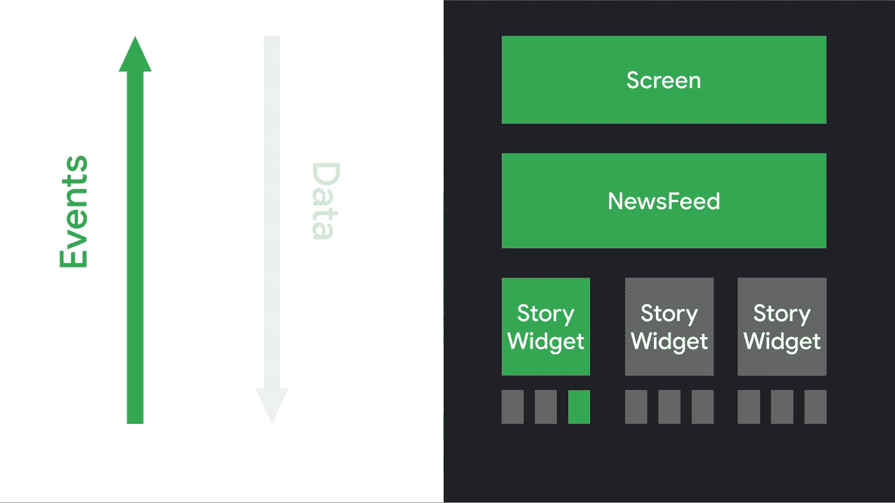
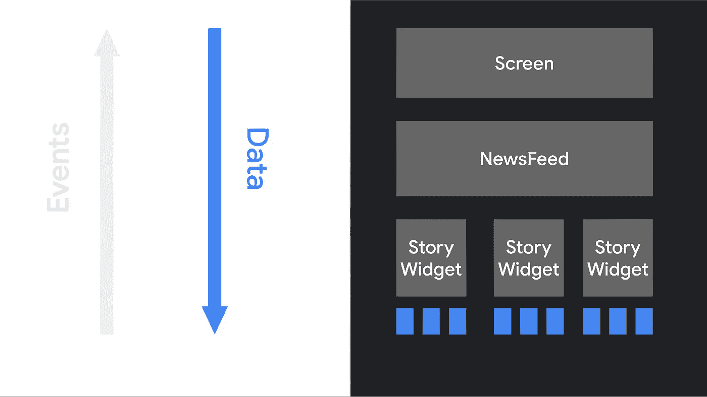
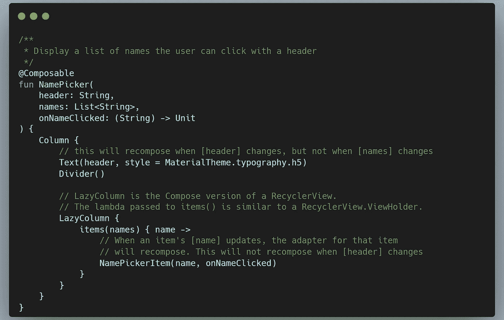
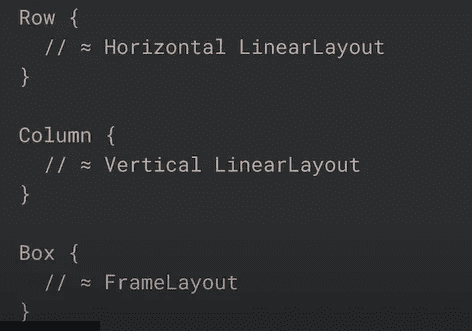
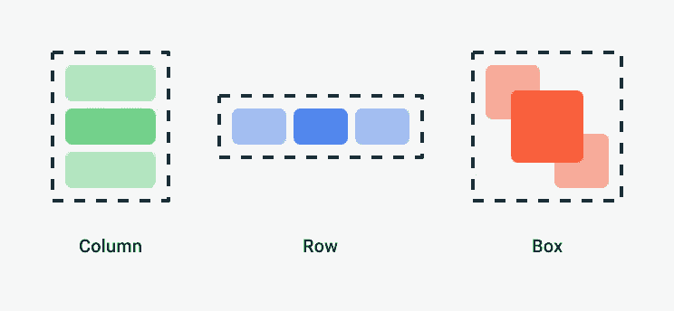
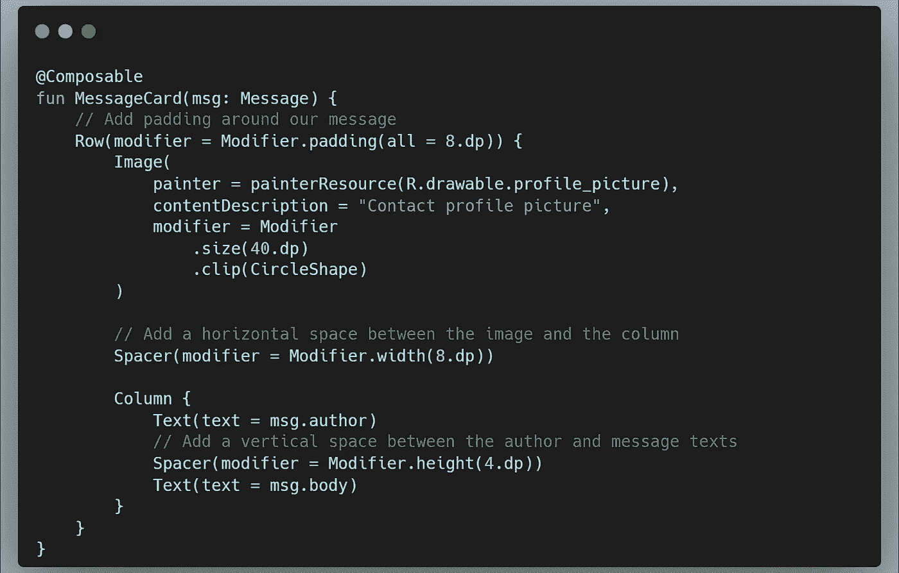
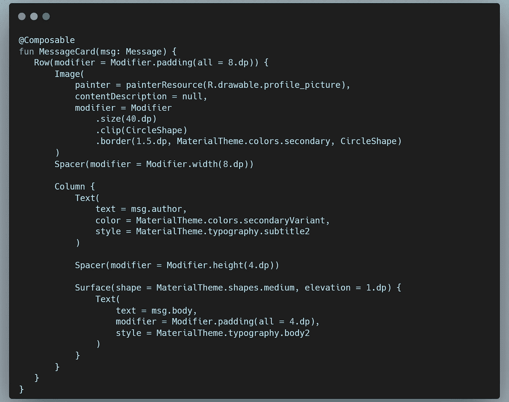

# Android Jetpack 撰写-基本版

> 原文：<https://blog.devgenius.io/android-jetpack-compose-basic-b8972e86a049?source=collection_archive---------7----------------------->

> Jetpack compose 是一个 UI 开发工具包，允许您构建声明性 UI 组件。

在 android 中，所有视图都是树形结构。因此，每当发生任何用户事件或数据变化时，UI 层次结构都需要用最新的数据进行更新，这是一项非常昂贵的工作。

这就是为什么声明式 UI 是解决这个问题的高级 UI 构建解决方案。当数据更新时，Compose 智能地决定 UI 的哪个部分需要更新。

使用 composable 函数构建一个 UI。您可以在函数上使用`@Composable`注释来创建组合函数。当你声明一个函数是可组合的，编译器会理解这个函数需要把数据转换成 UI。

```
@Composable
fun MessageCard(name: String) {
    Text(text = "Hello $name!")
}
```

*   可组合函数应该将数据作为输入，函数实现会将数据转换成 UI。
*   可组合函数应该总是从大写字母开始。
*   可组合函数不应返回任何内容。

如果您想预览您的组合 UI，那么您需要在可组合函数上添加`@Preview`注释。

## 合成中的数据流

(1)用户事件



当任何用户事件发生时，它将从底部的小部件(节点)通知到顶部的小部件。

(2)数据变更



当数据库或从网络接收的数据发生变化时，新数据将从顶层小部件(节点)发送到底层小部件。

## 改编

在传统的 XML UI 视图中有一个 setter 方法，所以在数据发生变化时，可以使用 setter 方法来更新 UI 上的新数据。

在 Compose 中，要更新数据，需要用新数据再次调用 composable 函数，这被称为重组。在重组中，compose 智能地决定 UI 的哪个部分需要改变，而不是重绘整个 UI。

## 组合函数行为

*(1)编写以任意顺序执行的函数*

```
@Composable
fun ButtonRow() {
    MyHome {
        Tab1Screen()
        Tab2Screen()
        Tab3Screen()
    }
}
```

这里，系统不保证组合函数将按 Tab1Screen()、Tab2Screen()、Tab3Screen()的顺序执行。

请不要犯类似于从 Tab1Screen 初始化变量并在 Tab2Screen()中使用它的错误。

*(2)作曲功能可以并行运行*

优化重组 android 系统并行运行合成函数。因此，compose 函数可能在线程池的不同线程中执行。在这种情况下，如果您正在调用 ViewModel 的函数，那么请确保从多个线程执行是线程安全的。

*(3)重组尽可能跳过*

在重组过程中，它只重组被更新的特定部分。



*(4)重组乐观*

重组是乐观的，意味着组合函数期望它应该在值再次改变和重组发生之前被执行。如果重组正在进行，并且在其完成之前，如果新值改变，则重组被取消，并且用新值开始重组。

(5)可组合的函数可能会非常频繁地运行

在某些可能的情况下，compose 函数运行得过于频繁，所以请确保不要在 compose 函数上执行任何 CPU 密集型工作(在单独的线程上执行)。

## 行列

在 jetpack compose 中，您可以在行(水平)和列(垂直)中排列可组合 UI 元素。


如果将合成布局与 XML 布局进行比较，那么



## **修改器**

现在，如果你想改变可组合 UI 元素的属性，比如大小、形状、填充等等。在那里你可以使用修饰语。



形状、颜色和字体是材料设计的三个基本支柱。在修改器的帮助下，你可以改变这个属性，美化 UI。



在下一个即将到来的系列中，我们将继续学习一些关于 Android Jetpack Compose 的新知识。