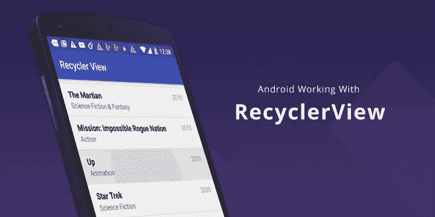
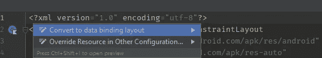
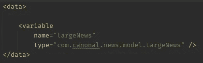
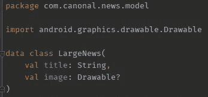
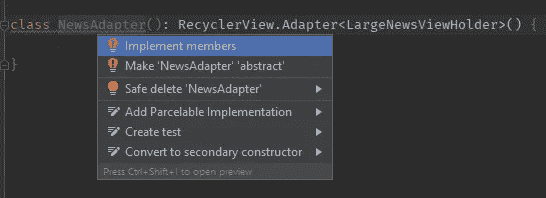
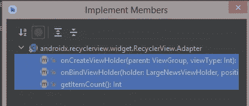
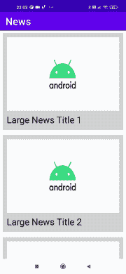
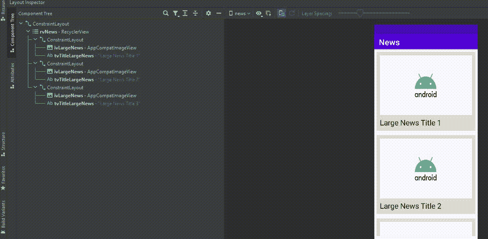
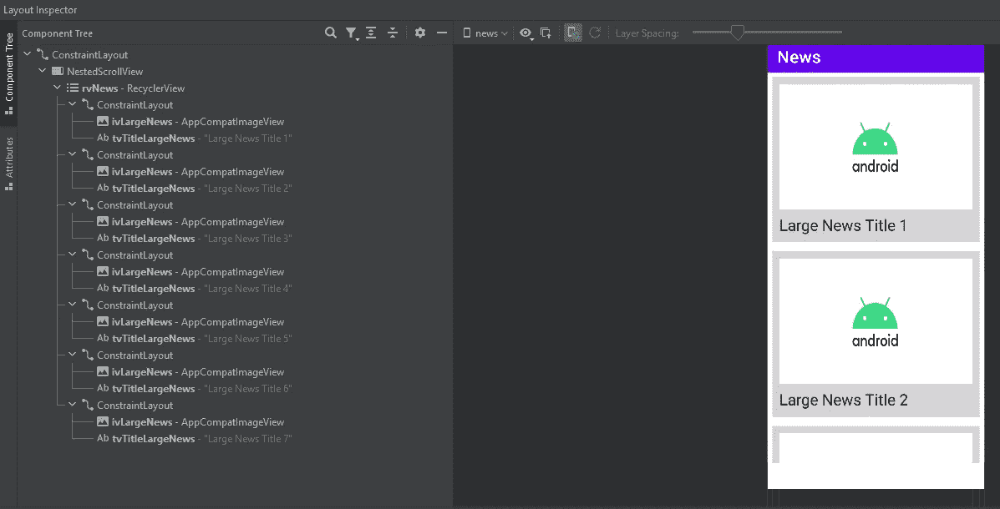

# 带数据绑定的 Android Kotlin RecyclerView

> 原文：<https://blog.devgenius.io/android-kotlin-recyclerview-with-databinding-788d353a67bf?source=collection_archive---------0----------------------->



在本文中，我将向您展示如何在一个新闻应用程序的上下文中从头开始实现一个 r [ecyclerview](https://developer.android.com/guide/topics/ui/layout/recyclerview) ，它是 Android 框架的一个基本组件。我还将在这个简单的项目中使用 [Android 数据绑定库](https://developer.android.com/topic/libraries/data-binding)。然后，我会解释一些关键点，可以是面试问题，比如它与 [ListView](https://developer.android.com/reference/android/widget/ListView) 的区别。为了简单起见，我不会重点介绍应用程序的架构和 UI。

让我们直接进入代码吧。

在创建了一个空的 Android 项目之后，我们要做的第一件事就是将必要的构建特性和插件添加到模块的`build.gradle`文件中进行数据绑定。在 android{}括号内添加以下构建功能。

```
buildFeatures**{** dataBinding true
**}**
```

然后，不要忘记在 plugins{}括号中添加必要的插件。

```
id 'kotlin-kapt'
```

我想创建一个新闻应用程序。为此，我将创建`LargeNews`类。在本文的下一个系列[中，我将使用不同的布局创建`ShortNews`类，但是只有一个适配器。这就是我在本文中将其命名为`LargeNews`的原因。](https://medium.com/@onalcan/recyclerview-with-multiple-views-in-kotlin-bffe299c1994)[如果您想查看包含多种视图类型的 recyclerview，您可以查看它。否则，不要介意，继续。](https://medium.com/@onalcan/recyclerview-with-multiple-views-in-kotlin-bffe299c1994)

添加一个名为`LargeNews`的新数据类。它需要两个参数:标题和图像。

```
data class LargeNews(
    val title: String,
    val image: Drawable?
)
```

下一步是将 recyclerview 添加到您的活动或片段中。为简单起见，我直接加到`MainActivity.kt`上。打开`activity_main.xml`并在你的父布局中添加 recyclerview。在这里，单击文件的左边缘，在这里可以找到`<?xml…?>`标签。在那里你会看到一个灯泡(或按 alt+enter)并选择“转换为数据绑定布局”。或者手动将布局包装在`<layout>..</layout>`标记中，并将 xmls 行包装在第一个布局标记中。我们将对其他布局文件重复这一步骤。



之后，XML 文件如下所示:

接下来，我们应该设计每个 recyclerview 项目的外观。正如我之前提到的，我不会在设计上花太多时间。然而，你可以随心所欲地发挥创造力。但是尽量避免创建深度布局层次结构和向 TextView 添加长文本。

在布局包中，添加一个新的布局文件。首先，将布局文件转换为数据绑定布局文件，然后组织布局。在我的布局中，将有一个图像，在这个图像下面，将有新闻的标题。这里，最简单的部分是添加一个数据绑定变量。在`<data>...</data>`标签中，我们创建了一个变量。这个变量的`type` 属性将是我们的 package_name。模型类的 *class_name* 。对于`name`属性，你可以自由选择，但是类名是有意义的。



类型应为包名.类名

随后，我们可以使用变量名将 LargeNews 参数添加到所需视图的属性中。

```
//Backgroud to ImageView
android:background="@{largeNews.image}"
or
//Text to TextView
android:text="@{largeNews.title}"
```

最终的 XML 文件如下所示:

既然我们已经确定了布局，我们就可以开始实现适配器和视图容器了。正如官方文件所述:

> “`ViewHolder`是一个视图的包装器，它包含列表中单个项目的布局。`Adapter`根据需要创建`ViewHolder`对象，并为这些视图设置数据

您可以在适配器类中编写 viewholder 类。尽管如此，我还是喜欢把它们分开。我们创建`LargeNewsViewHolder`类并扩展`RecyclerView.Viewholder`。为了使用数据绑定，我们将`ItemLargeNewsBinding`作为参数。我们编写了一个名为`bind`的函数，它将一个`LargeNews`对象作为参数。该函数将该对象绑定到布局。

```
class LargeNewsViewHolder(
    private val binding: ItemLargeNewsBinding
) : RecyclerView.ViewHolder(binding.*root*) {
    fun bind(largeNews: LargeNews) {
        binding.*largeNews* = largeNews
    }
}
```

另一方面，适配器类必须从`RecyclerView.Adapter<*your_view_holder_class_name*>`类扩展。此时，您将看到需要覆盖三个函数。另外，`NewsAdapter`应该接受一个包含大型新闻对象的列表。该列表将从`MainActivity.kt`发送。



*   onCreateViewHolder:通过膨胀布局来创建新的项目布局。
*   onBindViewHolder:将数据绑定到相关位置。
*   getItemCount:返回列表的大小。

最后，在`MainActivity.kt`中，我们从`getDummyData`函数中获取数据。然后我们创建一个适配器对象，并将这个适配器交给 recyclerview。另外，recyclerview 需要一个布局管理器。这里我们可以从三个选项中选择:`[LinearLayoutManager](https://developer.android.com/reference/androidx/recyclerview/widget/LinearLayoutManager)`、`[GridLayoutManager](https://developer.android.com/reference/kotlin/androidx/recyclerview/widget/GridLayoutManager)`、`[StaggeredGridLayoutManager](https://developer.android.com/reference/androidx/recyclerview/widget/StaggeredGridLayoutManager)`。它们中的每一个都有不同的设计目标，应该相应地使用。

最后，当我们运行应用程序时，我们会看到类似这样的内容:



我知道这一点也不吸引人，但它确实有效…

# 关于 RecyclerView 的其他信息

关于 recyclerview 的一个可能的面试问题是它与[列表视图](https://developer.android.com/reference/android/widget/ListView)的不同。在 recyclerview 之前，Android world 正在用 listview 创建基于列表的屏幕。然而，listview 并不是一种现代的、表演性的方式。因为 listview 会将列表中的所有项目一次加载到屏幕上，尽管有些项目在屏幕上看不到。而 recyclerview 加载屏幕上可见的项目。所以占用内存少，效率变高。

我们可以使用 Android Studio 的布局检查器工具看到 recyclerview 的这种行为。为此，只需运行您的应用程序并打开布局检查器。看下面的 gif，看标题号就可以跟着项了。总共，我有七件物品。当我们在列表的顶部时，我们看到只有前三项被加载。然后，我们滚动，使项目 1 不再可见。在这一点上，我们可以观察到第 1 项被从布局中删除，而第 4 项被添加。这就是它继续发展的方式。



只有可见项目会添加到布局中

尽管如此，如果您想利用 recycle view 的这种行为，您应该注意不要将 recycle view 放在 XML 的 [NestedScrollView](https://developer.android.com/reference/androidx/core/widget/NestedScrollView) 中。为了向你表明这一点，我将把我的`activity_main.xml`改为如下。

```
<androidx.core.widget.NestedScrollView
    android:layout_width="match_parent"
    android:layout_height="match_parent">

    <androidx.recyclerview.widget.RecyclerView
        android:id="@+id/rvNews"
        android:layout_width="match_parent"
        android:layout_height="match_parent"
        app:layout_constraintEnd_toEndOf="parent"
        app:layout_constraintStart_toStartOf="parent"
        app:layout_constraintTop_toBottomOf="parent"
        app:layout_constraintTop_toTopOf="parent" />

</androidx.core.widget.NestedScrollView>
```

当我们运行应用程序并打开布局检查器时，我们会看到所有 7 个项目都被加载到布局中，尽管事实上只有 3 个项目在屏幕上可见。



因此，如果您打算在一个可滚动的父级中使用 recyclerview，请注意这样一个事实:您不会从它的“recycle”特性中受益。因此，它变得效率更低。这是因为，通常情况下，recyclerview 会加载屏幕高度所能容纳的所有项目。但是，当 recyclerview 有一个可滚动的父级时，不管屏幕高度如何，它都会一次创建所有项目，因为其父级高度是无限的。

关于提高 recyclerview 的性能，我们可以提及的另一件事是`setHasFixedSize(boolean hasFixedSize)`函数。如果您预先知道 recyclerview 的大小(宽度和高度)不受适配器内容的影响，那么您可以将`hasFixedSize`设置为 true。例如，如果您的项目中有一个图像，并且它的大小没有改变(这同样适用于其他元素)，那么您应该使用

```
recyclerViewNews.setHasFixedSize(true)
```

此外，如果你想为每个项目使用一个分隔线，你可以使用`ItemDecoration`而不是视图来提高性能。

```
recyclerViewNews.addItemDecoration(
    DividerItemDecoration(
        this,
        LinearLayoutManager.*VERTICAL* )
)
```

这是所有的乡亲。你可以在这里查看[整个项目。](https://github.com/canonall/NewsMediumRecyclerViewExample)

非常感谢任何反馈或建议！