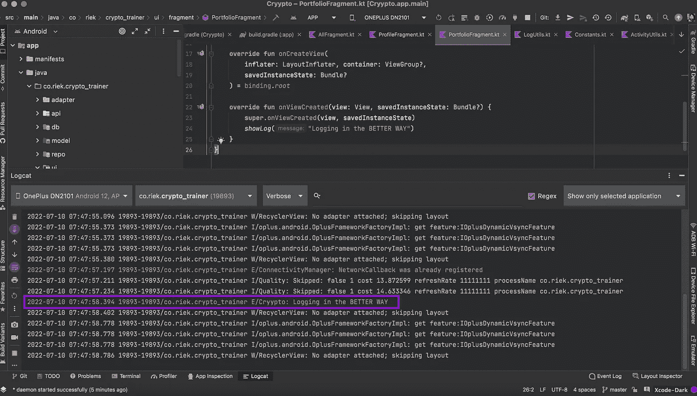

# 以更好的方式登录 Android

> 原文：<https://blog.devgenius.io/android-logging-in-a-better-way-2d65bd515404?source=collection_archive---------8----------------------->

登录 Android Studio 的有效方式

图片来源:[Pexels.com](http://pexels.com)作者:[安德里亚·皮亚卡迪奥](https://www.pexels.com/photo/man-holding-mug-in-front-of-laptop-842548/)

## **什么是测井？**

> 日志将出现在 Android Studio 的 Logcat 窗口中，显示系统消息，如垃圾收集发生时，以及您使用`[Log](https://developer.android.com/reference/android/util/Log)`类添加到应用程序的消息。它实时显示消息，并保留历史记录，以便您可以查看旧消息。

在构建 Android 应用程序时，作为 Android 开发人员，我们在代码中放入了大量日志。`Log`该类提供了 5 个优先级，可以根据我们的要求过滤出代码。这些级别是

*   `Log.v()`
*   `Log.d()`
*   `Log.i()`
*   `Log.e()`
*   `Log.w()`

例如，如果我们想要在 Logcat 中显示日志，那么我们需要调用`Log.e(TAG, "message)`，在这种情况下，我们想要显示一个错误。这通常在 Android studio 的 Logcat 窗口中以红色显示。

上述方法的问题是每次你写日志时都有`TAG`的需求，这在某些时候变得很烦人。首先，你可以将`TAG`作为`const val TAG = "MyApp"`放在类的顶部，但是你需要在每个类中都提到它，或者你必须将它添加到`Utils.kt`中。有一些库解决了在 tag 方法中添加 TAG 的问题。

在本文中，我们将在不使用任何外部库的情况下实现一种更好的日志记录方法，并且调用 log 方法将会很容易。此外，在发布模式下我们不需要日志，它也会被处理。

首先，您需要在您的`utils`包中创建一个文件。它可以被命名为`LogUtils.kt`，你只需要粘贴下面的代码。

LogUtils.kt

在 LogUtils.kt 文件中，有三个公共方法将在您的项目中使用。

为了创建这个 Utils 类，我使用了`Log.e(TAG, "message")`。主要原因是它用红色突出显示我们的日志，在调试时很容易识别。您可以随意使用任何优先级。

## 如何使用`showLog(“message”)`方法？

`showLog("message")`采用两个参数，一个参数用于消息，另一个参数用于标记名。默认情况下，`TAG`是预定义的，因此您不需要每次都传递它。在某些情况下，我们需要根据特定代码行的用途来更改标记名，在这种情况下，标记是可以更改的。

**示例-**

PortfolioFragment.kt

Pic 鸣谢:安卓工作室

在 Android studio 的截图中，您可以看到我们的方法生成的日志看起来像什么。因为我们已经设置了错误的优先级，所以它用红色突出显示。

通过这个，你就知道如何用一种简单的方式进行日志记录了。

你可以用上面的方法来得到简单的消息，而不是针对异常和 Throwables。如何从异常和抛出异常中获取日志？

为此，我们使用了`Extension`函数概念的概念，用`showLog()`扩展了`Exception`。如果你看到文件中的`LogUtils.kt`，你会看到另外两个基本上是扩展函数的方法，它们将用于异常和 Throwable。

## 如何在我们的代码中使用`Exception.showLog() or Throwable.showLog()` ？

只需要在异常的地方添加`e.showLog()`，你会以相似的方式使用相同的方法名得到异常。

综上所述，`LogUtils.kt`将让您有可能从一个地方管理日志记录，这肯定会增强您的日志记录体验。该条件已经放入代码中，因此该日志仅在应用程序处于`Debug`模式时有效。

## 结论

仅此而已！我希望你这次学到了一些有用的东西，同时也能在开发 Android 应用程序的时候提升你的登录体验。如果有任何疑问，请写下来，我很乐意解决您的疑问。

查看我的其他文章

 [## Android 开发者的 5 个有用的 Kotlin 扩展

### Kotlin extensions 将在构建 Android 应用程序时节省您的时间

better 编程. pub](https://betterprogramming.pub/5-useful-kotlin-extensions-for-android-developers-485f7c9ad7e8)  [## 如何使用 Jetpack 首选项数据存储

### SharedPreferences 的替换在这里

better 编程. pub](https://betterprogramming.pub/using-jetpack-preferences-datastore-more-effectively-414e1126cff7)  [## 用我的推荐链接- Prateek 加入媒体

### 作为一个媒体会员，你的会员费的一部分会给你阅读的作家，你可以完全接触到每一个故事…

codes-prateek.medium.com](https://codes-prateek.medium.com/membership) 

谢谢，干杯！