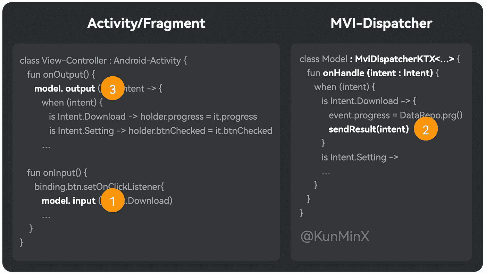

# Android:在实践中解决 MVI 架构的痛点

> 原文：<https://blog.devgenius.io/android-solving-the-pain-points-of-mvi-architecture-in-practice-4971fa9ed9c0?source=collection_archive---------7----------------------->


通过这篇文章可以快速了解:

1.为什么用 MVI，

2.为什么最终考虑使用 SharedFlow 实现，

3.repeatOnLifecycle + SharedFlow 的思路实现 MVI。

# 为什么是 MVI

MVI 是一个反应式模型，通过唯一的入口传入参数，从唯一的出口接收结果和完成响应。

换句话说，通过在 MVI 模型中聚合状态，页面根据返回的结果统一完成 UI 呈现，确保

*   获得的状态总是最新的，并且来自可靠和唯一的来源
*   消除可变的样板代码

“消除样板代码”相信开发者都有体会。“获得的状态总是最新的，来源是可靠的和唯一的”，这是值得怀疑的，所以我们继续寻找。

# MVI 原始理论模型

根据互联网上的 MVI 理论模型，经典 MVI 模型的伪代码示例如下:

我们很容易发现，经典的 MVI 模型“牵一发而动全身”，即无论修改哪个 widget，所有控件都需要重新渲染状态。

这样在 Android View 系统下就有了额外的性能开销。当页面小部件的显示逻辑比较复杂或者需要频繁渲染时，很容易造成丢帧。

# 改进版本 1:使用数据绑定

考虑到数据绑定 ObservableField 的去抖动特性，页面可以考虑 ObservableField 来完成状态的改变，以尽可能消除“小部件渲染”的性能开销。

但是，以上只是免除渲染，观察回调中的逻辑还是要去的，

开发人员需要有使用数据绑定的经验，另外还要编写数据绑定样板代码和 XML 绑定。

# 改进版本 2:使用密封类进行分流

根据业务场景，转移最初放置在数据类中的状态:

这样，这个业务场景的 UI 逻辑可以单独运行:

网上流行的例子，包括官方的例子，就在这里探讨和分享。

但在实战中很容易发现，Replay 1 的模型如 BehaviorSubject、LiveData、StateFlow 都是理想化的“过度工程”产品，在生产环境中容易出现不可预知的问题。

例如，当屏幕关闭时(页面生命周期离开开始)，replay 1 模型只保存最后一个，那么在 MVI 分流设计下，屏幕打开后(页面生命周期返回开始)，多种类型的消息只会推送最后一个，其余的全部丢失。

# 改进版本 3:使用 SharedFlow 推送结果

SharedFlow 中有一个队列。如果希望在屏幕打开后自动推送多种类型的消息，可以将重播次数设置为与队列长度相同，比如 10。

由于 replay 会按照设定的次数重播队列中的元素，所以当 replay 开始时，它会可视化地重播所有的，包括消耗的和未消耗的，也就是 widget 上的旧数据“闪现”，

这不是一次好的经历。

# 改进版本 4:通过计数防止重复推回

所以这里可以加一个判断——如果已经消费了，下次重播就不消费了。

但是每次创建页面都需要这样写，是不是不舒服，

因此，它可以内聚，并统一提取到一个单独的框架中进行维护。

MVI-调度员-KTX 应运而生。

# 改进版本 5:MVI 样板逻辑的内聚性

如下，通过内聚样板逻辑，如 repeatOnLifecycle、计数比较、可变/不可变等。

这样，即使开发者不熟悉 MVI 和 mutable，也可以通过专注于“输入-输出”来自动完成“单向数据流”的开发。



# 改进版本 6:添加版本以防止订阅推迟

在分析了大量样本后，我们很容易知道，在敏捷开发的过程中，实际高频的问题就是“消息分发一致性问题”。

与其刻意区分状态和事件这两个理论概念，不如将两者合二为一，升级为“消费且只消费一次”这种简洁易懂的线上模型。

因此，这里可以添加一个 verison 比较。

这样可以实现“多观察者消费，每个观察者只消费一次”，并且可以解决页面初始化或屏幕对屏幕场景中的“流缺失集合”而不会导致意外错误:

对于 UI 事件，比如对话框弹出、toast 弹出和页面跳转，可以使用这个模型，

对于 UI 状态，如进度呈现、btnChecked 呈现，也可以使用该模型，

状态可以通过 DataBinding ObservaField 或 Jetpack 进行动作和响应，在 Jetpack ViewModel 中构造可变状态和托管，整个过程如下:

```
 UI Layer          Domain Layer         Data Layer
unified Event  -> Domain Dispatcher -> Data Component
UI State/Event <- Domain Dispatcher <- Data Component
```

这样，当页面旋转和重建时，页面自动从 Jetpack ViewModel 获取 ObservaField/mutableState 绑定和呈现小部件，而不需要 replay 1 模型推回。

> *SharedFlow 仅限于 Kotlin 项目。如果想在 Java 项目中使用，可以参考 MVI-Dispatcher 的设计，内部维护一个队列，通过 Mutable-Result 实现上述功能。*

# 概括起来

理论模型都是为了解决特定环境下的特定问题。MVI 是一个理想化的理论模型，直接用于生产环境可能会滋生不可预测的问题，所以我们不断尝试、交流、反馈和更新。

感谢那些愿意“实事求是”测试反馈和交流的人，MVI-调度员系统框架发展到今天。

Github:MVI 调度员

[Github:MVI-调度员-KTX](https://github.com/KunMinX/MVI-Dispatcher-KTX)