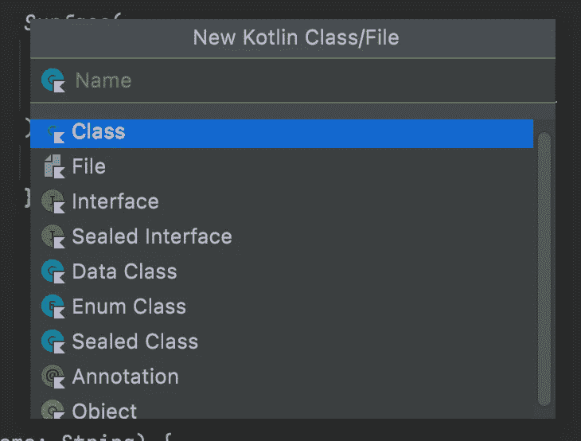
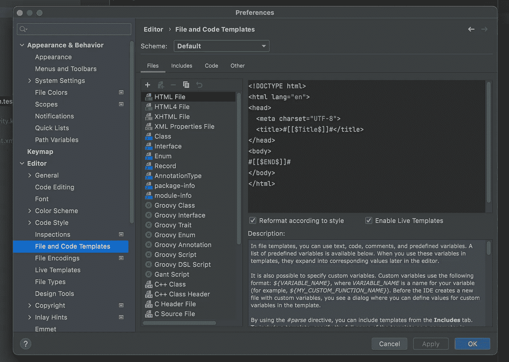
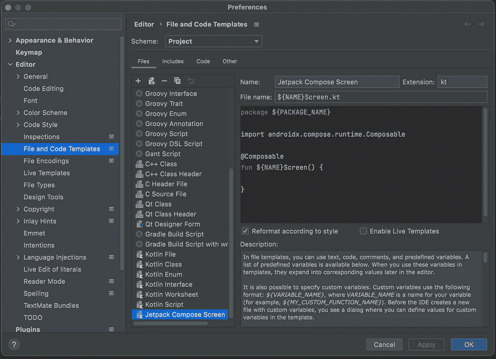
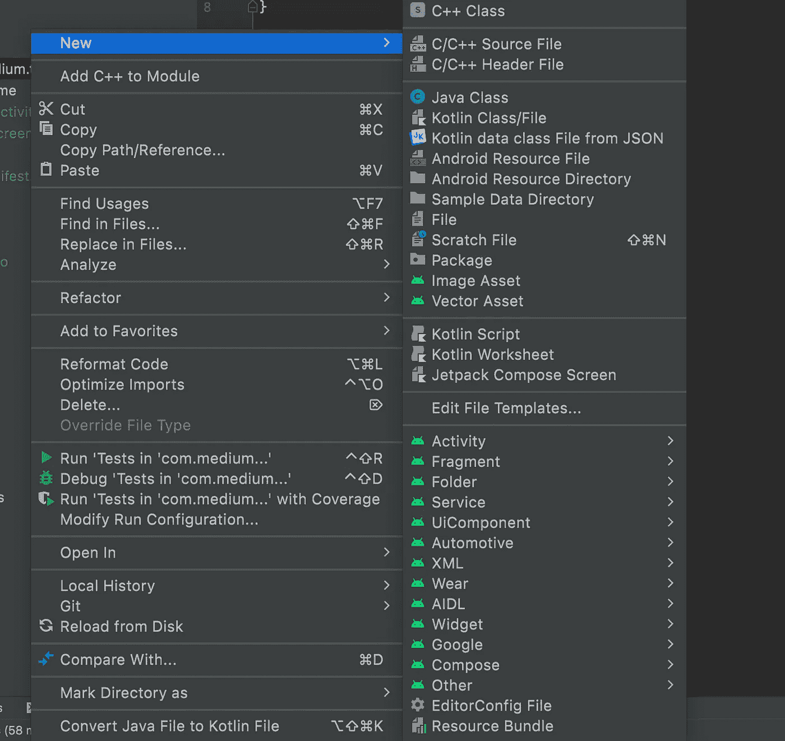
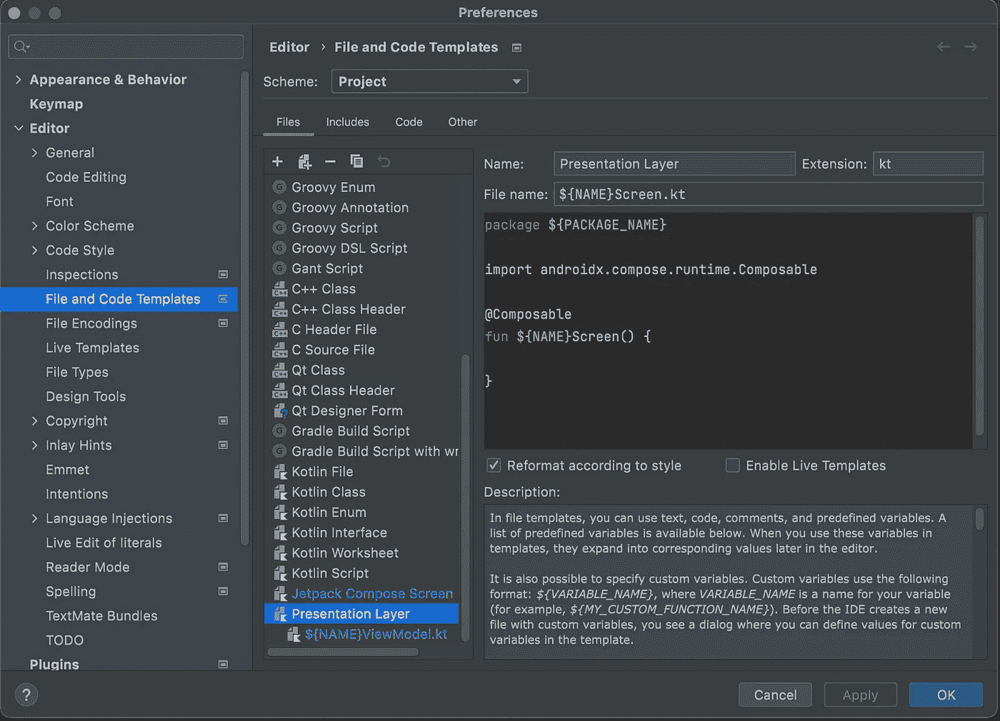
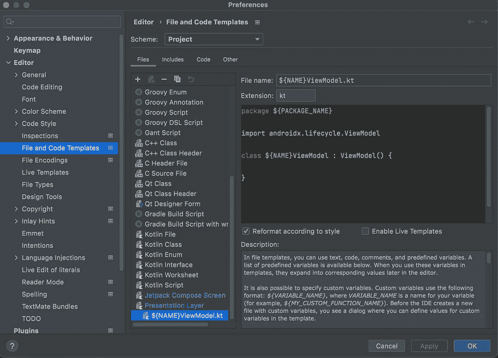

# Android Studio 文件和代码模板

> 原文：<https://blog.devgenius.io/android-studio-file-and-code-templates-45e429855f6b?source=collection_archive---------4----------------------->

## 通过学习如何在 Android Studio 中创建和使用文件和代码模板来提高您的工作效率。

在 Android Studio 中，我们可以创建几个 Kotlin 文件，例如:



都是`File Templates`，可以修改新建。让我们前往 Android Studio 设置，以便更好地了解它们。步骤:

*   Mac:
    Android Studio - >首选项- >编辑器- >文件和代码模板
*   Windows:
    文件- >设置- >编辑- >文件和代码模板

您应该会看到类似这样的内容:



正如你所看到的，有很多不同语言的模板:`Kotlin`、`HTML`、`Java`、`C++`等等。在屏幕顶部，您可以看到一个下拉菜单`Scheme`，您可以从中选择是查看所有项目的模板还是仅查看该项目的模板。如果你点击`Kotlin File`或者`Kotlin Class`模板，你会看到类是如何被创建的。

现在我们来添加自己的`File Template`。该模板将用于创建 Jetpack 撰写屏幕(您可以为您想要的任何内容创建模板)。点击`+`图标，输入模板名称`Jetpack Compose Screen`，输入扩展名`kt`，因为这是 Kotlin 文件的扩展名。模板看起来应该是这样的:



`${NAME}`是我们选择从该模板创建文件时将输入的名称，`${PACKAGE_NAME}`只是我们在其中创建文件的包的名称。现在当你想创建一个文件时，你会有一个`Jetpack Compose Screen`模板。



您还可以嵌套更多的文件模板，以便一次创建多个文件。例如，下面是创建`Screen`和`ViewModel`的模板:



`Presentation layer`是模板的名称，第一个文件与最后一个文件相同，只是创建了一个`Jetpack Compose Screen`。使用`+`按钮旁边的按钮，您可以嵌套文件模板。因此，我们将添加一个将创建`ViewModel`。



这将创建两个文件，如果你给名字`Test`，文件将被命名为:`TestScreen`和`TestViewModel`。拥有模板是非常有用的，你只需要做一次，而不是两次创建文件和写一些代码。

文件模板有很多可能性，你可以创建任何你想要的，只是不要忘记包括导入，这样所有的东西都会自动导入。你可以发挥你的想象力，结果，你将提高你的生产力，并通过不从零开始一次又一次地创造同样的东西来缩短开发时间。

你可以查看这个 [GitHub repo](https://github.com/Giga99/MediumRepos) ，因为它包含了我在本文中解释过的模板，只是不要忘记将`Scheme`改为 Project，这样它们就可以被加载了。

```
Connect with me on:
[Github](https://github.com/Giga99)
[LinkedIn](https://www.linkedin.com/in/igor-stevanovic/)
[Twitter](https://twitter.com/igor_s1999)
[Portfolio website](https://giga99.github.io/portfolio-website/)
```

如果您想了解 Jetpack Compose，可以看看这些文章:

[](https://betterprogramming.pub/implement-horizontal-and-vertical-viewpager-in-jetpack-compose-a7a91f2ac746) [## 在 Jetpack Compose 中实现水平和垂直 ViewPager

### 在 Jetpack 撰写中实现 ViewPager

better 编程. pub](https://betterprogramming.pub/implement-horizontal-and-vertical-viewpager-in-jetpack-compose-a7a91f2ac746) [](https://betterprogramming.pub/jetpack-compose-request-permissions-in-two-ways-fd81c4a702c) [## 在 Jetpack Compose 中请求权限的两种方法

### 在 Jetpack Compose 中请求权限的最佳方式

better 编程. pub](https://betterprogramming.pub/jetpack-compose-request-permissions-in-two-ways-fd81c4a702c)