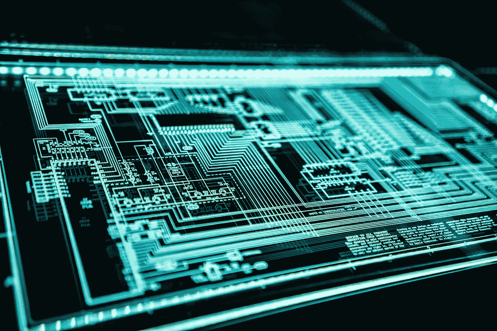

# Android vs iOS 更安全的战斗？

> 原文：<https://blog.devgenius.io/android-vs-ios-the-safer-battle-c849d7388bc?source=collection_archive---------24----------------------->

苹果 vs 安卓源码 Pinterest

还记得网络犯罪分子主要攻击笔记本电脑和台式机的时代吗？时代变了！如今，网络犯罪分子几乎每天都在瞄准智能手机和平板电脑。这是真的，但问题是:Android 和 iOS 哪个移动操作系统更安全？

令人惊讶的是，消费者越来越多地使用手机进行银行业务、社交媒体联系和在线交易。网络犯罪分子瞄准了 iPhones、iPads 和 Android 设备上的病毒和恶意软件攻击。iOS 和 Android 操作系统已成为不愿获取用户个人信息的网络窃贼的诱人目标。

如果安全是你最关心的问题，你想让你的 Android 或 iOS 设备免受病毒攻击和恶意软件，你应该正确地选择哪个操作系统？

阿迪·戈尔茨坦在 [Unsplash](https://unsplash.com/s/photos/cybersecurity?utm_source=unsplash&utm_medium=referral&utm_content=creditCopyText) 上的照片

没有简单的答案。

**安卓 vs. iOS:威胁等级**

在某些领域，苹果的 iOS 操作系统一直被认为是两个操作系统中更安全的。为什么？苹果的操作系统是一个封闭的系统。苹果不向应用程序开发者发布源代码，iPhones 和 iPads 的所有者也不能相应地修改手机上的代码。这使得黑客很难在 iOS 驱动的设备上找到漏洞。

相反，Android 设备依赖于开源代码，这意味着这些设备的所有者可以修补他们的手机和平板电脑的操作系统。过多的摆弄可能会在他们的设备安全性上造成弱点。如果一个手机制造商推出了一款修改了 Android 操作系统的新设备，而该代码中存在漏洞，黑客将毫无疑问地找到它！

Android 之所以成为黑客的攻击目标，是因为该操作系统驱动了当今如此多的移动设备。Android 操作系统在全球的流行使其成为网络罪犯的一个有吸引力的目标。Android 设备更容易受到这些犯罪分子发现的恶意软件和病毒的威胁。

照片由[布拉德扑向](https://unsplash.com/@bradpouncey?utm_source=unsplash&utm_medium=referral&utm_content=creditCopyText)上的 [Unsplash](https://unsplash.com/s/photos/iphone?utm_source=unsplash&utm_medium=referral&utm_content=creditCopyText)

但这并不能说明全部情况。虽然 iOS 可能被认为更安全，但网络犯罪分子攻击 iPhones 或 iPads 也不是不可能的。Android 和 iOS 设备的所有者需要意识到可能的恶意软件和病毒，并在从第三方应用商店下载应用程序时小心谨慎。最安全的方法是从可信和经过验证的来源下载应用程序，比如 Google Play 和苹果应用商店，它们会审查他们出售的应用程序。

此外还有社交工程攻击，在这种攻击中，网络犯罪分子诱骗用户放弃登录信息、银行账户访问权限和其他个人数据。不管你使用的是什么移动操作系统:iOS 和 Android 都同样容易受到这些类型的网络钓鱼攻击。

**iOS 的 Android 和 iPhone 安全提示**

***安卓和 iOS 软件更新和安全更新***

想要帮助保护您的 Android 手机或平板电脑的安全吗？请始终将您的移动设备升级到最新版本的 Android 操作系统。Android 会定期发布更新。跳过它们的安装可能很诱人，但这些更新旨在帮助保护您的 Android 设备免受最新的安全威胁。忽略这些更新可能会使您的手机、台式机或平板电脑面临风险。苹果的 iOS 更新往往是更大的事件，通常会在发布后立即提示 iPhone 和 iPad 用户安装它们。

事实上，Android 和 iOS 设备的所有者都可以在他们的移动设备上打开自动更新。这样，当 Android 或 iOS 更新发布时，他们的设备将自动更新到其操作系统的最新版本。

***硬件集成***

照片由 [Niclas Illg](https://unsplash.com/@nicklbaert?utm_source=unsplash&utm_medium=referral&utm_content=creditCopyText) 在 [Unsplash](https://unsplash.com/s/photos/hardware?utm_source=unsplash&utm_medium=referral&utm_content=creditCopyText) 上拍摄

Android 设备的安全性很大程度上取决于硬件。简单来说，一些制造商更擅长确保 Android 的内置安全功能正常工作。

三星就是一个很好的例子。三星 Knox 安全解决方案预装在该公司的所有手机、平板电脑和可穿戴设备中。三星的这个平台提供了更安全的引导过程，以防止当用户打开三星移动设备时加载未经授权的软件。

**如何在 Android 和 iOS 上“保持安全”**

用户发现 Android 很有吸引力，因为它是一个更加开放的操作系统，这意味着你需要更加谨慎。但请记住，你也必须对 iOS 保持谨慎。

考虑你下载的所有应用程序。下载流氓应用是让你的安卓手机、平板电脑或可穿戴设备感染恶意软件或病毒的最简单方式。iOS 也是如此，尤其是当你从第三方来源下载应用程序时。这就是为什么只从有信誉的来源下载应用程序很重要。

你的最佳选择？对于 Android，坚持使用 Google Play 商店。Google Play 拥有无数的应用程序。你真的没有理由从任何其他地方下载 Android 应用。如果你在 Google Play 之外冒险，你可能会增加下载受感染应用的几率。iOS 也是如此。最好去苹果应用商店。

Android 安全注意事项和更安全的 Android 手机提示:恶意软件可以通过多种方式感染设备:通过应用程序、钓鱼电子邮件或短信。

***Android vs iOS:各品牌手机操作系统对其安全性有何影响？***

照片由[马库斯·斯皮斯克](https://unsplash.com/@markusspiske?utm_source=unsplash&utm_medium=referral&utm_content=creditCopyText)在 [Unsplash](https://unsplash.com/s/photos/electronic-security?utm_source=unsplash&utm_medium=referral&utm_content=creditCopyText) 拍摄

**安卓操作系统**

*流行度:*安卓操作系统广泛流行。这意味着开发人员正在不断开发新的应用程序，以在该系统上运行。当黑客创建旨在感染你的移动设备的应用时，问题就来了。Google Play 有一个 app 审核流程。不幸的是，这一过程远没有开发人员在苹果应用商店添加应用程序时所面临的严格。恶意应用程序更容易潜入 Google Play 商店，用户也更容易意外安装一个。一个主要问题是，最终用户可以进入 Android 设备，安装来自未知来源的软件。这意味着你可以在 Android 设备上安装不是来自 Google PlayStore 的软件。这款软件——或称之为 APK——可以绕过谷歌 PlayStore 审查从一个网站下载并安装。

*开源:*安卓用户可以修改自己安卓设备的源代码。这吸引了那些希望灵活改变移动设备运行方式的用户。但这也可能使 Android 设备容易受到攻击。当修改设备的源代码时，用户可能会意外地给网络犯罪分子留下可乘之机。

*碎片化:*与只在苹果品牌产品上运行的 iOS 操作系统不同，Android 操作系统可以在许多公司生产的移动设备上运行。一些公司可能会提供比市场上其他公司更可靠、更安全的硬件。此外，设备的制造商可以使用定制的 ROM 或基本操作系统，该操作系统安装有不容易被移除或被恶意分析的软件。

**苹果的 iOS**

*更严格的控制:*开发者很难将应用程序放入应用商店。那是因为审核过程更加严格。正因为如此，恶意 app 潜入苹果商店的可能性更小。

*灵活性降低:*苹果不允许其设备的所有者修改或干扰其 iOS 操作系统或加载到其设备上的定制 rom。这使得系统更加安全，因为苹果控制了整个体验。这并不能阻止一些用户“越狱”他们的苹果移动设备，修改他们的源代码。越狱开启了设备的新功能——比如改变数字助理 Siri 的声音。如果你这样做，请小心:苹果不会为这类设备提供支持。

*一个不太诱人的目标:*由于 iOS 操作系统支持的移动设备较少，黑客不像以前那样经常攻击该系统。这是有道理的:如果黑客和网络犯罪分子更专注于攻击更受欢迎的 Android 操作系统，他们可以确保更多的受害者。