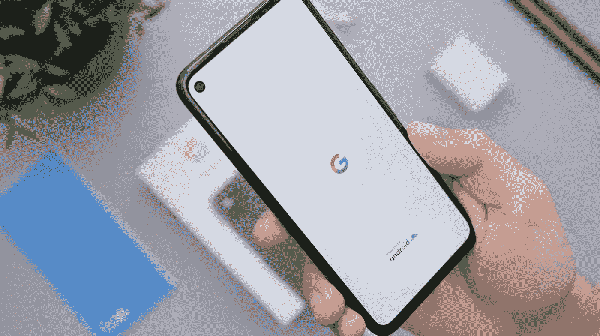

# Android 的 VoiceFilter-Lite 可以识别说话者的声音

> 原文：<https://blog.devgenius.io/androids-voicefilter-lite-can-recognize-the-speaker-svoice-2c215fb86a15?source=collection_archive---------8----------------------->

## VoiceFilter-Lite 演示版。

丹尼尔·罗梅罗在 [Unsplash](https://unsplash.com?utm_source=medium&utm_medium=referral) 上的照片

语音辅助技术允许用户使用语音命令与他们的设备进行通信。确保对特定用户的响应依赖于精确的语音识别。

# 挑战

在许多真实世界的使用情况下，这种系统的输入可以由重叠语音组成，这给许多语音识别算法带来了挑战。语音识别涉及解决模型大小、CPU 和内存限制等约束，以及电池使用和最小化延迟的考虑。

# VoiceFilter-Lite

在 VoiceFilter-Lite 中，谷歌对 VoiceFilter 进行了升级，通过在重叠语音中使用所选说话者的录音，可以显著改善语音识别。这种模式可以很容易地与现有的设备上的语音识别应用程序集成，允许用户在极其嘈杂的条件下访问语音辅助功能。

# 未来的工作

谷歌研究团队正在探索许多其他方法来使 VoiceFilter-Lite 更加有益。目前的模型只接受英语培训。在以后的工作中，模特会练习其他语言。该团队还致力于改善语音识别损失，以进一步提高语音识别能力。

感谢阅读。