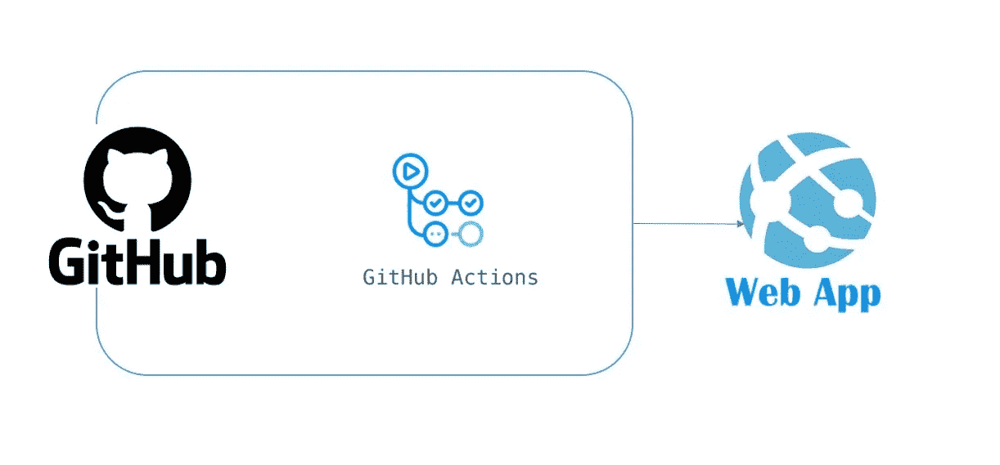
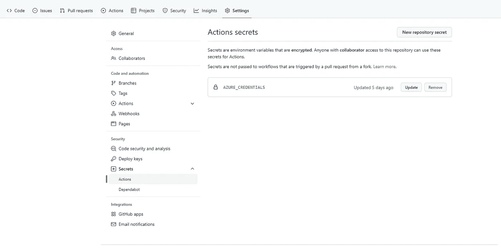
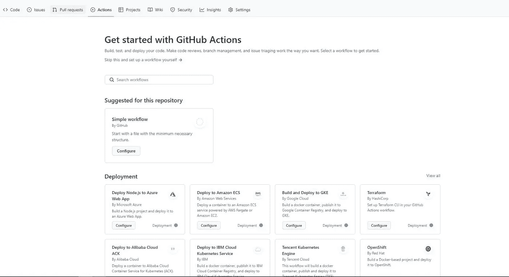
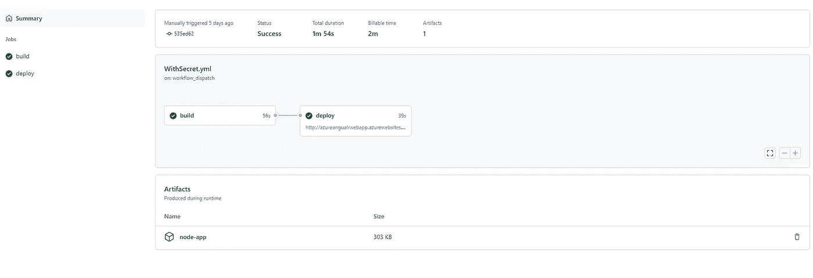
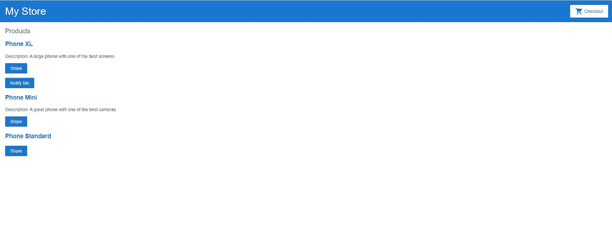

# 使用 GitHub 将 Angular 应用程序部署到 Azure Web App

> 原文：<https://blog.devgenius.io/angular-application-deployment-to-azure-web-app-using-github-49a4e3a7ba87?source=collection_archive---------8----------------------->



流动

在本文中，我将演示使用 GitHub 将 angular 应用程序部署到 Azure Web App 的过程

该演示将用于将应用程序部署到一个 web 应用程序，但是流程保持不变，并且可以用于部署多个应用程序。

**先决条件:**

1.  你有一个带有角度代码的 GitHub Repo

请点击此处找到本演示中使用的[回购的链接](https://github.com/babula000/AzureWebApp-GitHub-Public)

2.您拥有有效的 Azure 订阅

3.您已经在本地计算机中配置了 Azure CLI

**安装 Azure CLI:** 按照[安装 Azure CLI](https://docs.microsoft.com/en-us/cli/azure/install-azure-cli) 中提供的说明来设置您的 Azure CLI 环境。

# 步骤:

1.  创建资源组

```
az group create --name AzureWebAppDemo --location "eastus"
```

2.创建应用服务计划

> 出于演示目的，我们正在创建一个免费层应用服务计划

```
az appservice plan create -g AzureWebAppDemo -n MyFreePlan --sku Free
```

3.创建 Azure Web 应用程序来托管 Angular 应用程序

```
az webapp create -g AzureWebAppDemo --runtime "node:14LTS" -p MyFreePlan -n AzureAngualrWebApp
```

4.使用以下命令创建服务主体并保存信息

> P 请创建具有所需适当权限的服务主体

```
az ad sp create-for-rbac --name rgContributorSP --role Contributor --scopes subscriptions/<<subscriptionid>>/resourceGroups/AzureWebAppDemo
```

5.用步骤 4 中创建的凭证创建一个 json 内容

```
{
    "clientId": "client id valur",
    "clientSecret": "client sercret",
    "subscriptionId": "subscription id",
    "tenantId": "tenant id"
  }
```

6.创建 GitHub 秘密

登录 GitHub，进入 GitHub Repo →设置→秘密

名称:“AZURE_CREDENTIALS”

值:上面创建的 json



7.创建 GitHub 工作流

转到您的 GitHub Repo →操作

点击**自行设置工作流程**



工作流程

**工作流配置详情:**

> 可变的

```
env:
  AZURE_WEBAPP_NAME: 'AzureAngualrWebApp'    
  AZURE_WEBAPP_PACKAGE_PATH: '.'     
  NODE_VERSION: '14.x'
```

> 乔布斯
> 
> 构建作业

```
build:
    runs-on: ubuntu-latest
    steps:
    - uses: actions/checkout@v3- name: Set up Node.js
      uses: actions/setup-node@v3
      with:
        node-version: ${{ env.NODE_VERSION }}
        cache: 'npm'
    - name: npm install and build
      run: |
        npm install
        npm run build --if-present
    - name: Upload artifact for deployment job
      uses: actions/upload-artifact@v3
      with:
        name: node-app
        path: ./dist
```

> 部署作业

```
deploy:
    permissions:
      contents: none
    runs-on: ubuntu-latest
    needs: build
    environment:
      name: 'Development'
      url: ${{ steps.deploy-to-webapp.outputs.webapp-url }}steps:
    - name: Download artifact from build job
      uses: actions/download-artifact@v3
      with:
        name: node-app
    - uses: azure/login@v1
      name: Login to Azure
      with:
        creds: ${{ secrets.AZURE_CREDENTIALS }}
    - name: 'Deploy to Azure WebApp'
      id: deploy-to-webapp 
      uses: azure/webapps-deploy@v2
      with:
        app-name: ${{ env.AZURE_WEBAPP_NAME }}
        package: ${{ env.AZURE_WEBAPP_PACKAGE_PATH }}
    - name: logout
      run: |
        az logout
```

完整的 yml 配置

```
on:
  workflow_dispatch:env:
  AZURE_WEBAPP_NAME: 'AzureAngualrWebApp'    
  AZURE_WEBAPP_PACKAGE_PATH: '.'     
  NODE_VERSION: '14.x'permissions:
  contents: readjobs:
  build:
    runs-on: ubuntu-latest
    steps:
    - uses: actions/checkout@v3- name: Set up Node.js
      uses: actions/setup-node@v3
      with:
        node-version: ${{ env.NODE_VERSION }}
        cache: 'npm'
    - name: npm install and build
      run: |
        npm install
        npm run build --if-present
    - name: Upload artifact for deployment job
      uses: actions/upload-artifact@v3
      with:
        name: node-app
        path: ./distdeploy:
    permissions:
      contents: none
    runs-on: ubuntu-latest
    needs: build
    environment:
      name: 'Development'
      url: ${{ steps.deploy-to-webapp.outputs.webapp-url }}steps:
    - name: Download artifact from build job
      uses: actions/download-artifact@v3
      with:
        name: node-app
    - uses: azure/login@v1
      name: Login to Azure
      with:
        creds: ${{ secrets.AZURE_CREDENTIALS }}
    - name: 'Deploy to Azure WebApp'
      id: deploy-to-webapp 
      uses: azure/webapps-deploy@v2
      with:
        app-name: ${{ env.AZURE_WEBAPP_NAME }}
        package: ${{ env.AZURE_WEBAPP_PACKAGE_PATH }}
    - name: logout
      run: |
        az logout
```

触发 GitHub 动作进行验证



结果



**其他资源:**

[](https://github.com/Azure/login#configure-a-service-principal-with-a-secret) [## GitHub - Azure/login:连接到 Azure

### GitHub Actions 为您提供了构建自动化软件开发生命周期工作流的灵活性。有了 GitHub…

github.com](https://github.com/Azure/login#configure-a-service-principal-with-a-secret) [](https://github.com/babula000/AzureWebApp-GitHub-Public) [## GitHub-babula 000/AzureWebApp-GitHub-Public

### 此时您不能执行该操作。您已使用另一个标签页或窗口登录。您已在另一个选项卡中注销，或者…

github.com](https://github.com/babula000/AzureWebApp-GitHub-Public) 

我希望你喜欢阅读这篇文章，随时添加你的评论、想法或反馈，不要忘记在 linkedin 上保持联系。