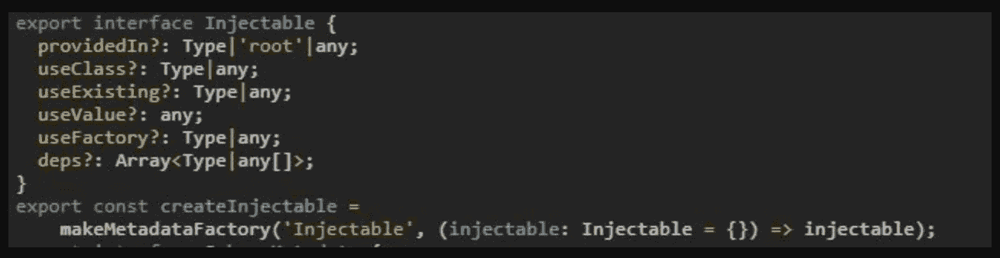

# 角度:核心. ts 细节

> 原文：<https://blog.devgenius.io/angular-core-ts-in-detail-3a6fc3c5dd7a?source=collection_archive---------11----------------------->

我正在开发一个具有深度嵌套组件的功能模块。我需要改进组件的渲染。

所以，我想我们开始调试吧。我知道 Angular 中的变化检测是如何工作的，但不确定这个关键字来自哪里，比如 **changeDetection、Input、Output、providers、host、selector、entrycomponents、encapsulation 等等..**之后，我发现我们在角度组件中使用的所有这些关键字的定义都在 **core.ts** 中。

一个很常见的问题是**组件和指令之间到底有什么区别？**

简而言之:组件是一个包含模板的独立指令。

我们将试图揭开它的神秘面纱，使它更有意义。

让我们看看 core.ts 中的指令声明

基本上，指令是一个带有输入、提供者、选择器等道具的接口。所以，这就是我们在创建组件装饰器时试图使用的东西。

现在，如果我们看看组件声明，如下图所示:

如果我们看到组件声明，我们会看到它扩展了指令接口(但是属性是可选的)，这完全取决于用户想要使用哪些属性。

因此，我们的组件声明有一个模板(内联 HTML)或 templateUrl(用作外部 HTML 文件)。样式(内联样式)和样式 URL(外部 CSS 文件)也是如此。

接下来是封装属性，它只是一个名为 ViewEncapsulation 的枚举。附上相同的图像。

然后是 changeDetection，它的类型也是一个名为 ChangeDetectionStrategy 的枚举。附上相同的图像。

变更检测本身是一个独立的主题，超出了本文的范围。

需要注意的一点是，如果你看到组件的定义，视图和组件是不同的，它们并不完全相同。

在 entry components 属性中，我们尝试处理动态组件，这些组件通常从特性模块中调用。(您可以直接从 Angular 9 Ivy 中的组件调用)，但是如果您已经将应用程序升级到 Angular 9.0 或更高版本，entrycomponents 属性现在已经过时。

我希望下次有人问你这个问题时

让我们深入研究一下。

你有没有想过装饰器背后是什么，比如组件、输入和输出？

angular 中的 Decorator 是一个附加了@ like [@Component](http://twitter.com/Component) 、 [@Input](http://twitter.com/Input) 、 [@Output](http://twitter.com/Output) 、 [@Pipe](http://twitter.com/Pipe) 、 [@Directive](http://twitter.com/Directive) 等的关键字。

让我们看看一些装饰器的定义，比如组件、输入和输出(最常用的)。

如果我们看到角度分量变化检测，它使用默认值，这意味着如果输入或浏览器事件中有任何变化，它将运行整个变化检测周期。附上相同的图像。

我希望，在 Angular 的日常 web 开发中，它可以让装饰者的使用变得有意义。

让我们进一步看看 core.ts 为我们提供了什么服务。

现在，让我们看看输入和输出装饰属性。

**输入**

**输出**

输入和输出装饰器用于组件之间的父子通信。当您的模块中有几个组件时，这是一个很好的实践。否则，建议使用 RxJS 主题，如(BehaviorSubjects，ReplaySubject，AsyncSubject，Subject)。

我们通常使用 HostBinding 和 HostListener 作为指令来监听一些事件并对它们做出反应。你有没有想过引擎盖下装的是什么？

**主机绑定&主机监听**

我们使用 [@HostBinding](http://twitter.com/HostBinding) 装饰器来绑定元素周围的一些属性。先说一个边框样式，背景颜色等。

一旦绑定完成，我们就考虑应该完成绑定的事件，这时[@ host listener](http://twitter.com/HostListener)decorator 就出现了。附件是我们如何使用主机绑定和主机侦听器的图像。

继续，让我们看看 [@Pipe](http://twitter.com/Pipe) 装饰师。

**管道**

管道装饰器用于将转换应用于接收到的输入值。它有两个属性，叫做名字和纯粹。

pure 是布尔类型的。可以认为它是一个纯函数和不纯函数。这同样适用于 Angular。

**纯功能**

输入参数值决定了输出。就像每一个相同的输入，我们得到相同的输出。可以共享结果，而不会改变结果。

**不纯**

在不纯函数的情况下，不能提供相同的保证。内部状态可以从外部改变，这就是为什么我们不能分享它。

我们继续吧。

**NgModule**

我们都使用过根模块或特性模块，但是你看到了吗，所有的模块都提供了什么。

如果我们看到 NgModule 声明，我们就有了注入服务的 prop 提供者和指令。

声明属性，我们用它来添加组件。

当试图处理 angular 中的动态组件时，entrycomponents 属性可以在组件级或模块级使用。

现在，注射服务。让我们看看它在引擎盖下包含了什么。

**服务**

povidedIn prop，我们希望在此注入此服务。它有三个价值。

1.  root:大多数 app 中的应用级注入器。该服务在整个应用程序中只有实例。
2.  平台:页面上所有应用程序共享的特殊单例平台注入器。
3.  any:在每个延迟加载的模块中提供一个唯一的实例，而所有急切加载的模块共享一个实例

让我们看看其他道具，如使用类，使用现有的，等等。

提供者的 prop 有两个名为 provide 和 useClass 的属性。如果我们有相同的名字，提供者充当一个简写。
那么，问题是我们什么时候可以使用 useClass 或 useExisting。

我们知道不同的阶层可以提供相同的服务。让我们看看这个例子。

图像描述是不言自明的。

让我们假设一个旧组件依赖于 OldLogger 类。OldLogger 和 NewLogger 有相同的接口，但是由于某种原因，你不能更新旧的组件来使用它。

当旧组件用 OldLogger 记录消息时，您希望 NewLogger 的单例实例来处理它。在这种情况下，当一个组件请求新的或旧的记录器时，依赖注入器应该注入那个单例实例。OldLogger 应该是 NewLogger 的别名。

如果你试图用 **useClass** 将 OldLogger 别名为 NewLogger，你的应用程序中会出现两个不同的 NewLogger 实例。

为了避免这两种情况，我们可以使用现有的道具。

我们都将 viewchild 或 contentchild 用于 DOM 操作，作为 HTML 元素上的引用，并使用它。

如果你看到 ViewChild 使用查询接口，它使用单个元素引用，但是如果你想使用多个引用，我们使用 ViewChildren。

我希望，你可能知道更多关于 angular 中的 core.ts 的细节和它的用途。

需要学习的领域很多。我刚刚介绍了在我们的日常开发中经常使用的 Angular。

快乐编码。不断学习。继续探索。😊