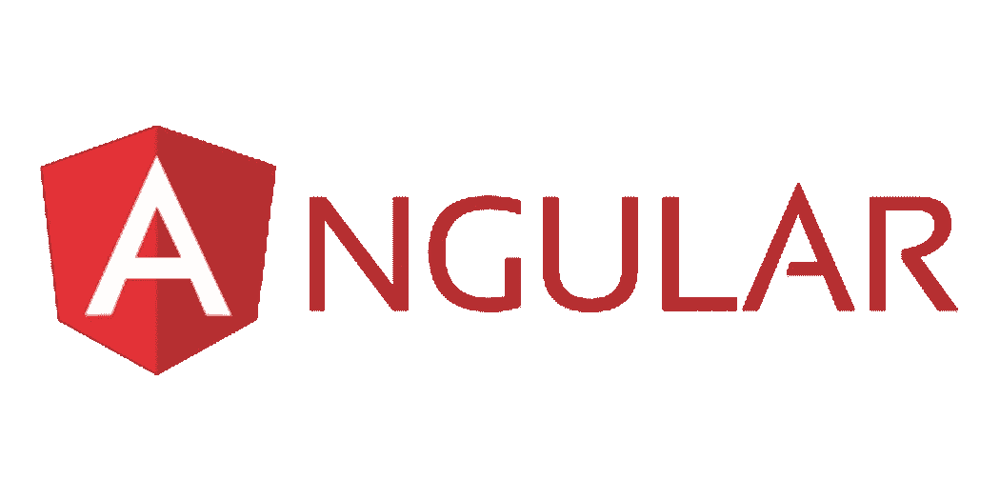
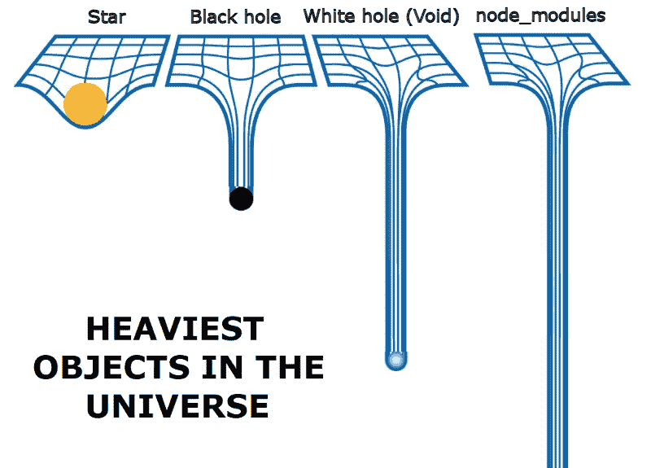

# 有角度的想法和 SonarQube 规则。

> 原文：<https://blog.devgenius.io/angular-ideas-and-sonarqube-rules-3f781f236bfe?source=collection_archive---------2----------------------->

打字稿是一个无止境的工作过程…



JavaScript 奠定了前端开发的基础，但如今 Typescript 发展迅速。它变成了一种编译语言，SonarQube 和 Jenkins 这样的工具帮助我们构建项目，并过滤代码气味、错误、漏洞和其他不一致之处。

SonarQube 规则对于识别 html、css 和 typescript 错误行为非常有帮助，可以改进。通常我们有 0 条未覆盖的线和 0 个未覆盖的条件。但这还不足以取悦 SonarQube。它希望有很多测试代码覆盖率，例如 98%。

0.分解器

解析器类作为预检查层工作。它将在组件准备好之前获取数据和条件。想法是创建类 ServiceResolver，它将订阅您的服务函数，通过例子来说明。这可以用于数据映射或验证检查。如果出现错误，将停止导航到组件。

```
export class ServiceResolver implements Resolve<string> {
  constructor(private authService: AuthService) { }
  resolve(route: ActivatedRouteSnapshot, state:RouterStateSnapshot): Observable<string> {
    return this.authService.getToken()
      .pipe( catchError(err => of(null)) );
  }
}
```

在测试过程中，我们需要为每个测试用例创建一个假的 ActivatedRoute，并将其传递给 resolver.resolve()方法。

您还需要在应用程序模块中定义 ServiceResolver 的用法:

```
const routes: Routes = [
{ path: 'users', component: UsersComponent, resolve: { users:  ServiceResolver } }
];[@NgModule](http://twitter.com/NgModule)({
  imports: [
    RouterModule.forRoot(routes, {onSameUrlNavigation: "reload" })],
  exports: [RouterModule]
})
export class AppRoutingModule { }
```

1.  深层拷贝

创建源的深层副本，它应该是一个对象或数组。这个函数在内部使用，主要在变更检测代码中使用。它不是一个通用的复制功能。当一个对象与这个对象及其子对象(或孙对象等)一起被复制时。)值被赋予另一个值，原始值的子值不受任何影响。

```
let originalObject = {name: 'Olmer', phone: '00000000'};
let copiedObject = Object.assign({}, originalObject);
```

对于具有嵌套属性的更复杂的对象，最好还是使用 deepCopy:

```
this.pricesAndTariffs = deepCopy(ObjectPrices);
```

有很多用于深度复制的库，比如:

[https://github.com/ykdr2017/ts-deepcopy](https://github.com/ykdr2017/ts-deepcopy)

2.ngOnChanges()或 get/set

请尝试在 Input()上使用 get，set，而不是 ngOnChanges。缺点:当 ngOnChanges 中有许多输入时，每个“如果”都必须检查。

2.属性指令

当需要改变视图的外观或行为时使用它。只需实现一个属性指令，并在组件和模块之间共享它，以避免重复相同功能的代码。

3.ngClass 允许选择使用类别。

下面是通过类的多种方法

```
<some-element [ngClass]="'first second'">...</some-element><some-element [ngClass]="['first', 'second']">...</some-element><some-element [ngClass]="{'first': true, 'second': true, 'third': false}">...</some-element><some-element [ngClass]="stringExp|arrayExp|objExp">...</some-element><some-element [ngClass]="{'class1 class2 class3' : true}">...</some-element>
```

**最好最简单的方法是:**

如果学生为空，则禁用，否则不禁用。在按钮属性中使用它。如果您使用引导主题

```
[ngClass]="{disabled: (students === null) ? true : false}" 
```

使用 ngClass 切换类

```
<button [ngClass]="{'active': selectedItem === 'item1'}" (click)="selectedItem = 'item1'">Button One</button>
<button [ngClass]="{'active': selectedItem === 'item2'}" (click)="selectedItem = 'item2'">Button Two</button>
```

4.尽可能使用 renderer addClass，removeClass。这将防止过多的变更检测检查。

5.错误处理程序。如何正确处理错误？

我们可以将我们的错误句柄移动到单独的文件中，并在`AppModule.`中注册它，只需用一个类`MyErrorHandler.`添加`@NgModule`

每个错误都将在模块的边界被拦截。通知用户有关问题并发送错误数据作为票据信息以供将来调查是有用的。

6.空的和未定义的对象。

> Null 表示变量值已定义，但 null 没有值。
> Undefined 意味着变量值没有被定义；价值多少不得而知。

**typeof** 关键字是检查它的理想选择:

```
let user = {
 name: 'Olmer',
 email: 'info@olmer.ru'
};

if (typeof user.phone === 'undefined') {
  console.log(user.phone); // undefined, because no phone property
}function hasUndefinedProperty(obj, prop){
  return ((prop in obj) && (typeof obj[prop] === 'undefined'));
};
hasUndefinedProperty(user, 'city');or the most short syntax:
function isUndefined(value) { return value === void 0; }
```

**typeof** 也可以用来定义其他类型。举例来说:

```
if (typeof prettyPrint !== 'function') {}
if (typeof myStr === "string") {}
```

7.Jasmine Karma 测试框架和“完成”功能。

 [## 有角的

### Angular 是一个构建移动和桌面 web 应用程序的平台。加入数百万开发者的社区…

angular.io](https://angular.io/guide/testing-services) 

```
describe('ValueService', () => {
  let service: ValueService;
  beforeEach(() => { service = new ValueService(); }); it('#getObservableValue should return value from observable',
    (done: DoneFn) => {
    service.getObservableValue().subscribe(value => {
      expect(value).toBe('observable value');
      done();
    });
  });
});
```

8.同一元素上的*ngIf 和*ngFor 导致错误

Angular v2 不支持同一元素上的多个结构指令。
作为一种变通方法，使用`<ng-container> or <ng-template>`元素，它允许您为每个结构指令使用单独的元素。

```
<tr *ngFor = "let item of list">
 <ng-template [ngIf] = "item == ’snooker’">
 <td>Unusual choice</td>
 </ng-template>
</tr>
export class Component{
  const list = ['pool', 'snooker', 'carom ball', 'pyramid'].
}
```

9.错误类型错误:无法将对象“[object Object]”的只读属性“value”赋值。

如果变量为常量、可观察变量或只读状态，则变量变为只读。

您必须使用 Object.assign()方法来更改对象的值，如下所示:

```
Object.assign(target, source);
```

在赋值之前检查对象也是合理的。

```
function isEmpty(str){
    return !str || !/[^\s]+/.test(str); //number and string
}
```

10. **As** 关键字——像造型一样，告诉编译器变量的类型。

```
get topics(): FormArray {
    const result: FormArray = this.form.get('posts');
    return result;
}
//or we can do it this way: 
return this.form.get('posts') as FormArray;
```

11.ViewChild —从视图中选择 html 元素。

[@ViewChild](http://twitter.com/ViewChild) 查询在 AfterViewInit、ngOnInit 或构造函数之前运行。

```
import { Component, ViewChild, AfterViewInit } from '[@angular/core](http://twitter.com/angular/core)';
[@Component](http://twitter.com/Component)({
  selector: 'app',
  template: `<p #myText> Lorem ipsum </p>`
})
export class AppComponent implements OnInit, AfterViewInit  {
  [@ViewChild](http://twitter.com/ViewChild)('myText', {static: false}) text: HTMLElement;
  ngOnInit() {}
  ngAfterViewInit() {
    console.log('myText', this.text);
  }
}
```

{static: false}表示 Angular 将在视图创建后查找元素。
{static: true}当您的孩子使用具有预定义值的实例字段时，请使用它。

# sonar cube——有用的工具，但有时很烦人。

项目的一些情况和规则:

1.  SonarQube 需要修复以下规则:当尝试设置自定义 HTML 标签的样式时，“意外的未知类型选择器`card`”。

想法很明确:不要直接使用有角度的`card`选择器。创建自定义标签，定义类名并应用所需的样式。

`.card {
margin: 0 15px 0px 15px;
}`

```
<card label='My card'
               class="card"
               imageUrl='../assets/icon.svg'
               (clicked)="routeTo('myCard')"></card>
```

2.索纳库贝。更新此函数，使其实现与第行中的不同。

```
<card label='My card'
               class="card"
               imageUrl='../assets/icon.svg'
               (clicked)="routeTo('myCard')"></card>6\. SonarQube. ‘Update this function so that its implementation is not identical to the one on line’private setupFormStatusChange() {
  this.totalFG.statusChanges.subscribe(next => {
    if (next === 'VALID') {
      this.formStatusService.tabIsValid(Tab.Cargo);
    }
  });
  this.detailsFG.statusChanges.subscribe(next => {
    if (next === 'VALID') {
      this.formStatusService.tabIsValid(Tab.Cargo);
    }
  });
}
```

解决方案:将受益人更新放入它自己的函数或方法中，并从两个地方调用它:

```
private setupFormStatusChange() {
  this.totalFG.statusChanges.subscribe(next => {
    this.updateFormStatus(next);
  });
  this.detailsFG.statusChanges.subscribe(next => {
    this.updateFormStatus(next);
  });
}
private updateFormStatus(next: any) {
  if (next === 'VALID') {
    this.formStatusService.tabIsValid(Tab.Cargo);
  }
}
```

3.Sonarqube 投诉“始终如一地使用退货”。

有时你什么都不会返回，并且会错过 return 关键字。我们必须看函数返回:它是布尔型还是其他类型？如果是布尔值，也要返回一个布尔值。否则，就返回 undefined。不会打破逻辑。

```
 function quotationText(quotation: Quotation): string {
    switch (quotation.status) {
      case QuoteStatus.COMPLETED:
        return "waiting for document processing";
      case QuoteStatus.INACTIVE:
        return "inactive";
    }
    return undefined;
  }
```

4.声纳量子质量剖面探测到的“认知复杂性”气味

当我们有很多 **if/else** 或者 **switch/cases** 的时候，就该这样重构了:

5.SonarQube 属性

在模拟测试数据等情况下，有时有必要从声纳分析中排除一些类别。我们在项目根创建特殊文件 **sonar-project.properties**

```
sonar.host.url=http://mysonar:8080/
sonar.language=ts
file.encoding=UTF-8
project.build.sourceEncoding=UTF-8
sonar.sources=apps/
sonar.exclusions= **/*.spec.ts
```

**棱角分明的后记:**



**结论**

充满细节和狡猾行为的棱角分明的世界。了解其中一些需要长时间的经验和耐心…

 [## 手册-基本类型

### 学习 TypeScript 的第一步:基本类型。

www.typescriptlang.org](https://www.typescriptlang.org/docs/handbook/basic-types.html#void)