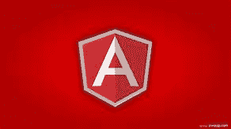
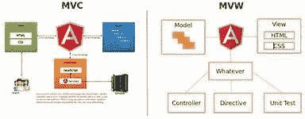

# 有角 JavaScript

> 原文：<https://blog.devgenius.io/angular-javascript-e640b1e62731?source=collection_archive---------11----------------------->

介绍

AngularJS 可能是一个基于 JavaScript 的 ASCII 文本文件前端网络框架，主要由 Google 和一个由个人和公司组成的社区维护，以处理在开发单页面应用程序时遇到的一些挑战。它旨在通过提供客户端模型-视图-控制器(MVC)和模型-视图-视图模型(MVVM)架构的框架，在富裕网络应用程序中通常采用的元素侧，修改每个事件，从而修改此类应用程序的测试。

AngularJS 是 MEAN stack 的一部分的前端，由 MongoDB info、Express.js net 应用服务器框架、Angular.js 本身、Node.js 服务器运行时设置组成。**版本 1.7.x** 将长期支持到 2021 年 7 月 1 日。之后的日期 AngularJS 不能更新，通常建议使用 Angular (2.0+)。

AngularJS 框架通过呈现机器可读文本术语(HTML)页面来工作，该页面嵌入了进一步的定制超文本标记语言属性。Angular 将这些属性解释为将页面的输入或输出组件绑定到由普通 JavaScript 变量描述的模型的指令。这些 JavaScript 变量的值通常在代码中手动设置，或者从静态或动态 JSON 资源中检索。

AngularJS 的理念是，声明式编程应该习惯于生成用户界面和连接包的各个部分，而命令式编程更适合于塑造副学士学位申请的业务逻辑。该框架采用并扩展了古老的超文本标记语言，通过双向数据绑定提供动态内容，从而实现模型和视图的自动同步。因此，AngularJS 不强调特定的文档对象模型(DOM)操作，目标是提高可测试性和性能。新的网站每天都在创建，在这里我们分享我们为所有 JS 开发者提供良好的 Angular JS 开发服务，这是一件有价值的事情，每个人都可以每天通过你的 PC 轻松访问我们的服务，在技术领域每天都创造新的东西。

服务:

●创建替代小工具

●编译修饰 DOM 的指令

●将所有指令链接到范围