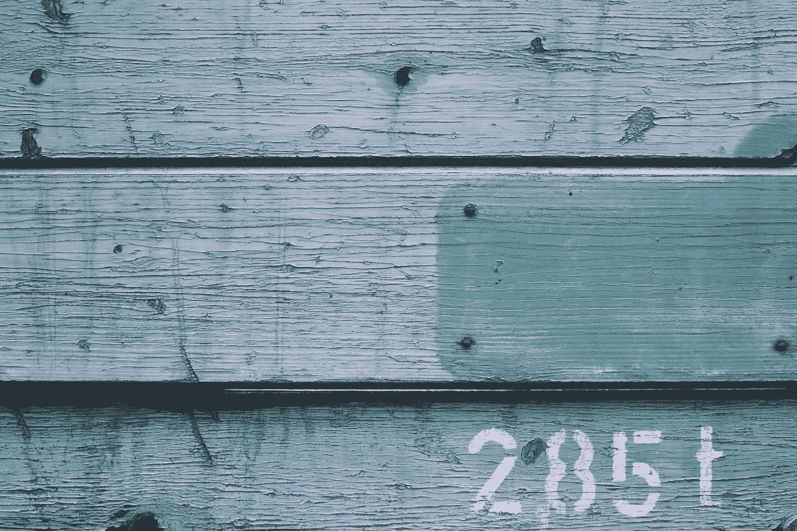

# 角形材料-侧导航、侧切换和滑块

> 原文：<https://blog.devgenius.io/angular-material-sidenavs-side-toggles-and-sliders-5424d0e2c0fd?source=collection_archive---------0----------------------->



马库斯·斯皮斯克在 [Unsplash](https://unsplash.com?utm_source=medium&utm_medium=referral) 上拍摄的照片

Angular Material 是一个流行的 UI 框架，基于 Angular 的材质设计。

在这篇文章中，我们将看看如何使用角度材料到我们的角度项目。

# 侧导航

Angular 带有侧导航组件。

我们可以这样写:

`app.module.ts`

```
import { BrowserModule } from '@angular/platform-browser';
import { NgModule } from '@angular/core';import { AppRoutingModule } from './app-routing.module';
import { AppComponent } from './app.component';
import { BrowserAnimationsModule } from '@angular/platform-browser/animations';
import { MatSidenavModule } from '@angular/material/sidenav';
import { MatButtonModule } from '@angular/material/button';@NgModule({
  declarations: [
    AppComponent
  ],
  imports: [
    BrowserModule,
    AppRoutingModule,
    BrowserAnimationsModule,
    MatSidenavModule,
    MatButtonModule
  ],
  providers: [],
  bootstrap: [AppComponent]
})
export class AppModule { }
```

`app.module.html`

```
<div>
  <mat-drawer-container class="example-container" autosize>
    <mat-drawer #drawer class="example-sidenav" mode="side">
      <p>Auto-resizing sidenav</p>
      <p *ngIf="showFiller">Lorem, ipsum dolor sit amet consectetur.</p>
      <button (click)="showFiller = !showFiller" mat-raised-button>
        Toggle extra text
      </button>
    </mat-drawer> <div class="example-sidenav-content">
      <button type="button" mat-button (click)="drawer.toggle()">
        Toggle sidenav
      </button>
    </div>
  </mat-drawer-container>
</div>
```

`app.component.ts`

```
import { Component } from '@angular/core';@Component({
  selector: 'app-root',
  templateUrl: './app.component.html',
  styleUrls: ['./app.component.css']
})
export class AppComponent {
  showFiller = false;
}
```

`styles.css`

```
.example-container {
  height: 100vh;
}
```

我们添加了以`mat-drawer-container`为容器的侧导航。

`mat-drawer`是 sidenav 抽屉。

切换侧边导航按钮显示抽屉。

“切换额外文本”按钮关闭抽屉。

填充文本显示由`showFiller`控制。

让我们切换抽屉。

# 滑动开关

我们可以用`mat-slide-toggle`组件添加一个开关。

例如，我们可以写:

`app.module.ts`

```
import { BrowserModule } from '@angular/platform-browser';
import { NgModule } from '@angular/core';import { AppRoutingModule } from './app-routing.module';
import { AppComponent } from './app.component';
import { BrowserAnimationsModule } from '@angular/platform-browser/animations';
import { MatSlideToggleModule } from '@angular/material/slide-toggle';@NgModule({
  declarations: [
    AppComponent
  ],
  imports: [
    BrowserModule,
    AppRoutingModule,
    BrowserAnimationsModule,
    MatSlideToggleModule
  ],
  providers: [],
  bootstrap: [AppComponent]
})
export class AppModule { }
```

`app.component.html`

```
<div>
  <mat-slide-toggle color="red" [checked]="true" [disabled]="false">
    Slide me!
  </mat-slide-toggle>
</div>
```

我们将`MatSlideToggleModule`添加到我们的模块中，这样我们就可以将`mat-slide-toggle`组件添加到模板中。

`checked`设置选中状态。

`disabled`如果是`true`则禁用。

`color`设置颜色。

# 滑块

我们可以用`mat-slider`组件添加一个滑块。

例如，我们可以写:

`app.module.ts`

```
import { BrowserModule } from '@angular/platform-browser';
import { NgModule } from '@angular/core';import { AppRoutingModule } from './app-routing.module';
import { AppComponent } from './app.component';
import { BrowserAnimationsModule } from '@angular/platform-browser/animations';
import { MatSliderModule } from '@angular/material/slider';
import { MatCardModule } from '@angular/material/card';@NgModule({
  declarations: [
    AppComponent
  ],
  imports: [
    BrowserModule,
    AppRoutingModule,
    BrowserAnimationsModule,
    MatSliderModule,
    MatCardModule
  ],
  providers: [],
  bootstrap: [AppComponent]
})
export class AppModule { }
```

`app.component.html`

```
<div>
  <mat-card class="example-result-card">
    <mat-card-content>
      <mat-slider min="1" max="5" step="0.5" value="1.5"></mat-slider>
    </mat-card-content>
  </mat-card>
</div>
```

添加`MatSliderModule`让我们将`mat-slider`添加到模板中。

`min`具有最小允许值。

`max`有最大允许值。

`step`有我们可以设定的区间。

`value`是滑块的值。

# 结论

我们可以在我们的 Angular 应用程序中添加侧导航、滑动开关和滑块。