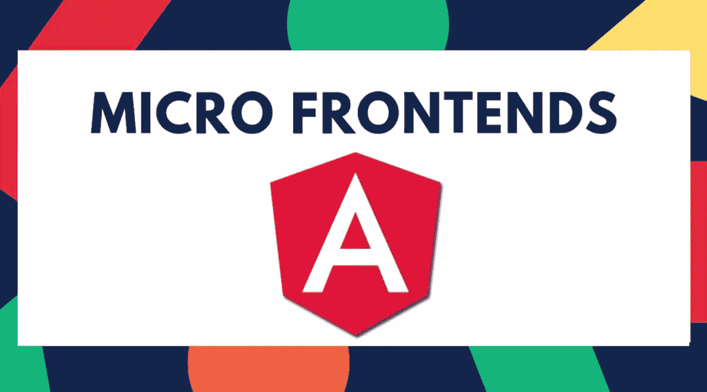
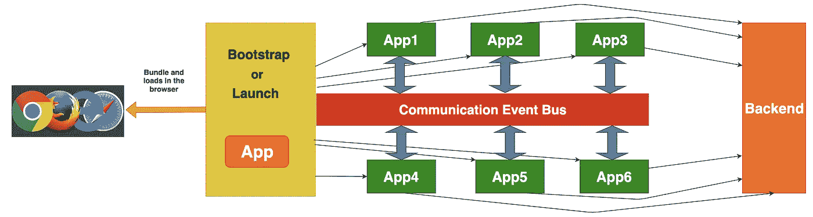
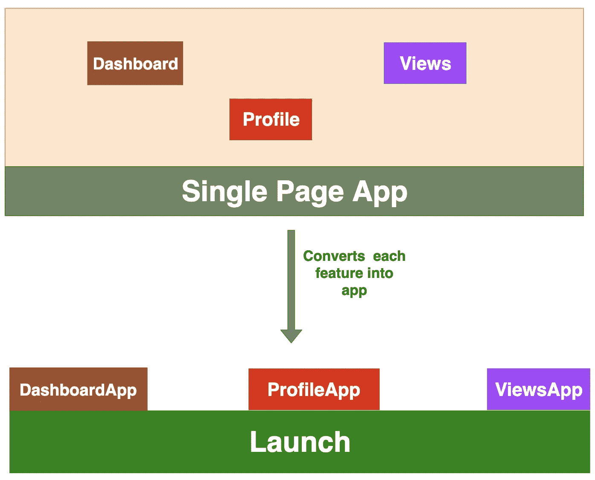
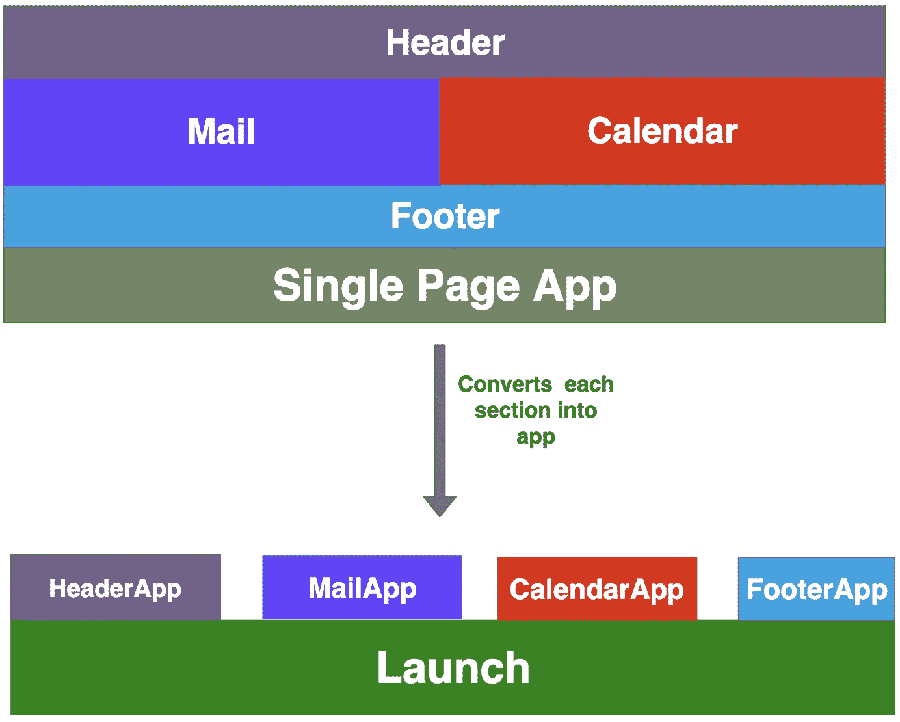
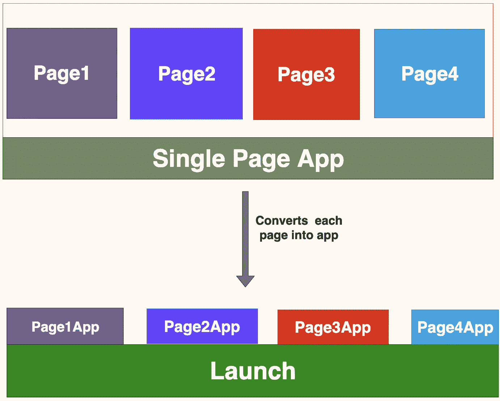
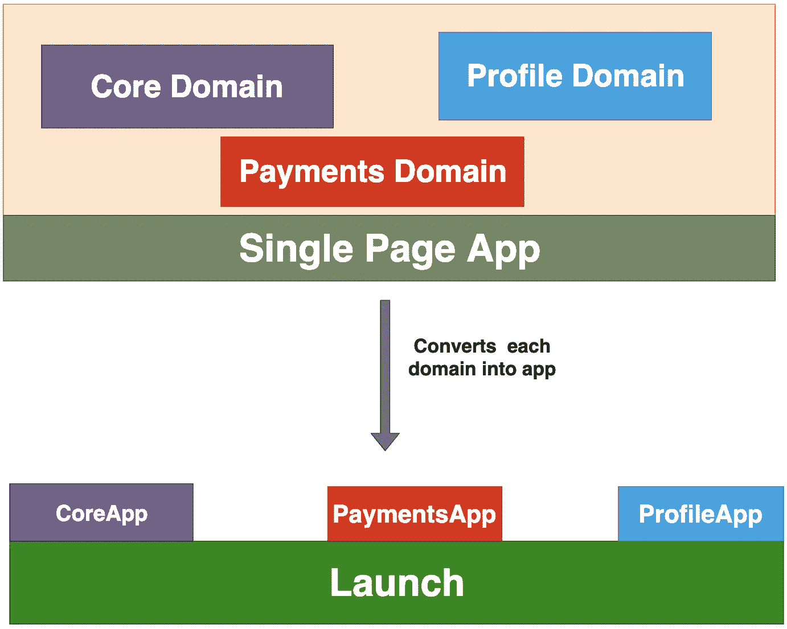
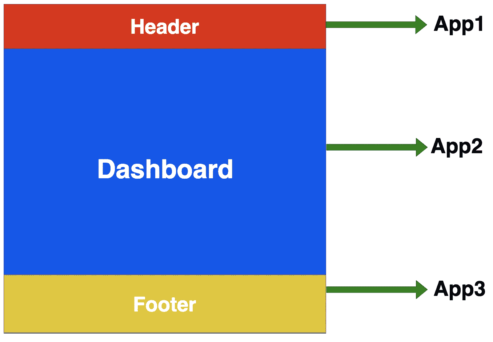
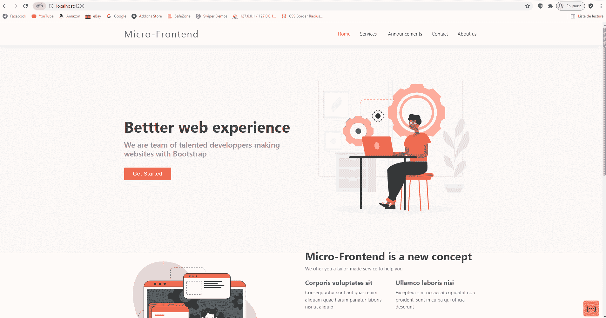

# 角度—微前端

> 原文：<https://blog.devgenius.io/angular-micro-frontend-4dad619c4277?source=collection_archive---------0----------------------->

## 从初级到高级，您需要了解的关于面向微服务的前端架构的一切



现代 web 应用程序变得越来越大、越来越复杂，有时由不同的团队管理。您的应用程序可能具有由不同团队开发的特性，并且您希望在交付整个应用程序之前只将某些特性发布到产品中。如果你有一个回购，你如何管理不同的团队，不同的发布时间表？

大多数复杂的应用程序都存在于客户端，这使得维护变得更加困难。这个庞大的应用程序还有其他一些问题。在这篇文章中，我将讨论优点，缺点，实现和许多其他东西。

*   ***简介***
*   **T5【微前端之旅】T6**
*   ***微前端的优势***
*   ***微前端的特性***
*   ***我们如何拆分应用***
*   ***微前端的不同做法***
*   ***微前端框架***
*   ***示例微前端项目带角***
*   ***汇总***
*   ***结论***

# 介绍

微前端是小的应用程序，通常按子域或功能划分，它们一起工作来交付更大的应用程序。在深入研究微前端之前，我们将了解什么是微前端，以及我们为什么要讨论它们。

通常，项目有不同的规模和不同的需求。如果你的项目简单到只有两三页，可以由一个团队维护，那就不用考虑这些微前端了。你可以用任何你选择的框架来实现，比如 Angular、React 或 Vuejs。

但是，情况并非总是如此。有时候，你的前端应用可能是另一个大应用的一小部分，或者你的应用由不同团队开发的许多部分和功能组成，或者你的应用由不同团队开发的一个功能一个功能地发布到生产中。如果你处于其中一种情况，那么你需要考虑一下微前端。让我们看看下图。



*微前端架构*

如上图所示，我们有 6 个前端应用程序协同工作来交付大型应用程序。这些应用程序之间的通信可以通过事件总线、窗口对象或发布/订阅方法来完成。每个应用程序都可以由单独的团队和任何框架来实现。每个应用程序都可以单独与其后端或端点对话。有一个 bootstrap/launch 应用程序可以加载所有的应用程序，并根据用户交互或路由在 DOM 中挂载和卸载。

**微前端之旅:**我们首先会明白，为什么我们首先需要这个。让我们来看看目前我们用于面向用户的 web 应用程序的技术。

**微前端的优势:**下面是这种架构的优势。

**应用程序很小:**显然，当我们把大的应用程序按章节、页面或功能分割时，应用程序就变小了。

**应用程序是独立的:**因为所有的应用程序都是分开开发的，所以它们是相互独立的

**app 更容易理解:**app 更容易理解，因为它们很小，由单个团队开发。

**应用程序更容易开发和部署:**由于这些应用程序本质上很小，并且由一个团队开发，因此开发和部署非常容易。我们甚至可以独立部署。

**应用程序更容易测试:**我们必须为更大的应用程序编写成千上万的单元测试，并且永远都要运行。这使得部署过程更慢。说到微前端，每个应用都有一些单元测试，并执行自己的单元测试，可以独立运行。

**应用开发变得更快:**由于有了独立的团队，整个开发变得更快更容易。

**CI/CD 变得更加简单**:每个应用程序都可以单独集成和部署，这使得 CI/CD 流程变得更加简单。当我们修复应用程序或引入新功能时，我们不必担心整个应用程序，因为所有功能都是独立的。

**独立的堆栈和版本:**我们可以为每个应用选择自己的堆栈，但这并不经常发生，但我们可以拥有同一堆栈的不同版本。例如，一些团队有时间和灵活性来引入和测试相同堆栈的新版本。

**没有共享代码:**在大型应用程序中，我们倾向于跨功能共享代码，但是，随着应用程序变得越来越大，这并不能很好地扩展，并且会引入很多错误和相互依赖。这不适用于微前端，因为我们不共享代码，除非它是一个哑组件。

**可以轻松地改变架构，而无需触及旧架构:**有时我们必须扩展旧架构，但我们可能没有开发人员来实现或扩展架构。借助微前端方法，我们可以使用最新的堆栈开发新功能，并独立交付。

# 微前端的特点

*   每个前端代表整个应用程序的特定功能或子域
*   每个前端都可以由单独的团队来实现。
*   每个前端可以用不同的技术实现。
*   它们不能共享彼此独立的逻辑及其。
*   每个前端可以归一个团队所有。

# 我们如何拆分应用

让我们看看如何将大型应用程序拆分成微型前端。划分应用程序没有特定的标准，我们可以根据自己的需求以多种方式进行划分。我们将会看到所有可能的应用划分方式。

**按功能**

这是最常见的方法，因为我们可以很容易地划分应用程序的功能。例如，如果应用仪表板、个人资料和视图有三个功能，我们可以将每个功能作为单独的应用，并在 ***Launch.js*** *的帮助下在 DOM 中挂载和卸载。这个 Launch.js 可以是一个单独的 app，也可以只是一个简单的 javascript app。*



**按章节**

有些应用程序的每个部分都有很多功能，例如 coinbase、Gmail 等。在这种情况下，我们可以将每个部分实现为一个新的应用程序。



**逐页**

有些应用的功能是按页面划分的。每个页面都有一些独立的功能。我们可以按页面划分这些应用程序，在下图中我们有四个页面。我们可以用这个做四个应用程序。



**按域**

基于域拆分应用也是最常见的方法之一。



按域

# 微前端的不同方法

有许多方法可以实现微前端。但是我找到了 6 种方法来实现。

*   ***Iframes***
*   ***通过 NGINX***
*   ***腹板构件/角形构件***
*   ***角形库***

*   ****定制的管弦乐****

# *微前端框架*

*微前端已经实现了至少两年，它仍然是一个绿色领域。你有没有想过有没有什么框架或库来实现这些，让我们的工作变得更容易。答案是肯定的，有几个库或框架*

*   *[单温泉](https://single-spa.js.org/)*
*   *[frint.js](https://frint.js.org/)*

# *单温泉*

*single-spa 是一个用于前端微服务的 javascript 框架，可以通过 Angular、React 和 Vue.js 等所有三种流行的框架/库来实现。它可以根据需要延迟加载应用程序，您可以查看他们的网站了解更多信息。*

# *福临门*

*js 是一个模块化的 JavaScript 框架，用于构建可伸缩的反应式应用程序。它还不支持 Angular，但它支持 React。如果您正在从头开始构建一个反应式应用程序，并且刚刚起步，那么这就是适合您的框架。你可以去他们的网站了解更多信息。*

# *具有角度的示例微前端项目*

*有了这些信息，让我们在一个[单 spa](https://single-spa.js.org/) 框架的帮助下构建一个示例 Angular 项目。我想为演示建立一个简单的应用程序，我会在另一篇文章中用所有的功能做完整的例子。*

*如下图所示，我们将按部分分割此应用程序。我们将总共实现 **4 个**应用:HeaderApp、DashboardApp、FooterApp 和 root 应用。*

**

*这是四个应用程序的四个存储库。您可以克隆它们并在您的机器上单独运行它们。*

```
*// root app runs on port 4200
git clone https://github.com/ahmedbhl/micro-root.git
npm install
npm start

// micro header runs on port 4300
git clone https://github.com/ahmedbhl/micro-header.git
npm install
npm start

// micro dashboard runs on port 4202
git clone https://github.com/ahmedbhl/micro-dashboard.git
npm install
npm start

// micro footer runs on port 4201
git clone https://github.com/ahmedbhl/micro-footer.git
npm install
npm start*
```

*您可以在**[***http://localhost:4200/***](https://morioh.com/redirect?id=5e2516a9c67a8f7752ae7b27&own=5ce3b24117a839790b133129&l=http%3A%2F%2Flocalhost%3A4200%2F)上访问整个应用程序***

******

****一起运行所有四个应用程序，使其成为一个应用程序****

***下面是微根 app 索引 HTML 文件。我们在第 10 行导入所有三个应用程序，并用适当的名称和位置注册这些应用程序。因为我们在页面加载时加载所有的应用程序，所以我们没有定义任何特定的上下文路径。***

```
***<!DOCTYPE html>
<html>
  <head>
    <meta http-equiv="Content-Security-Policy" content="default-src *  data: blob: 'unsafe-inline' 'unsafe-eval'; script-src * 'unsafe-inline' 'unsafe-eval'; connect-src * 'unsafe-inline'; img-src * data: blob: 'unsafe-inline'; frame-src *; style-src * data: blob: 'unsafe-inline'; font-src * data: blob: 'unsafe-inline';">
    <meta charset="utf-8">
    <meta http-equiv="X-UA-Compatible" content="IE=edge">
    <title>Your application</title>
    <meta name="viewport" content="width=device-width, initial-scale=1">
    <meta name="importmap-type" content="systemjs-importmap">
    <script type="systemjs-importmap">
      {
        "imports": {
          "footer": "http://localhost:4201/main.js",
          "dashboard": "http://localhost:4202/main.js",
          "header": "http://localhost:4300/main.js",
          "single-spa": "https://cdnjs.cloudflare.com/ajax/libs/single-spa/4.3.5/system/single-spa.min.js"
        }
      }
    </script>
    <link rel="preload" href="https://cdnjs.cloudflare.com/ajax/libs/single-spa/4.3.5/system/single-spa.min.js" as="script" crossorigin="anonymous" />
    <script src='https://unpkg.com/core-js-bundle@3.1.4/minified.js'></script>
    <script src="https://unpkg.com/zone.js"></script>
    <script src="https://unpkg.com/import-map-overrides@1.6.0/dist/import-map-overrides.js"></script>
    <script src="https://cdnjs.cloudflare.com/ajax/libs/systemjs/4.0.0/system.min.js"></script>
    <script src="https://cdnjs.cloudflare.com/ajax/libs/systemjs/4.0.0/extras/amd.min.js"></script>
    <script src="https://cdnjs.cloudflare.com/ajax/libs/systemjs/4.0.0/extras/named-exports.js"></script>
    <script src="https://cdnjs.cloudflare.com/ajax/libs/systemjs/4.0.0/extras/named-register.min.js"></script>
    <style>
    </style>
  </head>
  <body>
    <script>
      System.import('single-spa').then(function (singleSpa) {
        singleSpa.registerApplication(
          'header',
          function () {
            return System.import('header');
          },
          function (location) {
            return true;
          }
        )

        singleSpa.registerApplication(
          'dashboard',
          function () {
            return System.import('dashboard');
          },
          function (location) {
            // return location.pathname.startsWith('/app2');
            return true;
          }
        )

        singleSpa.registerApplication(
          'footer',
          function () {
            return System.import('footer');
          },
          function (location) {
            // return location.pathname.startsWith('/app1');
            return true;
          }
        );

        singleSpa.start();
      })
    </script>
    <import-map-overrides-full></import-map-overrides-full>
  </body>
</html>***
```

****根 app index.html****

***您可以给定/header 位置路径，以便在浏览器 URL 导航到/header 时加载标头。让我们来测试一下。***

```
***<script>
      System.import('single-spa').then(function (singleSpa) {
        singleSpa.registerApplication(
          'header',
          function () {
            return System.import('header');
          },
          function (location) {
            return location.pathname.startsWith('/header');
            // return true;
          }
        )***
```

****带/头****

******

# ***结论***

***我知道 Microfrontends 是如此时髦的东西，但你不应该在每个应用程序上都使用它。如果你的程序很小，不要使用它，也不要把它复杂化。这种方法应该使我们的整个过程天衣无缝，而不是过于复杂。因此，在使用这种方法之前，请做出最佳判断。***

***感谢阅读，继续访问！***