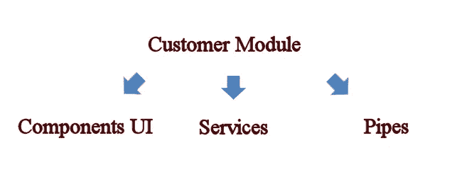

# 角管棘手的时刻

> 原文：<https://blog.devgenius.io/angular-pipe-tricky-moments-7681af7fdb47?source=collection_archive---------4----------------------->

只是一些 pipe 的练习思路在开发的时候出现在我面前。


帕提亚骑士全面保护(古罗马时代)

发明 angular pipe 是为了提供一个实例，该实例将运行一次，直到状态发生变化。管道接受输入，并将其转换为另一种类型，以在模板中生成输出。要在模板中使用管道，我们只需要符号|

Pipe 像一只斗牛犬一样捕捉对象值，不想刷新状态。有时候会变得很烦。要避免这种情况，请向管道添加附加参数，并在数组更改后立即更改它。即使使用纯管道，状态也会被刷新。

```
refreshValue: number = 0;// every new call will set new value 
updateChargeCode(charge: ChargeObject): void {
  this.refreshValue++;
}
```

从 component.html 调用管道，并将 **refreshValue** 变量作为参数传递:

```
<div [ngClass]="(charge.priceData | TariffChecker : refreshValue) ? 'charge-none' : ''">
</div>
```

现在看看管道， **refreshValue** 没有被使用，我们只是传递它以避免缓存:

```
@Pipe({
  name: "TariffChecker"
})
export class TariffCheckerPipe implements PipeTransform {
  transform(priceData: ChargeData, refreshValue?: number): boolean { return treatPassedParam(priceData);  
  }
}
private treatPassedParam(priceData: ChargeData): boolean {
  ...
  return false;
}
```

**纯管道**

它是一种没有内在状态和副作用的方法。所有实现的计算都不依赖于状态，我们有相同的输入参数并返回相同的值。这是因为我们不想为每个变更检测执行管道。

1.  输入参数的值定义了输出。如果输入保持不变，那么输出也不会改变。
2.  它可以传播到其他物体上，输出保持不变。

**不纯管道**

Angular 将在每次更改检测时执行不纯管道。他会经常在管道对象上调用 transform 方法。

1.  输入参数不会帮助我们理解，输出将如何被改变。
2.  它不能传播，因为内部状态可以从外部改变。

AsyncPipe 是包“@angular/common”中的标准管道。AsyncPipe 使用广泛，但它是不纯的，因为它有一个内部状态，即作为参数传递给管道的对可观察对象的订阅。

**管道中的多个参数**

从 UI component.html 调用管道:多个参数可以用冒号分隔:

```
<div [readonly]="{{myArg | myPipe: 'anotherArg', refreshValue }}" />
```

此外，您可以链接不同的管道，如下所示:

```
<div [ngClass]="{{ myArgument | myPipe: param1,
 myArgument2 | myPipe2: param2 }}" />
```

我们可以在组件类型脚本中定义管道

```
private result = 0;
constructor(private readonly dtFormatterPipe: DateFormatterPipe) {}private DateChangeSubscription() {
  result = this.dtFormatterPipe.transform(minDate, maxDate);
}
```

**将多个管道组合成一个变量:**

```
<ng-container *ngIf="{ name: myPipe | async,
   surname: myPipe2 | async } as personType">
  {{ personType.name}}
</ng-container>
```

**什么时候用管子？原因是什么？举几个例子。**

管道只是另一种分割 Angular 应用程序源代码的机制。举例来说，我们有一个组件来管理 UI 逻辑，我们还使用一个服务来进行基于数据的操作。并且额外的逻辑处理和错误处理可以移到管道中。它使代码更可读和可测试。



1.  可能返回默认值:

如果输入值不合适，使用默认值。我们向管道传递多个参数。

```
<my-component [value]="myValue | calculate: myDefaultValue"></my-component>
```

并在管道层面上做出一些处理:

```
@Pipe({name: 'calculate', pure: true})
export class CalculatePipe {
  transform(value: string, myDefaultValue: string): string {
    return value || defaultValue;
  }
}
```

或者，如果输入值为空，则可能是三元校验:

```
return value ? value : defaultValue;
```

2.以某种方式制作日期格式:

```
@Pipe({
  name: "formatMyDate"
})
export class FormatMyDatePipe implements PipeTransform {
  transform(date: Date): string {
    const dateOptions: Intl.DateTimeFormatOptions = { timeZone: "UTC", day: "numeric", month: "long", year: "numeric" }; const result = date.toLocaleDateString("en-US", dateOptions);
    return formatDate(result, ***DATE_LONG_PATTERN***, "en_US");
  }
}
```

3.用于检查空数组的管道:

```
@Pipe({
  name: "arrayNotEmpty"
})
export class ArrayNotEmptyPipe implements PipeTransform {
  transform<T>(arr: T[]): boolean {
    return arr?.length > 0;
  }
}
```

4.验证管道。

首先，让我们定义一些数组项:

```
export interface RouteCharges {
  chargeId?: string;
  chargeName: string;
}
const routeCharge1: RouteCharges = {
  chargeId: "1",
  chargeName: "Test"
}
const routeCharge2: RouteCharges = undefined;const pipe: ValidateChargePipe = new ValidateChargePipe();
pipe.transform([routeCharge1, routeCharge2]);
```

然后用数组参数调用管道进行过滤:

```
@Pipe({
  name: "validateCharge"
})
export class ValidateChargePipe implements PipeTransform {
  transform(routeCharges: RouteCharges[]): boolean {
    return routeCharges?.some(route => route?.chargeId);
  }
}
```

**管道异步 vs 订阅**

异步管道将创建订阅并保持可观察的最新值。异步管道将自动更新模板内的值。

使用 dollar $ char 来区分可观察变量。

```
data$: Observable<PersonData[]>;constructor(private readonly store: Store<State>) {}
ngOnInit() {
  this.data$ = this.store.pipe(...);
}
```

在 template.html 称之为

```
<ul><li *ngFor="let item of data$ | async">{{ item.id }}</li></ul>
```

订阅的工作方式与此类似，但需要花费更多精力来更新机制并手动取消订阅:

```
ngOnInit() {
  this.data$ = this.service.data$.subscribe(item => {
    this.myServiceData = item;
  });
}
ngOnDestroy() {
  this.data$.unsubscribe();
}
```

所以，简短地说说 **subscribe()** :

1.  为了避免 ngOnDestroy()中的内存泄漏，总是需要取消对对象的订阅。
2.  当我们在 ngOnInit()中订阅 Observable 时，它不会在模板中更新值。OnPush 更改检测策略不适用。需要手动调用 changedectitionref . markforcheck()。

```
 private readonly destroy$: Subject = new Subject<boolean>();
    isSaving: boolean; // variable for template html

    constructor(
        private myService: MyService,
        private cdr: ChangeDetectorRef
    ) {
      super(cdr);
      this.destroy$ = new Subject<boolean>();
    }

    ngOnInit() {
      this.myService.getTariffData()
            .takeUntil(this.destroy$)
            .subscribe(next => {
                 console.log(next));
                 this.isSaving = next;
                 this.cdr.markForCheck()
            });
    }

    ngOnDestroy() {
        this.destroy$.next(true);
        this.destroy$.complete();
        this.destroy$.unsubscribe();
    }
```

所以，关于**异步**的艰难时刻:

1.  对象必须潜在地在多个不同的地方在单个模板中被展开多次。喜欢`*ngIf="data$ | async as PersonType"`
2.  在真条件下可以访问`*ngIf`或`*ngFor`内的变量。例如，如果`*ngIf` 为 false，那么在组件方法中，内部的属性等于 null。


华金·索罗拉，1910 年，印象派绘画

**结论**

当创建一个有很多副作用复杂处理时，我们应该使用 subscribe to Observable，否则，“异步管道”可以很好地根据某些条件在 UI 中显示项目。

**链接**

 [## 有角的

### Angular 是一个构建移动和桌面 web 应用程序的平台。加入数百万开发者的社区…

angular.io](https://angular.io/guide/pipes)