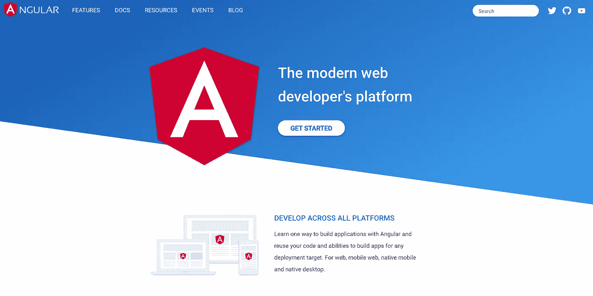
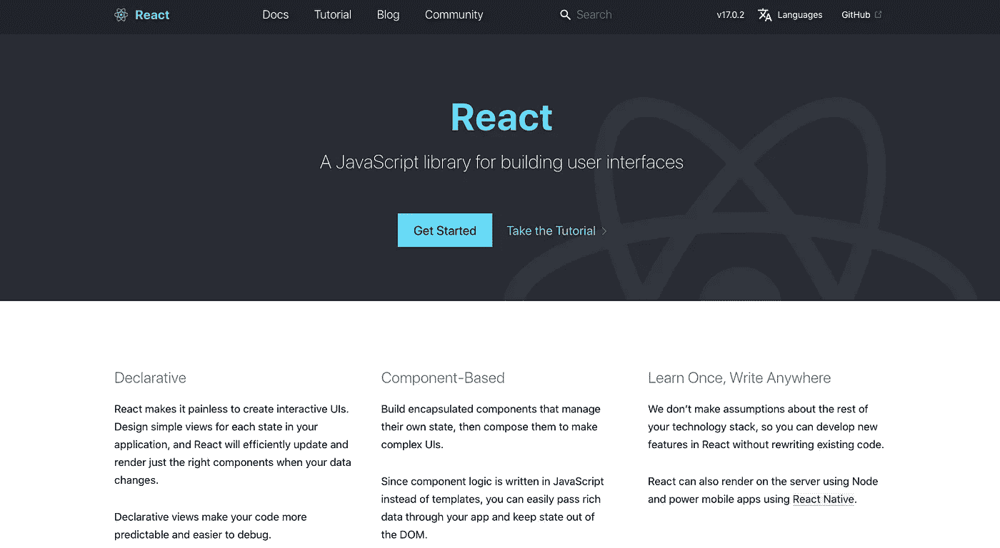
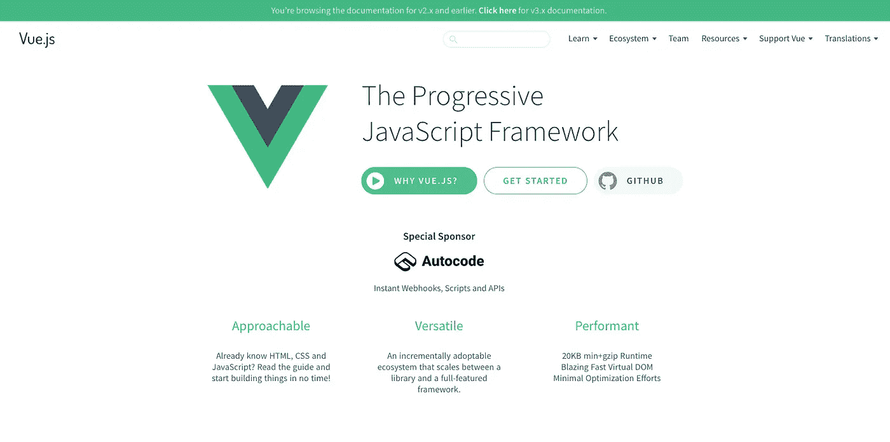

# 有棱角，有反应，还是 Vue？2021 年学哪个 JavaScript 框架？

> 原文：<https://blog.devgenius.io/angular-react-or-vue-which-javascript-framework-to-learn-in-2021-64847dd4071a?source=collection_archive---------3----------------------->

瑞安·普特拉在 [Unsplash](https://unsplash.com?utm_source=medium&utm_medium=referral) 拍摄的照片

有棱角，有反应，还是 Vue？哪个前端框架最适合你？这是 web 开发中最常被问到的问题之一，尤其是如果你在这个领域没有太多经验的话。

在我的职业生涯中，我或多或少地使用过所有这些框架，所以在这篇文章中，我想分享我所学到的东西，并简要解释这些框架的作用。

所以，希望这篇文章能在你决定选择哪一个学习/工作之前给你一些建议。

## 先学 JavaScript

照片由[费伦茨·阿尔马西](https://unsplash.com/@flowforfrank?utm_source=medium&utm_medium=referral)在 [Unsplash](https://unsplash.com?utm_source=medium&utm_medium=referral) 拍摄

实际上，关于这些前端框架，你首先应该知道的是，它们都是基于 JavaScript 的。

有些人甚至在对 JavaScript 有所了解之前就开始学习一个框架，当他们这样做的时候，他们最终只会更加困惑。

一旦你开始使用框架，你应该能够理解 JavaScript 和框架的区别。因为框架和库可以帮助我们更容易更快地编写 JavaScript。

这就是为什么在开始学习它们之前，你应该对 JavaScript 有很好的理解。

## 他们都做同样的工作

你应该知道的第二件事是，所有这些框架做或多或少相同的工作，这有助于我们通过简化 JavaScript 的使用或让它与 HTML & CSS 一起工作，以更简单的方式构建 web 应用程序。

因此，如果所有这些框架都在做类似的工作，那么您如何决定哪一个适合您呢？

在这种情况下，我会考虑两件事来帮助我决定选择哪个框架:

## 1.你是否喜欢它

[Jason Leung](https://unsplash.com/@ninjason?utm_source=medium&utm_medium=referral) 在 [Unsplash](https://unsplash.com?utm_source=medium&utm_medium=referral) 上的照片

事实是每个人都有点不同，可能对编程语言、框架或工具有不同的选择。

这就是为什么如果你在网上搜索或询问其他开发人员的意见，你会看到他们中的一些人是 React 的粉丝，而其他人选择 Angular，其余的是 Vue js 开发人员。

所以我认为这是个人的问题……要解决这个问题，你可以自己尝试一个简短的教程，看看其中的一些功能，而且你可能会对是否喜欢使用这个框架有自己的看法。

## 2.市场需求

亚历山大·沙托夫在 [Unsplash](https://unsplash.com?utm_source=medium&utm_medium=referral) 上的照片

比如说，你尝试了 Vue js，发现它非常酷。接下来你要做的就是找一份和 Vue 一起开发的工作或项目。

当然，你总能在任何地方找到远程项目，但我相信，许多人，尤其是初级开发人员，仍然更愿意在离他们居住更近的公司全职工作。

所以，如果你想要一份固定的全职工作，那么你应该考虑一下你目前居住的地方的市场需求，看看市场上是否有足够的 Vue js 工作。

所以，在你进行长时间的投资并深入挖掘你最喜欢的投资框架的细节之前，一定要先看看你当地的市场行情和开盘头寸。

现在让我们继续快速解释这些框架，并看看它们的作用。

# 有角的

[棱角官方网站](https://angular.io/)

Angular 是用于构建现代 web 应用程序的基于组件的框架。它是由谷歌创建的，背后有非常大的社区支持。

Angular 使用 TypeScript 进行开发，这种开发更加安全，而且 Angular 为路由、客户机-服务器通信、表单构建和许多其他事情提供了自己的包和解决方案。

[Angular 还提供了一个 CLI](https://cli.angular.io/) (命令行界面)，对于启动、部署或测试应用程序等操作来说非常方便。此外，您还可以使用 CLI 创建新组件、服务和其他许多东西。

# 反应

[反应官方网站](https://reactjs.org/)

第二个是 reactor(实际上是一个库，而不是一个框架)，它在今天非常流行。反应过来的是脸书。它还有一个基于组件的逻辑，背后还有一个庞大的社区，比如 Angular，不过 React 的一些主要区别在于:

*   React 的学习曲线很小，因此更容易学习
*   React 使用了一种称为“JSX”的不同语法，它基本上结合了 JavaScript 和 HTML
*   React 提供了自己的数据管理方法

这与 Angular 有很大不同。使用 React 的其他一些优点是

*   由于它今天非常流行，你可能会发现更多的工作/项目选择
*   React 有一个快速的呈现系统，这对于网站的性能非常重要

# 某视频剪辑软件

[Vue js 网站](https://vuejs.org/)

我们名单上的第三个是 Vue js。Vue 是一个用于构建用户界面的渐进式框架。Vue 用一些叫做指令的属性扩展了 HTML，比如 Angular has，它允许我们给 HTML 标签添加一些功能。

Vue 有自己的工作生态系统，你可以在它的[官方文档](https://v3.vuejs.org/guide/introduction.html)中找到更多信息。

## 试着坚持其中一个

即使这些框架之间有相似之处，在它们之间从一个项目跳到另一个项目对你没有任何帮助(除非你有足够的经验。)

所以一旦你做了决定，我强烈建议你坚持使用那个框架，直到你有足够的经验，然后如果你仍然喜欢，你可以尝试使用另一个框架。

如果你有兴趣了解更多编程知识，别忘了订阅[我的简讯](https://bit.ly/2KXEBsv)。

感谢您的阅读！