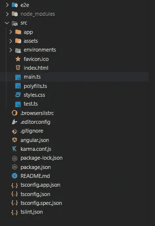

# 角度—对 RxJS 的简单理解

> 原文：<https://blog.devgenius.io/angular-simple-understanding-with-rxjs-d5fbb4facb9f?source=collection_archive---------2----------------------->

对角度的简单理解。


用 RxJS 对角度的简单理解。

在这里，我们将第一次谈论对角度的简单理解，自从我写了一篇关于 ReactJS / React Native 的文章。

首先，很抱歉，我几个月前还没有写文章，因为有很多事情要做，所以我没有时间写文章。不管怎样，这是我写的新文章！

**我知道，棱角分明很难学，但是嘿！这篇文章对 Angular 有一个简单的理解，让你在开始学习 Angular 的时候不会困惑或者挣扎。所以，让我们关注好的方面。**

# 遵循这篇文章的要求

1.  非常基础的 JavaScript(ES6)
2.  非常基本的类型脚本(可选)

# 跟随这篇文章的必备工具

## 1.NodeJS

重要的是 NodeJS 本身，因为 NodeJS 带有 **NPM** ，在这种情况下，我们将使用它来安装 ReactJS。你可以在这里下载 [NodeJS](https://nodejs.org/en) 。我推荐安装 **LTS** 版本，我写这篇文章的时候用的是 v 14 . 15 . 0*。*

## 2.文字编辑器

有很多文本编辑器，我更喜欢使用 **VSCode** ，你可以在这里下载 [VSCode](https://code.visualstudio.com) 。
如果你想使用像 **Sublime Text** 或 **Atom、**这样的文本编辑器，选择适合你的工具就可以了。

# 我为什么写这篇文章

胡达，你为什么写这篇文章？为什么你不再写一篇关于 React / React Native 或者 NodeJS 或者其他东西的文章呢？为什么是棱角分明的男人？！

好吧，是这样的，几天后我有空闲时间。不知道为什么开始学棱角分明。所以我自己说，为什么你才开始写一篇关于棱角分明的文章？我是说，为什么不呢？开始学的时候很好奇别人说的很难学的 Angular。伙计。很辛苦哈哈哈。

这就是为什么我创作了一篇有棱角的文章。似乎很有趣。

# 什么是有角？

Angular 是 Google 开发的健壮前端或 JavaScript 框架之一，我应该说 Angular 的意思是，它和其他框架一样。和 React 或者 Vue 一样。但是，有角的区别比任何其他框架都大:

1.  基本代码。
2.  复杂代码。
3.  使用依赖注入。
4.  使用 TypeScript。
5.  MVC 模式。
6.  CLI。

Angular 的用途是，和另一个前端框架一样，但是和另一个框架最大的不同，它内置了**类型脚本**和 **CLI** 。我假设你知道 CLI 是，那么什么是 TypeScript？TypeScript 是一种使用静态类型的 Javascript，如 Java、Golang 等。这就是 Angular 比其他任何框架都更健壮的原因，因为它的代码更加结构化。

您可以访问下面的 Angular 和 TypeScript 文档:

**棱角分明的文件**:

 [## 有角的

### Angular 是一个构建移动和桌面 web 应用程序的平台。加入数百万开发者的社区…

angular.io](https://angular.io/guide/setup-local) 

**打字稿**:

[](https://www.typescriptlang.org/) [## 任意比例的输入 JavaScript。

### TypeScript 通过向语言中添加类型来扩展 JavaScript。TypeScript 通过以下方式加速您的开发体验…

www.typescriptlang.org](https://www.typescriptlang.org/) 

# 我们开始吧

好吧，那么我们要构建什么样的应用程序呢？我们将使用 Angular 构建一个简单的 todo 应用程序，让您简单并完全理解。我们将使用一个名为 [JSON Typicode](https://jsonplaceholder.typicode.com/) 的假 rest API。

我假设您已经安装了 NodeJS。

## **1。安装角度 CLI**

首先，您需要使用 NPM 安装 **Angular CLI，**下面是您必须在终端/命令提示符下运行的代码:

```
npm install -g @angular/cli
```

上面的命令将在您的本地计算机上全局安装 Angular CLI。

## 2.使用 Angular CLI 创建新项目

成功安装 Angular CLI 后，您必须创建一个新项目。创建新项目的命令非常简单，命令如下:

```
ng new project-name-here
```

上面的代码，会把 Angular 安装在你当前的目录下，确保你把它安装在你想要的正确的目录下。成功创建新项目后，您可以在文本编辑器中打开它。成功创建新项目后，结果如下。



angular v11.0.4 的全新项目

这是你的项目目录，看起来很复杂，而且很多，我要重复一下正在发生的事情。

1.  **e2e** ，包含单元测试的文件夹。
2.  **src** ，一个常用文件夹，包含一个文件和 app 的文件夹(我们重点看这个)。
3.  **资产**，包含样式、图像或您拥有的其他资产的文件夹。

一旦你阅读了这篇文章，我会解释其他的事情。因此，确保像项目一样在正确的目录下打开终端/命令提示符。您可以使用下面的命令启动应用程序:

```
// Start the common server
ng serve// Start the common server by opening automatically in the browser
ng serve --open
```

默认情况下，它将在本地主机的 4200 端口打开。这是你创建的 fresh 应用的截图。


全新项目 Angular 版本 11.0.4

## **3。开始制作 Todo App**

好的，确保你没有错过第一步和第二步。在这里，我们将打开代码并清除应用程序，以启动我们将要构建的 Todo 应用程序。

所以，打开**src/app/app . component . html**中的文件，清除里面的代码，就像下图这样。


清除 src/app/app.component.html 的代码

如果你清除这些代码，然后打开浏览器，它会变得干净，变成一个空白页，因为你去掉了默认的 HTML 代码。

## 4.开始创建一些组件**。**

以下是我们将要创建的组件:

1.  **todos** 组件，包含我们的主要应用程序代码。
2.  **todo-create** 组件，包含我们创建 todo 的表单。
3.  **todo-item** 组件，包含我们的待办事项列表。

好的，我们如何创建这个组件？Angular 提供了自动创建组件的命令。下面是您想要运行来创建上面这些组件的命令:

```
// Generate todos component
ng generate component components/todos// Generate todo-create component
ng generate component components/todo-create// Generate todo-item component
ng generate component components/todo-item
```

这三个命令将生成你的组件，如果成功，它将输出这个结果到你的终端。


组件生成

该命令将自动创建您的组件，并在其中创建一些文件。Angular 将被放置在 **src/app/components** 文件夹中，angular 将提供包含 4 个文件、HTML、测试、TypeScript 和组件 CSS 的文件夹。**我们在这里将重点放在 HTML 和 TypeScript 上，不需要理会 CSS 和测试文件**。

下面是新创建的组件截图:


CLI 新生成的组件。

你注意到上图中突出显示的代码了吗？突出显示的代码是指用于组件的 TypeScript 装饰器。您可以在 TypeScript 文档中了解更多信息。

你注意到前面图像中终端的蓝色了吗？据说**更新**。这意味着当你运行一个生成组件的命令时，它将创建文件并更新入口点，入口点文件在这个例子中被命名为 **app.module.ts** 在 **src/app** 文件夹中。

你可以看到入口点( **app.module.ts)** 文件，看起来会是这样的。


入口点文件 **src/app/app.module.ts**

上面的图片，就是你的名为 **app.module.ts** 的入口点。这意味着，你的核心代码，或者我应该说的核心角。你可以看到在我们创建组件后，angular 自动在 **app.module.ts** 文件中注册我们的组件，准确地说是在**声明**键中。你也不需要为在你的应用中注册组件而烦恼。我希望你没有被这一步弄糊涂。

## **5。为应用程序创建核心文件(必读)。**

正如我之前所说，Angular 有一个复杂的代码环境，用于与用户、服务器或组件进行交互。

为了简单起见，我缩短了我的句子，并解释了 Angular 中您将面临的常见事情。

1.  **服务**

为了与服务器和组件交互，angular 有一个名为 service 的文件。这个服务文件，包含了我们的 app 逻辑，比如和服务器交互，和状态交互，或者和组件交互。好的，如何创建服务？CLI 提供了它，下面是命令:

```
ng generate service services/todo
```

上面的命令将在 **src/app/services** 文件夹中生成一个名为 **todo.service.ts.** 的服务文件

下面是该文件的代码:


Angular CLI 新生成的服务

**2。型号**

你需要一个模型来表示你从服务器上得到的数据，你**必须**使用这个模型，因为为了代码的一致性和开发的目的(使调试更容易)。

如何创建模型？遗憾的是，Angular 没有提供用于生成模型的 CLI，但代码真的很简单，在 **src/app/models** 文件夹内制作一个名为 **todo.model.ts** 的文件(先创建 models 文件夹)。代码如下:

**todo.model.ts**

上面的代码非常简单，只是创建了一个可以在构造函数中赋值的类。顺便说一下，我为这个模型创建了两种编写代码的方法。

**3。HTTP** 和**表单模块**。

为了与服务器进行交互，你需要向服务器发送请求，angular 提供了 **HTTP** (不是 Axios 或 fetch API)，它就像另一个常见的 HTTP 库，如 Axios 或 fetch API，但它是内置的 Angular。

什么是**表单模块**？在 Angular 中，如果你有一个与表单交互的组件，比如文本输入，复选框等。您必须将角度模块注册到应用程序。

那两个怎么用？转到 **src/app** 文件夹中的入口点文件( **app.module.ts)** 。

将代码更新如下:

更新后的 **app.module.ts**

我从 angular 注册了 **FormsModule** 和 **HttpClientModule** ，并将它们放在 imports 数组中。就像与表单和 HTTP 请求交互一样简单(与服务器交互)。

在你成功地实现了上面的三个步骤后，你可以进入下一步。

## 6.准备与服务器和组件交互的服务

在这一步中，我们将使我们的服务工作，您可以在实现它之后看到服务的工作。我会解释我们服务的每一个细节。

所以，打开 **src/app/services** 文件夹内的 **todo.service.ts** 。将您的代码更新成这样。

我猜，当你看到这些代码时，你已经迷惑了。我知道，我也经历过那个阶段。好的，我要迭代上面发生的事情，我也写一些注释，这样你们就能完全理解代码中发生了什么。

1.  **导入声明**

**首先**，我们导入一些来自 rxjs 的函数，包括:

*   **可观察的**，用于返回一些承诺基数。
*   **BehaviorSubject** ，用于观察某个状态是否从服务器更新。
*   **throwError** ，用于将错误返回给客户端或者应该说是组件。

**二、**导入 rxjs 运算符，什么是 rxjs 运算符？如果你看了我之前的一篇关于[**react js——用 Redux Saga**](https://medium.com/dev-genius/reactjs-simple-understanding-redux-with-redux-saga-f635e273e24a?source=friends_link&sk=7117848b8bcc90b3921a64ab3b2ef7b9) 简单理解 Redux 的文章，你就会看到两者的相似之处。这就像 rxjs 必须与我们从服务器接收的数据进行交互的一堆函数。我们在该应用中使用的功能有:

*   **映射，**用于映射来自服务器的数据。
*   **catchError** ，用于当我们开始向服务器发出请求时，从服务器捕捉错误。

> **注:**你看 **pipe()** 函数那个包装 **map** 和 **catchError** 对吗？它来自 **Observable** ，因为我们从 Angular 导入的 **HttpClient** ，正在返回一个 **Observable** 。因此，我们可以在实际呈现到用户/组件之前修改请求。这个**管道()**用于链接多个操作符，就像我们使用**映射**和**捕捉错误**一样。尽管如此， **pipe()** 还是会返回一个**可观测值**。

**第三个**，从 Angular it-self 导入 **HttpClient** ，如果你之前已经读过我的话，我们在 **app.module.ts** (我们的 Entrpypoint)中导入 **HttpClientModule** ，这样我们就可以使用所有 HTTP 请求与服务器进行交互。这个 **HttpClient** 你可以开始工作了，当你把 **HttpClient** 这样注入到构造函数中:


将模块注入服务。

**2。内部服务代码**

你看我们做了三个方法， **getTodos，createTodos，**和 **deleteTodos** 。这三种方法将在我们的组件中使用，以便与用户和服务器进行交互。正如你所看到的，我定义了那些将返回一个 **Observable** `**:Observable<any>**`的函数，这样组件就可以在整个组件中发送异步数据，我会在后面解释这一点。

你注意到这个状态了吗？


用于分配 Todo 数组的行为主题

这个呢？


使用 next()为 BehaviorSubject 赋值

一、为什么要用**行为主体**？如果我们不使用 BehaviorSubject，如果服务器有任何状态改变，状态不会改变，它将保持在以前的状态。用于更新**行为主题**中的状态，稍后将会解释。

对于价值本身，这里有正确的事情来分配价值和从**行为主体**获得价值。

而这个**行为主体**返回**可观察。**

> **注意**:顺便说一下，代码是自我解释的。

## 7.准备组件

首先，你可以看到当你创建一个组件时，你会注意到你的 TypeScript 组件文件中的这三样东西。


组件中的核心内容

图像是不言自明的，我在那里创建了一些评论。请注意这三件事。

好的，我假设，你有三个组件(todos，todo-create，todo-item)。

1.  **造型**

在我们与组件交互之前，确保首先使用我创建的样式更新您的样式。将这段代码复制到位于 **styles.css** 的全局样式文件中，这个文件可以在 **src** 文件夹中找到。

src/styles.css 中的样式

**2。更新 app.component.html**

之后，打开你的主 HTML 文件，在第三步我们清除默认 HTML，命名为**app.component.html**，位于 **src/app** 文件夹。

让你的**app.component.html**变成这样。

app.component.html

它将呈现 todos.component.html。

**3。更新 Todos 组件文件**

在更新您的主 HTML 之后，您可以更新您的 todos 组件，这个 Todo 应用程序的父组件。

更新位于**src/app/components/todos**文件夹中的 **todos.component.ts** 。代码就在下面:

已更新 todos.component.ts

好的，我在代码中写了一些注释，你也可以阅读，但是我将解释 todo 组件的类型脚本文件中的主要内容。

1.  你注意到我`import { Subscription } from ‘rxjs'`订阅用于观察组件中运行的一些可观察的东西，在这种情况下，从服务器获取所有待办事项，在某些情况下，你有另一个页面需要导航。当你导航到另一个页面时，你想销毁之前的异步请求，为什么？这是为了提高性能，如果你不破坏之前的异步请求或订阅，**每次你再次进入那个页面，你会被一遍又一遍地渲染，直到你的内存满了**(当你硬刷新页面时不受影响)但是，我推荐这一步以获得更好的性能。这就是我们使用订阅的原因。我正在编写一些代码来销毁/取消订阅**ngOnDestroy**(Angular life cycle)中的订阅
2.  **当服务器有任何请求时，如何自动更新状态？**例如当你创建一个待办事项或者删除待办事项时？因为答案就在下面:


每次服务器发生变化时更新状态

我已经突出显示了上面图片中的代码，就是这样，当服务器有任何变化时，你不用再费心去更新状态了。因为，如果看到 **todo.service.js** 中的代码。在每种方法中，每当我们发出请求，比如获取、创建和删除数据时，我们都会更新**行为主题**。

下面是我们将数据更新到 **todo.service.ts** 中的 **BehaviorSubject** 的例子，因为我在下图中突出显示了代码。


使用 next()更新**行为主题**值

每次，当成功向服务器订阅数据时，我们会给**行为主体**分配一个新值，这就是为什么你不需要再费心操纵组件的状态。

对于 HTML，很简单，更新位于**src/app/components/todos**文件夹中的**todo.component.html**。

todos.component.html

主要的事情是，Angular 为 HTML 提供了一个指令，在这个例子中，is， ***ngFor** 用于在 HTML 中循环数据。

在`<app-todo-item>`标签处，我们使用`[todo]="todo"`传递一个绑定到它的对象，并使用`(removeTodo)="removeTodo($event)"`绑定一个事件处理程序。您可以在[角度数据绑定](https://angular.io/guide/binding-syntax)处检查角度数据绑定。

**4。更新待办事项组件文件**

还和我在一起吗？坚强点，我们离完成应用越来越近了！

在**src/app/components/todo-item**文件夹内的 **todo-item.component.ts** 文件中。将代码更新成这样。

todo-item.componen.ts

在我们将对象绑定从父组件(**todos.component.html)**传递到`<app-todo-item>`标签之后，您会看到。我们使用 Angular 的**输入**和**输出**接受绑定。为了发出从父节点传递来的对象，我们简单地调用`this.removeTodo.emit(todoId)`，这将从父节点调用函数并删除 todo。另外，我在代码中放了一些注释，这样你就知道代码中实际做了什么。

> **注意**:如果您不想从子组件发出事件，**我建议将您的服务注入到子组件**中，以减少从子组件发出事件。如果你有很多事件要从父组件绑定到子组件，那会很麻烦。

这是 todo-item.component.html 的 HTML 格式。

todo-item.component.html

**5。更新待办事项创建组件文件**

最后！您所需要做的就是更新您的 todo-create 组件文件！

好的，打开**src/app/components/todo-create**文件夹中的**todo-create . component . ts**文件，将文件更新为这样。

todo-create.component.ts

这只是一个简单的 TypeScript 文件，但是我们在其中注入了 **todo.service.ts** ，以便订阅创建新的 todo 到服务器。

对于 HTML，打开**src/app/components/todo-create**文件夹内的**todo-create.component.html**文件。这是代码。

todo-create.component.html

对于**todo-create-. component . HTML**的简单 HTML，我们注意到我们必须接受创建 todo 的标题，对吗？为此，我们使用两种方式从 Angular 绑定名为 **[(ngModel)]** ，即接受其中的一些变量，在这种情况下，我们将**标题命名为**，而这种**标题**从两种方式绑定的形式中，我们在 TypeScript 文件中接受。请注意，这个 **[(ngModel)]** 就像 keyup 一样，看着输入的每一个变化。只看代码的注释，我在 TypeScript 文件 tho 里写注释。

## 8.决赛成绩

我建议你通过重新运行 **ng serve** 来重启 Angular dev 服务器。这是应用程序的最终结果。


角度待办事项应用程序

它在界面 XD 中很难看，但是，我们在这里关注的是 Angular。如果你读过我以前的一篇关于 [**ReactJS 的文章——用上下文**](https://medium.com/dev-genius/reactjs-manage-your-state-nicely-with-context-1ed3090a6a46?source=friends_link&sk=6e3cf720a3cc5cfe3da5df10141a95b4) 很好地管理你的状态。您将看到我们创建了相同的应用程序，但现在，当然是使用 Angular。

如果你不希望得到和我一样的结果，请确保你仔细阅读了我写的每一步。

# 结论

在你读完这篇文章后，我希望你了解有棱角的自我。也许你不会理解，没关系。事情是这样的，Angular 是对我来说最难学的**前端框架，当我阅读 Angular 的文档，做一些研究时，我挣扎了很久。嘿，如果你不断尝试，你就会明白发生了什么。**

我知道，很多事情在我刚刚写的代码中没有解释，对此我很抱歉。我只是在解释你在真实 app 中可能面临的核心东西。

如果您仍然不清楚应该使用什么样的前端框架，Angular、React 还是 Vue？这取决于你，只是用那个匹配到你和你的情况。

我应该说，这个 Angular 框架是健壮的，并使你的代码更加结构化，因为 Angular 有许多项目模式，代码比任何其他前端框架都更健壮。但是，**你需要更多的时间来学习这个棱角**。

所以核心的事情是，如果你在学习棱角分明的时候挣扎了很多。请保持耐心，继续学习！

这是我们刚刚构建的 Angular Todo 应用程序的代码。

[](https://github.com/hudaprs/medium_angular) [## hudaprs/中等角度

### 此项目是使用 Angular CLI 版本 11.0.4 生成的。为开发服务器运行 ng serve。导航到…

github.com](https://github.com/hudaprs/medium_angular) 

如果你还有困惑，请在讨论中留下评论。

下一篇文章再见！生活真美好！