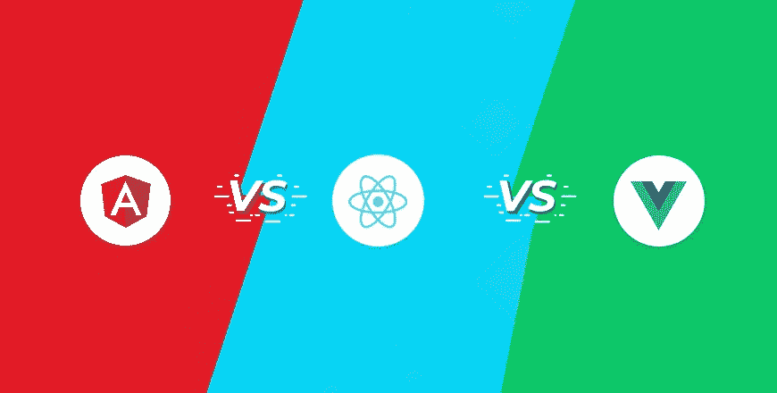

# Angular VS React VS Vue:哪个框架最好

> 原文：<https://blog.devgenius.io/angular-vs-react-vs-vue-which-framework-is-the-best-3d6ade1ee5c4?source=collection_archive---------14----------------------->

角度对比反应对比 Vue

在过去的几年中，web 开发领域出现了许多 javascript 框架和库，吸引了全世界开发人员的注意，也在这些开发人员中获得了很大的人气。现在市场上最占优势的框架是:脸书的 React.js，谷歌的 Angular.js，以及最后但并非最不重要的一个开源合作者团队的 Vue.js，这三个框架相互竞争，以求生存，并成为开发者中最好的前端框架。

但是现在，我们这篇文章的目标是确定这三个框架中哪一个是开发网站和 web 应用程序的最佳选择，所以，让我们开始吧:

# **1。内置特性和功能:**

这一点对于许多开发人员来说非常重要，因为有许多前端专业人员不想使用由不知名的开发人员开发的第三方插件和库，或者作为开发人员的辅助项目开发的第三方插件和库，这就是框架内的内置功能如此重要的原因。

在这一点上，angular 赢得了竞争，angular 拥有 https 请求、表单验证等内置功能……所有这些功能都是由 Angular 开发团队在谷歌内部构建和维护的，这就是我认为 Angular 与 react 和 vue 的区别。

# 2.语法:

框架的语法对许多开发人员来说是一件重要的事情，在这一点上，我们应该承认 vue 的语法与 react 和 angular 相比非常容易，这就是为什么许多开发人员选择 vue 的原因，我们还应该提到 react 的语法并没有那么难，事实上，许多开发人员更喜欢使用 JSX 的方法，而不是选择将 HTML 和 JS 分开。

# 3.学习曲线:

这一点对于正在尝试学习前端框架的开发者来说也是如此重要。在这一点上，我认为 react 和 vue 都是相等的，react 和 vue 的学习曲线非常相似，我不认为这两个框架在适应方面有什么不同，事实上，angular 很难学，尤其是对初学者来说，我并没有说不可能学会 angular，但是，老实说，在开始学习 angular 时，你会发现一些困难， 而且你一定要意识到，学习 angular 需要有 typescript 的先验知识，所以，如果你不懂 typescript，想学习 angular，我建议你先学习 typescript，再直接跳到 angular。

# **4。性能:**

对于这一点，我并没有真正找到一个明确的赢家，因为所有三个框架在启动和运行时性能方面都非常接近，这使我们得出结论，当您选择一个框架工作时，不要担心性能。

# 5.受欢迎程度和社区支持:

根据 Stack Overflow，React js 是这三个框架中最受欢迎的，angular 排在第二位，vue js 排在最后，另外，我们应该提到，这三个框架都有巨大的社区支持，当你选择框架时，你不应该担心这一点。

# 6.工作机会:

据 indeed.com 称，angular 的工作机会比 react 和 vue 多，有 3000 多个工作机会，react 以 2500 多个工作机会排在第二位，vue 以 1000 多个工作机会排在最后一位。当然，我应该提到的是，这些数字并不是市场上工作机会的准确数字，但是，它让我们清楚地看到市场是如何发展的，我还应该提到，这些数字因国家和城市而异。

# 结论:

总之，我强烈建议任何想学习前端框架的人开始学习所有三个框架，然后选择你喜欢使用的一个。

最后，希望这篇短文赢得您的赞赏，感谢您的关注。