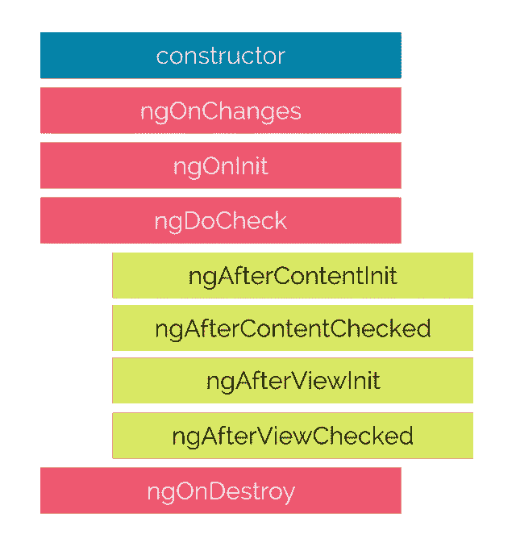

# Angular2 打字稿让我们的生活更耐人寻味。

> 原文：<https://blog.devgenius.io/angular2-typescript-makes-our-life-more-intriguing-82729afd9d30?source=collection_archive---------5----------------------->

Angular CLI 11 的一些实用想法。

开发过程不能没有前端运行。这里我结合自己日常的前端开发工作，把一些有角度的循环往复的东西组合在一起。

**一.皮棉库**

Lint 的严格规则帮助我们避免了空的和未定义的错误，这非常好。但是 Lint 可能非常烦人，并且某些类型的错误会不时地重复出现，从而停止编译过程。举个例子，最讨厌的:

a.禁止连续的空行

b.不能使用双大括号。“应该是”

c.缺少分号

有时很容易忘记在函数式编程中添加半列

d.“rxjs”的多个导入可以合并为一个。

`import {Subscription} from ‘rxjs’;
import {fromEvent} from ‘rxjs’;`

应该是:`import {fromEvent, Subscription} from ‘rxjs’;`

e.参数中冒号后应有一个空格

f.指定的进口必须按字母顺序排列。

`import {AfterViewInit, Component, ElementRef, OnDestroy, OnInit, ViewChild} from ‘[@angular/core](http://twitter.com/angular/core)’;`

g.超过最大行长度 160

以同样的方式等等…

二。接下来，我收集了一些我在开发过程中经常遇到的代码。逻辑简单易懂。

1.  **任何**

Java 使用 **Object** 关键字作为其他类型的根，Angular 在这种情况下与 Kotlin 相似，使用 **Any** 关键字:

`const myVariable: any = [];`

2.如何用 Typescript 合并两个对象数组？用**spread**operator 很容易:this.results = [ …this.results，…data . results]；

3.模板分析错误:无法绑定到“ngModel”，因为它不是“input”的已知属性。

只需添加**表单模块**即可显示此类搜索表单

4.数组在另一个数组内，使用`some` 运算符过滤它:

5.输入表单字段的 Karma Jasmine 单元测试:

6.父组件和子组件之间的数据交互:@Output 允许子组件向父组件发送数据。

[此处为官方文档](https://angular.io/guide/component-interaction)

@Input()允许父组件更新子组件中的数据。

7.使用 Rx.js 作为组件之间的通信。

用旧的预备编程，你可以得到模块化或性能。通过功能性 Rx 编程，您可以两者兼得。当我在 RxJava 中使用反应式方法时，我很喜欢，在 JavaScript 中看到它也很好。

基于 3 'O '原则的 Rx:可观察的—操作者—观察者。

在这里，我们创建一个可观察的，并订阅一个可观察的流。中间层操作员处理数据(映射、过滤..).

8.但是我们也可以在 Rx.js 中使用管道。自定义管道仅在数据发生变化时调用其转换方法。 **catchError** 和 **finalize** 方法对于处理状态非常有用。

9.在 ngOnDestroy()方法中订阅和取消订阅服务。

10.导航到页面

或者我们也可以以更全面的方式导航:

11.表单中禁用的字段。无法在服务器上发布。
有时 UI 表单中的字段应该是可见的，但对于编辑是禁用的:
`<input type=”text” id=”createdBy” name=”createdBy” value=”Olmer” DISABLED />`
要在表单中推送该值，请在 POST 请求之前将其状态更改为“启用”。

12.构造器 vs ngOnInit 和整个生命周期

构造函数允许我们进行依赖注入(通过实例服务)

当输入或输出绑定值改变时调用 ngOnChanges
第一次 ngOnChanges 后调用 ngOnInit。用于方法调用一次。

从组件的<ng-content>元素作为子元素传递的内容。
`[@ViewChild](http://twitter.com/ViewChild)('objContent') objContent: ElementRef;`</ng-content>

ngAfterContentInit，ngafterviewit-视图在内容之后初始化，可以在 ngafterviewit 中使用。

13.作为类的全局变量。

只需创建一个简单的服务模型 ReportTypeParamsModel，使其成为 [@Injectable](http://twitter.com/Injectable) 并添加到模块的‘Providers’中。这些数据将被全球访问。

14.私有成员变量“store”永远不会被重新分配；标记为“`readonly`”。

将 function 属性设为`readonly` 是一个很好的做法，因为您可能不想再次重新分配实例。

`private readonly unsubscribe = new Subject();`

readonly:
允许在用于属性的构造函数
中赋值，以防止重新赋值

const:
用于变量，像`const var: string;`
也不能重新分配

15.用 html 模板绑定静态变量。

我们不能直接静态变量。但是我们可以参考一下。

16.Typescript 中的枚举非常容易预测

**结论**

充满障碍、规则和条件的打字稿。由于我的工作，我收集细节只是为了获得更多的知识。所有这些算法都在我目前的项目中发挥作用。