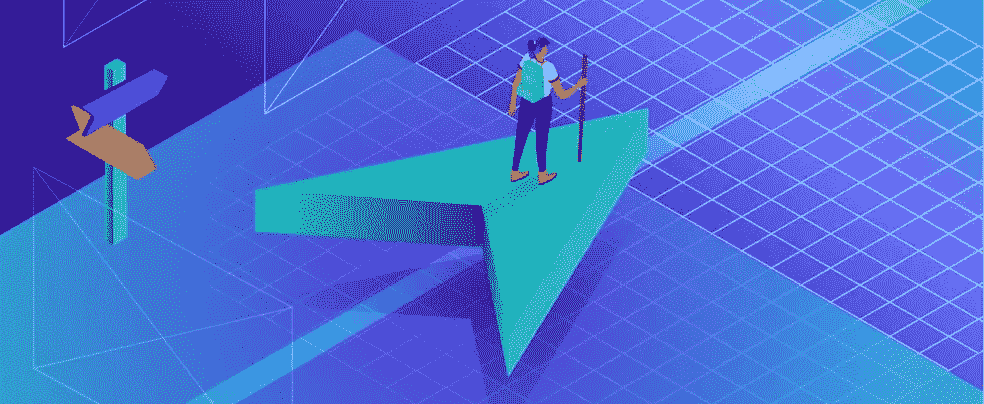

# Jetpack Compose 中的动画底部导航

> 原文：<https://blog.devgenius.io/animated-bottom-navigation-in-jetpack-compose-af8f590fbeca?source=collection_archive---------4----------------------->



来源:[https://kinsta.com/blog/website-navigation/](https://kinsta.com/blog/website-navigation/)

在这个创建中，我们将创建一个自定义的底部导航栏，如下图所示，其中有许多复杂的动画，这些动画在预定义的底部导航栏中并不存在。


> 那么当某样东西不存在时，我们该怎么办呢，在我以前的文章中可以找到答案。

## 写作中的思考

我们将把这个问题分成更小的部分，从这些部分构建整个底部导航，首先我将关注底部导航项目的 UI。它看起来像一个盒子里一个图标和一个文本，当一个在上面，另一个在下面时，它们随着动画上下移动。


现在让我们集中精力制作它们的动画。正如我们所讨论的，当一个图标向上时，另一个图标向下，反之亦然。为了产生这种效果，当需要显示图标时，我可以将文本向上移动到底部导航的可视区域之外，当需要显示文本时，将图标向下移动到底部导航的可视区域之外。


在这里，当选择此项时，我们使用`offset(y = top)`将图标顶部对齐底部导航的顶部,`0 dp`表示将显示图标。与此同时，我们用`offset(y = top — 56.dp)`将文本的底部与底部导航的顶部对齐，因为`top — 56.dp`是`-56 dp`意味着它将位于图标的正上方，但看不见。

我们还有一个弹性效果，它来自动画的 [**动画特效**](https://developer.android.com/jetpack/compose/animation#animationspec) 。你可以把 **AnimationSpec** 想象成视图世界动画的[](https://thoughtbot.com/blog/android-interpolators-a-visual-guide)**。**

```
val top by *animateDpAsState*(
    targetValue = if (selected) 0.*dp* else 56.*dp*,
    animationSpec = SpringSpec(dampingRatio = 0.5f, stiffness = 200f)
)
```

**这里我们正在创建一个 [**SpringSpec**](https://developer.android.com/reference/kotlin/androidx/compose/animation/core/SpringSpec) 虽然是默认的**animation spec**但是我们调整了`dampingRatio`和`stiffness`来产生上面的效果。**

> **把阻尼比想象成`dampingRatio`更大，这意味着你的弹簧太肥了，所以在你拉伸和释放它之后，它不会反弹太多。阻尼比越小，意味着弹簧越细，弹簧越容易反弹**
> 
> **把`stiffness`想象成这个弹簧在被释放之前被拉伸了多长时间。这里的数字越大，刚度越大。**

**现在是时候把这些放在底部导航中了**

**在这里，我们首先创建一个数组 **BottomNavItem** ，它只是一个数据类。然后我们迭代它，并把它们放在可组合的**底部导航**中，我们得到👇**

****

**很好，但是好像少了点什么。*(动画栏)***

**您在第一个 gif 中看到的移动到所选项目顶部的栏将在我们的底部导航中，要将它移动到所选项目的顶部，我们需要知道项目何时被选中，我们还需要知道栏的正确位置。让我们看看怎么做。**

**这里对于动画栏，我们只是使用了一个高度为`3 dp`宽度为`100 dp`的盒子，当项目被选中时，我们会用动画将它偏移到正确的位置。**

**因此，当第二个项目被选中时，默认情况下它将位于开始位置，并位于底部导航的中间。所以要知道中间在哪里，我们需要知道底部导航的宽度。**

**宽度由下式给出👇**

```
.*onGloballyPositioned* **{** width = **it**.size.width.toFloat()
**}**
```

**我们还创建了一个浮动动画👇**

```
val offsetAnim by *animateFloatAsState*(
    targetValue = when (currentIndex) {
        1 -> width / 2f - *with*(*LocalDensity*.current)**{**50.*dp*.*toPx*()**}** 2 -> width - *with*(*LocalDensity*.current)**{**100.*dp*.*toPx*()**}** else -> 0f
    }
)
```

**当项目被点击时，我们更新索引，更新动画的目标，因此我们在动画中看到了酒吧。**

**谢谢，祝你愉快😊**