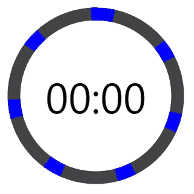

# 如何用 Vue 创建一个动画倒计时器

> 原文：<https://blog.devgenius.io/animated-countdown-timer-vue-93fc6709e03b?source=collection_archive---------15----------------------->


计时器应用无处不在，它们都有自己独特的外观和设计。有些人选择极简设计，仅使用文本来指示剩余时间，而其他人试图通过显示缓慢减少的饼形或甚至定期播放音频来通知剩余时间，从而更加直观。

这是我们将在本文中构建的一种计时器:


它用长度、文本和颜色来指示剩余时间，这使得它非常具有描述性。

我们将使用 Vue，所以设置您的项目，让我们开始吧！

# 创建计时器环

我们将从使用一个 [svg](https://developer.mozilla.org/pl/docs/Web/SVG/Element/svg) 元素创建定时器环开始。它将包含一个 [circle](https://developer.mozilla.org/en-US/docs/Web/SVG/Element/circle) 元素，我们将使用它来创建计时器环。这个圆将被画在`svg`容器的中心，半径为 45 像素。

**src/components/apptimer . vue**

```
<template>
  <div class="root">
    <svg class="svg" viewBox="0 0 100 100" >
      <g class="circle">
        <circle class="time-elapsed-path" cx="50" cy="50" r="45" />
      </g>
    </svg>
  </div>
</template>
```

我们将把`circle`元素包装在一个`g`元素中，这样我们就能够将`circle`与本教程稍后将添加的其他元素组合在一起。

我们已经创建了基本的 HTML 标记，现在让我们添加显示戒指的 CSS。

**src/components/apptimer . vue**

```
...
<style>
/* Sets the container's height and width */
.root {
  height: 300px;
  width: 300px;
  position: relative;
}/* Removes SVG styling that would hide the time label */
.circle {
  fill: none;
  stroke: none;
}/* The SVG path that displays the timer's progress */
.time-elapsed-path {
  stroke-width: 7px;
  stroke: #424242;
}
</style>
```

让我们在`App.vue`中注册`AppTimer`组件并显示它:

**src/App.vue**

```
<template>
  <AppTimer />
</template><script>
import AppTimer from './components/AppTimer.vue';export default {
  name: 'App',
  components: {
    AppTimer,
  },
};
</script>
```

这就是我们现在所拥有的。只是一枚普通的戒指。让我们继续前进。


# 显示计时器标签

创建计时器环后要做的下一件事是显示指示剩余时间的标签。

**src/components/apptimer . vue**

```
<template>
  <div class="root">
    ...
    <div class="time-left-container">
      <span class="time-left-label">{{ timeLeftString }}</span>
    </div>
  </div>
</template><script>
export default {
  methods: {
    padToTwo(num) {
      // e.g. 4 -> '04'
      return String(num).padStart(2, '0');
    },
  },
  computed: {
    // e.g. timeLeft of 100 -> '01:40'
    timeLeftString() {
      const timeLeft = this.timeLeft;
      const minutes = Math.floor(timeLeft / 60);
      const seconds = timeLeft % 60;
      return `${this.padToTwo(minutes)}:${this.padToTwo(seconds)}`;
    },
    timeLeft() {
      return this.limit - this.elapsed;
    },
  },
  // Register props to be set from App.vue
  props: {
    elapsed: {
      type: Number,
      required: true,
    },
    limit: {
      type: Number,
      required: true,
    },
  },
};
</script>
...
```

现在`AppTimer`有了两个道具。`elapsed`属性将用于设置已经过去的时间，而`limit`属性将指定总时间。

`timeLeft()`是一个计算属性，当`elapsed`改变时将自动更新。

`timeLeftString()`是另一个计算属性，它将以`MM:SS`格式返回一个字符串，指示定时器剩余时间。每当`timeLeft()`改变时，其值将被更新。

让我们将下面的 CSS 添加到`AppTimer.vue`，它将样式化标签并将其覆盖在计时器环的顶部:

**src/components/apptimer . vue**

```
...
<style>
...
.time-left-container {
  /* Size should be the same as that of parent container */
  height: inherit;
  width: inherit;/* Place container on top of circle ring */
  position: absolute;
  top: 0;/* Center content (label) vertically and horizontally  */
  display: flex;
  align-items: center;
  justify-content: center;
}.time-left-label {
  font-size: 70px;
  font-family: 'Segoe UI';
  color: black;
}
</style>
```

让我们从`App.vue`开始设置我们创建的`AppTimer`道具:

**src/App.vue**

```
<template>
  <AppTimer :elapsed="0" :limit="10" />
</template>
...
```

现在我们可以看到标签了。


# 启用计时器倒计时

计时器如果不能倒计时就没有用了，让我们添加一些逻辑来启用这个功能。

我们将使用一个状态变量(`timeElapsed`)来记录到目前为止以秒为单位的总时间。使用`setInterval()`方法，我们将这个变量每 1000 毫秒(1 秒)递增 1。我们还将使用`clearInterval()`方法，确保一旦所有的计时器都结束了，我们就停止常规的递增。

所有这些逻辑都将包含在`startTimer()`方法中。我们将在`mounted()`钩子中调用`startTimer()`，以便在页面加载后立即开始倒计时。

**src/App.vue**

```
<template>
  <AppTimer
    :elapsed="timeElapsed"
    :limit="timeLimit"
  />
</template><script>
import AppTimer from './components/AppTimer.vue';export default {
  name: 'App',
  data() {
    return {
      timeElapsed: 0,
      timerInterval: undefined,
      timeLimit: 10,
    };
  },
  methods: {
    startTimer() {
      this.timerInterval = setInterval(() => {
        // Stop counting when there is no more time left
        if (++this.timeElapsed === this.timeLimit) {
          clearInterval(this.timerInterval);
        }
      }, 1000);
    },
  },
  // Start timer immediately
  mounted() {
    this.startTimer();
  },
  components: {
    AppTimer,
  },
};
</script>
```

现在我们有了一个功能计时器。


# 创建计时器进度环

现在我们需要添加一个将被动画化的环来可视化剩余的时间。我们会给这个戒指一个与众不同的颜色，把它放在灰色的戒指上。久而久之它将动画显示越来越多的灰色环，直到没有剩余时间时，只有灰色环是可见的。

我们将使用一个[路径](https://developer.mozilla.org/en-US/docs/Web/SVG/Tutorial/Paths)元素创建一个环，并用 CSS 对其进行样式化:

**src/components/apptimer . vue**

```
<template>
  <div class="root">
    <svg
      class="svg"
      viewBox="0 0 100 100"

    >
      <g class="circle">
        ...
        <path
          class="time-left-path"
          d="
            M 50, 50
            m -45, 0
            a 45,45 0 1,0 90,0
            a 45,45 0 1,0 -90,0
          "
        ></path>
      </g>
    </svg>
    ...
  </div>
</template><script>
...
</script><style>
...
.time-left-path {
  /* Same thickness as the original ring */
  stroke-width: 7px;/* Rounds the path endings  */
  stroke-linecap: round;/* Makes sure the animation starts at the top of the circle */
  transform: rotate(90deg);
  transform-origin: center;/* One second aligns with the speed of the countdown timer */
  transition: 1s linear all;/* Colors the ring */
  stroke: blue;
}.svg {
  /* Flips the svg and makes the animation to move left-to-right */
  transform: scaleX(-1);
}
</style>
```

所以现在这个蓝环覆盖了灰环。


# 制作计时器进度环的动画

为了制作戒指的动画，我们将使用`path`的[笔画-仪表板阵列](https://developer.mozilla.org/en-US/docs/Web/SVG/Attribute/stroke-dasharray)属性。

以下是不同`stroke-dasharray`值的戒指外观:


我们可以看到，将`stroke-dasharray`设置为单个值会创建一个长度相同的破折号(蓝色弧线)和间隙(破折号之间的空间)的模式。`stroke-dasharray`添加尽可能多的破折号，以填满路径的整个长度。

顾名思义，`stroke-dasharray`也可以取多个值。让我们看看当我们指定两个时会发生什么:



当指定两个值时，第一个值将决定虚线的长度，第二个值将决定间隙的长度。

我们可以用这个行为让蓝色路径可视化剩余时间。为此，首先，让我们使用圆周长公式(`2πr`)计算蓝色路径形成的圆的总长度:

```
Full path length = 2 x π x r = 2 x π x 45 = 282.6 ≈ 283
```

因此，为了显示路径剩余的时间，我们将指定两个值，第一个值将从`283`开始并逐渐减少到`0`，而第二个值将在`283`保持不变。这确保了始终只有一个破折号和一个缺口，因为`283`与整个路径一样长。

下面是第一个值改变时路径长度的变化:


让我们在代码中实现它:

**src/components/apptimer . vue**

```
<template>
  <div class="root">
    <svg
      class="svg"
      viewBox="0 0 100 100"

    >
      <g class="circle">
        ...
        <path
          class="time-left-path"
          v-if="timeLeft > 0"
          d="
            M 50, 50
            m -45, 0
            a 45,45 0 1,0 90,0
            a 45,45 0 1,0 -90,0
          "
          :style="{ strokeDasharray }"
        ></path>
      </g>
    </svg>
    ...
  </div>
</template><script>
export default {
  ...
  computed: {
    ...
    strokeDasharray() {
      const radius = 45;
      const totalLength = 2 * Math.PI * radius;
      const timeFraction = this.timeLeft / this.limit;
      const elapsedDash = Math.floor(timeFraction * totalLength);
      return `${elapsedDash} ${totalLength}`;
    },
  },
  ...
};
</script><style>
...
</style>
```

每当剩余时间改变时，我们使用一个计算属性(`strokeDasharray`)来计算`stroke-dasharray`属性的新值。

当没有剩余时间时，我们使用`v-if`完全停止显示蓝色环。

现在蓝色的环会随着标签移动来指示剩余时间。


不过有一个问题:如果你仔细观察，当计时器到达零时，蓝色的环会突然消失。


这是因为动画持续时间设定为一秒钟。当剩余时间的值设置为零时，仍然需要一秒钟的时间来将蓝色圆环的动画设置为零。

要解决这个问题，我们可以使用一个公式，每过一秒钟，环的长度就会减少一个额外的量(独立于动画)。让我们修改`AppTimer.vue`来做到这一点:

**src/AppTimer.vue**

```
<template>
...
</template><script>
export default {
  ...
  computed: {
    ...
    strokeDasharray() {
      const radius = 45;
      const total = 2 * Math.PI * radius;
      const timeFraction = this.timeLeft / this.limit;
      const adjTimeFraction = timeFraction - (1 - timeFraction) / this.limit;
      const elapsedDash = Math.floor(adjTimeFraction * total);
      return `${elapsedDash} ${total}`;
    },
  },
  ...
};
</script><style>
...
</style>
```

现在蓝色圆环在被`v-if`移除之前被还原到末端:


# 创建背景

我们已经完成了计时器，所以我们需要在后台工作。我们将在`App.vue`中创建并样式化它:

**src/App.vue**

```
<template>
  <div class="background">
    <div
      class="elapsed"
      :style="{ height: '100%', backgroundColor: 'blue' }"
    ></div>
  </div>
  <AppTimer
    :elapsed="timeElapsed"
    :limit="timeLimit"
  />
</template><script>
...
</script><style scoped>
.background {
  height: 100%;
  position: absolute;
  top: 0;
  width: 100%;
  display: flex;
  flex-direction: column;
  justify-content: end;
  background-color: black;
}.background .elapsed {
  /* For the height animation */
  transition: all 1s linear;
}
</style><style>
html,
body,
#app {
  height: 100%;
  margin: 0;
}#app {/* Center timer vertically and horizontally */
  display: flex;
  justify-content: center;
  align-items: center;position: relative;
}
</style>
```

因为我们将背景颜色设置为蓝色，所以我们需要更改计时器环和计时器标签的颜色，使它们保持可见。

我们将使用白色:

**src/components/apptimer . vue**

```
...
<style>
...
.time-left-label {
  ...
  color: white;
}.time-left-path {
  ...
  /* Colors the ring */
  stroke: white;
}
...
</style>
```

我们现在可以看到背景:


# 制作背景动画

背景很好看，但是只是静态的。让我们添加一些代码，以动画其高度久而久之。

**src/App.vue**

```
<template>
  <div class="background">
    <div
      class="elapsed"
      :style="{ height: backgroundHeight, backgroundColor: 'blue' }"
      v-if="timeLeft > 0"
    ></div>
  </div>
  <AppTimer
    :elapsed="timeElapsed"
    :limit="timeLimit"
  />
</template><script>
...
export default {
  ...
  computed: {
    timeLeft() {
      return this.timeLimit - this.timeElapsed;
    },
    timeFraction() {
      return this.timeLeft / this.timeLimit;
    },
    backgroundHeight() {
      const timeFraction = this.timeFraction;// Adjust time fraction to prevent lag when the time left
      // is 0, like we did for the time left progress ring
      const adjTimeFraction =
        timeFraction - (1 - timeFraction) / this.timeLimit;const height = Math.floor(adjTimeFraction * 100);return `${height}%`;
    },
  },
  ...
};
</script>
...
```

现在我们有了一个背景动画，作为剩余时间的另一个指示器。


# 在特定时间点更改背景颜色

如果还能用颜色来表示剩余时间，那就太好了。

我们将使用一个`thresholds`数组定义背景颜色改变的时间点。倒计时开始时，背景颜色为蓝色。总时间的 50%会变成橙色，总时间的 20%会变成红色。

**src/components/App.vue**

```
...
<script>
...
export default {
  ...
  data() {
    return {
      ...
      thresholds: [
        {
          color: 'blue',
          threshold: 1,
        },
        {
          color: 'orange',
          threshold: 0.5,
        },
        {
          color: 'red',
          threshold: 0.2,
        },
      ],
    };
  },
  ...
};
</script>
...
```

我们将使用 [reduce()](https://developer.mozilla.org/en-US/docs/Web/JavaScript/Reference/Global_Objects/Array/reduce) 方法从`thresholds`数组中获取当前时间的颜色。

**src/components/App.vue**

```
<template>
  <div class="background">
    <div
      class="elapsed"
      :style="{ height: backgroundHeight, backgroundColor }"
      v-if="timeLeft > 0"
    ></div>
  </div>
  ...
</template><script>
...
export default {
  ...
  computed: {
    ...
    backgroundColor() {
      return this.thresholds.reduce(
        (color, item) =>
          item.threshold >= this.timeFraction ? item.color : color,
        undefined
      );
    },
  },
  ...
};
</script>
...
```

我们完事了。我们有一个功能计时器，倒计时，并以 4 种不同的方式显示还剩多少时间。


# 探索这个应用程序的源代码

你可以在 GitHub 上点击查看这个迷你应用[的完整源代码。](https://github.com/tariibaba/CB-Animated-Timer-Countdown-Vue)

*原载于*[*codingbeautydev.com*](https://cbdev.link/00d67a)

# JavaScript 做的每一件疯狂的事情

[注册](https://cbdev.link/d3c4eb)并立即免费获得这本引人入胜的指南，了解 JavaScript 微妙的注意事项和鲜为人知的部分。

