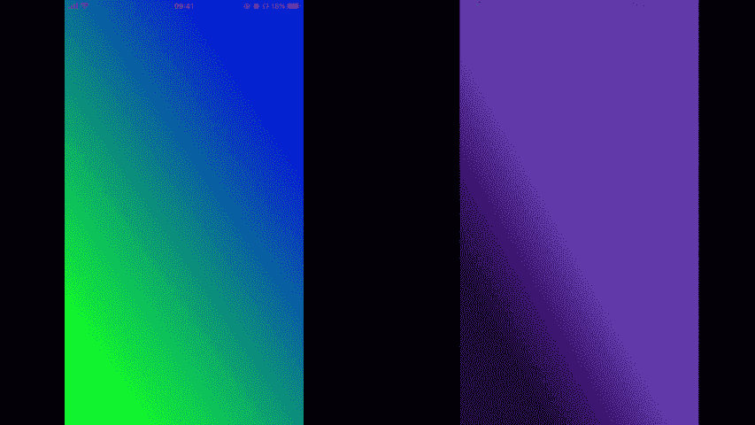
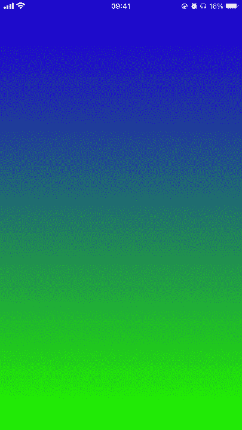
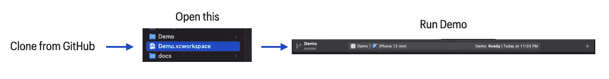

# iOS 中的动画渐变

> 原文：<https://blog.devgenius.io/animated-gradient-in-ios-d480f07490d5?source=collection_archive---------8----------------------->


特别感谢玛利亚·萨欧卢·❤️的标志

谁不喜欢渐变呢，尤其是当它们是动画的时候。
在这篇文章中，我们将看到一个名为 FancyGradient 的新库，以及如何在你的项目中使用它🌈

> 根据研究，漂亮的动画可以增加用户体验🚀

## 演示👇：



例子

## 安装:

为了使用 FancyGradient，您需要在项目中添加库。但是不要担心包装经理会帮助你。

*   **Cocoapods** 要使用 Cocoapods 安装 FancyGradient，只需将下面一行添加到您的 Podfile 中，然后在您的终端中运行`pod install`。

```
pod "FancyGradient"
```

*   **Swift 包管理器**

Swift 包管理器是一个内置在 Xcode 中的依赖管理器(所以你已经有了)。从文件菜单中，向您的项目添加一个新的 Swift 包依赖项，并粘贴到该项目的 Git URL 中。

```
[https://github.com/Nikoloutsos/fancyGradient](https://github.com/Nikoloutsos/fancyGradient)
```

[](https://github.com/Nikoloutsos/fancyGradient) [## GitHub-Nikoloutsos/fancy gradient:swift 中强大的动画 gradientView🌈

### FancyGradient 是一个 UIView 子类，可以让你在你的 iOS 应用中制作渐变动画。它纯粹是用 Swift 写的…

github.com](https://github.com/Nikoloutsos/fancyGradient) 

## 制作你的动画🌈：

FancyGradient library 有一个简单易用且有文档记录的 API 来创建您的动画🎉让我们看看如何创作我们的动画。👀

让我们首先创建一个动画，其中:

1.  我们先改变颜色(变成红色、橙色)3 秒钟
2.  然后方向角为(⬆️向上)1 秒钟



请记住，可以制作动画的渐变属性有:

*   **颜色**
*   **角度/方向**(例如 90 度)
*   **颜色停止**(当你希望一种颜色比其他颜色占据更多空间时)

> 提示:提供一个`FancyGradientViewDelegate`的实现来通知你什么时候动画结束。用于展示

## 我相信你能做的不止这些🔱：

我敢肯定，你想创造更加复杂和美丽的动画。我相信你能做到，⭐️.

我建议你克隆这个项目并运行包含许多例子的演示。



*FancyGradient 可以在麻省理工学院许可下的*[*Github*](https://github.com/Nikoloutsos/fancyGradient)*上找到开源的。*