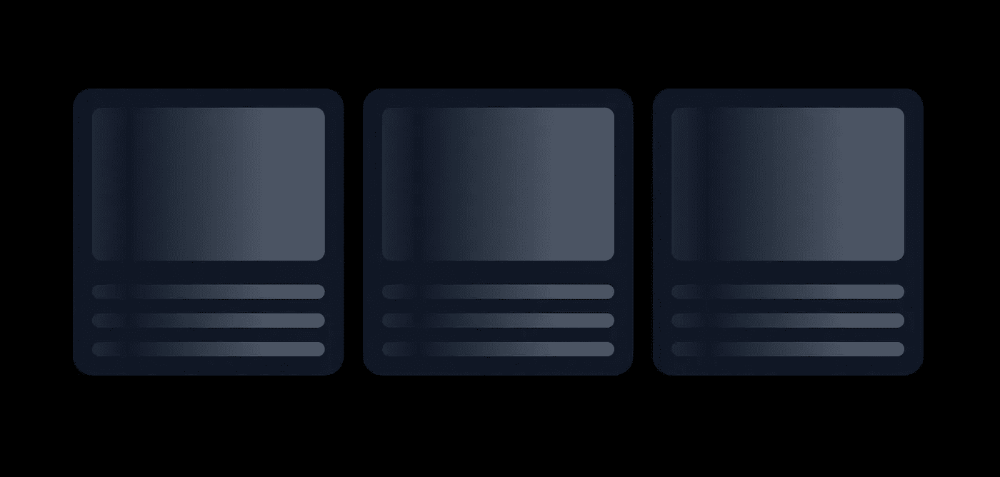

# 顺风 CSS 中的动画骨架

> 原文：<https://blog.devgenius.io/animated-skeleton-in-tailwind-css-a2439b598b17?source=collection_archive---------4----------------------->



动画骨骼加载器

Tailwind 是现在用的最多的 CSS 框架了吧？😍

无需离开 HTML 或创建一行自定义 CSS，tailwind 允许您利用实用程序类来调整布局、颜色、间距、字体、阴影等，以创建完全独特的组件设计。

大多数时候，当需要为我的 web 应用程序创建一个加载器和框架来显示加载状态时，以前我更喜欢 ReactJS 库，它增加了应用程序的包大小，并带来了许多其他问题，使我很少甚至没有定制。你知道有更好的方法吗？是啊。顺风💫

Tailwind 很有趣，它的动画工具类也可以用来创建中等复杂的 CSS 动画。让我们知道如何用 tailwind CSS 构建我们自己的动画骨架加载器。

# **1。用顺风实用程序类创建一个简单的框架****。**

```
<div class="space-y-5 rounded-2xl bg-gray-900 p-4">
  <div class="h-32 rounded-lg bg-gray-600"></div>
  <div class="space-y-3">
    <div class="h-3 rounded-lg bg-gray-600"></div>
    <div class="h-3 rounded-lg bg-gray-600"></div>
    <div class="h-3 rounded-lg bg-gray-600"></div>
  </div>
</div>
```


骨骼

我喜欢圆形边框。您可以用自己的类和样式创建一个。

# **2。用顺风 CSS 创建渐变叠加。**

我们需要创建一个渐变，我们稍后将动画来给出加载效果。这里我们将使用顺风渐变类来创建一个简单的透明到白色和白色到透明的渐变。另外，请注意渐变方向将是向右的。

```
"bg-gradient-to-r from-transparent via-gray-900 to-transparent"
```

上面的类会给你这样的东西。


梯度

包含类的完整 HTML 代码将如下所示。

```
 <div class="space-y-5 rounded-2xl bg-gray-900 p-4 bg-gradient-to-r from-transparent via-gray-600 to-transparent">
      <div class="h-32 rounded-lg bg-gray-600"></div>
      <div class="space-y-3">
        <div class="h-3 rounded-lg bg-gray-600"></div>
        <div class="h-3 rounded-lg bg-gray-600"></div>
        <div class="h-3 rounded-lg bg-gray-600"></div>
      </div>
    </div>
```

附加了渐变类的预览将是这样的。


带渐变的骨架

# 2.制作渐变动画

我们需要定义一个 CSS 动画，它将在 x 轴上水平平移渐变，并将无限循环移动。我们将为此使用 CSS 关键帧。

让我们在顺风配置中添加关键帧来创建我们自己的可重用动画类。Tailwind config 提供了一种简单的方法来为 Tailwind 内置类定制和添加我们自己的 CSS 规则。

## 更新您的 tailwind.config.js

```
module.exports = {
  content: ['./pages/**/*.{js,ts,jsx,tsx}', './components/**/*.{js,ts,jsx,tsx}'],
  theme: {
    extend: {
      keyframes: {
        shimmer: {
          '100%': {
            transform: 'translateX(100%)',
          },
        },
      },
    },
  },
};
```

我们可以像这样使用动画

```
"animate-[shimmer_1s_infinite]"
```

# 3.将渐变动画添加到骨架

我们将在修改器之前使用顺风*来添加叠加到骨架上。这是你可以做到的。*

将以下类添加到框架中，以将渐变添加到框架中。

```
"before:absolute before:inset-0 before:-translate-x-full before:animate-[shimmer_1s_infinite] before:border-t before:border-gray-900 before:bg-gradient-to-r before:from-transparent before:via-gray-900 before:to-transparent"
```

```
 <div class="relative space-y-5 rounded-2xl bg-gray-900 bg-gradient-to-r from-transparent via-gray-600 to-transparent p-4 shadow-xl shadow-black/5 before:absolute before:inset-0 before:-translate-x-full before:animate-[shimmer_1s_infinite] before:border-t before:border-gray-900 before:bg-gradient-to-r before:from-transparent before:via-gray-900 before:to-transparent">
      <div class="h-32 rounded-lg bg-gray-600"></div>
      <div class="space-y-3">
        <div class="h-3 rounded-lg bg-gray-600"></div>
        <div class="h-3 rounded-lg bg-gray-600"></div>
        <div class="h-3 rounded-lg bg-gray-600"></div>
      </div>
    </div>
```

不要忘记添加“relative”类到父 div 中，如上所示，这将有助于渐变在骨架上的定位。


骨架加载程序 gif

# 3.完成动画。

我们注意到上面的渐变动画正移出骨架元素。为了确保它在骨架的约束下，我们可以使用 CSS 属性“overflow-hidden”。

```
 <div class="overflow-hidden relative space-y-5 rounded-2xl bg-gray-900 bg-gradient-to-r from-transparent via-gray-600 to-transparent p-4 shadow-xl shadow-black/5 before:absolute before:inset-0 before:-translate-x-full before:animate-[shimmer_1s_infinite] before:border-t before:border-gray-900 before:bg-gradient-to-r before:from-transparent before:via-gray-900 before:to-transparent">
      <div class="h-32 rounded-lg bg-gray-600"></div>
      <div class="space-y-3">
        <div class="h-3 rounded-lg bg-gray-600"></div>
        <div class="h-3 rounded-lg bg-gray-600"></div>
        <div class="h-3 rounded-lg bg-gray-600"></div>
      </div>
    </div>
```

## 喔喔喔🎉！！

我们已经准备好了我们的骨骼。它非常灵活，易于定制，而且速度非常快。


骨架渐变动画

使用带有网格的加载器来获得适合一系列卡片的好看的多个加载器。

# 那是一个包裹。

你可以去 https://play.tailwindcss.com/ieHLryPJPw 参观一个互动的顺风游乐场，玩玩代码。

在下一篇文章中，我们会用一种简单的方式简化看起来复杂的问题，再见。跟随你的男人获得更多。

https://medium.com/@aesthytik

[https://medium . com/@ aesthytik/building-a-timer-with-react-hooks-d 958 C5 D4 a6 d 1](https://medium.com/@aesthytik/building-a-timer-with-react-hooks-d958c5d4a6d1)