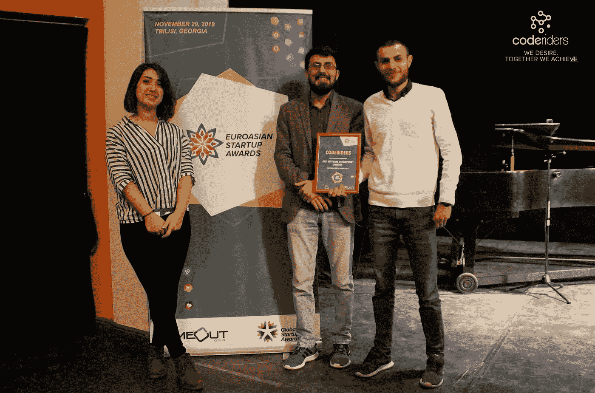
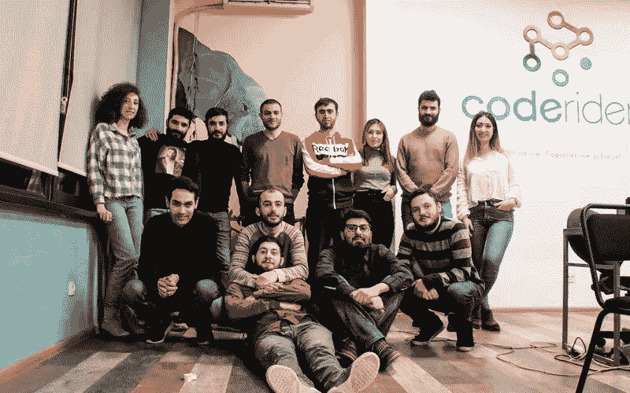

# CodeRiders 的 Anna Khachatrian 讲述了如何利用数字化转型让您的公司更上一层楼

> 原文：<https://blog.devgenius.io/anna-khachatrian-of-coderiders-on-how-to-use-digital-transformation-to-take-your-company-to-the-7e6126995715?source=collection_archive---------6----------------------->

***我们的业务发展执行官安娜·哈恰特里安接受了*** [***杰森·哈特曼***](https://medium.com/@jasonhartmanofficial)*[***权威杂志***](https://medium.com/authority-magazine) ***的采访。下面我们代表整个面试。****

*当一些公司不熟悉技术创新和数字化流程时，数字化转型的主要挑战就来了。他们通常没有 IT 部门或合适的内部专业人员来处理 IT 事务。公司技术人员的缺乏使得数字提供商和客户的沟通过程有点困难。当然，这并不涉及每一个组织。但通常非技术人员需要更多时间来适应数字化，了解更多细节，分析这对他们的公司是否至关重要。由于技术人员处于技术环境的中心，他们总是会注意到缺乏数字解决方案会以这样或那样的方式影响业务，因此对他们来说更快、更容易。*

*作为我们“如何利用数字化转型将贵公司带入下一个阶段”系列的一部分，我有幸采访了 Anna Khachatrian。安娜·哈恰特里安是软件开发公司[*code riders*](https://www.coderiders.am/)*的业务开发主管。她是一名数字营销专家，在业务发展、合作伙伴关系、客户沟通和潜在客户开发方面拥有 5 年以上的经验。安娜以演讲人的身份参加了当地和国际的一些活动，她最近的一次演讲是在妇女影响网络(WIN)的一次会议上，关于数字化经济中的职业女性。她还接受了几家媒体和活动组织者的采访，并为国际媒体(如企业家 Clutch)、CodeRiders 博客和她自己的 Medium 博客撰写文章。**

*非常感谢你加入我们的采访系列。在我们开始之前，我们的读者想更好地“了解你”。你能告诉我们一些关于你的“背景故事”和你是如何开始的吗？*

*我的教育背景和我现在做的不一样。我从语言学和新闻学开始，最后进入了 it 领域。我从大学时代就开始工作，当过记者、英语教师、翻译和公关专家，但现在我可以肯定，当我 5 年前进入信息技术行业时，我就塑造了自己的职业道路。从事 IT 领域的技术创新让我感觉很舒服。我开始探索数字世界，这时候我明白了我的职业目标是什么。从那以后我每隔一天就在研究和学习这个行业的新东西。每一天都给我带来新的技能和新的机会，因为我的工作是数字化的，我们在虚拟世界中会遇到不断的创新。我发现这非常令人兴奋，激励我前进。*

*今天我在 CodeRiders 的工作主要是关于数字和数字化。我的工作领域是技术和创新领域的数字营销。我是 CodeRiders 和其想要数字化业务的客户之间的主要沟通者。我领导公司的营销活动，实施集客营销和外呼营销方法。帮助企业实现他们想要的数字解决方案让我很开心。我为业务增长制定长期和短期战略，在商务会议和活动中介绍 CodeRiders 及其服务。除此之外，我的日常工作包括进行搜索引擎优化和 SMM 活动，并在市场上推广公司品牌。今天，我在数字世界展示技能的方式让我和我的客户都很满意。*

*你能分享一个你刚开始工作时犯的最好笑的错误的故事吗？你能告诉我们你从中得到了什么教训或“收获”吗？*

*我收到这个问题很多，每次回头看都能找到例子。肯定会有失败的例子，但人类大脑的构造方式是，你总是记得你拥有的美好事物和成功故事，而不是失败。就我而言，我寻找这个问题的答案已经很久了，也是因为我已经形成了自己的心态，即使我犯了错误，我也总是试图从中找到好的一面，找到我学到的教训。这就是为什么我热衷于记住积极的一面，而不是失败。*

*然而，在回忆了我过去的经历后，我想我有一个故事要和你分享。几年前，我被邀请加入一个技术团队，担任项目经理，负责整个开发过程。我以前没有项目管理的经验，但是因为我成功地与我们的客户进行了沟通，并且我已经在 IT 行业工作了几年，所以我很有信心我也能够领导开发团队。正如你所猜测的，这个项目不是一帆风顺的。最后，我度过了许多紧张的日子，艰难的时光，以及我从这个故事中学到的一系列教训。长话短说，毕竟客户最终非常满意，他们仍然与我们保持联系，并打算在不久的将来与我们建立另一个开发项目。我的错误是开始做一些我没有完全意识到的事情，并在学习期间努力成功地结束它。如果现在给我这个机会，我会首先获得一些关于项目管理的基本(如果不是深入)知识和最重要的技巧，然后再投入到项目中。这是一个理想的解决方案，提供优质的服务，没有额外的压力和能量损失，这涉及到任何事情。我们可能认为我们已经做好了充分的准备，可以迎接任何新的事物，但是我们也应该在精神上和专业上为新的挑战做好准备。即使客户对这个项目的反馈非常积极，我个人认为这个项目是失败的，因为有很多情况我可以处理得更好，更顺利，更流畅。*

**

*没有人能够在前进的道路上获得成功。有没有一个特别让你感激的人帮助你走到了今天？可以分享一个故事吗？*

*今天，当我回顾我的职业生涯时，我觉得故事情节和我周围的人是以一种方式塑造和聚集的，他们中的每一个人和每一种情况都有助于提高我的技能和性格。我很难指出一个比其他人更有影响力的人。但是为了理解所有的情况和事件通常是如何联系在一起的，让我提一下，当我开始作为自由记者和通讯员的职业生涯时，我无法想象几年后我会在一个完全不同的行业工作。我在新闻界的同事也指导我尝试公关管理方面的技能。我做到了，而且我觉得很舒服，所以我继续攻读公共关系硕士学位，并以此开始了我在科技行业的数字营销专家的职业生涯。有一件事我一直在努力做，也鼓励我周围的每个人去做，那就是在一个不仅会因你的承诺而成长，还会教会你以前不知道的技能和经验的环境中工作。你学到的东西有时可能看起来太小，但一旦你在现实生活中使用它们，你就会明白在创新和创造性的环境中工作会让你获得更多的技能和知识。*

*有没有一本特别的书、播客或电影对你产生了重大影响？你能分享一个故事或者解释一下为什么它能让你产生如此大的共鸣吗？*

*我可能会注意到励志电影在我生活中的重要性。我喜欢基于现实生活故事的电影，这些电影讲述了导致他们成功的人物的坚持。其中一部电影是《鞭打》。我自己就是一个极其执着的人，不倾向于半途而废。当我拿起一件事情时，我的目标是以我想象的方式完成它——不管它有多难或者需要我付出多少精力。所以，看这样的电影确实激励我觉得我走在正确的道路上，这样每天我都离我的梦想越来越近。*

***广泛的** [**研究**](https://www.forbes.com/sites/caterinabulgarella/2018/09/21/purpose-driven-companies-evolve-faster-than-others/#6f3565da55bc) **表明“目标驱动型企业”在许多领域都更成功。当你的公司开始时，它的愿景是什么，它的目的是什么？***

*当 CodeRiders 在 2013 年启动其使命和愿景时，它们与我们现在拥有的完全不同。原因是 CodeRiders 最初是作为一个 web 开发学校成立的。当时，我们的愿景是让成千上万的亚美尼亚青年学习网络和移动开发，并有机会毫无困难地进入 IT 就业市场。我们遵循这一愿景，向 800 多名年轻人介绍和教授软件开发。作为一所学校运营一年后，我们决定我们也应该为我们的学生提供工作机会和一个很好的工作场所。因此，2014 年，我们还成立了 CodeRiders 软件开发公司，其核心理念是:“时间宝贵。自动化应该能拯救它。”因此，我们利用最先进的技术和创新来构建简单强大的系统，以实现业务流程的自动化。我们的业务背后有一个目标，在公司运营的漫长岁月中，我们一直努力遵循这个目标。令我们非常高兴的是，这些年来我们成功地做到了，现在我们有了更多的精力和动力。*

**

*你现在正在做什么新的、令人兴奋的项目吗？你认为这对人们有什么帮助？*

*在 7 年的运营中，CodeRiders 软件开发公司帮助其他公司将其业务数字化，并提供专为满足其业务需求而构建的最先进的解决方案。2020 年，我们决定，除了为全球其他公司提供数字化帮助，我们还希望创造自己的数字产品，通过创新的解决方案帮助客户轻松生活。该项目是一个应用程序，将有助于司机和汽车专家以最简单的方式找到对方，并通过移动应用程序连接，而不是花时间开车通过，以便找到该地区最好的专家。该应用程序仍处于开发阶段，我们希望它能在今年上线。由于它还没有发布，我们现在不能告诉太多的细节，但我们真的相信这是一个不仅有潜力在本地市场使用，而且在世界范围内使用的应用程序。由于这是我们的团队设计和开发的第一个自己的产品，我们真的很关心它，并希望为用户提供一个能够满足他们所有需求的产品。*

***谢谢你所做的一切。现在，让我们转而讨论数字化转型的主要焦点。为了我们读者的利益，您能帮助解释数字化转型的确切含义吗？在实践层面上，参与数字化转型是什么样子的？***

*简单地说，数字化转型是在业务核心实施技术和创新的过程。这就像是组织内部的技术革命。特别是在新冠肺炎期间的整体形势和封锁证明，数字化和实施新技术的需求应该是所有企业的头等大事。世界变得遥远，现在仍然遥远。想象一下，如果没有任何数字解决方案，人们将无法忍受这种情况。为了赢得竞争并在市场中领先一步，许多企业投资于技术改造——尽管他们正在经历危机。数字化转型的投资回报几乎总是证明这是值得花钱的事情。事实证明，在危机中，重新设计或更新业务是有效的。在有无限机会的虚拟世界定位会更快。如今，一些公司可以在激烈的竞争中生存，而无需实施创新和数字工具。无论属于哪个行业，软件解决方案和数字化转型在任何公司都是受欢迎的。*

*哪些公司最能从数字化转型中受益？*

*我们在 CodeRiders 的经验表明，数字化转型的需求增加，尤其是在医疗保健、教育、零售和金融等行业。原因很简单——这些行业受新冠肺炎的影响最大，需要新的技术解决方案，为非物理交互提供替代方案，并让公司保持运营。难怪医疗保健公司在这份名单上排名第一。这是去年需求量最大的行业。如果没有数字化转型和创新解决方案，许多医院、综合诊所和其他医疗机构将无法应对这种局面。一个简单的技术解决方案是一个连接医生和病人的平台，而不需要去医院拿处方或其他文件。*

*关于金融也是一样。当然，许多金融机构在封锁之前已经进行了数字化转型，这些组织成功通过了封锁危机测试。*

*由于封锁，几乎所有的教育机构都关闭了，所以他们能做的就是将业务转变为数字平台，建立一个数字学习机构。最流行的电子学习解决方案包括虚拟教室、在线会议平台、白板、虚拟考试等。对许多人来说，这是一件新鲜事，但 2020 年是关于精神和职业的快速提升，所以即使那些不是每天都使用数字设备的人，也必须这样做才能前进。*

*由于人们应该呆在家里，购物和电子商务行业是需要快速数字化转型的行业之一。因此，零售行业在新的业务发展计划中也改变了自己的观点。如果实体店能够在不提升其数字化外观的情况下取得商业成功，在 2020 年这几乎是不可能的。实体商店不得不建立网上商店和电子商务平台，以提高他们的销售和业务收入。*

*我们很想听听您帮助他人实现数字化转型的经历。根据您的经验，数字化转型如何帮助改善运营、流程和客户体验？如果可能的话，我们想听一些故事。*

*我在之前的回答中提到的行业也是 CodeRiders 所擅长的。在我们的经验中，我们帮助这些行业的客户将他们的传统业务方式转变为数字化方式。例如，我们的一个客户是香港的一所英国小学。他们过去常常手动处理他们的日常任务，例如，日常教师填写日志信息，为每个学生写下作业，当他们必须向家长提供关于他们孩子的反馈时，他们需要翻阅他们的手写日记以回忆他们到底想说什么，或者他们需要给家长打电话或接听他们的电话以安排与他们的会面，等等。这些只是他们以前工作的一小部分。现在，有了 CodeRiders 构建的数字解决方案，他们可以通过数字设备完成所有的文书工作，大部分工作都实现了自动化，教师在日常重复性任务上花费的时间也减少了。他们可以通过几个简单的步骤通过日历计划安排会议，跟踪学生的进度，通过应用程序向家长发送学生反馈，向学生发送学习材料。另外，他们把学生的考试游戏化了。因此，他们不仅可以像往常一样通过考试，还可以玩游戏并赢得成功。*

**

*另一个例子是一家美国公司的医疗保健项目。这是一个虚拟连接医生和病人的平台。该应用程序的主要目的是帮助患者从医生那里获得所需的咨询或信息，而无需实际访问他们。这样他们可以节省时间，更加方便和准确。该系统拥有患者的人口统计数据，医生能够与他们讨论、撰写、输入、更新和共享患者的报告。当然，他们可以事先跟踪客户的健康史，以及随后的进展。他们可以分配在线处方，并与患者互动。该平台还支持医疗结算和在线支付。如果患者仍然想看医生，他们可以通过电子方式安排和预约。*

*对一些公司来说，整合数字化转型是否是一个充满挑战的过程？有哪些挑战？你如何帮助解决这些问题？*

*当一些公司不熟悉技术创新和数字化流程时，数字化转型的主要挑战就来了。他们通常没有 IT 部门或合适的内部专业人员来处理 IT 事务。公司技术人员的缺乏使得数字提供商和客户的沟通过程有点困难。当然，这并不涉及每一个组织。但通常非技术人员需要更多时间来适应数字化，了解更多细节，分析这对他们的公司是否至关重要。由于技术人员处于技术环境的中心，他们总是会注意到缺乏数字解决方案会以这样或那样的方式影响业务，因此对他们来说更快、更容易。*

*作为对这种情况的解决方案，我们通常与客户举行介绍、解决方案和学习会议。这意味着在数字化的每个阶段，我们都向客户提供有关过程、影响、益处和可能问题的完整信息。这有助于开发团队从客户那里获得反馈，也有助于客户理解数字化的核心。它让他们提出创新和变革的新方法。*

***好吧。谢谢你。这是我们讨论的首要问题。根据您的经验和成功，“公司可以利用数字化转型更上一层楼的五种方式”是什么？请为每个人分享一个故事或例子。***

*7 年多来，CodeRiders 一直致力于帮助企业实现数字化转型。顺便说一下，这个月我们将参加[欧亚创业奖](https://euroasianstartupawards.com/season-2020/)，在那里我们被提名为“数字变形金刚”。所以，数字化和自动化是我们的目标和方向。正如 CodeRiders vision 所说“时间是宝贵的。自动化应该能拯救它。”。我们鼓励全球企业通过进入数字世界向前迈进一步。*

*没有标准的数字化转换方法。这在很大程度上取决于业务结构、行业、目标、优先级等。因此，我们首先考虑这些优点，讨论企业通常因未实现数字化而面临的问题，并提供能够满足其所有技术需求的解决方案。最常见的五种数字化转型方式是通过以下技术解决方案实现的。*

****1。ERP 软件:*** 企业资源规划(ERP)软件是一种可能的解决方案，适用于在管理员工工作、跟踪公司发展、分析已完成工作等方面遇到困难的企业。ERP 软件在一个平台上收集了所有员工的任务，使工作时间变得更加可行，压力更小，员工和客户之间的交流更加虚拟和富有成效(取决于 ERP 中包含的软件类型)。很明显，把你的团队聚集在一个平台上，减少从一个办公室到另一个办公室的时间，会更节省时间，更有效率。这对远程团队管理特别有帮助。ERP 系统中可能包含某些类型的软件，如 CRM、库存管理、工资和财务管理、报告和分析、文档管理、共享日历等。最近，我们与澳大利亚客户成功完成了一个 ERP 项目。它的案例研究(可以在我们的网站上找到)是一个生动的例子，说明 ERP 系统如何帮助家庭将其家庭任务转化为数字水平。*

***2*。定制 CRM 系统:*** 客户关系软件(CRM)系统在定制时就定在了每个公司独特的业务需求上。自定义 CRM 系统使所有至关重要的业务任务高度自动化，允许具体和可靠的业务分析，数据迁移，用户培训会议，支持，发展，等等。如果一个企业在紧张的情况下努力处理和管理他们的客户、合作伙伴、成员、员工或候选人的数据，这些方面是极其重要的。自动化的 CRM 将允许设置指标和跟踪进展，因此公司可以面对提高投资回报率和反弹客户保留率的好处。基于给定的报告，他们可以建立战略性的和现实的 KPI。他们还可以从其他 CRM 工具、门户网站和任何其他存储数据的来源收集数据。这可以通过集成、数据转换(ETL)或迁移来完成。我们帮助我们的一个欧洲客户建立了一个 CRM 和一个电子邮件营销系统(我们网站上的案例研究)用于商业管理。这帮助他们的业务实现了数字化增长，并将手工工作转变为自动化工作。*

****3。电子商务平台:*** 疫情证明了无论传统商店多么成功，如果不数字化，它们在危机情况下都会面临相当大的问题。在线商店是 2020 年规模巨大的顶级事物之一。为了赢得竞争，许多实体店通过创建电子商务平台转型为数字商店。这不仅帮助他们的企业在危机中生存下来，还通过从数字空间获得更多客户以及在更多地区、城市等扩大客户数据库来实现增长。因此，可扩展且安全的电子商务解决方案可以帮助企业向最终用户提供强大的在线购物体验，并通过提高投资回报率和整体生产力来创造价值。[足墙](https://www.coderiders.am/portfolio#footmall)是我们引以为豪的电子商务平台之一。该项目的目标是开发一个在线市场和画廊，成为商店和客户之间的纽带，使购买过程更容易。最棒的是，我们在几年前完成了这个项目，它仍然在运营并帮助其客户在线购物，体验一个数字化商店。*

****4。商业智能工具:*** 如果将手工和耗时的工作转移到自动化的工作中，组织将能够做出更明智的商业决策。现在，在 BI 数字化的帮助下，许多有用的解决方案都可以轻松获得，例如预测和分析、结构化数据、优化、预算规划、财务报告、数据可视化等等。通过连接人员、流程和内容的工作流自动化系统，公司可以轻松地帮助他们的团队有效协作，并即时相互共享数据。它们可以为用户集中、清理和过滤数据，高效地提取所需信息。商业智能工具有助于分析不同来源的历史和实时数据，挖掘数据，阐明最重要的方面，并做出预测。通过这种方式，我们利用 BI 可视化解决方案帮助我们的一个客户将其数据转换为图形、表格、图表、图示和仪表板。他们还能够概述他们的财务方向和期望，记录整个计划将如何逐月执行，指定支出。数字化转型帮助他们整合和集中财务信息，以制定准确的预算并执行假设情景分析。*

****5。学习管理系统:*** 这是疫情期间仅次于网上商店的第二大数字化工具。由于教育行业是完全远程化的行业之一，如果没有虚拟解决方案，任何课程都无法进行，因此学习管理系统可以提供帮助。传统学校向虚拟学校的数字化转型有助于教师、学生、家长和管理者组织和安全存储大数据，分析和跟踪学生的学习进度和表现，改善资源分配，个性化在线培训体验等。最有用的工具是在线培训课程、虚拟教室、课程录音、在线考试系统等。我们为香港的客户开发了一个连接老师、家长和学生的学习管理系统。它不仅允许学生亲自去学校上课，还允许学生在家就能拿到作业、书籍、电影和其他信息材料。他们甚至可以用智能手机通过小测验和考试。这个过程有点游戏化，让学生觉得有趣。此外，教师可以在一个平台上访问学生的所有数据，向家长发送反馈，与他们预约，跟踪学生的进步和分析他们的弱点等。*

*这些只是数字化转型的五种方式和例子，然而，还有更多。*

*点击下面的链接阅读 CodeRiders 博客上文章的其余部分。*

* [## 如何利用数字化转型让您的公司更上一层楼

### 权威杂志的作者 Jason Hartman 采访了我们的业务发展主管 Anna Khachatrian

www.coderiders.am](https://www.coderiders.am/blog/anna-khachatrian-of-coderiders-on-how-to-use-digital-transformation-to-take-your-company-to-the-next-level)*