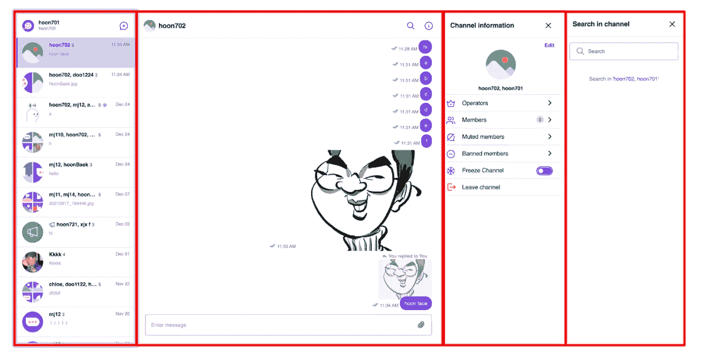
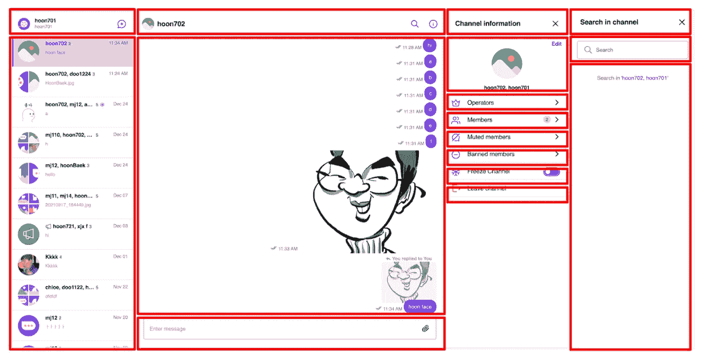
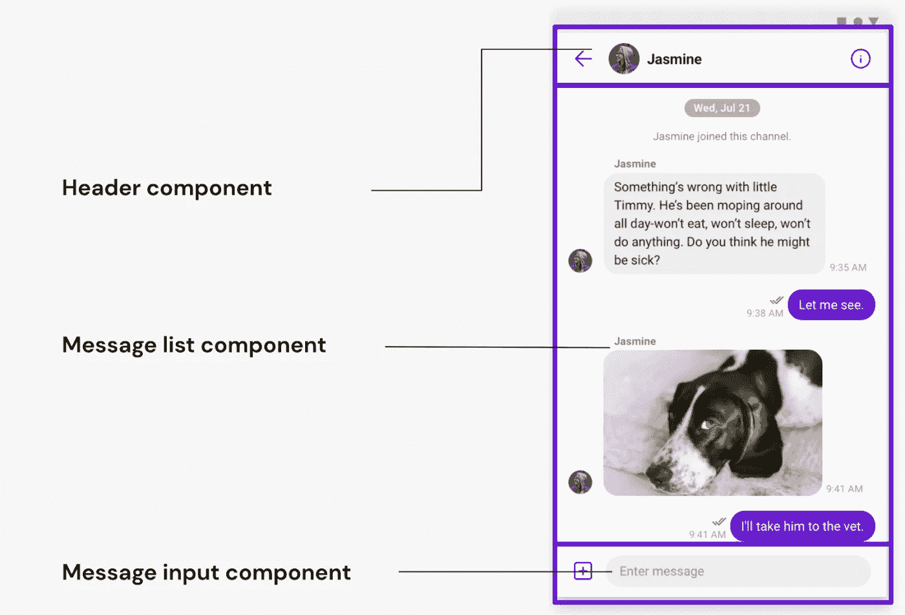

# 宣布 web & mobile SDK 升级以实现更简单、更快速的集成，并推出新的 UIKit 以改进定制

> 原文：<https://blog.devgenius.io/announcing-upgraded-sdks-a-newly-modularized-uikit-for-faster-more-customizable-chat-a58f7208065f?source=collection_archive---------13----------------------->

伊曼纽尔·德洛姆
产品营销经理| [仙鸟](https://www.sendbird.com)

> 为了第一时间了解新教程、开发者相关的聊天/电话发布以及其他重要更新，[注册](https://get.sendbird.com/dev-newsletter-subscription.html)获取我们的开发者简讯。

我们很高兴地宣布发布 3 个新的开发者友好的 Sendbird 聊天 SDK 和一个完全重新构建的 UIKit！我们做了这些改进，以改善开发人员在 web 和移动应用程序中构建现代、功能丰富的聊天的体验。

*   我们正在推出三个测试版:分别使用 [Swift](https://developer.apple.com/swift/) 、 [Kotlin](https://kotlinlang.org/) 和 [TypeScript](https://www.typescriptlang.org/) 重新构建了用于 [iOS](https://github.com/sendbird/sendbird-chat-sdk-ios) 、 [Android](https://github.com/sendbird/sendbird-chat-sdk-android) 和 [JavaScript](https://github.com/sendbird/sendbird-chat-sdk-javascript) 的 Sendbird Chat SDKs。
*   我们的 send bird Chat[UIKit](https://sendbird.com/features/chat-messaging/uikit)——整合最成熟的网络和移动应用对话平台的最快方式——经过重新架构，在定制应用时为开发人员提供了更大的灵活性。

# 新的 Swift、Kotlin 和 TypeScript SDKs

Swift、Kotlin 和 TypeScript 提供了巨大的性能、稳定性和安全性优势。近年来，这些现代语言的受欢迎程度大幅提高:

*   根据谷歌的数据，现在, [Play Store](https://play.google.com/store/apps) 上排名前 1000 的应用中，超过 60%都是用 Kotlin 开发的。
*   许多领先品牌如[脸书](https://www.facebook.com/)、 [WhatsApp](https://www.whatsapp.com/) 、[优步](https://www.uber.com/)、 [Slack](https://slack.com/) 、 [Lyft](https://www.lyft.com/) 、 [LinkedIn](https://www.linkedin.com/) 选择 Swift 作为其 iOS 应用。
*   TypeScript 已经成为数千家公司的 web 应用程序的首选语言，包括 [Asana](https://app.asana.com/) 、 [Lyft](https://www.lyft.com/) 和 [Cloudflare](https://www.cloudflare.com/) 。

我们决定对我们的 web 和移动 SDK 的整个代码库进行现代化，以便开发人员能够:

*   利用这些语言更直观、更简短的语法。
*   快速识别并修复错误。
*   受益于苹果、谷歌和微软带来的未来改进。

此外，我们利用代码迁移来:

*   重构我们的代码
*   改进代码模式
*   创建更好的 API 包装器

我们所有客户的好处是更好的编程体验、改进的性能和更短的开发周期。

在我们这边，随着这些现代语言的采用，我们正在见证开发效率的显著提高。这转化为我们客户的有形价值。创新的速度越快，我们就能越频繁地发布新的建立关系的工具，来帮助品牌与他们的用户建立联系，或者帮助用户有效而真实地参与其中。迁移带来全方位的好处，并为客户带来长期成功。

我们的 SDK 中值得注意的迁移变化包括:

*   旧产品名称的更新，如“SendBirdSDK”和“SendbirdChat”。这将我们的聊天 SDK 与 Sendbird UIKit、Calls 和 Desk 产品 SDK 区分开来。
*   可用性改进，例如:
    a)新的参数类，消除了带有许多参数的函数
    b)连接处理程序
*   用树摇动法减小 JavaScript 库的大小。
*   弃用 SyncManager SDK，代之以 SDK 集成的本地缓存功能，以支持离线消息传递。
*   仅从 Sendbird 接口启用实例创建。
*   对 Android 版本(Lollipop)以上的支持。
*   Internet Explorer 支持的终结。这一变化是由微软 2021 年 5 月的公告推动的，该公告详细介绍了他们在 2022 年 6 月弃用所有 Internet Explorer 服务的情况。

# 你为什么要迁移？

除了 v4 SDKs 的幕后效率改进和使用新语言的便利性，迁移到新 SDK 的主要原因是可以访问即将推出的所有精彩功能！我们将在 v4 SDKs 上专门推出新功能，而在版本 3 上没有新功能。此外，我们希望过渡是无缝的，因为代码行为和逻辑在 v3 和 v4 之间保持不变。

*注意:当升级到 v4 时，使用 SyncManager 的客户需要迁移到最新的本地缓存集成。使用我们方便的*[*Android*](https://sendbird.com/docs/chat/v3/android/guides/migration-from-syncmanager)*[*iOS*](https://sendbird.com/docs/chat/v3/ios/guides/migration-from-syncmanager)*和*[*JavaScript*](https://sendbird.com/docs/chat/v3/javascript/guides/migration-from-syncmanager)*迁移指南来更新您的代码。**

# *如何迁移到新版本的 Sendbird Chat SDK*

*迁移需要几天的集成工作。请参考我们的 [Android](https://sendbird.com/docs/chat/v4/android/quickstart/send-first-message) 、 [iOS](https://sendbird.com/docs/chat/v4/ios/quickstart/send-first-message) 和 [JavaScript](https://sendbird.com/docs/chat/v4/javascript/quickstart/send-first-message) 文档来启动该过程，并在 GitHub 上下载我们针对 [Android](https://github.com/sendbird/sendbird-chat-sample-android) 、 [iOS](https://github.com/sendbird/sendbird-chat-sample-ios) 和 [React](https://github.com/sendbird/sendbird-chat-sample-react) 的示例。*

*当然，我们随时可以在 [Sendbird 社区门户](http://community.sendbird.com/)上回答问题，或者直接通过我们的[销售团队](https://sendbird.com/contact-sales)回答问题。*

# *您应该何时迁移到新的 SDK？*

*我们鼓励您尽快迁移到 Sendbird Chat v4，因为您将是第一批使用 Sendbird Chat 最新功能的人！在第 4 版公开发布后，我们将继续支持第 3 版一年。然而，在这个时间范围之外，我们将不会解决版本 3 的任何技术或性能问题。相反，我们将引导每位客户使用 v4 SDKs。*

# *新的 Sendbird Chat SDK 将于何时公开发布？*

*今天，我们的 SDK 处于测试阶段，我们目前的计划是在几周内发布具有令人兴奋的新功能的公开版本！我们对 v3 的支持将仅限于修补程序。*

# *Sendbird Chat UIKit v3 —增强定制*

*当我们在 2020 年推出第一个 UIKit 版本时，我们最初的目标是提供基本的开箱即用的聊天功能，以便更快地集成到移动和网络应用程序中。*

*在第二个版本中，我们在 UIKit 中包含了更多的[send bird Chat SDK 的](https://sendbird.com/features/chat-messaging/features)特性，但是数据、资源和事件绑定的[定制](https://sendbird.com/developer/tutorials?cat=uikit)有局限性。*

*因此，来自客户的反馈是需要更多的灵活性来定制他们的 UI。因此，我们用更细粒度、模块化的组件重新构建了 UIKit。*

*下面是新架构模块化前后的用户界面对比。*

**

*图一。初始 UIKit 架构(UIKit v2)*

**

*图二。后置模块化(UIKit v3)*

*版本 2 相当单一，只有四个宏组件，如图 1 所示。相比之下，在版本 3 中，每个宏模块都被分成单独的头、主体和输入元素，可以添加、删除或配置大小和外观。*

*图 3。与图 1 中的模块 2 不同，对话通道分为:*

*   *头球*
*   *邮件列表*
*   *输入消息表单*

**

*图 3。Sendbird Chat UIKit v3 的对话通道组件*

*模块化进一步分离了数据和事件，增强了开发人员定制应用内聊天的自由度。我们最初的设计定位是在集成速度和定制之间取得平衡，如果客户需要，为更多的模块化留出空间。*

*既然您已经熟悉了新架构的优点，那么让我们来回顾一下您可以充分利用新的 Sendbird Chat UIKit 的一些资源。*

# *如何快速使用新的 Sendbird 聊天工具包*

*为了立即投入运营，我们鼓励您从我们的迁移指南开始:*

*   *[安卓 ](https://sendbird.com/docs/uikit/v3/android/introduction/migration-guide)*
*   *[**iOS**](https://sendbird.com/docs/uikit/v3/ios/introduction/migration-guide)*
*   *[反应过来 ](https://sendbird.com/docs/uikit/v3/react/introduction/migration-guide)*

*此外，请参考这些视频教程来熟悉架构，并观看我们工程团队的动手编码。*

*   ***Android:** [UIKit v3 概述](https://youtu.be/oH41o2iKhgs)，[现场编码](https://youtu.be/RmvuEiN-oPA)*
*   ***iOS:** [UIKit v3 概述](https://youtu.be/esn1v0f13Os)，[现场编码](https://youtu.be/P1l2k4VMWCY)*
*   ***React:** [UIKit v3 架构](https://youtu.be/_32XTRu8WKc)， [UIKit 定制](https://youtu.be/cCqlpcu4BBw)，[现场编码](https://youtu.be/QNeDhVzg5gQ)*

*此外，请务必查看我们已整合的重大变更列表:*

*   *[**安卓**](https://github.com/sendbird/sendbird-uikit-android/blob/v3-beta/changelogs/BREAKINGCHANGES_V3.md)*
*   *[iOS](https://github.com/sendbird/sendbird-uikit-ios/blob/v3.0.0-beta/changelogs/BREAKING_CHANGES_V3.md)*
*   *[**反应过来**](https://github.com/sendbird/sendbird-uikit-react/blob/develop-v3/CHANGELOG.md)*

*并下载 UIKit 示例。*

*   *[**安卓**](https://github.com/sendbird/sendbird-uikit-android/tree/v3-beta/uikit-sample)*
*   *[**iOS**](https://github.com/sendbird/sendbird-uikit-ios/tree/main-beta/Sample)*
*   *[**做出反应**](https://github.com/sendbird/sendbird-uikit-react/tree/ec74b7e1d735094a436015b7e89e10ae9232711c/samples/groupchannel)*

# *快速抖动更新！*

*对于那些错过它的人，我们在几周前发布了对 Sendbird Chat Flutter SDK 的 web 支持。SDK 现在实现了 Flutter 的完整价值主张:允许开发人员为他们所有的移动和 web 应用程序共享一个 Dart 代码库。*

*有了这个附加功能，您现在可以构建像 PWAs 或 SPAs 这样的 web 应用程序，并将您现有的移动应用程序带到 web 上！*

*查看我们的[文档](https://sendbird.com/docs/chat/v3/flutter/quickstart/send-first-message)和[样本](https://github.com/sendbird/Sendbird-Flutter)，了解更多关于 Flutter 的 Sendbird 聊天。*

# *更快、更强、更好*

*经过几个月的开发，我们期待看到你们全部采用新的 SDK 和 UIKits！我们知道你会像我们一样喜欢用苹果、谷歌和微软支持的最有效的语言编码。我们也期待着发布新功能，以更真实有效地连接您的企业和用户，通过您的网络和移动应用程序建立更牢固的关系！*

*对于那些想知道…新语言确实会在 Sendbird 平台上变得无处不在的人，请继续关注更多利用它们的产品更新！*

*请[让我们知道您的反馈](https://sendbird.com/contact-us)，因为我们将一直努力超越您的最高期望。*

*在那之前，来自 Sendbird 的问候，你的网络和移动应用的忠实对话伙伴。🎗🚀*

> *为了第一时间了解新教程、与开发者相关的聊天/电话发布以及其他重要更新，[注册](https://get.sendbird.com/dev-newsletter-subscription.html)我们的开发者简讯。*