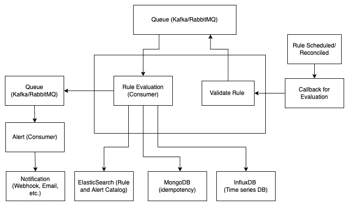
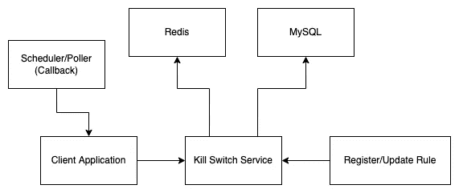

# 异常检测和补救

> 原文：<https://blog.devgenius.io/anomaly-detection-and-remediation-18d8f5f87b1b?source=collection_archive---------13----------------------->

期待意想不到的事情

# 1.介绍

这篇文章的概述是关于建立一个系统来检测潜在的异常并立即采取行动。因此主要有两个阶段:检测和遏制。然而，这篇文章讨论了检测和包含异常的用例，作为一个通用的实现细节。

# 1.1.两个主要组件:

*   **异常检测服务**(检测):定义检测异常事件的规则。
*   **Kill Switch 服务**(包含):区分优先级并评估规则以切换应用程序行为。

# 2.异常检测服务

异常检测服务是一个警报框架，用于在任何时间序列数据存储之上配置警报。

# 2.1.工作概述

来自应用程序的事件被发布并存储在时序数据存储中。以固定的时间间隔和频率评估预定义的规则(绝对和相对)，以便在检测到任何异常时发出警报。

# 2.2.异常可以大致分为两种类型:

*   **绝对异常:**基于绝对数据值；例如，从上午 10 点到下午 5 点，一个应用程序每 30 分钟收到至少 400 笔付款；任何低于最小值的都被认为是异常。
*   **相对异常:**基于相对于前一天/周/月的数据值；例如，从上午 10 点到下午 3 点的 30 分钟时间窗口中的支付次数相对于前一天(同一天和 30 分钟窗口)减少 25%或更多；也就是说，如果从昨天下午 3:00 到 3:30 有 200 笔付款，而今天少于 140 笔(下降超过 25%)，这就是异常。

# 2.3.模型

假设数据被发布到时间序列存储，规则的不同字段如下:

*   `ID`:唯一的标识符。
*   `Query`:从时序数据存储中获取评估数据。
*   `Anomaly rule-type`:绝对/相对。
*   `Time window`:滑动窗口间隔。
*   `Time Interval`:从间隔到间隔。
*   `Frequency`:规则评估的频率。
*   `Expiry/Validity`:决定是否对规则进行评估。
*   `Content`:预警内容(JSON 或 String)。
*   `Receivers` : Webhook、Email 等。
*   `Status`:活动/非活动。

# 2.4.系统设计

此时，很明显，查询必须在定义的时间间隔(从-到)和时间窗口内执行；此外，在相对规则的情况下，当前查询结果必须将结果与历史数据进行比较。

然而，历史数据通常被存档，并且不可伸缩以在每次评估规则时运行查询，因为某些关键系统可能频繁执行。

一个可能的解决方案是使用惰性加载:将结果存储在 ElasticSearch(查询结果、时间窗口/间隔、规则 ID 等)中。)评估规则后；因此，对于**相关规则**，可以从 ElasticSearch 中检索历史数据值，而不是每次都查询时序数据存储。此外，通过管道**将历史数据结果预填充到 ElasticSearch** 中进一步减少了规则评估时间。

注册规则时，对于时间间隔和窗口，调度程序负责以预定义的频率评估规则。例如，一个规则有一个 30 分钟的时间窗口和一个上午 10 点到下午 3 点的时间间隔，频率为 10 分钟:在这种情况下，规则评估为 10-10:30、10:10-10:40、10:20-10:50 等等。

最后，当必须评估规则时，调度程序向队列发布一条消息。一旦规则评估产生警报，警报消息将被推送到另一个队列。

因此，涉及的不同**组件**如下:

异常检测服务系统设计

**键值存储(MongoDB):**

*   存储规则评估和预警所需的规则和预警数据的目录(更好的选项:使用 ElasticSearch 从时间间隔和时间窗口搜索规则，这是协调规则注册所必需的)。
*   对于幂等性—确保同一规则在同一时间窗口内不会被评估超过一次，并跟踪以前的评估状态。

**Queue (RabbitMQ/Kafka):** 对规则评估和预警请求进行排队。

**时序数据存储(InfluxDB):** 应用程序事件的数据存储。通过查询数据来评估规则。

# 2.5.结论

只要数据被发布到时间序列数据存储中，并且具有跨域的用例，异常检测器的应用是无穷无尽的:对数据库的异常查询、API 的频率、工具的使用(Cloud Trail)、用户权限的改变、资源利用率峰值等等。检测到异常后的操作项是开放式的，最后，规则评估不限于对时序数据存储的查询。扩展可以具有用于查询数据的 ML 决策层。

# 3.切断开关服务

# 2.1.工作概述

“kill-switch”的基本思想是获取一个 JSON 输入，并评估输入 JSON 上的一组规则，然后返回匹配结果。之后，由接收者决定行动项目；一种可行的方法是抛出一个带有自定义状态代码的异常，并将客户端页面配置为显示相关消息，如“临时阻止”

例如:假设应用程序中有一个工作流，在这个工作流中，订单的购买被完成，汇丰银行暂时停机，或者发现了一个 bug 因此，要阻止这样的工作流，可以创建一个 kill-switch 规则，该规则与`HSBC`银行的`PURCHASE`工作流相匹配。

*   预定义规则:`WORKFLOW == "PURCHASE" and BANK == "HSBC"`
*   JSON 输入:`{"WORKFLOW": "PURCHASE", "BANK": "HSBC"}`
*   输出:`True`

# 3.2.模型

规则的不同字段如下:

*   `ID`:唯一标识符。
*   `Conditions`:评估输入的 JSON。
*   `Time Interval`:开始和结束间隔(规则的有效期/到期日)。
*   `Frequency`:规则评估的频率(默认为 30 秒)。
*   `Status`:活动/非活动。

# 3.3.系统设计

虽然为给定的 JSON 实现一个简单的规则引擎相对容易，但是后端应用程序中的大多数 API 需要调用 Kill-switch 服务来进行评估。因此，确保低延迟具有更高的优先级。

kill-switch 服务可以将规则集存储在具有更长 TTL 的键值缓存存储(如 Redis)中，并在规则过期或被修改时更新缓存。

调用 kill-switch 服务的应用程序仍然必须承受网络延迟来进行 API 调用，对于大多数后端 API 来说可能如此。考虑到 TTL 可能需要几秒钟，使用另一层 Redis 是个坏主意。更好的方法是使用调度器+队列组合，在运行时以预定义的频率加载与集成应用程序相关的 kill-switch 规则。

KS 的准系统实现:[https://github.com/addu390/django-kill-switch](https://github.com/addu390/django-kill-switch)

所涉及的不同**部件**如下:

断路开关服务系统设计

**数据存储(MySQL):** 验证并存储规则。

**Queue (RabbitMQ/Kafka):** (对于客户端应用程序)调度器回调被推送到队列以导入 kill-switch 规则(内存中)。

**键值缓存(Redis):** 缓存规则以促进低延迟 API 调用。

# 3.4.结论

kill-switch 服务的使用案例跨越多个域。它只需要一组键值对和验证键值对的规则，然后是一个完全控制客户端的操作项。无论是暂时阻塞一个工作流、一组用户、一个工具，甚至是资源。然而，重要的是将 KS 用于其主要目的，而不是强制适用于其他用例，如 A/B 测试。

这两个服务(AD 和 KS)独立工作，是独立的应用程序。而是齐头并进。例如，激活断路开关可以是异常检测器的动作项目。