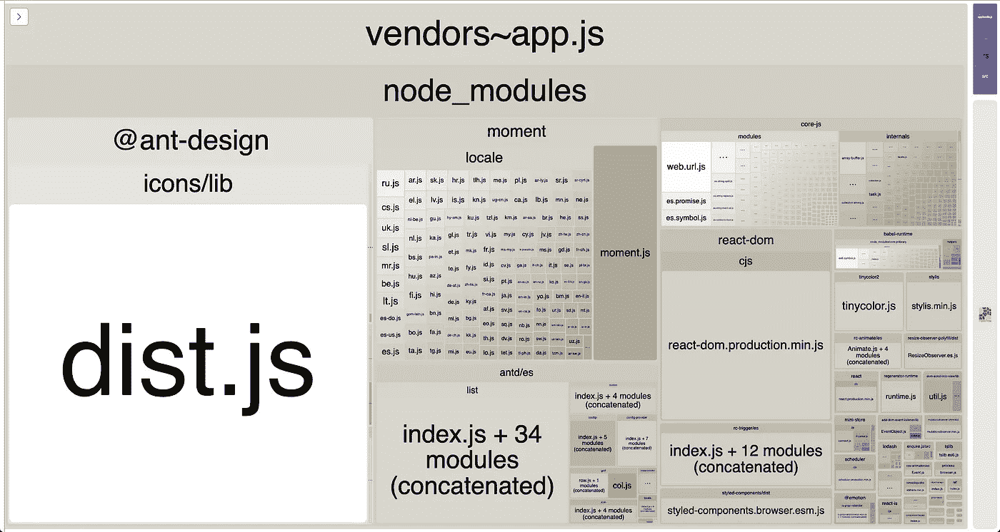
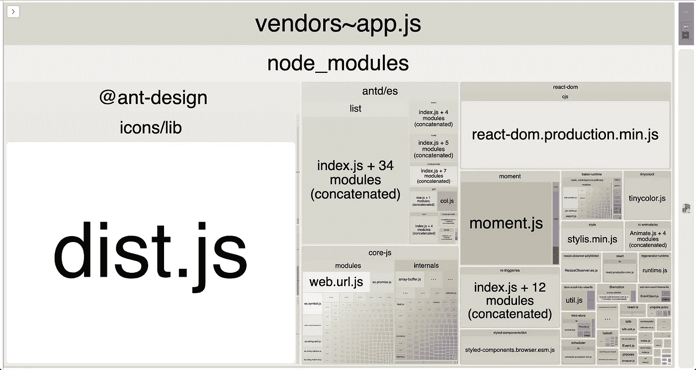
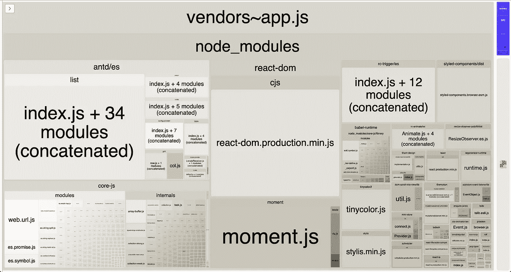

# Ant 设计组件定制和捆绑包优化

> 原文：<https://blog.devgenius.io/ant-design-component-customization-and-bundle-optimization-a1fa3253a175?source=collection_archive---------0----------------------->

使用您的定制包装器轻松替换原始组件，并有效减小包的大小。使用 React、TypeScript、Styled-Components 的分步教程。

[黎允文](https://unsplash.com/@henrylaiphotography?utm_source=unsplash&utm_medium=referral&utm_content=creditCopyText)在 [Unsplash](https://unsplash.com/s/photos/ant?utm_source=unsplash&utm_medium=referral&utm_content=creditCopyText) 上拍照

我是 Ivan Kopenkov，前端开发人员。在本文中，我将告诉您我用于 UI 库组件定制的方法。您还将学习如何显著减小包的大小，删除 Ant Design 中所有不必要的模块。

在我们的例子中，我们为项目中的原始 Ant 设计组件制作包装器，改变它们的外观，并开发它们的逻辑。同时，我们从`ant-design`模块导入定制的和原始的组件。这节省了树抖动功能，并使复杂的库组件使用我们的包装器，而不是原始的嵌套元素。

如果您已经或即将使用 Ant Design，本文将为您提供一种更好、更有效的方法。即使您选择了另一个 UI 库，您也可以实现这些想法。

# 使用用户界面库的问题

UI 库为开发人员提供了各种随时可用的组件，这些组件在任何项目中都是必需的。通常，这样的组件被测试所覆盖，它们支持最常见的用例。

如果您打算使用这些库之一，您应该准备好面对下面两个问题:

1.  当然，每个项目都需要修改 UI 组件。组件必须与项目设计相匹配。此外，经常需要为特定的用例开发或更改一些组件的逻辑。
2.  大多数 UI 库包含的组件、图标和实用程序比一个项目中使用的要多，至少在早期阶段是这样。但是所有这些文件都可能被放入捆绑包中，这会显著增加应用程序的初始加载时间。

第一个问题通过定制库组件来解决，第二个问题通过包优化来解决。包括 Ant Design 在内的一些库已经适应了树抖动，它让捆绑器自动从捆绑包中排除未使用的模块。

但是，即使使用 Ant 设计，内置的树摇动支持也不足以实现有效的束大小。这个库的所有图标都将包含在这个包中，还有整个 Moment.js 库和每个本地化文件，因为它是一些 Ant 组件的依赖项。此外，如果一些 Ant 组件在一个文件中被重新导出，那么它们中的每一个都将被添加到包中。即使只使用其中一个。

# 定制方法

让我们从定义 UI 库组件定制的可用解决方案开始。

## 1.全局类的重新定义(仅 CSS)

这是最简单的方法。您只需要为全局 CSS 类添加样式，这些样式由 UI 库组件使用。

缺点是:

*   组件的行为和逻辑不能被改变或添加。
*   CSS-in-JS 可能以这种方式使用，但只用于全局类定义，没有这种解决方案的超级能力。
*   全局类的使用会导致不必要的样式混合:相同的类可能会在项目的其他部分使用，而选定的 UI 库可能会被同一站点上的第三方模块使用。

事实上，这种方法唯一的优点就是简单。

## 2.组件的本地包装

这种方法更高级，它涉及到在项目中为每个需要定制的组件创建一个单独的文件。在这样一个文件中，您创建了一个新的组件，它在自身内部呈现 UI 库中的可选组件。

优点:

*   它允许您定制组件的样式，还可以修改组件逻辑。
*   您可以同时使用 CSS-in-JS 的所有功能。

缺点是:

*   如果一个原始组件在整个项目中被广泛使用，那么您需要将它的所有导入都更改为新包装器的源代码。根据组件的使用范围，这可能相当耗时。
*   假设您使用 IDE 自动完成功能，通过这种方式自动导入选定的组件。在这种情况下，您需要注意您从列表中选择的组件，因为您至少有两个组件:定制的组件和原始组件。很容易忘记这一点，选择原始组件，甚至在创建新的包装器后不小心留下一些原始组件的导入。
*   最重要的是:许多组件都很复杂，并且它们在内部使用同一个库的其他组件。因为原始组件完全不知道我们的包装器，所以它们将继续在自己内部使用原始组件，忽略包装器中的逻辑或外观变化。例如，像 AutoComplete 这样的 Ant 设计组件在其内部呈现输入和选择组件。同时，列表内部使用了网格、分页和旋转。密码、搜索和文本区也是如此，它们是输入的依赖项，等等。

## 3.派生 UI 库存储库

制作原始 UI 库的私有副本似乎是最强大也是最复杂的方法。

优点:

*   它在外观定制和逻辑修改方面为您提供了最大的自由度。
*   有机会在其他项目中重用相同的分叉 UI 库。

缺点是:

*   当您试图将原始的存储库更新拉到分叉的存储库时，您可能会遇到一些复杂的情况。
*   对于开发人员来说，在单独的存储库中不断修改组件以满足主项目的需求是非常不方便的。

# 我们如何定制 Ant 组件

经过长时间的讨论，我们的团队决定在新项目中使用 Ant Design UI 库。我的职责是为一个新项目创建一个样板文件，它将在以后启动其他项目时使用。对于我们来说，改变风格以及修改和添加组件的逻辑是至关重要的。

我们不想分叉 ant 设计存储库，因为我们有过将组件分离到一个分离的存储库中的糟糕经历。在开发 [MCS](http://mcs.mail.ru/) 时，我们一直在使用语义 UI 库，将其组件存储在一个单独的存储库中。找不到方便的工作方法。我们第一次与另一个项目( [b2c-cloud](https://cloud.mail.ru/) )共享这个存储库，为彼此开发不同的主题。但是这很不方便，而且一个项目的变更可能会意外地影响到另一个项目，所以在某些时候，我们再次从这个存储库分叉。最终，我们将包装器从分离的存储库转移到项目中，我们对此非常满意。

我选择了第二种方法，直接在项目中创建包装器。同时，我希望定制的组件直接从`antd`模块导入。这允许我们在为组件制作包装器时，避免更改已经使用的组件的导入。这也省去了树抖动，使复杂的组件自动使用自定义包装器，而不是原来的组件。

之后，我将告诉你如何一步一步地满足这些需求，你将理解如何在其他项目中实现相同的方法。

## 第一步。带包装的文件

在存储项目组件的文件夹中，我为未来的包装器创建了一个新的目录，名为`antd`。在这里，我们逐渐为包装器添加了新的文件，这取决于我们的修改需求。每个文件都是一个组合，一个包装组件，呈现从 UI 库中导入的原始文件。让我们来看看这样一个文件的简化示例:

为了演示样式定制的方法，我使用样式化的组件更改了组件背景颜色。为了展示逻辑定制的方法，我添加了`tooltipTitle`参数，以便在它被传递时额外呈现一个工具提示。

## 第二步。将带有别名的组件导入更改为包装器

现在让我们考虑如何让一个构建器(这里是:Webpack)将从`antd`的根导入的模块的原始路径改为我们的 wrappers 的路径。

我们应该用包装器`src/components/antd`在根文件夹中创建一个`index.ts`文件，并将位于`node_modules/antd/lib/index.d.ts`的文件内容复制到这个文件中。然后，使用一些 IDE 的大规模替换工具，我们将每个导入路径从`./componentName`更改为`antd/lib/componentName`。

至此，应该有下一个内容了:

然后，我们更改为其制作包装器的组件的导入路径。在这种情况下，我们应该从`src/components/antd/Button`导入按钮:

现在我们只需要配置 Webpack 来使用这些路径作为 Ant 组件的别名。我制作了一个简单的工具来制作别名集:

> 值得注意的是，当复杂组件使用原始嵌套元素而不是自定义元素时，这里是问题的解决方案**。文件 AntAliases.ts 中的一段代码，用于在位于 Ant Design library 文件夹文件中的复杂组件中查找嵌套组件的相对导入。然后，它为这些导入创建别名，使复杂的组件使用我们为嵌套组件定制的包装器。**

我们的 Webpack 配置的 resolve 部分如下所示:

## 第三步。类型脚本支持(可选)

前两步足以独立工作。但是，如果您使用 TypeScript 并更改包装器中原始组件的接口(正如我在示例中所做的，添加了额外的属性`tooltipTitle`，那么您将需要向 TypeScript 配置添加别名。在这种情况下，它比使用 Webpack 简单得多；您只需将文件的路径和上一步导入的包装器添加到`tsconfig.json`:

## 第四步。变量(可选)

当我们在项目中使用样式组件时，在单个 ts 文件中声明样式变量并在需要的地方导入它们是非常方便的。Ant 设计风格是使用 Less.js 编写的，它允许我们在项目中构建风格，使用 less-loader 注入变量。因此，在我们的组件和包装器中使用相同的变量，以及用它们构建原始组件的样式是一个很好的机会。

因为我们的样式指南暗示在 camelCase 中命名变量和函数，所以最初我们在这种情况下定义变量。Ant Designless-files 使用 kebab-case 进行变量命名，因此我们也可以在 kebab-case 中自动转换和导出这些变量。

我们带有简短样式变量声明的文件如下所示:

您可以在[文件](https://github.com/ant-design/ant-design/blob/master/components/style/themes/default.less)中看到 Ant 设计变量的完整列表。

我们通过在 Webpack 配置中添加 less-loader 来注入变量和构建 less-files:

## 组件示例

一旦你完成了前两个步骤，一切都会好的。让我们看看使用修改后的组件的代码:

## 电网和无线电的问题是

如果你不打算让网格和无线电渲染包装组件代替原始组件，你可以省略这一部分。这个问题是由于网格实际上不是一个独立的组件造成的。事实上，它位于`node_modules/antd/es/grid/index.js`的源只包含组件 Col 和 Row 的重新导出。

由于我们使用了别名，所有其他复杂的组件都已经使用了我们的包装器。但是当我们使用 Grid 时，由于它的文件内容，它仍然会导入原始的列和行。要解决这个问题，我们应该考虑接下来的步骤。

为了说明这种情况，我为 Col 创建了一个包装器，并在默认情况下将其背景设置为红色。

然后，我为测试呈现了原始的 List 组件，并希望它为它的列呈现修改后的 Col。

为了让 List 完全使用我们的包装器而不是默认的 Col，我们创建了一个新文件，用我们的包装器的路径替换位于`node_modules/antd/es/grid/index.js`中的原始重新导出。我们将这个新文件应用于`antd/Grid.ts`，下面是它的内容:

现在我们只需要在`AntAliases.tsx`中定义的常量`SPECIAL_ALIASES`中设置该文件的路径:

最后，定制部分结束。现在 List 将把我们的 Col 包装器呈现为它的列。要定制行，只需在`src/components/antd/Grid.tsx`制作一个包装器并改变行路径。做起来不是很方便，但是你只需要它做两个组件:电网和电台。尽管在去年，我们的项目中没有收到这方面的需求。

# 捆绑优化

## 树摇晃

正如我提到的，Ant Design 的最新版本是开箱即用的。它以前的版本不是，所以我们过去使用 babel-plugin-import 来删除不用的代码。我假设其他没有内置树抖动支持的库可以通过使用这个插件来实现，至少是部分实现。

## 样式导入

尽管有原生树抖动支持，我们并没有放弃 babel-plugin-import，而是继续使用它在导入 js 代码时自动获取组件的样式。使用它，没有多余的样式被添加到包中，开发人员也不需要考虑样式依赖性。现在，忘记导入某些组件的样式是不可能的。

该插件在项目根目录下的`babel.config.js`文件中启用:

## Moment.js

目前，该软件包由以下模块组成:

Ant Design 使用 Moment.js，它将所有的本地化文件都拉到包中。您可以在图像中看到它如何显著增加了包的大小。如果您不需要依赖于 Moment.js 的此类组件，如 DatePicker，您可以简单地剪切这个库，例如，通过向某个空文件添加 Moment.js 的别名。

因为我们仍然在我们的项目中使用 Moment.js(忽略它的创建者最近已经弃用它的事实😅)，我们没有必要完全消除它。我们只是排除了无用的本地化文件，只留下支持的语言(en 和 ru)。

多亏了 Webpack 提供的 ContextReplacementPlugin，这才成为可能:

现在，我们可以确保消除冗余文件，如下一个屏幕截图所示:

> 如果你使用 Lodash 和/或 Ramda，并希望从包中排除他们未使用的文件，但同时你不想从他们单独的文件中导入每个函数，你可以只添加到你的 Babel 配置 [babel-plugin-lodash](https://github.com/lodash/babel-plugin-lodash) 和 [babel-plugin-ramda](https://github.com/megawac/babel-plugin-ramda) 。

## 核标准情报中心

上面的 Webpack Bundle Analyzer 截图显示，这个 Bundle 最重的部分是 Ant Design 内置图标集。这是因为 Ant Design 从单个文件中导出图标。

我们在项目中使用独特的自定义图标，所以我们根本不需要这个文件。你可以切断它，还有 Moment.js，只要给某个空文件做个别名。但是，我想说明如果您想使用它们，只保存所需的默认图标的能力。

出于这个原因，我添加了文件`src/antd/components/Icons.tsx`。我只留下了微调图标来呈现状态为`"loading"`的按钮:

我还在 Webpack 配置中为这个文件添加了一个别名。

现在我们只需要呈现按钮本身:

因此，我们得到的包中只有我们使用的一个图标，而不是像以前那样得到完整的图标包:

或者，您可以使用我们刚刚创建的同一个文件轻松地将默认图标替换为标准图标。

# 结论

最后，Ant Design 每一个不用的组件都被 Webpack 砍掉了。同时，我们继续从库的根目录导入任何组件，无论是包装器还是原始组件。

此外，在开发过程中，TypeScript 将显示定制组件的正确类型，就像上面示例中的 Button 一样，我们为它添加了额外的属性`tooltipTitle`。

如果我们决定定制项目中的另一个组件，即使是一个广泛使用的组件，我们将只需要添加一个带有包装器的文件，并使用位于`src/components/antd/index.ts`的重新导出来更改文件中该组件的路径。

我们已经在两个不同的项目中使用这种方法一年多了，仍然没有发现任何缺陷。

你可以在我的库中看到这种方法的原型和本文[中描述的例子。除了这个解决方案，我们还使用 Jest 和 React 测试库来测试我们的组件。这将在另一篇文章中讨论，因为它包含一些棘手的元素。](https://github.com/ikopenkov/ant-customization)