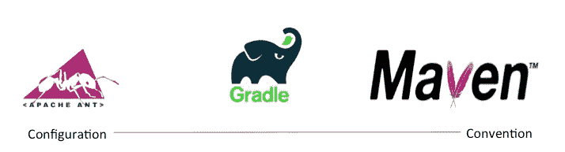

# 蚂蚁 vs Maven vs Gradle

> 原文：<https://blog.devgenius.io/ant-vs-maven-vs-gradle-801fde21af80?source=collection_archive---------0----------------------->

我将快速比较和对比这三个“构建”工具(针对 Java 世界)。我之所以要概述这种比较，是因为很多人似乎不明白这三者之间的区别。

我把“构建”放在引号中是因为这三个部分各有各的独特之处。Maven 不仅仅是一个“构建”工具。但是大多数人将它们称为“构建”工具，并将其用于特定目的。

还有很多面向 java 的“构建”工具，比如 [Ivy](http://ant.apache.org/ivy/) 和 [Buildr](https://buildr.apache.org/) 。此外，还有许多其他针对整个基于 JVM 的生态系统的相关构建工具，如 [sbt](https://www.scala-sbt.org/) (Scala)、 [Grape](http://www.groovy-lang.org/Grape) (Groovy)、 [Leiningen](https://leiningen.org/) (Clojure)。

我特别强调这 3 个工具是因为多年来，随着时间的推移，它们被最广泛地使用。在现有的博客帖子、科技文章、stackoverflow 问题中，已经有许多[Ant](https://ant.apache.org/)vs[Maven](https://maven.apache.org/)vs[Gradle](https://gradle.org/)的比较，我不会重新发明轮子。相反，我只想一吐为快，谈谈我个人对此的看法。简而言之，我想根据我多年来的个人经历和学习，分享一下我对这个话题的看法。

## 阿帕奇蚂蚁

“超越常规的配置”

也许现在(2018 年)这是一个相当老式的构建工具，我当然清楚地记得早在 2006 年我上大学的时候，我的讲师们就非常提倡这个工具。甚至当我 10 年前开始我的职业生涯时，我工作的公司，我参与的项目都在大量使用这个工具。然后我被告知这是主流。

这个工具建立在“配置”的概念之上，不像其他工具，比如 [Maven](https://maven.apache.org/) ，你稍后会看到它是“约定”的。要做到这一点，你需要编写/编码你希望“构建”过程采取的“动作”。即配置。

示例:

## 专家

现在，让我们在跳到[格拉德](https://gradle.org/)之前，将焦点切换到[玛文](https://maven.apache.org/)。没有查过 [Maven](https://maven.apache.org/) 和 [Gradle](https://gradle.org/) 的真实历史，据我所知 [Maven](https://maven.apache.org/) 在 [Gradle](https://gradle.org/) 之前就存在了。Ant 之后没多久， [Maven](https://maven.apache.org/) 就这么火了。如此受欢迎，以至于现在它被认为是所有 Java 项目事实上的构建工具。

虽然，它不仅仅是一个构建工具，而是一个完整的软件“项目管理系统”。简而言之，它的工作方式是通过将所有工件存储在一个存储库(Maven Central Repository)上来帮助您管理依赖关系。您指定您的“构建”文件(它被称为“pom.xml”)。

在 pom.xml 文件中，您列出了所需的依赖项。It 系统的特色是一个“插件”架构，允许你放置插件来定制构建生命周期过程。不像 [Ant](https://ant.apache.org/) , [Maven](https://maven.apache.org/) 使用一个约定的构建生命周期过程。如果你想改变它的某些方面，你可以插入插件并指定配置细节。

然而，它仍然是相当僵硬的，它遵循一个惯例，而不是给你配置的灵活性。因此， [Maven](https://maven.apache.org/) 就是所谓的“约定胜于配置”。

我认为它与[蚂蚁](https://ant.apache.org/)完全相反。

这里有个例子:

## 格拉德勒

最后，我们来到了阶梯上。

在我的记忆中，Gradle 在过去的三四年里慢慢变得流行起来。有些人开始喜欢格雷迪，原因很简单，用我自己的话说:

" [Gradle](https://gradle.org/) 具有这两个词的优点，因为它遵循了 [Maven](https://maven.apache.org/) 的约定模型，但又提供了 Ant 所具有的配置灵活性"

所以，换句话说， [Gradle](https://gradle.org/) 是两者的约定&配置。

过去，人们使用 Ant 是因为它的配置能力非常灵活(因为您可以按照自己的意愿手动定义构建步骤)。人们选择 [Maven](https://maven.apache.org/) 是因为它遵循惯例的简单模型，而不用花太多时间在 Ant 中编写所谓的构建脚本。

但是，如果你想遵循一个惯例，但仍然有一些小部分你想完全定制呢？

这就是格雷尔的用武之地。在我看来，这也是人们选择 Gradle 的原因。仅仅是因为这个原因。

行动中的格雷尔:

人们选择 Gradle 的另一个原因是不再有 XML 了！Ant 和 Maven 都是基于 XML 的。用 [Gradle](https://gradle.org/) ，它是你使用的基于 groovy 的 DSL。因为它是 DSL，所以开发人员能够使用冗长的 XML 进行编码，而不是编写/配置。

## 概括起来

