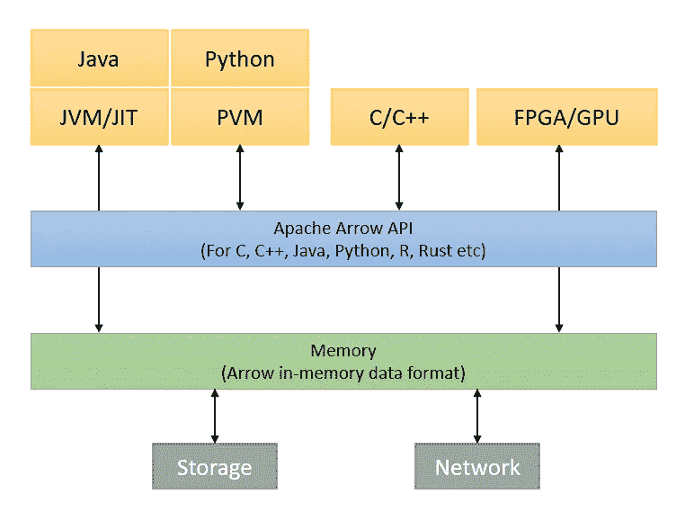
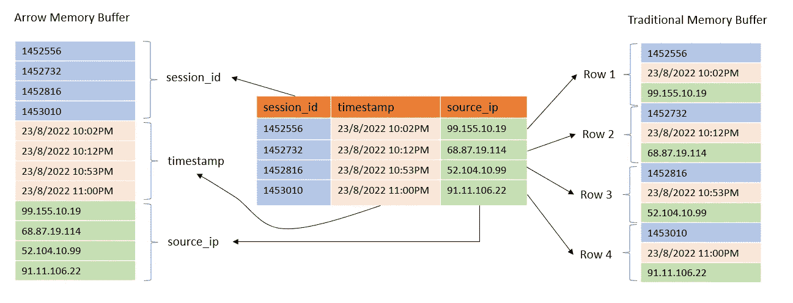
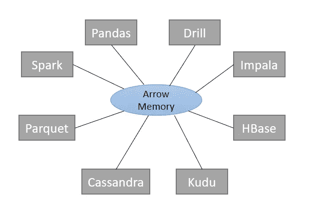
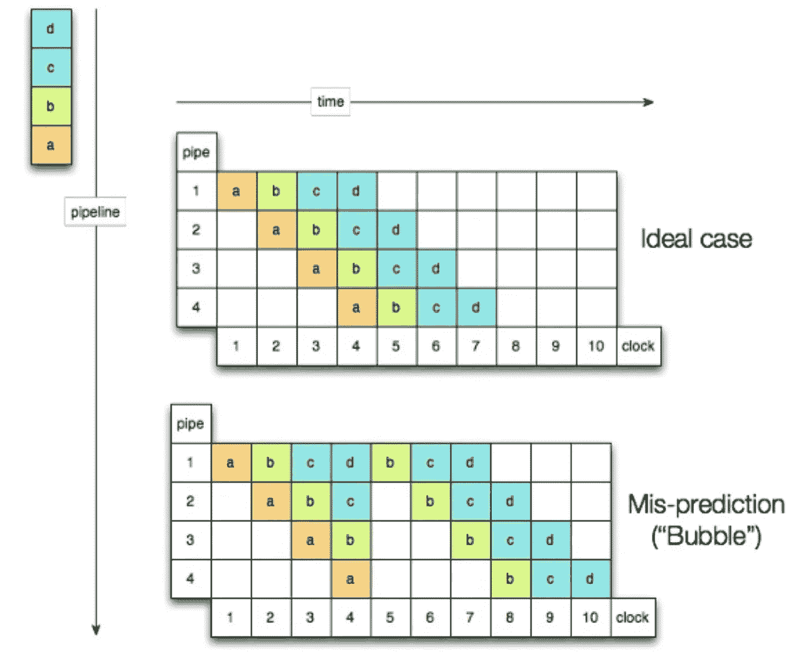
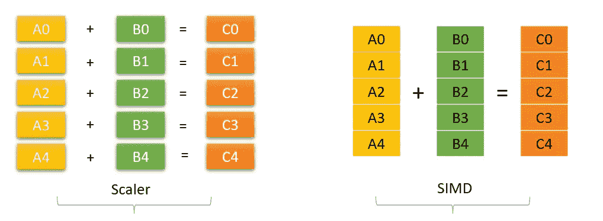
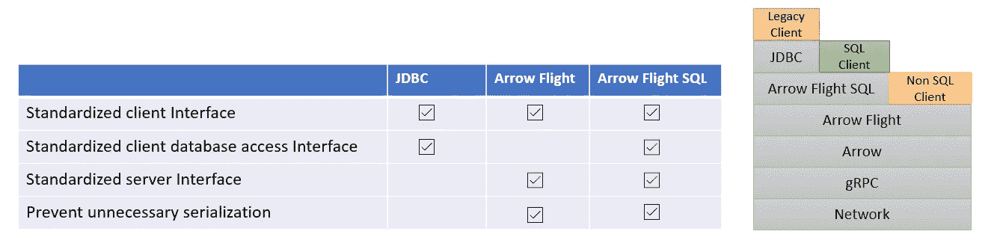

# 阿帕奇箭头

> 原文：<https://blog.devgenius.io/apache-arrow-2d72137d9e84?source=collection_archive---------1----------------------->


[https://arrow.apache.org/](https://arrow.apache.org/)

一种独立于语言的内存列数据格式

## 什么是阿帕奇箭？

Apache Arrow 的核心是一个标准化的、独立于语言的内存列格式规范，用于在内存中表示表格数据集。它还包括将箭头表示公开为 API 的库。



Apache Arrow 正在用于 pandas、Dremio、Spark、Amazon Data Wrangler、AWS Athena、AWS Lake Formation、Superset、Streamlit 和 Drill 等项目。

## 关键组件

*   数据交换规范
*   输入输出库
*   网络格式
*   向量计算库
*   分区数据集管理器

## 内存中的列数据格式



到处写，到处跑。



## Arrow 性能优势

*   **与平台和语言无关—** Arrow 是一个通晓多种语言的人。
*   **平行度**。一次数据传输可以并行跨越多个节点、处理器和系统。
*   **缓存局部性:** Arrow 将相似的类型一起存储在内存中。这使得高速缓存预取更加有效，最大限度地减少了因高速缓存未命中和主内存访问导致的 CPU 延迟。
*   **流水线:** Arrow 通过最大限度地减少循环内指令数量和循环复杂性，减少了分支预测失败。



*   **SIMD 指令:** Arrow 组织数据，使其非常适合 SIMD(在单个时钟周期内执行多个操作)操作。



*   **零拷贝数据共享:**当两个系统采用 Arrow 作为内部表示时，一个系统可以将数据直接交给另一个系统使用，从而减少数据移动开销。
*   Arrow 旨在最大限度地降低在网络上移动数据的成本。它利用分散/集中读取和写入，并具有零序列化/反序列化设计，允许节点之间的低成本数据移动。

## 在 Python 中使用箭头。

```
# pip install pyarrow
import pyarrow as pa
import pyarrow.compute as pc
import pyarrow.dataset as ds
import pyarrow.flight # transmit arrow buffers over gRPC
import pyarrow.parquet
import pyarrow.feather

mmap_file = pa.memorty_map('demo-file.arrow', r)
table = pa.ipc.RecordBatchFileReader(mmap_file).read_all()
df = table.to_pandas()
# pandas -> arrow -> pandas
table_pa = pa.Table.from_pandas(df_pandas)
df_pandas = table_pa.to_pandas()
```

## 数据类型映射

> 模式—元数据
> 表—数据帧
> 数组—列表/列

## 箭头的 PySpark 设置

```
spark.sql.execution.arrow.pyspark.enabled=**true** spark.sql.execution.arrow.pyspark.fallback.enabled=**true**
spark.sql.parquet.mergeSchema=**false**
spark.hadoop.parquet.enable.summary-metadata=**false**
spark.sql.execution.arrow.maxRecordsPerBatch=20000
```

PyArrow 还集成了 Hive、Kudu 和 Cassandra

## 箭头飞行

Arrow Flight 是一种基于专用 gRPC 的数据传输协议，它简化了大型数据集在网络接口上的高性能传输。Arrow Flight 保持内存中格式的相同在线表示，消除了序列化开销。

## 是什么让阿帕奇箭飞行速度很快？

*   **无序列化/反序列化**。由于跨系统的相同表示，当数据跨越流程边界时，不需要进行数据重组。
*   **批量操作**。Arrow Flight 对记录批次进行操作，而不必访问单独的列、记录或单元格。
*   **无限并行**。Flight 是一种横向扩展技术，因此实际上，吞吐量只受客户端和服务器以及两者之间的网络的能力限制。
*   **高效的网络利用。** Flight 使用 gRPC 和 HTTP/2 传输数据，提供高网络利用率。

使用 Flight 提供数据

```
import pyarrow as pa
import pyarrow.flight as flight

def deliver_data(flight_server, pyarrow_df):
    flight_server.serve_buffers(df, metadata=pyarrow_df.schema.metadata)

with flight.FlightServer.from_ports(port_range=(9000, 90001)) as server:
    serve_data(server)
```

> 雪花和 BigQuery 都支持以箭头格式传递结果。

```
pip install snowflake-connector-python[pandas]
ctx = snowflake.connector.connect(...)
cur = ctx.cursor()
sql = "select * from demo_table"
cur.execute(sql)
df = cur.fetch_pandas_all()
# alternate
for df in cur.fetch_pandas_batches()
    ...
```

## 箭头飞行 SQL

它是从数据库进行高性能数据传输的通用(适用于所有数据库引擎的单一驱动程序)标准。它是建立在箭飞行之上的。而使用 Arrow Flight SQL 读取 10 M 记录比使用 PyODBC 读取 10M 记录快 15 倍。



## 极地

Polars 是一个非常快的数据帧库，使用 Apache Arrow 作为内存模型在 Rust 中实现。

```
pip install polars[numpy,pandas,pyarrow]
```

## Arrow 的其他功能

*   支持压缩和编码
*   支持 CPU 加速
*   支持 GPU

感谢阅读！！