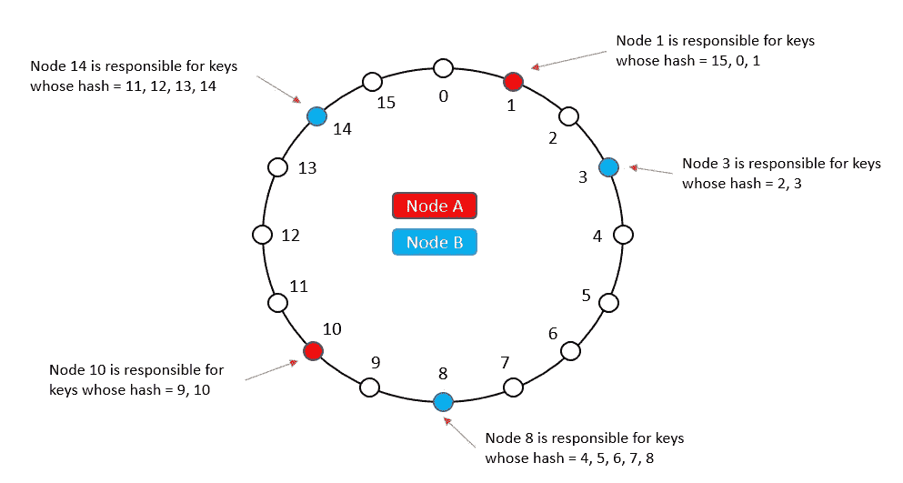
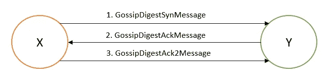
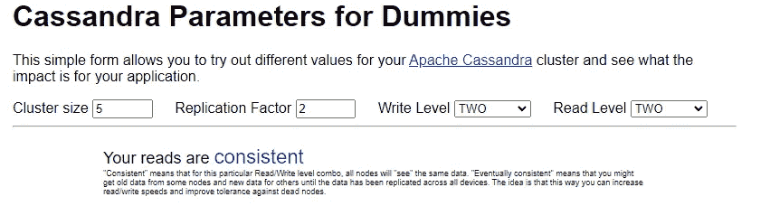
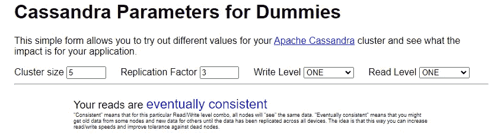
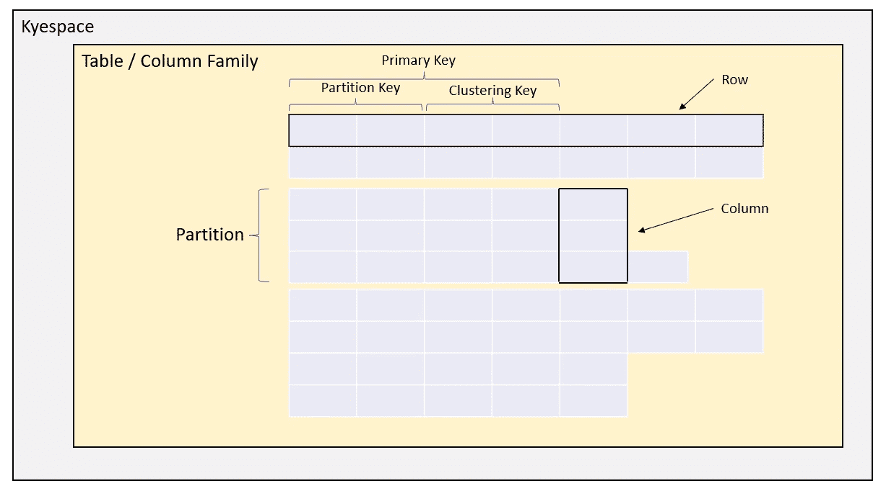

# 阿帕奇卡桑德拉-简介

> 原文：<https://blog.devgenius.io/apache-cassandra-introduction-bd9a7a09f71?source=collection_archive---------4----------------------->

用于扩展的行分区数据库

Cassandra 是一个**开源、分布式、宽列 NoSQL** 数据库，旨在实现高可用性。它提供了快速的读写性能。《卡桑德拉》是根据《发电机》和《大餐桌纸》改编的。

## 优势

*   低延迟的全球可用性
*   完全多主数据库复制
*   商用硬件上的线性扩展
*   灵活模式

让我们讨论一下 Cassandra 的一些关键概念。

## 一致散列法

Cassandra 使用一种称为一致散列的特殊散列形式在存储节点上划分数据。



## 代币

Cassandra 使用**令牌(64 位整数)**来确定数据在环上的位置。Cassandra 将这些令牌的范围分配给节点。向群集中添加和删除节点会导致在节点之间重新分配这些令牌。

当一个新节点加入一个集群时，它将承担集群中其他节点的平均部分数据的责任。如果一个节点出现故障，负载会均匀分布在集群中的其他节点上。

## 八卦协议

Cassandra 使用八卦协议来寻找节点配对和元数据传播。

*   在集群中，每个成员都有一个已知成员及其地址和一些元数据的子集列表。
*   每个成员定期根据不同节点发出的数据更新其邻居心跳计数器列表，并将更新后的信息发送给其他邻居。
*   在接收到这样的八卦消息时，节点将消息中的列表与它自己的列表合并，并为每个成员采用最大心跳计数器。
*   只要节点的心跳计数器持续增加，就可以保证它是健康的，如果心跳没有增加超过某个阈值时间段，则认为它是死的。



*   可扩展的 O(登录)轮完井
*   高度容错
*   趋同一致性
*   分散的
*   简单的算法

 [## 八卦模拟器

### 如上所述，Gossip 协议是周期性执行的，即循环执行。这就是单词循环…

flopezluis.github.io](https://flopezluis.github.io/gossip-simulator/) 

Cassandra 使用种子节点的概念来避免逻辑分区。种子节点是功能齐全的节点，可能来自静态配置或配置服务。所有节点都以这种方式知道种子节点。为了协调成员关系的变化，每个节点通过 gossip 协议与种子节点连接。因此，逻辑分裂是极不可能的。

## 告密者

卡珊德拉的飞贼决定了主机的相对接近度。Snitches 收集有关网络拓扑的信息，以便有效地路由请求。

飞贼类型有多种选择。这是通过在`cassandra.yaml`文件中设置`endpoint_snitch`来完成的。

> 简单飞贼(下一个可用)
> 机架推断飞贼(机架感知)
> EC2 飞贼(AZ 和区域感知)
> 属性文件飞贼(cassandra-topology.properties)

> 节点间通信和流是通过 Netty 的非阻塞 I/O (NIO)。

# 一致性

Cassandra 通常被用作 AP 系统，但它提供了一个可调的一致性模型。我们甚至可以用 Cassandra 作为一致性很强的 CP 系统。[使用此链接检查写入和读取级别的一致性。](https://www.ecyrd.com/cassandracalculator/)



## 数据模型

> Keyspace(数据库)
> 列族(表)
> 分区(murmur3partitioner)
> 行
> 列
> 视图(system，system_trace)
> 物化视图



## 列类型

> 分区键列—决定将哪些行存储在一起
> 聚集键列—决定存储哪些行的顺序
> 二级索引列—增加了向查询添加额外预测的功能

> 主键=分区键+聚集键


辅助索引是列上的索引，用于查询使用非主列的表。辅助索引在构建时保证与其本地副本一致。

*注意:数据的物理分布和存储由主键决定。*

## 正在连接到集群

> 节俭 API
> CQL

一些命令示例

> 描述集群
> 描述密钥空间
> 描述密钥空间密钥空间名称

## 使用 python 连接到 Cassandra

```
# pip install cassandra-driverfrom cassandra.cluster import Cluster
from cassandra.auth import PlainTextAuthProviderauth_provider = PlainTextAuthProvider(username='user', password='pass')
cluster = Cluster(['cluster_ip'], auth_provider=auth_provider  port=9042)
session = cluster.connect('keyspace_name', wait_for_all_pools=True)
rows = session.execute('SELECT * FROM table_name')
# session.execute_async()for row in rows:
    print(row.col1, row.col2, row.col3)
```

## 将数据加载到 Cassandra

> 插入
> 复印
> 表格加载器

## 磁盘存储布局

Cassandra 使用基于 LSM 的(Memcache、提交日志和 SSTables)存储解决方案。更多关于 LSM 的细节在这里。Cassandra 中存储所有数据文件的主目录是`/var/lib/cassandra/data`。该文件夹包含每个键空间表映射的以下文件。比如`/var/lib/cassandra/data/keyspace1/table1`

> compression info . db
> data . db
> filter . db
> index . db
> statistics . db
> summary . db
> TOC . txt

> 可以使用工具→ sstable2json 查询 sstable

## 一致性水平

> 一—单副本响应
> 二—双副本响应。三个副本响应。
> 法定人数——副本响应的多数(n/2 + 1)。
> 所有—所有副本响应。
> LOCAL_QUORUM —本地数据中心(协调器所在的数据中心)中的多数副本响应。
> EACH_QUORUM —每个数据中心响应中的多数副本。
> LOCAL_ONE —只有一个副本必须响应。在多数据中心群集中，这也保证了读取请求不会发送到远程数据中心的副本。
> ANY——单个复制品可以响应，或者协调器可以存储提示。

> 读取仲裁+写入仲裁>复制因子

> *法定人数=上限((所有复制因子之和+ 1 ) / 2 )*

## 缓存和加速

> 布隆过滤器
> 键缓存
> 行缓存

## 与关系数据库的键偏差

> 没有连接
> 没有参照完整性
> 查询第一个设计
> 反规格化
> 优化存储设计
> 排序设计决策

## 故障处理

> 暂时的失败—严格的法定人数和暗示的移交
> 永久的失败—使用 Merkle 树的反熵

**提示切换**是一种处理临时故障的机制。当执行写入并且已知该行的副本节点提前关闭或者不响应写入请求时，协调器将在本地存储提示。这个提示基本上是突变的包装，表明它需要被重放到不可用的节点。一旦节点通过 gossip 发现它持有提示的节点已经恢复，它将把对应于每个提示的数据行发送到目标。

## 管理/操作工具

> bin/nodetool 状态
> bin/nodetool 信息-h 主机名
> bin/nodetool 环
> bin/nodetool cfstats(表)
> bin/node tool cfhistograms
> bin/node tool 压缩状态
> bin/nodetool 分解
> bin/nodetool 删除节点

Cassandra 可通过设置文件`cassandra.yaml`中的值进行配置。

Cassandra 支持备份。可以对一个、所有或特定的密钥空间进行备份。这些备份可以存储在本地存储或远程云存储，如亚马逊 S3 桶。可以使用 nodetool 从 Cassandra 快照恢复 Cassandra 数据。它允许完整恢复、表级恢复或时间点恢复。

## 监控选项

> JMX·康索尔

## 部署选项

> K8ssandra 算子

价值观. yaml

```
cassandra:
  version: "3.11.10"
  cassandraLibDirVolume:
    storageClass: gp2
    size: 2048Gi

  heap:
   size: 31G
   newGenSize: 31G

  resources:
    requests:
      cpu: 7000m
      memory: 60Gi
    limits:
      cpu: 7000m
      memory: 60Gi

  datacenters:
  - name: dc1
    size: 3
    racks:
    - name: us-east-1a
      affinityLabels:
        topology.kubernetes.io/zone: us-east-1a
    - name: us-east-1b
      affinityLabels:
        topology.kubernetes.io/zone: us-east-1b
    - name: us-east-1c
      affinityLabels:
        topology.kubernetes.io/zone: us-east-1c

stargate:
  enabled: **true**
  replicas: 3
  heapMB: 1024
  cpuReqMillicores: 3000
  cpuLimMillicores: 3000

medusa:
  enabled: **true**
  storage: s3

  bucketName: prod-k8ssandra-s3-bucket

  storageSecret: prod-k8ssandra-medusa-key

  storage_properties:
    region: us-east-1
```

装置

```
helm repo add k8ssandra [https://helm.k8ssandra.io](https://helm.k8ssandra.io)
helm repo update
helm install prod-k8ssandra k8ssandra/k8ssandra -f values.yamlkubectl get secret prod-k8ssandra-superuser -o jsonpath="{.data.username}" | base64 --decode ; echo
kubectl get secret prod-k8ssandra-superuser -o jsonpath="{.data.password}" | base64 --decode ; echo
```

## 托管产品

> Amazon Keyspaces —无服务器和按需服务
> AstraDB —来自 DataStax

## 修改后的开源版本

> Rocksandra —来自 Instagram 的基于 RocksDb 的存储引擎

## 生产就绪

目前用于大公司，如:

> 苹果、Discord、沃尔玛、百思买、网飞、Instagram、彭博、Hulu、Intuit

快乐阅读！！