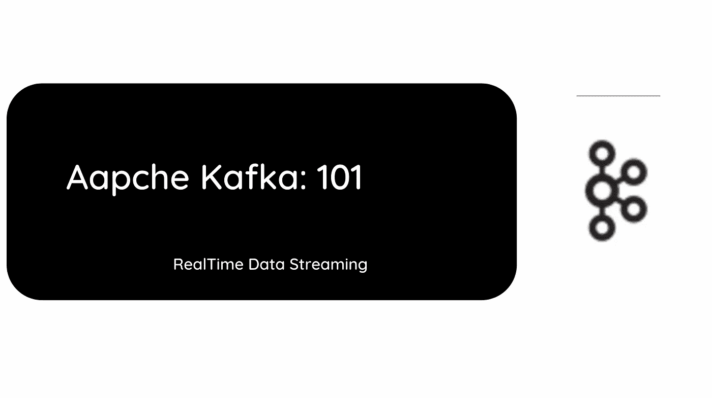
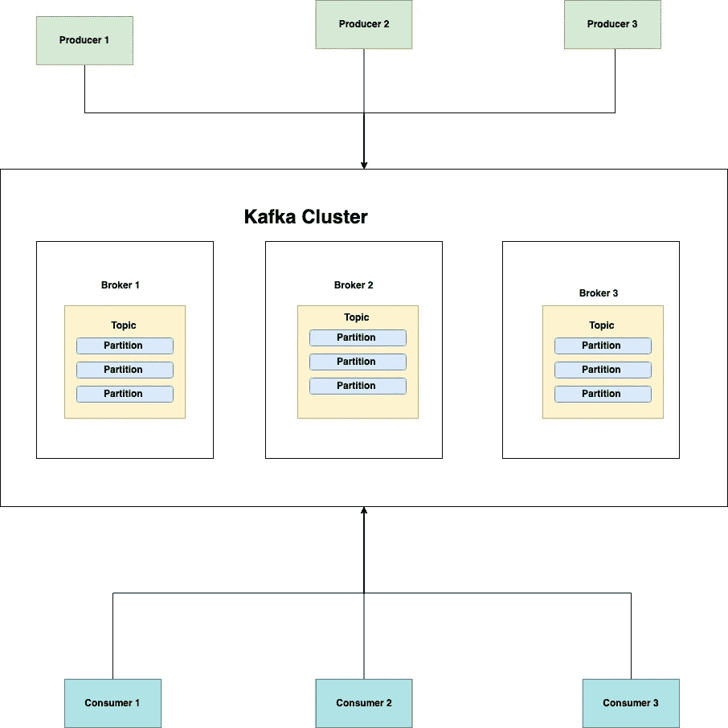
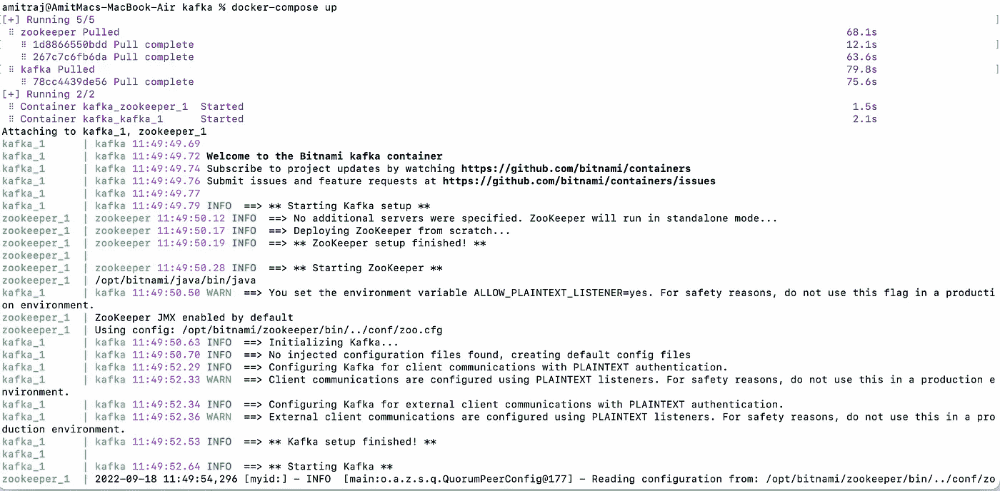

# 阿帕奇卡夫卡:101

> 原文：<https://blog.devgenius.io/apache-kafka-101-d85e6ee402e0?source=collection_archive---------4----------------------->

这篇博客是我们从零开始讨论 101 个概念的系列文章的一部分，读者的入门知识有限。这篇文章属于 ***中级*** 系列，因为它涉及到理解 **Apache Kafka** 的原语及其作为基于异步的分布式架构的主干的重要性。

[**SideCar 和 service mesh 101**](/sidecar-and-service-mesh-101-134d342bdad9) [**数据加密 101**](/data-encryption-101-f0a25db7d913)[**数据库复制 101**](/database-replication-101-d148514598a7)[**缓存策略 101**](/caching-strategy-101-3bc974d2a6cd)[**Kubernetes 部署 101**](http://kubernetes-deployments-101/)



# 什么是阿帕奇卡夫卡？

Kafka 是一个实时**数据流平台**，旨在克服传统单片架构同步处理的局限性。通常用作分布式消息传递层，它是低延迟和高流量基于微服务的应用程序的一站式解决方案。

通常部署为单个/多个节点的集群，可以跨越可用性区域和地区，它提供**弹性**消息传递保证选项。

# 基础建筑

## 生产者

生产者是生成消息/数据流的应用程序。他们使用**代理**或 **Zookeeper** URL 连接到 Kafka 集群。

## 顾客

消费者是使用单个消息/批处理流的应用程序。

## 主题

主题是在 Kafka 集群中存储消息的类别/逻辑分离。Kafka 将消息记录保留为日志。**偏移**决定了生产者/消费者消费日志的相对位置。

## 划分

主题被细分为**个分区**，是卡夫卡层级中最小的存储单元。每个分区存储单个**日志文件，这些日志文件在分布到多个代理的节点间复制**，以实现容错。

## 经纪人

Kafka 集群由多个满足高可用性需求的服务器组成，称为代理。它们还有助于跨分区复制消息数据。

## 动物园管理员

zookeeper 帮助管理 Kafka 集群的活动，例如在代理之间进行协调，为复制选择主分区等。



# 写作策略

向 Kafka 集群编写消息的生产者可以根据**弹性与延迟**需求选择不同的策略。

## **Ack=0**

生产者不等待来自 Kafka 经纪人的确认来将发布事件标记为成功。尽管这种方法是最快的，但它对于应用程序来说是最不可靠的。

## **Ack=1**

在这个策略中，生产者等待来自给定主题的领导者分区的确认。因此，它被认为是安全的生产使用。

## **Ack= 2**

在这种策略中，生产者只有在将主题写入其他复制副本之后，才会等待来自给定主题的领导者分区的确认。因此它被认为是最慢的技术。

# 阅读策略

发布在主题上的消息可以由消费者使用不同的读取语义来读取。

## **最多一次**

在这种默认的消息传递语义中，消费者将读取/使用消息，不会超过一次。

## **正好一次**

在这个方案中，给定的发布消息将只被消费者阅读一次。

## **至少一次**

这种容错方案保证消息至少被可用消费者池读取一次，但是，它可能导致同一条消息被读取多次。

# 本地设置

## Docker 合成文件

## 本地运行

```
docker-compose-up
```



# 摘要

这篇博客讨论了 Kafka 作为一个消息传递系统和 Kafka 集群的本地设置的基础知识。考虑到这个主题的广度，我们将详细讨论拱门的其他元素，如业务用例、Kafka 流 API 或 kSql，我们将在后面的高级博客中讨论。

*如需反馈，请留言至****Amit[dot]894[at]Gmail[dot]com****或联系*[*https://about.me/amit_raj*](https://about.me/amit_raj)*的任何链接。*