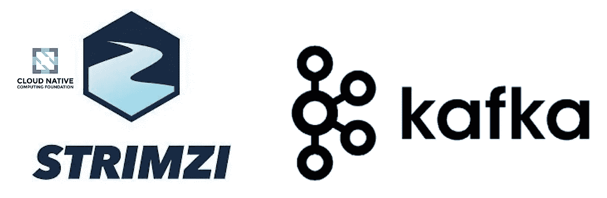

# 使用 Strimzi 的 Kubernetes 上的 Apache Kafka

> 原文：<https://blog.devgenius.io/apache-kafka-on-kubernetes-using-strimzi-27d47b6b13bc?source=collection_archive---------3----------------------->



[Apache Kafka](https://kafka.apache.org) 是一个开源分布式事件流平台，被数千家公司用于高性能数据管道、流分析、数据集成和关键任务应用。这是一个非常可扩展和高性能的系统。然而，集群的管理被认为在操作上是复杂的。

在撰写本文时，Strimzi 是一个 CNCF 沙盒项目。Strimzi 使用 Kubernetes 中的 Operator 模式，并帮助在各种部署配置中运行 Apache Kafka 集群。这有助于将整个 Kafka 集群作为 IaC(基础设施即代码)。

使用 Strimzi，您可以简化:

*   部署和运行 Kafka 集群
*   部署和运行 Kafka 组件
*   配置对 Kafka 的访问
*   保护对卡夫卡的访问
*   升级卡夫卡
*   管理经纪人
*   创建和管理主题
*   创建和管理用户

Strimzi 是在 Apache License 2 下开发的，作为一个支持该项目的 CNCF，它提供了一个保证，不会被局限于特定于供应商的生态系统。

在本文中，我们将记录在 Kubernetes 集群中部署两个 kafka 集群的步骤。我们将不使用舵图，而是使用将由`kubectl`执行的 YAML 文件。

> 如果您没有访问 Kubernetes 集群的权限，并且想知道如何在本地机器上安装它，那么请阅读文章—[Kubernetes on Local Machine](https://pratimsc.medium.com/kubernetes-on-local-machine-e061a30a2bbe)。

对于本文，我假设您使用的是 Linux 或 Mac 机器。

> ***相关文章列表*** :
> 
> [第 1 部分——使用 Strimzi 的 Kubernetes 上的 Apache Kafka](/apache-kafka-on-kubernetes-using-strimzi-27d47b6b13bc)
> 
> [第 2 部分—针对外部用户的 Kafka 上的简单 authN 和 authZ](/simple-authn-and-authz-on-kafka-for-users-a557066a097c)

# Strimzi 项目人工制品

Strimzi 的 Git 存储库位于—[https://github.com/strimzi/strimzi-kafka-operator/](https://github.com/strimzi/strimzi-kafka-operator/)

你可以复制一份代码，然后按照指令编译它。但是您不熟悉 Java，那么使用团队的发布包会更容易。

所有被释放的文物都位于—[https://github.com/strimzi/strimzi-kafka-operator/releases](https://github.com/strimzi/strimzi-kafka-operator/releases)。

# Strimzi 自定义资源定义

在 Kubernetes API 中，资源是存储某种 API 对象集合的端点。例如，内置的 Pod 资源包含一组 Pod 对象。

一个*定制资源*是一个扩展 Kubernetes API 的对象，或者允许一个人将他们自己的 API 引入到一个项目或集群中。

一个*定制资源定义* (CRD)定义了定制对象种类，并让 Kubernetes API 服务器处理资源的整个生命周期。

执行以下命令下载`0.32.0`版本的 [CRD(自定义资源定义)](https://kubernetes.io/docs/tasks/extend-kubernetes/custom-resources/custom-resource-definitions/):

```
curl -L https://github.com/strimzi/strimzi-kafka-operator/releases/download/0.32.0/strimzi-crds-0.32.0.yaml -o strimzi-crds-0.032.0.yaml
```

CRD 具有群集范围，因此安装它们需要群集管理权限。执行以下命令来执行下载的 CRD 文件:

```
kubectl apply -f strimzi-crds-0.32.0.yaml
```

这将向 Kubernetes 服务器注册 CRD 定义。执行以下命令以验证所有定义都已注册:

```
kubectl get customresourcedefinition.apiextensions.k8s.io -o name | grep -i strimzi
```

您应该看到类似下面的内容，确认创建了十个 CRD:

```
customresourcedefinition.apiextensions.k8s.io/kafkas.kafka.strimzi.io
customresourcedefinition.apiextensions.k8s.io/kafkaconnects.kafka.strimzi.io
customresourcedefinition.apiextensions.k8s.io/strimzipodsets.core.strimzi.io
customresourcedefinition.apiextensions.k8s.io/kafkatopics.kafka.strimzi.io
customresourcedefinition.apiextensions.k8s.io/kafkausers.kafka.strimzi.io
customresourcedefinition.apiextensions.k8s.io/kafkamirrormakers.kafka.strimzi.io
customresourcedefinition.apiextensions.k8s.io/kafkabridges.kafka.strimzi.io
customresourcedefinition.apiextensions.k8s.io/kafkaconnectors.kafka.strimzi.io
customresourcedefinition.apiextensions.k8s.io/kafkamirrormaker2s.kafka.strimzi.io
customresourcedefinition.apiextensions.k8s.io/kafkarebalances.kafka.strimzi.io
```

# Strimzi Kafka 聚类算子

在 Kubernetes 中，操作者是利用*定制资源*来管理应用程序及其组件的软件扩展。

[操作员模式](https://kubernetes.io/docs/concepts/extend-kubernetes/operator/)旨在捕捉管理一个或一组服务的操作员的关键目标。负责特定应用程序和服务的操作员对系统应该如何运行、如何部署以及出现问题时如何反应有着深刻的了解。

## 创建集群角色

只需创建少量集群角色，Strimzi 操作员就可以管理集群中的各种 Kafka 资源。让我们执行下面的命令来下载*集群角色*的资源定义。

```
# Cluster role - strimzi-cluster-operator-namespaced
curl -L https://raw.githubusercontent.com/strimzi/strimzi-kafka-operator/release-0.32.x/cluster-operator/src/main/resources/cluster-roles/020-ClusterRole-strimzi-cluster-operator-role.yaml -o 020-ClusterRole-strimzi-cluster-operator-role.yaml# Cluster role - strimzi-cluster-operator-global
curl -L https://raw.githubusercontent.com/strimzi/strimzi-kafka-operator/release-0.32.x/cluster-operator/src/main/resources/cluster-roles/021-ClusterRole-strimzi-cluster-operator-role.yaml -o 021-ClusterRole-strimzi-cluster-operator-role.yaml# Cluster role - strimzi-cluster-operator-leader-election
curl -L [https://raw.githubusercontent.com/strimzi/strimzi-kafka-operator/release-0.32.x/cluster-operator/src/main/resources/cluster-roles/](https://raw.githubusercontent.com/strimzi/strimzi-kafka-operator/release-0.32.x/cluster-operator/src/main/resources/cluster-roles/021-ClusterRole-strimzi-cluster-operator-role.yaml)022-ClusterRole-strimzi-cluster-operator-role.yaml -o 022-ClusterRole-strimzi-cluster-operator-role.yaml# Cluster role - strimzi-cluster-operator-watched
curl -L [https://raw.githubusercontent.com/strimzi/strimzi-kafka-operator/release-0.32.x/cluster-operator/src/main/resources/cluster-roles/](https://raw.githubusercontent.com/strimzi/strimzi-kafka-operator/release-0.32.x/cluster-operator/src/main/resources/cluster-roles/021-ClusterRole-strimzi-cluster-operator-role.yaml)023-ClusterRole-strimzi-cluster-operator-role.yaml -o 023-ClusterRole-strimzi-cluster-operator-role.yaml# Cluster role - strimzi-kafka-broker
curl -L https://raw.githubusercontent.com/strimzi/strimzi-kafka-operator/release-0.32.x/cluster-operator/src/main/resources/cluster-roles/030-ClusterRole-strimzi-kafka-broker.yaml -o 030-ClusterRole-strimzi-kafka-broker.yaml# Cluster role - strimzi-entity-operator
curl -L https://raw.githubusercontent.com/strimzi/strimzi-kafka-operator/release-0.32.x/cluster-operator/src/main/resources/cluster-roles/031-ClusterRole-strimzi-entity-operator.yaml -o 031-ClusterRole-strimzi-entity-operator.yaml# Cluster role - strimzi-kafka-client
curl -L https://raw.githubusercontent.com/strimzi/strimzi-kafka-operator/release-0.32.x/cluster-operator/src/main/resources/cluster-roles/033-ClusterRole-strimzi-kafka-client.yaml -o 033-ClusterRole-strimzi-kafka-client.yaml
```

现在，以集群管理员访问权限执行以下命令，在 Kubernetes 集群中创建 *ClusterRole* :

```
kubectl create -f 020-ClusterRole-strimzi-cluster-operator-role.yaml  -f 021-ClusterRole-strimzi-cluster-operator-role.yaml -f 022-ClusterRole-strimzi-cluster-operator-role.yaml -f 023-ClusterRole-strimzi-cluster-operator-role.yaml -f 030-ClusterRole-strimzi-kafka-broker.yaml  -f 031-ClusterRole-strimzi-entity-operator.yaml -f 033-ClusterRole-strimzi-kafka-client.yaml
```

执行以下命令，验证所需的群集角色是否存在:

```
kubectl get clusterroles.rbac.authorization.k8s.io  -o name | grep -i strimzi
```

它应该显示创建了五个集群角色:

```
clusterrole.rbac.authorization.k8s.io/strimzi-cluster-operator-namespaced
clusterrole.rbac.authorization.k8s.io/strimzi-cluster-operator-global
clusterrole.rbac.authorization.k8s.io/strimzi-kafka-broker
clusterrole.rbac.authorization.k8s.io/strimzi-entity-operator
clusterrole.rbac.authorization.k8s.io/strimzi-kafka-client
clusterrole.rbac.authorization.k8s.io/strimzi-cluster-operator-watched
clusterrole.rbac.authorization.k8s.io/strimzi-cluster-operator-leader-election
```

## 操作员名称空间

我们希望集群操作符驻留在与实际 Kafka 集群不同的位置。以便有明确的角色分离，例如平台开发者可以管理操作者，而应用开发者在他们自己的名称空间中管理 Kafka 资源。让我们执行下面的命令来创建一个命名空间来托管所有的操作员资源:

```
kubectl create namespace strimzi
```

## 运营商服务帐户

操作员的所有操作都将使用遵循最低特权原则的服务帐户来完成。执行以下命令创建服务帐户“strimzi-cluster-operator ”:

```
cat <<EOF | kubectl create -n strimzi -f - 
apiVersion: v1
kind: ServiceAccount
metadata:
  name: strimzi-cluster-operator
  labels:
    app: strimzi
EOF
```

## 群集角色绑定

让我们将服务帐户`strimzi-cluster-operator`绑定到所需的集群角色，执行范围限于名称空间`strimzi`，在这里将创建与操作者相关的所有资源。

> 如果您使用不同于`strimzi`的名称空间，用您的名称空间的名称替换`-n strimzi`和`namespace: strimzi`中的值。

绑定到集群角色`strimzi-cluster-operator-global`:

```
cat <<EOF | kubectl create -n strimzi -f - 
apiVersion: rbac.authorization.k8s.io/v1
kind: ClusterRoleBinding
metadata:
  name: strimzi-cluster-operator
  labels:
    app: strimzi
subjects:
  - kind: ServiceAccount
    name: strimzi-cluster-operator
    namespace: strimzi
roleRef:
  kind: ClusterRole
  name: strimzi-cluster-operator-global
  apiGroup: rbac.authorization.k8s.io
EOF
```

绑定到集群角色`strimzi-kafka-broker`:

```
cat <<EOF | kubectl create -n strimzi -f -
apiVersion: rbac.authorization.k8s.io/v1
kind: ClusterRoleBinding
metadata:
  name: strimzi-cluster-operator-kafka-broker-delegation
  labels:
    app: strimzi
*# The Kafka broker cluster role must be bound to the cluster operator service account so that it can delegate the cluster role to the Kafka brokers.
# This must be done to avoid escalating privileges which would be blocked by Kubernetes.* subjects:
  - kind: ServiceAccount
    name: strimzi-cluster-operator
    namespace: strimzi
roleRef:
  kind: ClusterRole
  name: strimzi-kafka-broker
  apiGroup: rbac.authorization.k8s.io
EOF
```

绑定到集群角色`strimzi-kafka-client`:

```
cat <<EOF | kubectl create -n strimzi -f -
apiVersion: rbac.authorization.k8s.io/v1
kind: ClusterRoleBinding
metadata:
  name: strimzi-cluster-operator-kafka-client-delegation
  labels:
    app: strimzi
*# The Kafka clients cluster role must be bound to the cluster operator service account so that it can delegate the
# cluster role to the Kafka clients using it for consuming from closest replica.
# This must be done to avoid escalating privileges which would be blocked by Kubernetes.* subjects:
  - kind: ServiceAccount
    name: strimzi-cluster-operator
    namespace: strimzi
roleRef:
  kind: ClusterRole
  name: strimzi-kafka-client
  apiGroup: rbac.authorization.k8s.io
EOF
```

## 操作员配置

所有操作员将使用可观察性、日志等配置。因此，让我们创建一个 *ConfigMap* 定义，其中包含操作者将使用的属性文件。根据您的需要进行调整:

```
cat <<EOF | kubectl create -n strimzi -f - 
kind: ConfigMap
apiVersion: v1
metadata:
  name: strimzi-cluster-operator
  labels:
    app: strimzi
data:
  log4j2.properties: |
    name=COConfig
    monitorInterval=30

    appender.console.type=Console
    appender.console.name=STDOUT
    appender.console.layout.type=PatternLayout
    appender.console.layout.pattern=%d{yyyy-MM-dd HH:mm:ss} %-5p %c{1}:%L - %m%n

    rootLogger.level=${env:STRIMZI_LOG_LEVEL:-INFO}
    rootLogger.appenderRefs=stdout
    rootLogger.appenderRef.console.ref=STDOUT
    rootLogger.additivity=false

    # Kafka AdminClient logging is a bit noisy at INFO level
    logger.kafka.name=org.apache.kafka
    logger.kafka.level=WARN
    logger.kafka.additivity=false

    # Zookeeper is very verbose even on INFO level -> We set it to WARN by default
    logger.zookeepertrustmanager.name=org.apache.zookeeper
    logger.zookeepertrustmanager.level=WARN
    logger.zookeepertrustmanager.additivity=false

    # Keeps separate level for Netty logging -> to not be changed by the root logger
    logger.netty.name=io.netty
    logger.netty.level=INFO
    logger.netty.additivity=falseEOF
```

如果您已经到达这里，没有任何问题，那么您已经为 Strimzi Operator 准备好了 Kubernetes 集群。我们现在可以开始创建 Kafka 集群和相关资源。

# Strimzi 管理的 Kafka 集群

## Kafka 集群名称空间

我们希望将所有与 Kafka 集群相关的资源托管到自己的名称空间，比如说`kafka-cluster-1`。在 Kubernetes 集群中，我们将有多个 Kafka 集群，管理它们的操作员都将在名称空间`strimzi`中创建，但是每个 Kafka 集群可以存在于单独的名称空间中。这有助于细粒度的访问控制。

让我们为 Kafka 集群创建一个名称空间:

```
kubectl create namespace kafka-cluster-1
```

## 向操作员提供许可

Strimzi 服务帐户`strimzi-cluster-operator`需要被授予明确的权限，以便它可以管理名称空间`kafka-cluster-1`中的 Kafka 资源

绑定到集群角色`strimzi-cluster-operator-namespaced`:

```
cat <<EOF | kubectl create -n kafka-cluster-1 -f - 
apiVersion: rbac.authorization.k8s.io/v1
kind: RoleBinding
metadata:
  name: strimzi-cluster-operator
  labels:
    app: strimzi
subjects:
  - kind: ServiceAccount
    name: strimzi-cluster-operator
    namespace: strimzi
roleRef:
  kind: ClusterRole
  name: strimzi-cluster-operator-namespaced
  apiGroup: rbac.authorization.k8s.io
EOF
```

绑定到集群角色`strimzi-entity-operator`:

```
cat <<EOF | kubectl create -n kafka-cluster-1 -f -
apiVersion: rbac.authorization.k8s.io/v1
kind: RoleBinding
metadata:
  name: strimzi-cluster-operator-entity-operator-delegation
  labels:
    app: strimzi
*# The Entity Operator cluster role must be bound to the cluster operator service account so that it can delegate the cluster role to the Entity Operator.
# This must be done to avoid escalating privileges which would be blocked by Kubernetes.* subjects:
  - kind: ServiceAccount
    name: strimzi-cluster-operator
    namespace: strimzi
roleRef:
  kind: ClusterRole
  name: strimzi-entity-operator
  apiGroup: rbac.authorization.k8s.io
EOF
```

绑定到群集角色“strim zi-cluster-operator-watched ”:

```
cat <<EOF | kubectl create -n kafka-cluster-1 -f -
apiVersion: rbac.authorization.k8s.io/v1
kind: RoleBinding
metadata:
  name: strimzi-cluster-operator-watched
  labels:
    app: strimzi
subjects:
  - kind: ServiceAccount
    name: strimzi-cluster-operator
    namespace: strimzi
roleRef:
  kind: ClusterRole
  name: strimzi-cluster-operator-watched
  apiGroup: rbac.authorization.k8s.io
EOF
```

绑定到名称空间`strimzi`中操作员窗格的集群角色`strimzi-cluster-operator-leader-election`:

```
cat <<EOF | kubectl create -n strimzi -f -
apiVersion: rbac.authorization.k8s.io/v1
kind: RoleBinding
metadata:
  name: strimzi-cluster-operator-leader-election
  labels:
    app: strimzi
subjects:
  - kind: ServiceAccount
    name: strimzi-cluster-operator
    namespace: strimzi
roleRef:
  kind: ClusterRole
  name: strimzi-cluster-operator-leader-election
  apiGroup: rbac.authorization.k8s.io
EOF
```

## 创建 Strimzi 运算符

现在，我们需要创建一个 Strimzi 操作符来管理名称空间`kafka-cluster-1`中的 Kafka 集群资源。该操作符将被托管在名称空间`strimzi`中。必须使用环境关键字`STRIMZI_NAMESPACE`向操作员传递它将管理的名称空间。

执行以下命令创建一个可以支持 Kafka 3 . 3 . 1 版的操作员:

```
cat <<EOF | kubectl create -n strimzi -f - 
apiVersion: apps/v1
kind: Deployment
metadata:
  name: strimzi-cluster-operator-kafka-cluster-1
  labels:
    app: strimzi
spec:
  replicas: 1
  selector:
    matchLabels:
      name: strimzi-cluster-operator
      strimzi.io/kind: cluster-operator
  template:
    metadata:
      labels:
        name: strimzi-cluster-operator
        strimzi.io/kind: cluster-operator
    spec:
      serviceAccountName: strimzi-cluster-operator
      volumes:
        - name: strimzi-tmp
          emptyDir:
            medium: Memory
            sizeLimit: 1Mi
        - name: co-config-volume
          configMap:
            name: strimzi-cluster-operator
      containers:
        - name: strimzi-cluster-operator
          image: quay.io/strimzi/operator:0.32.0
          ports:
            - containerPort: 8080
              name: http
          args:
            - /opt/strimzi/bin/cluster_operator_run.sh
          volumeMounts:
            - name: strimzi-tmp
              mountPath: /tmp
            - name: co-config-volume
              mountPath: /opt/strimzi/custom-config/
          env:
            - name: STRIMZI_NAMESPACE
# Explicitly mention the namespace whose Kafka clusters will be managed
              value: kafka-cluster-1
            - name: STRIMZI_FULL_RECONCILIATION_INTERVAL_MS
              value: "120000"
            - name: STRIMZI_OPERATION_TIMEOUT_MS
              value: "300000"
            - name: STRIMZI_DEFAULT_TLS_SIDECAR_ENTITY_OPERATOR_IMAGE
              value: quay.io/strimzi/kafka:0.32.0-kafka-3.3.1
            - name: STRIMZI_DEFAULT_KAFKA_EXPORTER_IMAGE
              value: quay.io/strimzi/kafka:0.32.0-kafka-3.3.1
            - name: STRIMZI_DEFAULT_CRUISE_CONTROL_IMAGE
              value: quay.io/strimzi/kafka:0.32.0-kafka-3.3.1
            - name: STRIMZI_KAFKA_IMAGES
              value: |
                3.2.0=quay.io/strimzi/kafka:0.32.0-kafka-3.2.0
                3.2.1=quay.io/strimzi/kafka:0.32.0-kafka-3.2.1
                3.2.3=quay.io/strimzi/kafka:0.32.0-kafka-3.2.3
                3.3.1=quay.io/strimzi/kafka:0.32.0-kafka-3.3.1
            - name: STRIMZI_KAFKA_CONNECT_IMAGES
              value: |
                3.2.0=quay.io/strimzi/kafka:0.32.0-kafka-3.2.0
                3.2.1=quay.io/strimzi/kafka:0.32.0-kafka-3.2.1
                3.2.3=quay.io/strimzi/kafka:0.32.0-kafka-3.2.3
                3.3.1=quay.io/strimzi/kafka:0.32.0-kafka-3.3.1
            - name: STRIMZI_KAFKA_MIRROR_MAKER_IMAGES
              value: |
                3.2.0=quay.io/strimzi/kafka:0.32.0-kafka-3.2.0
                3.2.1=quay.io/strimzi/kafka:0.32.0-kafka-3.2.1
                3.2.3=quay.io/strimzi/kafka:0.32.0-kafka-3.2.3
                3.3.1=quay.io/strimzi/kafka:0.32.0-kafka-3.3.1
            - name: STRIMZI_KAFKA_MIRROR_MAKER_2_IMAGES
              value: |
                3.2.0=quay.io/strimzi/kafka:0.32.0-kafka-3.2.0
                3.2.1=quay.io/strimzi/kafka:0.32.0-kafka-3.2.1
                3.2.3=quay.io/strimzi/kafka:0.32.0-kafka-3.2.3
                3.3.1=quay.io/strimzi/kafka:0.32.0-kafka-3.3.1
            - name: STRIMZI_DEFAULT_TOPIC_OPERATOR_IMAGE
              value: quay.io/strimzi/operator:0.32.0
            - name: STRIMZI_DEFAULT_USER_OPERATOR_IMAGE
              value: quay.io/strimzi/operator:0.32.0
            - name: STRIMZI_DEFAULT_KAFKA_INIT_IMAGE
              value: quay.io/strimzi/operator:0.32.0
            - name: STRIMZI_DEFAULT_KAFKA_BRIDGE_IMAGE
              value: quay.io/strimzi/kafka-bridge:0.22.3
            - name: STRIMZI_DEFAULT_JMXTRANS_IMAGE
              value: quay.io/strimzi/jmxtrans:0.32.0
            - name: STRIMZI_DEFAULT_KANIKO_EXECUTOR_IMAGE
              value: quay.io/strimzi/kaniko-executor:0.32.0
            - name: STRIMZI_DEFAULT_MAVEN_BUILDER
              value: quay.io/strimzi/maven-builder:0.32.0
            - name: STRIMZI_OPERATOR_NAMESPACE
              valueFrom:
                fieldRef:
                  fieldPath: metadata.namespace
# Enabling support for Zookeeper less Kafka
# Topic Operator is not supported in KRaft mode, yet.
            - name: STRIMZI_FEATURE_GATES
              value: "+UseKRaft,+UseStrimziPodSets"
            - name: STRIMZI_LEADER_ELECTION_ENABLED
              value: "true"
            - name: STRIMZI_LEADER_ELECTION_LEASE_NAME
              value: "strimzi-cluster-operator"
            - name: STRIMZI_LEADER_ELECTION_LEASE_NAMESPACE
              valueFrom:
                fieldRef:
                  fieldPath: metadata.namespace
            - name: STRIMZI_LEADER_ELECTION_IDENTITY
              valueFrom:
                fieldRef:
                  fieldPath: metadata.name
          livenessProbe:
            httpGet:
              path: /healthy
              port: http
            initialDelaySeconds: 10
            periodSeconds: 30
          readinessProbe:
            httpGet:
              path: /ready
              port: http
            initialDelaySeconds: 10
            periodSeconds: 30
          resources:
            limits:
              cpu: 2000m
              memory: 4096Mi
            requests:
              cpu: 200m
              memory: 384Mi
  strategy:
    type: Recreate
EOF
```

您可以通过执行以下命令来检查操作员面板的状态:

```
kubectl -n strimzi get pods -o wide --watch
```

一旦 operator pod 处于`running`状态，您就可以在目标名称空间`kafka-cluster-1`中创建 Kafka 集群和相关资源。

## 创建 Kafka 集群

我们将创建一个简单的 Kafka 集群，它具有短暂的存储，并通过 Zookeeper 和 Kafka Broker 的 3 个实例来满足弹性。

让我们在名称空间`kafka-cluster-1`中创建一个`kafka.kafka.strimzi.io`，即 Kafka v3.3.1 集群资源。

```
cat <<EOF | kubectl create -n kafka-cluster-1 -f -
apiVersion: kafka.strimzi.io/v1beta2
kind: Kafka
metadata:
  name: kafka
spec:
  kafka:
    version: 3.3.1
    replicas: 3
    listeners:
      - name: plain
        port: 9092
        type: internal
        tls: false
      - name: tls
        port: 9093
        type: internal
        tls: true
        authentication:
          type: tls
      - name: external
        port: 9094
        type: nodeport
        tls: false
    storage:
      type: ephemeral
    config:
      offsets.topic.replication.factor: 2
      transaction.state.log.replication.factor: 2
      transaction.state.log.min.isr: 2
      default.replication.factor: 2
      min.insync.replicas: 2
      inter.broker.protocol.version: "3.3"
# The entry for Zookeeper is required even in Kraft mode. However, they are ignore by the Operator.
  zookeeper:
    replicas: 1
    storage:
      type: ephemeral
# The entity operator will allow managing of the Topics and Users in the Kafka by the Operator.
  entityOperator:
# If Kraft mode is enabled for operator, remove entry for `topicOperator`. Ref: [https://strimzi.io/docs/operators/latest/configuring.html#type-EntityTopicOperatorSpec-reference](https://strimzi.io/docs/operators/latest/configuring.html#type-EntityTopicOperatorSpec-reference) 
    topicOperator: {}
    userOperator: {}
EOF
```

现在，通过执行下面的命令，观察名为`kafka`的 Kafka 集群的创建，并等待所有 pod 被标记为`running`:

```
kubectl -n kafka-cluster-1 get pods -o wide --watch
```

当 Zookeeper 和 Kafka broker 的 3 个 pod 处于`running`状态时，那么集群就可以使用了。

# 使用 Kafka 集群

## 创建主题

让我们在集群中创建一个主题`tweets`，命名为`kafka`，命名空间为`kafka-cluster-1`，其中有两个分区，数据复制两次。

```
cat <<EOF | kubectl create -n kafka-cluster-1 -f -
apiVersion: kafka.strimzi.io/v1beta2
kind: KafkaTopic
metadata:
  name: tweets
  labels:
    strimzi.io/cluster: kafka
spec:
  partitions: 2
  replicas: 1
  config:
    retention.ms: 900000
    segment.bytes: 1073741824
EOF
```

当就绪状态为`true`时，主题`tweets`即可使用，并且可以通过执行以下命令来验证:

```
kubectl -n kafka-cluster-1 get kafkatopic -o wide --watch
```

## 发布到主题

本文中创建的 Kafka 集群将端口`9094`公开为`NodePort`，以允许来自 Kubernetes 集群之外的系统的流量。这是通过我们的`Kafka`资源`kafka.kafka.strimzi.io/kafka`的定义中的以下代码块实现的。

```
.....
      - name: external
        port: 9094
        type: nodeport
        tls: false
.....
```

执行以下命令，找出您的 Kubernetes 的 IP 地址和端口号:

```
kubectl -n kafka-cluster-1 describe kafka kafka
```

您应该会看到与集群相关的所有详细信息，但是我们对以下部分的信息感兴趣:

```
.....
    Addresses:
      Host:             192.168.64.23
      Port:             31363
    Bootstrap Servers:  192.168.64.23:31363
    Type:               external
.....
```

> 注意，根据您的 Kubernetes 集群信息，信息看起来会有所不同。对于本文，我使用在我的机器上创建的 Kubernetes 集群。

Kafka 集群可以在`192.168.64.23:31363`上连接，这是引导服务器监听的地方。根据集群的创建方式，您的情况会有所不同。在本文的其余部分，我将使用上面的地址。

如果你还没有 Kafka 客户端，请从 https://kafka.apache.org/downloads 下载。

```
$ curl -L "[https://dlcdn.apache.org/kafka/3.3.1/kafka_2.13-3.3.1.tgz](https://dlcdn.apache.org/kafka/3.0.0/kafka_2.13-3.0.0.tgz)" -o kafka_2.13-3.3.1.tgz
$ tar -xvf kafka_2.13-3.3.1.tgz
$ cd kafka_2.13-3.3.1
```

现在，从机器上的终端连接到集群，执行以下命令:

```
./bin/kafka-console-producer.sh --broker-list 192.168.64.23:31363 --topic tweets
```

一旦接通，键入任何消息。根据主题`kafkatopic.kafka.strimzi.io/tweets`在创建过程中的配置，消息将可用 15 分钟:

```
.....
retention.ms: 900000
.....
```

## 从主题消费

现在，在另一个终端中执行下面的命令来启动一个消费者会话，并接收生产者输入的消息。

```
bin/kafka-console-consumer.sh --bootstrap-server 192.168.64.23:31363 --topic tweets --from-beginning
```

这将显示在主题`tweets`上发布的所有消息。

# 结论

您可以看到，使用 Strimzi 可以使用 Kubernetes 客户资源定义来定义和管理 Kafka 集群和资源，从而为整个集群启用 IaC。CI/CD 流程可以使用 Git 和 Helm 图表来管理集群和其中的资源。

本文涵盖了最简单的场景。Strimzi 允许用共享租用所需的更复杂的配置来定义 Kafka 集群。