# Apache Kafka 在本地系统上的设置

> 原文：<https://blog.devgenius.io/apache-kafka-set-up-on-a-local-system-890c48202e64?source=collection_archive---------4----------------------->

在 ubuntu 系统上安装 Kafka 的分步指南


伊登·布德罗在 [Unsplash](https://unsplash.com?utm_source=medium&utm_medium=referral) 上拍摄的照片

本文将帮助您在本地 ubuntu 系统上运行 Apache Kafka。

在这篇文章中不会有任何关于卡夫卡是如何工作的理解，我很确定有很多好文章可以帮助你理解卡夫卡的建筑和它的服务。

让我们开始吧:

**第一步:下载阿帕奇卡夫卡**

首先，当然你需要下载卡夫卡。使用此链接下载它。

[](https://www.apache.org/dyn/closer.cgi?path=/kafka/3.3.1/kafka_2.13-3.3.1.tgz) [## Apache 下载

### 我们建议您下载以下网站:https://dlcdn.apache.org/kafka/3.3.1/kafka_2.13-3.3.1.tgz 候补…

www.apache.org](https://www.apache.org/dyn/closer.cgi?path=/kafka/3.3.1/kafka_2.13-3.3.1.tgz) 

**步骤 2:设置 zookeeper 和 kafka-server**

打开您的终端并复制以下命令:

```
wget [https://dlcdn.apache.org/kafka/3.3.1/kafka_2.13-3.3.1.tgz](https://dlcdn.apache.org/kafka/3.3.1/kafka_2.13-3.3.1.tgz)
tar -xvzf kafka_2.13-3.3.1.tgz
cd kafka_2.13-3.3.1
```

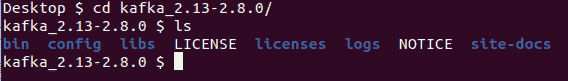

解压缩 Kafka 目录后

现在，如果您导航到 bin 目录，所有的`.sh`文件都是可用的。使用这些文件，您可以创建集群和主题，启动 zookeeper，启动 Kafka 服务器，等等。

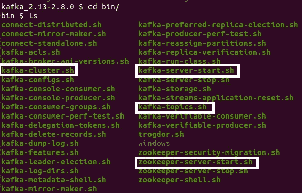

bin/目录

在初始化 Kafka 服务器之前，我们需要启动一个 zookeeper。通过运行下面的命令，我们可以启动动物园管理员。

```
cd kafka_2.13-3.3.1
bin/zookeeper-server-start.sh config/zookeeper.properties
```

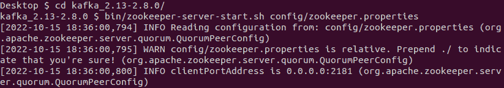

经营动物园管理员

打开一个新的终端，使用下面的命令运行 Kafka-server

```
cd kafka_2.13-3.3.1
bin/kafka-server-start.sh config/server.properties
```

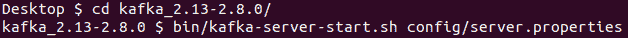

运行 Kafka 服务器

Zookeeper 运行在端口 2181 上，Kafka-server 运行在端口 9092 上。如果我们有任何特定的 IP 和端口，我们可以使用各自的`.sh`文件来更改它。

**第三步:在第四步之前我们需要 JAVA**

要设置集群管理器，我们需要在系统上安装 java。

```
java --version
```

如果上面的命令给你一个错误，使用下面的命令安装 java。

```
sudo apt-get update
sudo apt install default-jdk
sudo apt install default-jre
```

运行完所有三个命令后，检查`java --version`，它应该会显示最新版本。

**步骤 4:设置集群管理器**

基本上，我们有两个选项来启动集群管理器，一个是通过命令行使用那些`.sh`文件，另一个是使用 CMAK 提供的接口。

CMAK(Apache Kafka 的集群管理器)可从以下网址获得:

[](https://github.com/yahoo/CMAK) [## GitHub -雅虎/CMAK: CMAK 是一个管理 Apache Kafka 集群的工具

### CMAK(以前称为 Kafka Manager)是一个管理 Apache Kafka 集群的工具。有关…的详细信息，请参见下文

github.com](https://github.com/yahoo/CMAK) 

在这个演示中，我们将使用 CMAK 接口。

克隆 repo(在 Kafka 目录之外。)

```
git clone [https://github.com/yahoo/CMAK](https://github.com/yahoo/CMAK)
cd CMAK
```

一旦你克隆了 CMAK 回购协议，

```
cd CMAK
./sbt clean dist
```

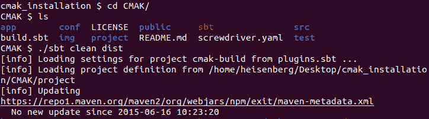

`./sbt clean dist`它会安装一些必要的目录和文件。

导航至`cd target/universal/`

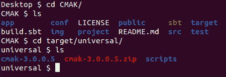

导航到目标\通用

拉开`cmak-3.0.0.5.zip`

```
unzip cmak-3.0.0.5.zip
cd cmak-3.0.0.5
cd conf
```

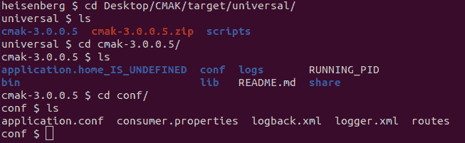

会议目录列表

我们将对`application.conf`进行更改

```
nano application.conf
```

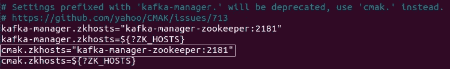

将高亮显示的一行更改为`cmak.zkhosts="localhost:2181"`保存文件`ctrl+x`T4。

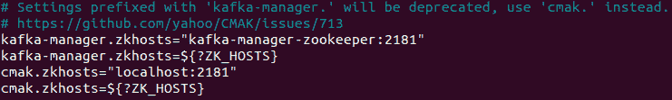

导航到 CMAK 目录并运行集群管理器。

```
cd CMAK-3.0.0.5
bin/cmak -Dconfig.file=conf/application.conf -Dhttp.port=8080
```

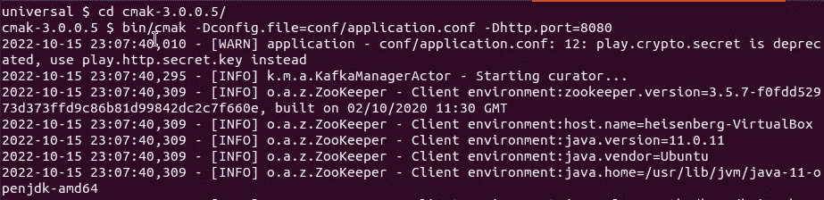

集群管理器正在运行

进入你的浏览器，输入`localhost:8080`

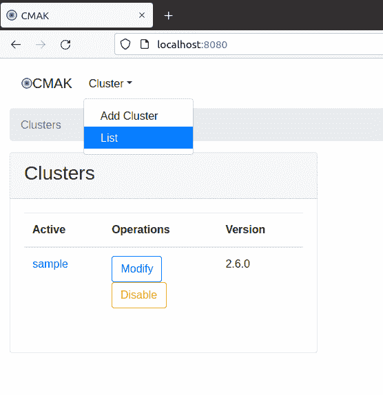

我已经创建了一个“示例”集群，您可以使用“添加集群”选项创建集群，然后您可以选择创建主题和其他服务。集群管理器有不同的度量选项，您可以自己尝试使用其中的一些。

嗯，这就是如何在本地系统上设置 Apache Kafka。确保所有三个终端 zookeeper、Kafka-server 和 Cluster manager 都在运行。

参考资料:

[1][https://kafka.apache.org/quickstart#quickstart_download](https://kafka.apache.org/quickstart#quickstart_download)

[https://github.com/yahoo/CMAK](https://github.com/yahoo/CMAK)