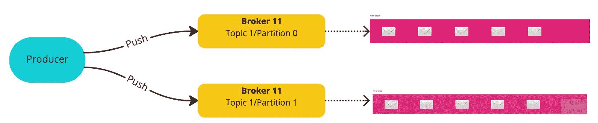
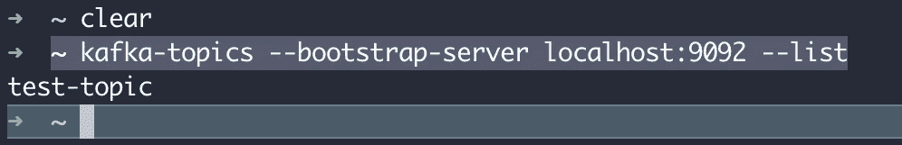
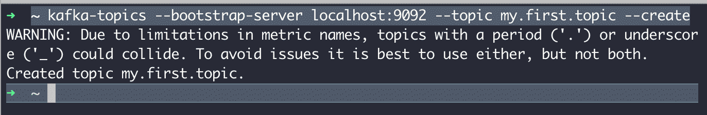
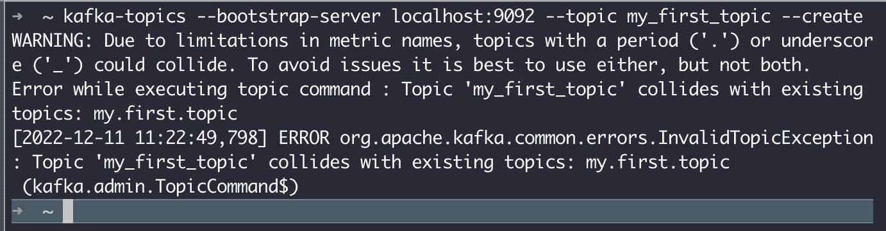
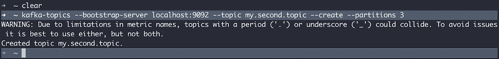
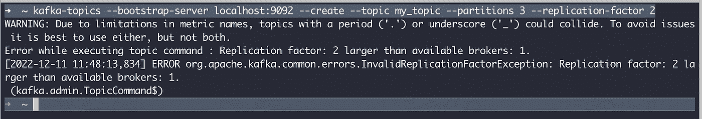
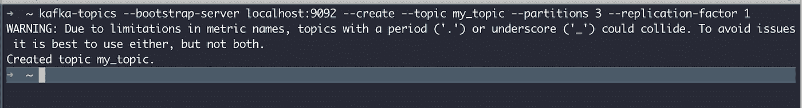
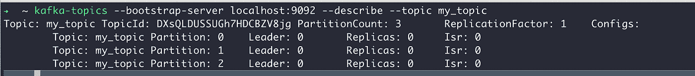
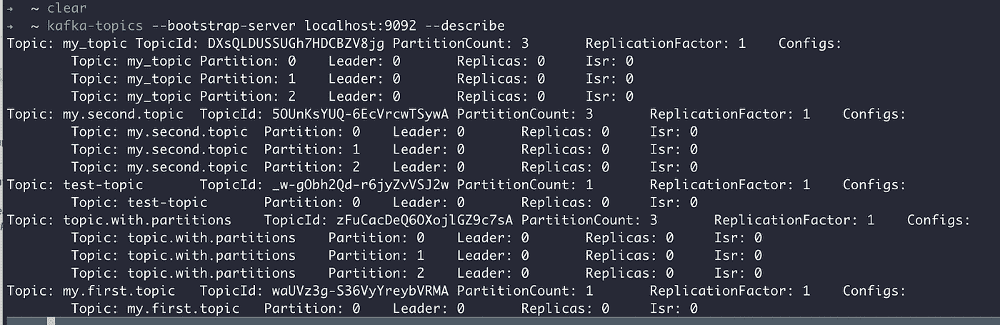
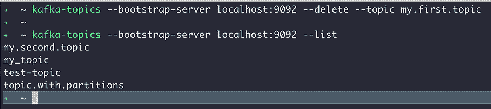

# 阿帕奇卡夫卡—主题、分区和偏移

> 原文：<https://blog.devgenius.io/apache-kafka-topics-partitions-and-offsets-eb6a18ef4a2e?source=collection_archive---------4----------------------->


afka 主题用于在 Kafka 集群中存储和组织事件。主题是集群中的数据流，一个 Kafka 集群可以有许多主题。每个主题都由其名称标识，名称在整个 Kafka 集群中必须是唯一的。例如，一个主题可以被命名为“付款”、“订单”或“日志”。

生产者向 Kafka 主题发送消息，消费者从主题中读取数据。Kafka 中的主题是多生产者和多订户的，这意味着一个主题可以有一个或多个向其写入数据的生产者和一个或多个从中读取数据的消费者。

主题类似于数据库中的表，但是没有任何约束。生产者可以以任何格式向主题发送数据，Kafka 主题支持任何类型的消息格式，如 JSON、文本文件、二进制文件或任何其他格式。主题中的消息序列称为数据流，主题中的消息可以根据需要经常读取。默认情况下，Kafka 会在有限的时间内保留所有已发布的消息，无论它们是否已被消费。默认保留时间为 168 小时(即一周)，但这可以在配置文件中进行配置(使用***log . retention . hours***设置)。

在 Kafka 集群中，主题可以分成多个分区。一个主题可以有一个或多个分区，这些分区位于不同的 Kafka 代理上。数据的放置对于可伸缩性很重要，因为它允许客户端同时从许多代理读取和写入数据。主题中的分区数量是在创建主题时定义的，它们被编号为 0、1、2 等等。



当生产者向 Kafka 主题发布消息时，它被附加到主题的一个分区中。如果消息包含消息键(如用户 ID 或订单 ID)，它将总是被写入同一个分区。消息键可以是字符串、数字、对象或其他任何东西，但它是可选的；如果没有提供键，键将被设置为 null，消息将以循环方式发送到不同的分区。Kafka 使用一种密钥散列机制将带有密钥的消息分发到适当的分区。

一旦消息被写到 Kafka 主题，它就不能被改变。这叫做不可变性，它意味着*卡夫卡的主题是不可变的*。

## 抵消

在 Kafka 中，一个分区中的每条消息都被分配了一个唯一的顺序整数，称为“偏移量”。偏移量用于标识分区内的每条消息。默认情况下，每个分区的偏移量从 0 开始，每收到一条新消息就增加 1。但是，偏移量是特定于分区的，因此分区 0 中偏移量为 1 的消息可能与分区 1 中偏移量为 1 的消息不同。

Kafka 保证了一个分区内消息的顺序，但是不能保证同一主题的不同分区内的消息之间的顺序。此外，Kafka 消息会随着时间的推移而被删除，因此一旦消息被删除，其偏移量将不再使用。卡夫卡作品中的偏移以永无止境的顺序不断增加。

Kafka 设计为通过数据复制实现容错和高弹性。在 Kafka 中，主题可以跨多个代理复制，这意味着数据的重复副本被写入多个服务器。这可以防止出现故障时数据丢失，并确保数据始终可供使用。Kafka 中的复制是在分区级别执行的，复制因子(即数据的副本数量)可以在创建主题时设置。生产环境中通常使用的复制系数为 3，这意味着总会有三份数据拷贝。复制因子为 1 意味着没有复制。

## Kafka 主题 CLI

**列出 Kafka 主题** —要列出 Kaka 服务器中的所有 Kafka 主题，我们将使用*–List*命令。

对于 mac 和 Linux，使用 *kafak-topic.sh* 命令，对于 windows，可以使用 *kafka-topic.ba* t 命令。***—bootstrap-server***代表我们试图连接的 Kafka broker。我的 Kafka 代理是在本地启动的，因此，我使用 localhost:9092。

```
➜  ~ kafka-topics --bootstrap-server localhost:9092 --list
```



它返回 *test_topic* ,因为我在 Kafka 服务器上只创建了一个主题

**创建 Kafka 主题** —您可以使用*–Create*命令在 Kafka 服务器上创建主题。参见下面的例子

```
➜  ~ ~ kafka-topics --bootstrap-server localhost:9092 --topic my.first.topic --create
```



我们的第一个主题创建时只有一个分区，如果我们在创建时没有指定任何配置，它将使用默认设置。

如你所见，我们得到了一个警告，因为我用了一个点。它只是告诉我们不要使用(。)和(_)具有相同的主题名称。例如，如果我试图创建一个名为 *my_first_topic* 的主题，它不允许我创建它，因为它会与 *my.first.topic* 名冲突。



在上图中我们可以看到，当我们试图创建一个名为 *my_first_topic* 的主题时，Kafka 抛出了一个异常。它明确表示 *my_first_topic* 与现有主题 *my.first.topic* 冲突。对于同一个主题名称，我们不能同时使用下划线和点号。

*主题名必须仅由 ASCII 字母数字字符和字符“.”组成“_”和“-”。*

**创建带有分区的主题**

我们将使用 *— partitions* 命令创建一个带有分区的主题。在本例中，我们将创建一个包含 3 个分区的主题

```
➜  ~ kafka-topics --bootstrap-server localhost:9092 --topic my.second.topic --create --partitions 3
```



*我的第二个主题*已经创建了 3 个分区。

注意—默认情况下，这两个主题的复制因子都是 1，因为我们没有为复制因子指定任何配置。

让我们创建一个带有复制因子的主题。要创建带有复制因子的主题，我们需要在创建主题命令中指定 *—复制因子*选项。

```
➜  ~ kafka-topics --bootstrap-server localhost:9092 --create --topic my_topic --partitions 3 --replication-factor 2
```



在上面的例子中，我试图创建一个复制因子为 2 的主题。但是正如你所看到的，我得到一个错误，说 ***复制因子:比可用的代理大 2:1***。

我得到这个错误是因为我的 Kafka 集群中只有一个代理，它小于给定的复制因子。因此，如果您试图创建一个复制因子大于 Kafka 集群中的代理数量的主题，这是行不通的。您可以创建一个复制因子小于或等于 Kafka 集群中代理数量的主题。但是，在将来，如果您有一个包含更多代理的 Kafka 集群，那么您可以为您的主题定义一个更高的复制因子。

因此，让我们创建一个只有一个复制因子的主题



现在，我的主题已经创建，没有任何错误:)

**描述一个话题**

为了描述 Kafka 主题并获得分区细节，我们需要提供*–describe*选项。

```
➜  ~ kafka-topics --bootstrap-server localhost:9092 --describe --topics my_topic
```



从上图我们可以看到，my_topic 有 3 个分区，复制因子为 1。分区 0 位于代理领导者 0 上，分区 1 也位于代理领导者 0 上。

如果在上面的命令中没有指定*–topic*，它将描述该集群中的所有主题。参见下面的例子

```
➜  ~ kafka-topics --bootstrap-server localhost:9092 --describe
```



你可以在上面的图片中看到，它描述了服务器中的所有主题

**修改一个题目**

要增加 Kafka 主题中的分区数量，请使用*–alter*命令。让我们将 *my.first.topic* 中的分区数量增加到 3。

```
➜  ~ kafka-topics --bootstrap-server localhost:9092 --alter --topic my.first.topic --partitions 3
```


— alter 命令没有任何输出。您可以使用 *—描述*命令来验证结果。

> 通过使用此命令，您只能增加分区的数量，而不能删除它们。这是一个危险的命令，如果您的应用程序使用基于键的排序，则不建议使用，因为增加分区数量会影响键散列技术。

**删除一个话题**

要删除一个主题，我们将使用*–delete*命令和我们想要删除的主题名称。下面是一个例子

```
➜  ~ kafka-topics --bootstrap-server localhost:9092 --delete --topic my.first.topic
```



*–删除*命令没有任何输出。要验证主题是否被删除，您可以使用*–列表*或*–描述*命令。从*–list*命令的输出可以看出 *my.first.topic* 已经被成功删除。

要删除多个主题，可以将逗号分隔的主题列表传递给–delete 命令。参见下面的例子

```
➜  ~ kafka-topics --bootstrap-server localhost:9092 --delete --topic my.first.topic, my.second.topic
```

它将删除*我的第一个主题*和*我的第二个主题*主题。

> 话题的删除取决于代理设置(***delete . topic . enable***)，如果未启用，则话题不会被删除。它将被标记为删除，但不会被删除。

Apache Kafka 安装可以参考我之前关于 Kafka [的文章 https://medium . com/devo PS-dev/Apache-Kafka-getting-started-with-Kafka-61948 e 50 D1 ab](https://medium.com/devops-dev/apache-kafka-getting-started-with-kafka-61948e50d1ab)

## 参考资料:

[https://kafka.apache.org/quickstart](https://kafka.apache.org/quickstart)