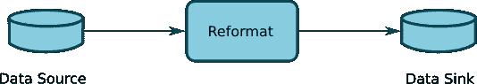
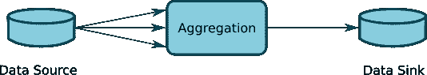
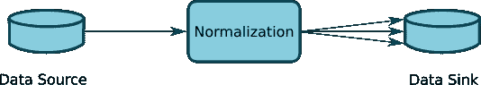
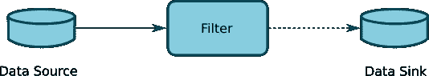
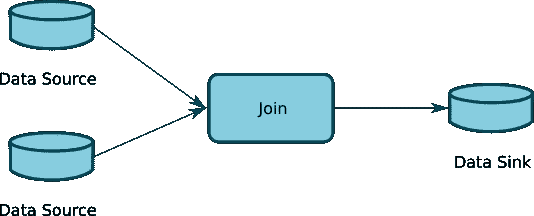
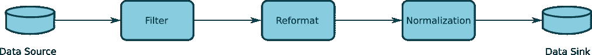
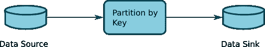
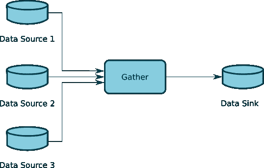
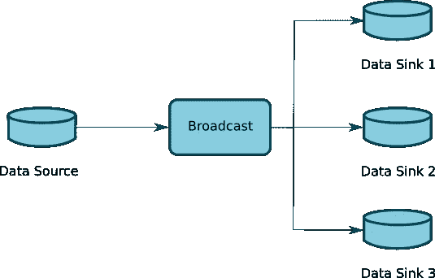

# 阿帕奇卡夫卡教程-回到基础

> 原文：<https://blog.devgenius.io/apache-kafka-tutorial-back-to-fundamentals-f3ea8dda4823?source=collection_archive---------4----------------------->

在任何地方，我们都会看到关于如何读/写主题、流数据处理等的 Apache Kafka 教程。这些教程中的许多似乎是基于面向对象的范例(OOP)。在进一步探讨之前，我们应该问——卡夫卡是为了什么？—我们可以直截了当地说，Kafka 用于实时数据流解决方案。现在的问题是——如果我们使用 OOP 来建模一个实时数据流解决方案，这是否是最优的？—我不这么认为。

# 首先，什么是流？

在数据处理中，流是数据流。视频/音频播放、股票市场数据是典型的流示例。但是视频本身并不是一个流，它是我们处理视频文件中的数据的方式，它变成了一个流。只有当我们读取文件，并应用一些数据处理技术使数据从源流向接收器时，我们才能说我们是流数据。

每个流都需要一个数据源、一个通道和一个数据接收器。信道是连接数据源和数据宿的纽带，是传输数据的媒介。如果你稍微思考一下这个问题，所有有数据源和数据接收器的东西都符合这个定义:文件、数据库、队列、主题。HTTP 也可以当作数据源；每个 HTTP 资源(API、网页等。)有一个由它的 URL 定义的位置，它有数据内容，我们可以做读操作(GET)，写操作(POST，PUT，DELETE)，就像它是一个文件或数据库一样。唯一的一点是，HTTP 资源比一个简单的文件更聪明，因为我们用它来编写内部的业务规则。

# 数据流怎么做？

数据流是一种在流中处理数据的技术，要正确处理它，您需要了解一些基本的数据操作。以下所有概念都符合一个称为[数据流编程](https://medium.com/dataseries/microservices-a-new-paradigm-a-new-mindset-d6584e1704b4) (DFP)的范例:

*   **重新格式化**:是一对一的操作。该操作将输入数据转换成不同格式的输出数据。对于它读取的每条记录，它将在输出中生成一条记录。Kafka streams 中的等价操作是 [KStream.map](https://kafka.apache.org/20/javadoc/org/apache/kafka/streams/kstream/KStream.html#map-org.apache.kafka.streams.kstream.KeyValueMapper-) 方法。

*   **聚合**:多对一操作。它按键对几个输入记录进行分组，然后汇总分组后的记录以生成单个输出。通过执行该操作，我们将在输出中拥有与输入中的唯一键一样多的记录。group by key 操作是用 [KStream.groupBy](https://kafka.apache.org/20/javadoc/org/apache/kafka/streams/kstream/KStream.html#groupBy-org.apache.kafka.streams.kstream.KeyValueMapper-) 方法执行的，分组记录后我们可以用 [KGroupedStream.aggregate](https://kafka.apache.org/20/javadoc/org/apache/kafka/streams/kstream/KGroupedStream.html#aggregate-org.apache.kafka.streams.kstream.Initializer-org.apache.kafka.streams.kstream.Aggregator-) 汇总数据。

*   **规范化**:一对多操作。对于每个记录，它可能产生零个或多个记录。在卡夫卡中，我们用 KStream.flatMap 做这件事。

*   **过滤**:该操作根据指定数据选择标准的布尔表达式过滤记录。卡夫卡中的等价函数是 [KStream.filter](https://kafka.apache.org/20/javadoc/org/apache/kafka/streams/kstream/KStream.html#filter-org.apache.kafka.streams.kstream.Predicate-) 。

*   **Join** :从两个输入流中读取数据，并将记录与匹配的字段组合起来。这种操作有很多种，为了优化数据流，理解每一种操作都非常重要。为了完全理解连接操作，我们需要引入几个概念。
*   首先，我们需要知道有两种类型的过程:1)批处理作业 2)和连续流。当我们在批处理作业中执行连接时，我们只是读取输入数据并连接所有记录，直到读取最后一条记录。在这种情况下，执行连接的工作单元是整个数据集。批量连接的一个例子是数据库连接，连接从第一条记录开始，并在读取最后一条记录时产生结果。连续流是不同的，在这种情况下，我们可能会收到几个小时的记录，所以，我们什么时候可以说一个连接完成了？—如果我们正在处理股票市场数据，我们将在上午 8:00 开始处理，直到下午 3:00 收盘。在一个连续加入的工作单元是不同的，工作单元是由一个时间窗口定义的，或者是由记录数定义的。
*   为了理解连接，我们需要知道的另一个概念是查找。它是一种数据操作，基本上是使用索引数据集中的键值来搜索记录。对于流中的每一条记录，我们将在第二个数据集中查找一条匹配的记录，称为查找数据集。但是查找数据集需要具有一些特征:1)优选地，查找数据集应该能够在存储器中被分配，不是所有的查找都在存储器中运行，但是这可以用作知道查找数据集应该具有多大的参考。2)其次，外观应该有一个主键。3)最后，查找数据集必须总是具有近似的已知大小。还有其他类型的查找能够处理数百万条记录，就像在内存中一样，这种查找称为索引压缩平面文件(ICFF)，这种查找没有大小限制。通常，在我们执行连接之前，需要准备好查找数据集(即，在我们执行连接之前，查找数据集需要包含所有必需的记录)。
*   接下来，您需要知道内存中的连接。内存连接在内部使用查找操作来匹配两个数据集。正如您可以推断的那样，内存连接的工作单元是由查找数据集的大小定义的，因为每当我们需要连接两个记录时，作业总是会在查找数据集内寻找匹配。在这种情况下，我们不需要时间窗，因为工作的单位总是已知的。在 Kafka 中，内存中的连接是这样定义的: [KStream.join](https://kafka.apache.org/20/javadoc/org/apache/kafka/streams/kstream/KStream.html#join-org.apache.kafka.streams.kstream.KTable-org.apache.kafka.streams.kstream.ValueJoiner-) 。
*   还有另一种连接，您不知道两个数据集何时结束。在这种情况下，需要以不同的方式定义工作单元，特别是在 Kafka 中，这种情况下的工作单元是由以毫秒为单位的时间窗口定义的，否则 join 可能不会产生任何结果。卡夫卡的功能是 [KStream.join](https://kafka.apache.org/20/javadoc/org/apache/kafka/streams/kstream/KStream.html#join-org.apache.kafka.streams.kstream.KStream-org.apache.kafka.streams.kstream.ValueJoiner-org.apache.kafka.streams.kstream.JoinWindows-) 。
*   最后，你需要知道连接的变化，比如左连接、右连接、内连接、全外连接等等。

这些操作有很多有用的变化，但是理解基本操作将会引导你理解任何变化。

这些是进行流式处理时最常用的数据操作。您可以在一个管道中组合所有这些操作，以便转换数据。

流具有比面向对象编程等传统解决方案更快的特性(一个例外是 [Java Stream](https://docs.oracle.com/javase/8/docs/api/java/util/stream/package-summary.html) ，这一点也不快，但一般来说许多流框架都是好的)。

# 数据流控制

最后，我们需要知道如何控制数据流。为此，我们需要了解一些数据分区技术。

*   **表达式分区**:是在管道中创建分支的一种方式。该操作根据布尔表达式将记录分布到其输出中。换句话说，它根据布尔表达式定义的标准将传入的记录流分成两个或多个传出的记录流。使用 partition by expression 意味着您打算以不同的方式处理每个流
*   按表达式划分的输出是有序的。输出的 order 属性表示分区表达式是按顺序计算的，第一个要完成的表达式表示记录必须遵循的流程。
*   卡夫卡中用表达式做划分的等价函数是 [KStream.branch](https://kafka.apache.org/20/javadoc/org/apache/kafka/streams/kstream/KStream.html#branch-org.apache.kafka.streams.kstream.Predicate...-) 。

*   **Partition by Key** :根据键值将记录分发到其输出流。partition by key 操作解释键值的方式取决于键的内部表示。即整数类型字段中的数字 9 将被解释为不同于字符串或小数类型字段中的数字 9。正如您在图中看到的，该数据流控制没有创建要单独处理的分支，所有分支都将被抽象为一个分支。
*   在 Kafka 中，该操作由函数 [KStream.groupByKey](https://kafka.apache.org/20/javadoc/org/apache/kafka/streams/kstream/KStream.html#groupByKey--) 执行。一般来说，在按键划分之后，我们会想要做一些聚合，特别是在 Kafka 中，所有的聚合函数都在 [KGroupedStream](https://kafka.apache.org/20/javadoc/org/apache/kafka/streams/kstream/KGroupedStream.html) 中定义。

*   **Gather** :以任意顺序将来自多个流分区的记录集合在一起。该操作不遵循任何标准，如果输入记录被排序，则不能保证在收集后输出中保持顺序。卡夫卡中的对等函数是 [KStream.merge](https://kafka.apache.org/20/javadoc/org/apache/kafka/streams/kstream/KStream.html#merge-org.apache.kafka.streams.kstream.KStream-) 。
*   **合并**:合并不同流的记录。当我们进行组合时，它意味着一些逻辑，使多个流成为一个单元。通常，合并操作是使用键值作为标准来执行组合的。卡夫卡中没有对等的功能。

*   **广播**:将输入流的副本写入每个输出。这不同于任何分区操作。分区操作分割输入流，而广播增加了并行性，因为它在每个分支中复制相同的流。必须小心使用此操作，因为它会增加工作量并可能降低性能。
*   在 Kafka 中，广播并没有特别的功能，但是它很容易实现。由于没有函数，而且很容易实现，开发人员可能会在没有注意到的情况下实现广播，结果他们可能会在运行时遇到性能下降。
*   实现广播的一种方法是在你的课堂上安排多个听众阅读同一主题。此配置将使广播向每个听众发送相同记录的副本。
*   进行广播的另一种方法是在代码的不同位置引用同一个 KStream 对象，每个引用都将成为广播操作的一个分支。

# 平行

理解并行性的基础是数据分区。如果不首先理解数据分区和数据流控制，就很难理解任何并行性变化。我将为并行性写一篇不同的文章，因为这个话题很广泛。

与并行相对的是串行处理。尝试串行实现好的数据管道，然后跳到并行。

# 微服务

数据流编程[中提出的很多概念都是与微服务](/micro-apis-or-microservices-cc707870d126)正交的，这也是 Kafka 非常适合微服务的原因。

# 在近处

如果你想在 Kafka 上取得成功，你必须了解这些非常基本的数据操作，这是数据流编程(DFP)的基础。