# Apache NiFi —跨系统大规模传输数据

> 原文：<https://blog.devgenius.io/apache-nifi-transport-data-across-system-at-scale-1d76d45c5b29?source=collection_archive---------0----------------------->

自动化系统间的数据流动

Apache NiFi 是一个开源的拖放式数据流工具，它快速、可靠、可伸缩，并且可以并发处理大量数据。一个 100 节点的 NiFi 集群每天可以处理数万亿个事件和数 Pb 的数据，并具有完整的数据来源和血统。

## 优势

*   开放源码
*   漂亮的用户界面让我们可以快速构建原型
*   导入基于 XML 的模板
*   无数据丢失(保证交付)
*   数据缓冲和背压支持
*   支持基于优先级的作业队列
*   低延迟和高吞吐量
*   支持推拉模式
*   带注册表的数据流版本控制
*   可插拔和可扩展的设计

# Nifi 术语

## 流文件

基本都是数据。它有两个要素

*   **属性** —这些是来自流文件的元数据。这些首先存储在 WAL 中，然后持久存储在 FlowFile 存储库中。
*   **内容—** 指向内容存储库的指针

*注意:流文件被持久化到磁盘*。

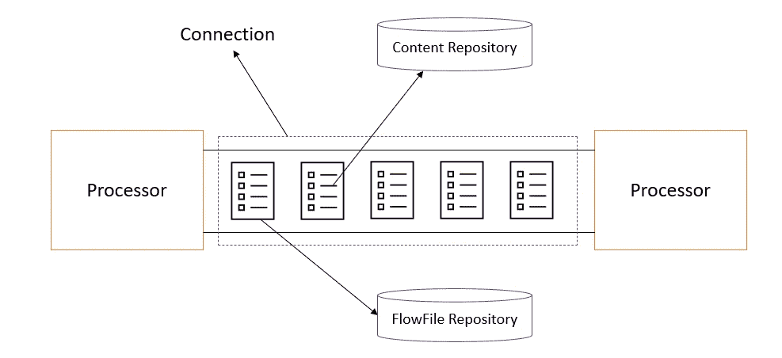

## 处理器

处理器为消费、转换、监听、发布、上传和查询数据提供了一个简单的途径。处理器将转换应用于流文件，并生成新的流文件。处理器可以更新、添加或删除属性或/和改变流文件的内容。它们相互传递对 FlowFile 的引用。它们并行运行。NiFi 附带了 400 多个处理器。它们大致分为以下几类:

> 数据摄取
> 路由&中介
> 属性提取
> 数据转换
> 拆分&聚合
> 发送数据
> 系统交互
> 数据库访问
> HTTP
> AWS

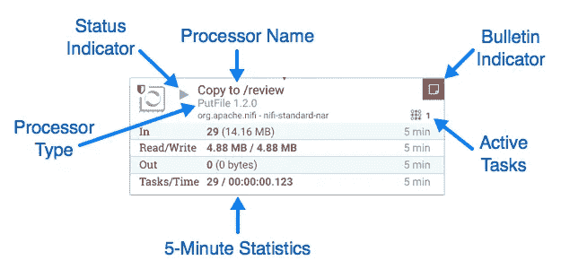

## 处理机配置


*   设置—惩罚、产量和公告级别
*   时间安排—时间表、持续时间、并发性
*   属性—与处理器行为相关的设置
*   关系——成功/失败
*   注释-处理器实例的详细信息

## 数据接收处理器

GenerateFlowFiles | get files | GetSFTP | get http | get HDFS | listen http | listen upd

## 数据转换处理器

convert record | update record | ConvertJSONToSQL | compress content

## 数据出口

PutEmail | PutFile | PutSQL | puth DFS | PutKafka

## 路由和中介

控制速率|检测重复

## 查询记录

它是最受欢迎的处理器之一。它允许我们将每个流文件视为一个数据库表。它使用一个唱片读取器和一个唱片写入器。读取器和写入器可以是不同的格式。NiFi 提供了许多记录阅读器，如 CSVReader、JsonTreeReader、AvroReader、SyslogReader 和 GrokReader。同样，它有许多类似 SyslogWriter、JsonRecordSetWriter 和 FreeFormTextRecordSetWriter 的编写器。

作为一个优势，NiFi 允许我们添加定制的处理器。

> 使用 Maven 原型构建 NiFi 定制处理器→生成`nar` →将`nar`放入 lib 并重启 NiFi。

## 关系

命名关系是为了表示处理文件的结果。处理器完成文件任务后，它会将流文件传输到其中一个关系。每个处理器可以有零个或多个关系。

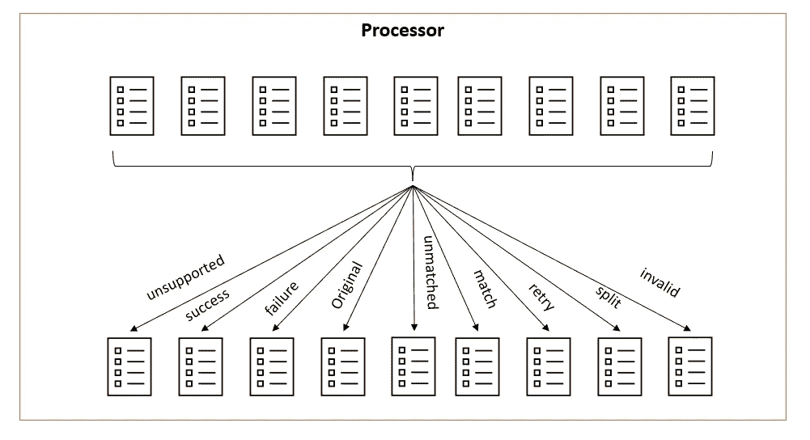

## 连接器

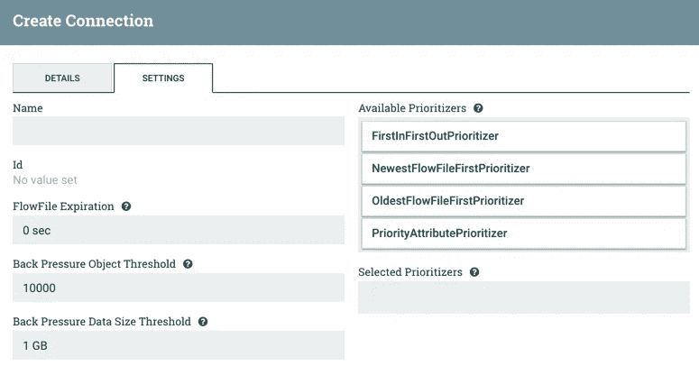

它是两个处理器之间的流文件队列。这些连接器定义了流文件的优先级。以下 4 个优先级排序器是现成可用的:

> first infirst out
> NewestFlowFileFirst
> OldestFlowFileFirst
> priority attribute

**到期—** It 是一个概念，通过这个概念，在定义的时间内没有被处理的流文件将被自动从队列中删除。默认值为 0 秒(没有过期)。

**背压** —它控制在源不再计划运行之前，队列中可以存在多少数据。默认值为 10k/1GB。

## 控制器服务

这些用于各种以系统为中心的数据流业务需求。像 awscrdentialsprovidercontroller 服务用于与 AWS 连接，HiveConnectionPool 用于连接到配置单元数据库。

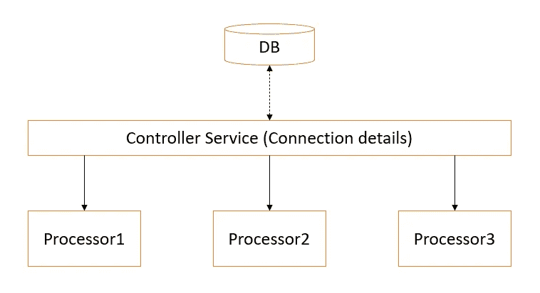

## **漏斗**

它可以将来自几个连接的数据合并成一个连接— **合并**。它还可以将结果/流文件分发给多个处理器— **分叉**。

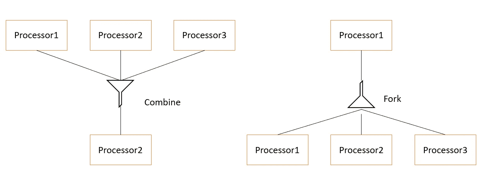

## 参数注册表

保存特定于环境或系统的属性。它简化了跨环境的配置管理。定义变量有两种方法:

*   **参数窗口** —立即可用，范围为过程组
*   **自定义属性文件**(nifi . variable . registry . properties)——需要重启 nifi 服务器

从 1.18 开始，我们可以有一个自定义的参数提供者。它允许从外部来源创建参数上下文(例如，基于文件的 Kubernetes 秘密、环境变量)。这也允许我们通过运行“获取参数”操作来保持外部源的参数是最新的。

## 处理器组

一组逻辑相似的处理器和连接，便于维护和管理。进程组作为一个整体从输入端口读取，并向输出端口写入。如果我们将进程组视为一个函数，那么**输入端口**可以被视为该函数的**参数**，而**输出端口**可以被视为该函数的**返回值**。

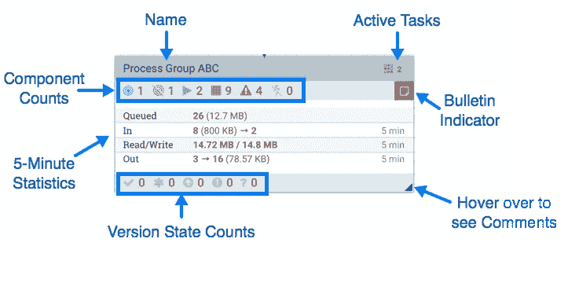

## 港口

进程组的入口点和出口点。每个进程组可以有一个或多个输入或输出端口，通过它们的名称来区分。

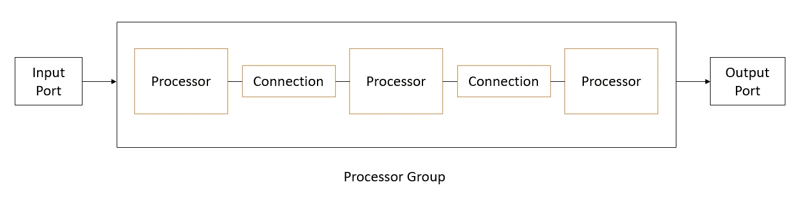

> 处理器通过名为*连接*的队列交换名为*流文件*的信息块。最后，*流控制器*负责管理这些组件之间的资源。

# Nifi 的组件

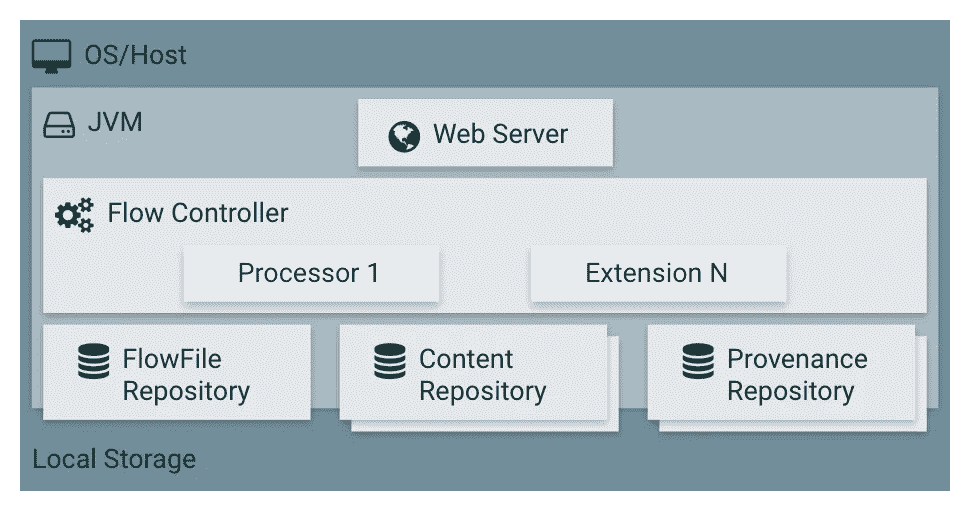

## 网络服务器

在 8080 上运行的交互式用户界面。它由 Jetty web 服务器提供支持，UI 是用 Angular 构建的。UI 提供了构建工作流的拖放功能。它还显示工作流的状态和集群状态。它每 30 秒自动刷新一次。

**UI 组件**

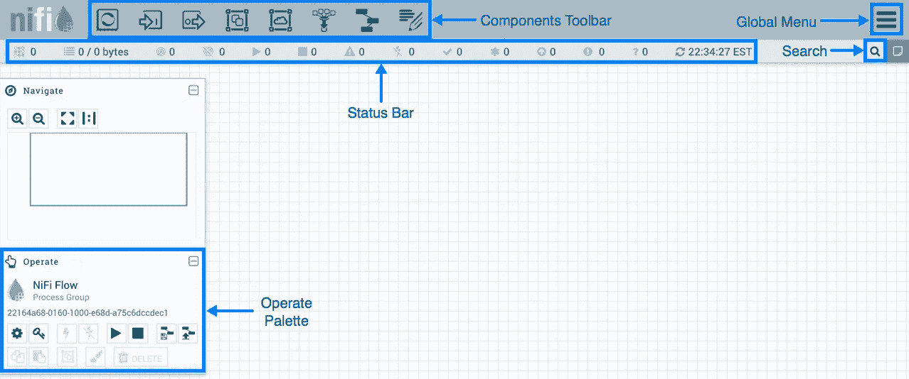

*   组件工具栏
*   全局菜单
*   搜索
*   状态栏
*   导航调色板
*   操作调色板

## 流量控制器

流量控制器是将一切结合在一起的粘合剂。它为处理器分配和管理线程。它执行数据流。

*   **处理器** s— QueryRecord，UpdateRecord，JoltTransformRecord，PartitionRecord，RouteText，GenerateFlowFile，RouteOnAttribute，PutFile，ExecuteSql **，** InvokeHttp **，** SpliJson **，** ConvertAvroToJSON，EvaluateJsonPath，ExecuteSparkInteractive NiFi 现在包含了大约 400+个处理器。
*   **扩展** —控制器服务、报告任务、优先级排序器和客户用户界面。

## 流文件存储库

流文件存储库包含通过 NiFi 数据流的每个流文件的当前状态和属性。NiFi 跟踪流文件存储库中的状态，该存储库当前在流中是活动的。

> nifi . flow file . repository . directory

## 内容存储库

内容存储库存储所有流文件中的所有数据。

这个存储库利用不变性和写入时复制范例(它在将内容复制到新位置时修改内容)来最大化速度和线程安全性。

## 出处储存库

每次修改流文件时，NiFi 都会在此时获取流文件及其上下文的快照。NiFi 中该快照的名称是一个*起源事件*。[出处储存库](https://nifi.apache.org/docs/nifi-docs/html/nifi-in-depth.html#provenance-repository)记录出处事件。

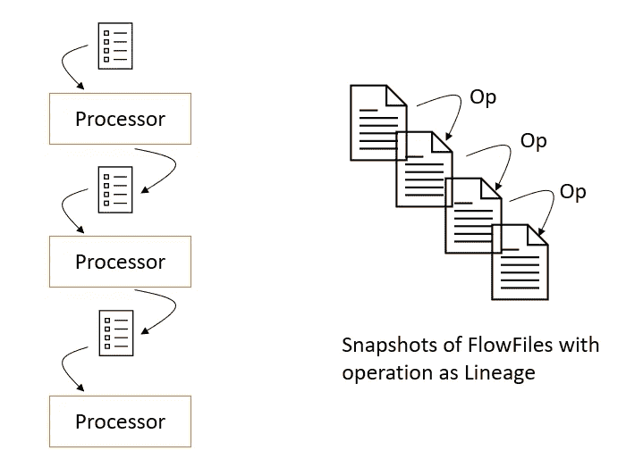

## 模板

模板是基本构建块的逻辑分组，以形成更大的构建块。然后，可以将该模板拖到画布上，或者导出为 XML 文件并与其他人共享。从其他人那里收到的模板可以导入到 NiFi 的一个实例中，并拖到画布上。

## NiFi 注册表

[Nifi Registry](https://nifi.apache.org/registry) 是 Nifi 的一个独立子项目，存储版本化的数据流。

*   水桶
*   流动

可以将其配置为使用外部数据库存储元数据。此外，它可以使用 git 作为持久化的后端。

> nifi . registry . db . *
> org . Apache . nifi . registry . provider . flow . git . gitflowpersistenceprovider

## 监控 NiFi

*   **公告** —当处理器记录任何警告或错误时，我们会在处理器的右上角看到一个“公告指示器”。
*   **报告任务** —这些任务允许我们收集 NiFi 集群中正在发生的诊断数据，并将其发送到其他地方。这些任务在后台运行。例如 SiteToSiteBulletinReportingTask、SiteToSiteMetricsReportingTask。
*   **NiFi API** — NiFi 公开 API 获取系统状态。tht 的 URL 是`[http://<nifi_host>:8080/nifi-api/system-diagnostics](http://localhost:8080/nifi-api/system-diagnostics)`。
*   **NiFi 汇总&数据来源 UI。**

## 重要的配置文件

NiFi 的日志位置

> nifi-app . log
> nifi-bootstrap . log
> nifi-request . log
> nifi-user . log

Nifi 中的重要配置和属性文件。

```
/conf/nifi.properties
/conf/bootstrap.conf
/conf/users.xml
/conf/authorizers.xml
/conf/authorizations.xml
/conf/bootstrap-notification-service.xml
/conf/login-identity-providers.xml
/conf/state-management.xml
/conf/flow.xml.gz
```

要添加 LDAP 身份验证，我们需要修改以下配置

> nifi . security . user . log in . identity . provider

另外，在`*login-identity-providers.xml*` *文件中设置适当的值。*

## 在 K8s 上安装 NiFi 集群

**选项 1(使用舵)**

```
helm repo add cetic https://cetic.github.io/helm-charts
helm repo update
helm install my-release cetic/nifi
```

**选项 2(使用 NiFiKop)**

```
# Create three namespaces zookeeper, nifi, cert-manager

# Install zookeeper
helm repo add bitnami https://charts.bitnami.com/bitnami

helm install zookeeper bitnami/zookeeper \
    --set resources.requests.memory=256Mi \
    --set resources.requests.cpu=250m \
    --set resources.limits.memory=256Mi \
    --set resources.limits.cpu=250m \
    --set global.storageClass=standard \
    --set networkPolicy.enabled=true \
    --set replicaCount=3
    --set namespaces={"zookeeper"}

# Install Cert Manager
helm repo add jetstack https://charts.jetstack.io
helm install \
  cert-manager jetstack/cert-manager \
  --namespace cert-manager \
  --create-namespace \
  --version v1.10.1 \
  --set installCRDs=true

# Add repo
helm repo add orange-incubator https://orange-kubernetes-charts-incubator.storage.googleapis.com/

# install NiFi operator
helm install nifikop \
    orange-incubator/nifikop \
    --namespace=nifi \
    --version 0.7.6 \
    --set image.tag=v0.7.6-release \
    --set resources.requests.memory=256Mi \
    --set resources.requests.cpu=250m \
    --set resources.limits.memory=256Mi \
    --set resources.limits.cpu=250m \
    --set namespaces={"nifi"}

# Install cluster using the operator
kubectl create -n nifi -f cluster.yaml
```

## NiFi 调谐参数

> 调度—并发任务，运行调度
> 控制器线程—事件，计时器
> 常规—惩罚，产出
> 背压—对象，大小

## 使用 NiFi 的公司

> 威士、波音、首都一号、耐克、埃克森美孚、美国电话电报公司、美光

## 可供选择的事物

*   流集
*   AWS 数据管道
*   谷歌数据流
*   蓝色数据工厂

数据流水线快乐！！