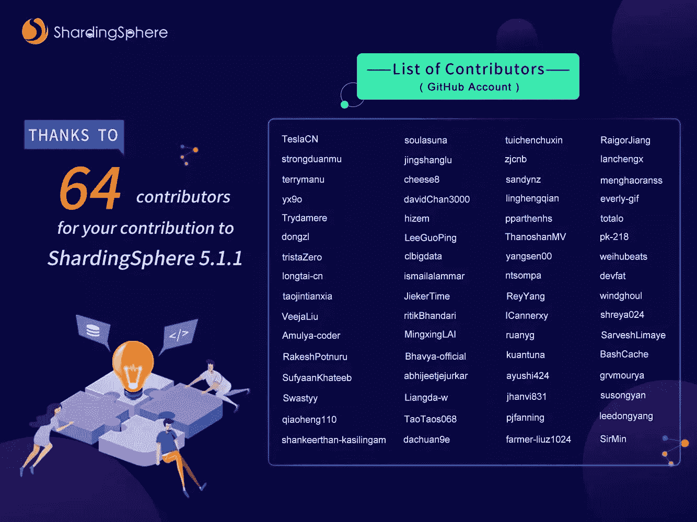

# Apache ShardingSphere 5.1.1 已经推出

> 原文：<https://blog.devgenius.io/apache-shardingsphere-5-1-1-is-available-3929034d4430?source=collection_archive---------18----------------------->

> *在 Apache ShardingSphere 5.1.0 发布后不到两个月的时间里，我们的社区已经合并了来自世界各地的团队或个人的 698 个 pr，为您带来了新的 5.1.1 版本。该版本在特性、性能、测试、文档、示例等方面进行了大量优化。*
> 
> *性能方面值得特别一提，因为我们采用了行业标准的 TPC-C 测试模型，在 16 台物理服务器上运行 Apache ShardingSphere 5.1.1 和 openGauss 3.0 数据库，实现了超过 1000 万 tpmC，是同规模行业中的最佳性能！*
> 
> *本文是对 ShardingSphere 5.1.1 更新的概述。*

Apache ShardingSphere 5.1.1 更新优化了 5.1.0 的功能和性能，并修复了一些问题。下面将为您提供一些更新的概述。

# 核心

内核是 ShardingSphere 的基础，我们的目标仍然是构建一个功能齐全、性能稳定的内核。在 5.1.1 中，ShardingSphere 在内核层面优化了很多逻辑，修复了之前版本中不同场景下发现的问题，包括数据分片、读写拆分、数据加密等，不同程度地提升了各个场景的性能。

在数据库方言方面，内核改进了对 [MySQL](https://www.mysql.com) 表空间的支持，改进了对 [Oracle](https://www.oracle.com/database/) 、 [SQL Server](https://www.microsoft.com/en-us/sql-server/sql-server-downloads) 、 [PostgreSQL](https://www.postgresql.org) 、 [openGauss](https://opengauss.org/en/) 等数据库的 SQL 支持。此外，对 PostgreSQL / openGauss 模式(一种三层结构)的初始支持已经在 ShardingSphere 内核中实现，并将在未来的版本中得到改进。

# 连接

此更新修复了 ShardingSphere-JDBC 的潜在性能风险，优化了内部 ShardingSphere-JDBC 和数据库连接池之间的非必要交互逻辑，并降低了 ShardingSphere-JDBC 的性能开销。

在 ShardingSphere-Proxy 方面，改进了对 MySQL / PostgreSQL 数据类型的支持。ShardingSphere-Proxy MySQL 偶尔出现的`ResultSet`关闭错误已经修复，ShardingSphere-Proxy MySQL 也初步支持在协议层执行多条语句，提高批处理操作的性能。

在客户端支持方面，ShardingSphere-Proxy PostgreSQL 改进了对 PostgreSQL JDBC 驱动 42.3.x 的支持，ShardingSphere-Proxy openGauss 改进了对 openGauss JDBC 驱动 3.0 的支持。

# 弹性横向扩展

在此更新中，除了修复 DistSQL 在报告错误后无法重新启动迁移任务的问题外，弹性缩放也得到了改进，并实现了停止源写入、恢复源写入和部分表缩放的新功能。对于不满足迁移条件的情况，弹性横向扩展可以快速失效，及时发现问题，避免用户额外的时间成本。

# DistSQL

DistSQL 在用户体验方面进行了优化，增加了更多的校准，降低了用户在使用 DistSQL 时出现配置错误的可能性。我们还修复了一些用户输入与 DistSQL 关键字冲突的问题。

# 分布式治理

在读/写拆分和数据库发现方面，MySQL 除了原有的 MGR 之外，新增了查询主次延迟的数据库发现方法，可以通过获取次延迟自动切换读/写拆分数据源，降低了用户使用动态读/写拆分的门槛。

在集群模式下，元数据存储结构得到了优化和重建，ZooKeeper 会话超时和表名大小写不匹配导致的问题得到了修复。

# 分布式事务

在事务方面，ShardingSphere-JDBC 增加了对保存点的支持，ShardingSphere-Proxy 增加了对 XA 场景下保存点的支持，此外还增加了对`LOCAL`事务的`Savepoint`的支持。

当 Narayana 作为 XA 实现使用时，ShardingSphere 支持 Narayana 的配置，使 XA 的使用更加方便。

有了 PostgreSQL / openGauss，当一个事务发生异常时，ShardingSphere 可以正确地中止事务并自动回滚。

以上是对 Apache ShardingSphere 5.1.1 部分更新的介绍，详情请参考更新日志。ShardingSphere 社区将发布其中一些特性的详细解释，敬请关注。

ShardingSphere 5.1.1 在 API 级别没有变化，但在功能和性能方面做了许多改进——欢迎您试用。

# 更新日志

## 新功能

*   内核:PostgreSQL 支持`alter materialized view`
*   内核:PostgreSQL 支持`declare`语法
*   内核:PostgreSQL 支持`discard`语法
*   内核:PostgreSQL 支持`$$`标记
*   内核:支持 MySQL 创建表空间语句
*   弹性扩展:实现停止源写入和恢复源写入
*   弹性扩展:支持部分表的扩展
*   DistSQL:新语法`SHOW UNUSED RESOURCES`
*   分布式治理:治理中心中新的持久性 XA 恢复 Id
*   分布式治理:数据库发现增加了延迟主从延迟的新特性
*   分布式事务:ShardingSphere-Proxy 支持保存点
*   分布式事务:PostgreSQL & openGauss 事务异常，自动回滚
*   分布式事务:Narayana XA 事务简易
*   分布式事务:JDBC 支持保存点

## 最佳化

*   内核:重构内核功能代码以提高性能
*   接口:减少 sharding sphere-代理 Docker 图像大小
*   接口:ShardingSphere-Proxy 支持用`set names`这样的语法设置字符编码
*   接口:ShardingSphere-Proxy MySQL 支持批量语句
*   接口:ShardingSphere-Proxy 支持 openGauss JDBC 驱动程序 3.0 客户端
*   弹性扩展:在一个 ShardingSphere-Proxy 集群中，只有一个代理节点需要进行完成检测
*   弹性扩展:优化输入和输出配置中的字段类型，将它们从 int 改为 Integer，以便更容易通过 DistSQL 配置为 null
*   弹性横向扩展:优化 MySQL 校准和 SQL
*   弹性扩展:优化进度删除和进度检查
*   弹性扩展:优化 FinishedCheckJob 在错误状态下无法进行完成检查的问题
*   弹性扩展:如果有不适合迁移的表，尽快报告错误
*   弹性扩展:当 PipelineAPIFactory 创建 GovernanceRepositoryAPI 时重用 ClusterPersistRepository
*   弹性扩展:升级 jobId 生成算法；jobId 支持幂等性
*   DistSQL: `CREATE/ALTER ENCRYPT RULE`语法支持配置数据类型和长度
*   DistSQL 统一`SHOW ALL VARIABLES`和`SHOW VARIABLE`语法的显示
*   DistSQL: `DROP BINDING TABLE RULES`语法消除了绑定顺序对删除结果的影响
*   DistSQL: `SHOW INSTANCE LIST`语法增加了`mode_type`字段的显示
*   DistSQL: `ENABLE/DISABLE INSTANCE`语法增加了模式的校准
*   DistSQL:添加校准以查看删除读/写拆分规则时规则是否在使用中
*   DistSQL:创建读/写拆分规则时添加资源重命名校准
*   DistSQL: `SHOW READWRITE_SPLITTING READ RESOURCES`增加延迟时间显示
*   DistSQL: `DROP RULE`语法支持`IF EXISTS`的预判断
*   DistSQL:优化`ADD/ALTER RESOURCE`连接失败消息
*   分布式治理:DistSQL 添加模式版本号以支持 DistSQL 的批量执行
*   分布式治理:在集群模式下优化持久性元数据
*   分布式治理:数据库发现创建添加 schemaName 标记的作业

## 重构

*   内核:重构加密和解密测试用例
*   内核:重构元数据模型以适应 PostgreSQL 数据库和模式模型
*   弹性横向扩展:管道模块消除了 HikariCP 依赖性
*   分布式治理:重新配置治理中心的存储节点结构
*   分布式治理:重构治理中心的元数据结构
*   分布式治理:将数据库发现管理器模块调整为 MySQL 模块

## 问题修复

*   内核:修复常量无法获取变量的异常
*   内核:修复`InsertValueContext.getValue`转换异常
*   内核:修复不同的聚合函数列异常

# Apache ShardingSphere 开源项目链接:

[ShardingSphere Github](https://github.com/apache/shardingsphere/issues?page=1&q=is%3Aopen+is%3Aissue+label%3A%22project%3A+OpenForce+2022%22)

[ShardingSphere Twitter](https://twitter.com/ShardingSphere)

[切割球松弛度](https://join.slack.com/t/apacheshardingsphere/shared_invite/zt-sbdde7ie-SjDqo9~I4rYcR18bq0SYTg)

[投稿指南](https://shardingsphere.apache.org/community/cn/contribute/)

# 作者

**吴伟杰**

> *SphereEx 基础设施研发工程师，Apache ShardingSphere PMC*
> 
> 他专注于 Apache ShardingSphere 接口和 sharing sphere 子项目 ElasticJob 的研发。

