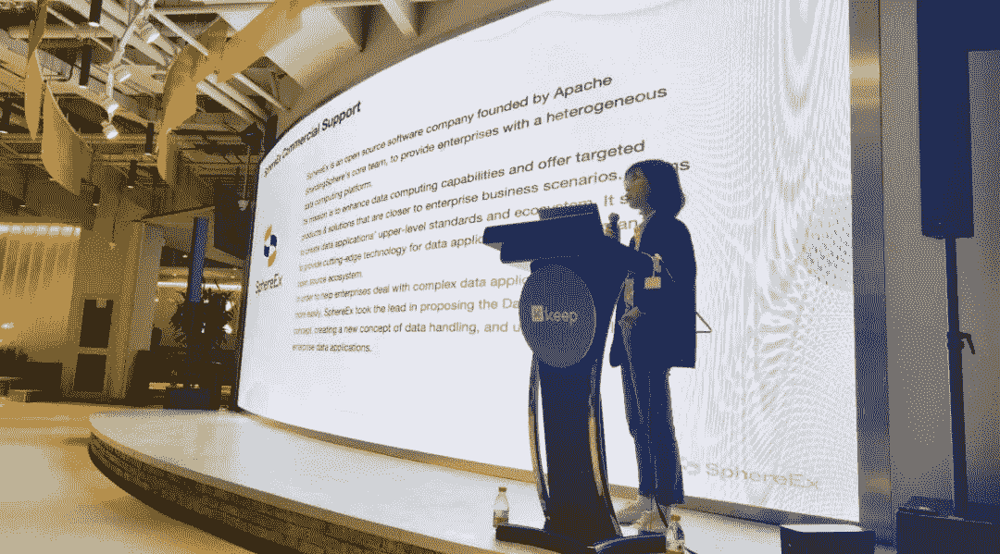
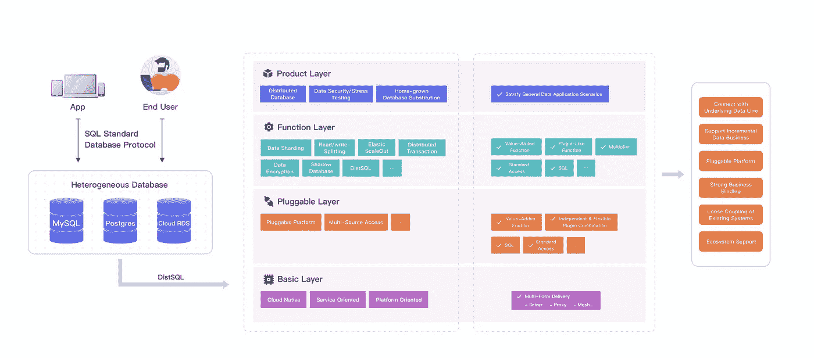

# Apache ShardingSphere 企业应用程序

> 原文：<https://blog.devgenius.io/apache-shardingsphere-enterprise-applications-e8cd903b11c4?source=collection_archive---------18----------------------->

> 为了进一步了解应用程序场景、企业需求，并提高开发团队对 Apache ShardingSphere 的理解，我们的社区推出了“企业访问”系列。

# 保持

对于我们社区的第一次访问，我们去了位于万科时代中心的亚洲领先的锻炼和健身教练应用程序制造商" [Keep](https://www.keepkeep.com) "总部，并与 Keep Co .的开发人员分享了我们的技术。

早在 2018 年，Keep 就已经为其多元化的业务线在多个应用场景中部署了分片和读/写拆分等分片领域功能。

随着 Apache ShardingSphere 5.0 的发布，Database Plus 和可插拔架构的概念在某种程度上重塑了 ShardingSphere 生态系统。访问期间，我们与 Keep 的同行进行了深入的交流和探讨。

Keep 工程师对 Apache ShardingSphere 5.0 表示了极大的兴趣。在此次活动中，Apache ShardingSphere PMC 和 SphereEx 首席技术官 Juan Pan 全面概述了最初的 ShardingSphere 架构、用户端访问、社区建设和[数据库加概念](https://www.infoq.com/articles/next-evolution-of-database-sharding-architecture/)。

PMC 阿帕奇沙漠地带，潘娟

## Database Plus:解放数据库管理员和开发人员

Database Plus 是分布式数据库系统的一个设计概念。通过在碎片化的异构数据库之上构建一个使用和交互的标准层和生态系统，并通过倍增和扩展计算能力(例如数据共享、数据加密和解密)，应用程序和数据库之间的所有交互都面向 Database Plus 构建的标准层。这导致屏蔽了数据库碎片对上层事务的不同影响。

潘认为，全球数据库产业的蓬勃发展主要得益于以下两个原因:

*   **业务端需求:**
    在业务方面，为了保证持续的访问量和交易量增长，底层数据库必须尽快响应请求。此外，微服务的拆分和相应数据库的后续修改也产生了来自业务端的需求。
*   **运营&维护端需求:**
    DBA 负责运行整个业务和数据系统，包括数据安全、备份、分布式治理、数据集群的 API 智能监控等。
    如果中间层可以满足交易流量并理解请求，DBA 可以相应地修改请求，然后可以执行更多的操作。因此，我们需要在承载交易流量和支持数据库能力建设的需求双方之间达成平衡，从而在双方之间创建一个高效、协作的生态系统。
    随着 5.0 版本的发布，分片功能不再是 Apache ShardingSphere 的核心。实际上，在 ShardingSphere 生态系统中，分片已经被“降级”为次要功能。遵循 Database Plus 概念，Apache ShardingSphere 构建了一个可插拔的架构生态系统，使中间层能够实现更多的增值功能。

ShardingSphere 的数据库加架构

以数据加密和解密为例，我们可以看到由于 [MySQL](https://www.mysql.com) 等数据库本身不支持加密算法，所以一般在业务层是怎么做的。这意味着加密&解密只能在应用层和业务层实现。然而，如果我们考虑复杂的在线业务，当他们升级他们的加密算法时会面临相当大的任务，这就产生了一个问题。
解决这个问题的最佳方案是在中间层加密和解密数据。 [ShardingSphere-Proxy](https://shardingsphere.apache.org/document/current/en/user-manual/shardingsphere-proxy/) 可以直接绑定到数据库，放置在应用程序和底层数据库之间的中间层。通过利用与不同数据库兼容的协议，ShardingSphere-proxy 将感觉“类似于 DB ”,从而决定 SQL 查询将落在哪个节点上，让上层应用程序为 ShardingSphere 编程，并屏蔽底层数据库的影响。当事务发送请求时，数据处于明文状态，但在通过代理后会被加密，在检索时会被解密。

ShardingSphere 加密和解密功能

因此，ShardingSphere 加密和解密过程可以从现有的应用程序和数据库系统中分离出来，并可以与特殊的加密算法联系起来，特别是在涉及密码机的情况下。加密等 ShardingSphere 功能可以节省大量 DBA 和开发人员的时间，让他们能够将更多精力放在业务上。

# 爱奇艺

> 我们的第二站是亚洲领先的在线流媒体平台爱奇艺。

2021 年 11 月，来自 ShardingSphere 社区的一个团队访问了爱奇艺[爱奇艺](https://www.iq.com/?lang=en_us)的创新中心，与来自北京和上海的同行进行了深入互动和讨论。在会议期间，Apache ShardingSphere PMC 主席和 SphereEx 创始人张亮详细介绍了最新的 Apache ShardingSphere 社区计划、其未来发展和数据库网格。

在会议期间，爱奇艺对 ShardingSphere 和 Database Mesh 的功能和未来计划特别感兴趣。以下是此次访问中的一些关键问题:

## ShardingSphere 如何管理其加密密钥？

[加密](https://shardingsphere.apache.org/document/current/en/features/encrypt/)密钥管理是从属于加密算法的一种能力。当 ShardingSphere 在解密中需要一个加密密钥时，该密钥可以通过加密算法配置的属性来传递。原则上，加密密钥管理不是 ShardingSphere 的功能，而是加密算法的工作。

## ShardingSphere 有内置的加密算法吗？还是通过外界合作完成？

严格来说，ShardingSphere 没有配备内置功能。那是因为 ShardingSphere 的可插拔架构分为多层，加密模块本身只是可插拔架构的 L2 的一个能力。

加密模块只定义了顶层的加密连接器，详细的加密算法实现了连接器的可插拔部分。目前，ShardingSphere 支持几种最常用的开源算法，但它不支持任何特定的国家加密算法。

集成加密算法对开发人员来说很容易:他们不需要修改源代码，只需要一个 ShardingSphere 加密算法连接器。ShardingSphere 的数据加密过程对用户是完全透明的，并且非常容易使用。

## -数据库网格和 SphereEx 的未来计划是什么？

数据库网格是另一个 ShardingSphere 计划。我们现在正计划通过 [Sidecar 整合数据库网格。](https://shardingsphere.apache.org/document/legacy/3.x/document/en/manual/sharding-sidecar/) Sidecar 将用于管理流量，而 ShardingSphere 将用于管理计算，底层数据库的节点用于管理存储。
Sidecar 和 ShardingSphere 的功能部分重叠，但不完全重叠。ShardingSphere 有超过 190 个模块，因此不可能用 Sidecar 完全取代 ShardingSphere。这就是为什么 ShardingSphere 赋予 Sidecar 一些轻量级功能，而 Sidecar 也具备缓冲一些流量和请求的功能。
数据库计算能力仍然由 ShardingSphere 处理，因为通过 Sidecar 为异构数据库的分布式事务、查询和优化运行重量级计算会消耗太多的应用资源。

在未来，将开发其他 Sidecar 功能，如管理、SQL 审计和权限。这样，Sidecar 和 ShardingSphere 将各有侧重，提供更好的解决方案，

## - Sidecar 相当于一个数据平面。你会把控制平面和 [Istio](https://istio.io) 组合在一起，还是单独建造控制平面？

ShardingSphere 使用 [DistSQL](https://opensource.com/article/21/9/distsql) (分布式 SQL)为分片、加密等创建规则。ShardingSphere 已经配备了 Sidecar 的控制平面功能。Sidecar 上实现的任何功能都可以由 ShardingSphere 的 DistSQL 控制。
未来，我们会考虑将 Sidecar 整合到 Istio 生态系统中。

到目前为止，随着 5.0 版本的发布，Apache ShardingSphere 已经正式将自己重新定位于一个新的领域，其核心是 Database Plus 概念。除了数据库上层强大的增量功能，Database Plus 架构还向开发人员和用户开放了一个高度可扩展的数据库生态系统，为 Apache ShardingSphere 规划了一个新的未来开发路线。

# 搜狐

> 第三次 ShardingSphere 社区访问将我们带到了搜狐——广告、搜索引擎、在线多人游戏和其他服务的巨头。

Apache ShardingSphere 社区团队访问了 Sohu.com 总部，与互联网巨头的同行进行了深入的讨论。在见面会上，Apache ShardingSphere PMC 和 SphereEx 首席技术官 Juan Pan 详细介绍了 Apache ShardingSphere 的功能。

搜狐公司是一家综合性互联网公司，拥有丰富的历史和全面的业务线，在其多个业务线中使用 ShardingSphere 产品，如社交媒体和视频服务。

在 ShardingSphere-JDBC 的驱动下，以 ShardingSphere-Proxy 为容器管理平台，ShardingSphere 为搜狐提供各方面的支持，帮助搜狐缓解数据库流量压力。

在这次活动中，来自 Sohu.com 的工程师对 Apache ShardingSphere 5.0 表现出了极大的兴趣。Juan Pan 全面概述了 ShardingSphere 的架构、客户端访问、社区建设和 Database Plus 概念。

## 导航并解决行业挑战

由于企业数据库系统的复杂性和数据库的高昂成本，服务提供商应该为企业提供主流数据库产品以及能够满足多种需求的产品和服务。

面对数据库市场多样化的用户需求和日益多样化的产品，一个可行的解决方案可能是具有更高灵活性和可扩展性的数据库部署和功能。

通过为异构数据库创建上层标准和生态系统，Apache ShardingSphere 提供了能够精确满足企业需求的多样化功能。作为一个由多个适配器组成的生态系统，通过使用 ShardingSphere-JDBC 和 sharding sphere-代理的混合部署模型，Apache ShardingSphere 使用户能够通过一个控制台配置分片策略，并灵活地创建适合不同场景需求的应用系统。这允许工程师更自由地构建最适合他们正在进行的项目需求的系统架构。

ShardingSphere 的部署架构

围绕连接、增量和可插拔特性，并基于可插拔架构，Apache ShardingSphere 以微内核的形式创建了一个强大的内核架构。

基于其强大的内核能力，Apache ShardingSphere 产品可以为用户提供分布式数据库、数据安全、数据库网关和[全链路压力测试](/full-link-online-stress-testing-for-production-database-apache-shardingsphere-shadow-database-84f7cba56f99)的理想解决方案，帮助提升企业和用户的效率。

Apache ShardingSphere 的功能概述

谈到未来的优化，潘认为 Apache ShardingSphere 的性能仍然存在一些不足，尤其是 ShardingSphere-Proxy 的适配器。在未来，社区将加倍努力改进其内核，最小化代理的业务和数据性能损失，改进路由和重写逻辑，减少创建数据库对象，并避免过多的年轻 GC。

# Apache ShardingSphere 开源项目链接:

[ShardingSphere Github](https://github.com/apache/shardingsphere)

[ShardingSphere Twitter](https://twitter.com/ShardingSphere)

[ShardingSphere 松弛通道](https://join.slack.com/t/apacheshardingsphere/shared_invite/zt-sbdde7ie-SjDqo9%7EI4rYcR18bq0SYTg)

[投稿指南](https://shardingsphere.apache.org/community/cn/contribute/)

# 作者

**Yacine Si Tayeb**

> *spherex 国际业务主管*
> 
> *Apache ShardingSphere 贡献者*
> 
> Yacine 对技术和创新充满热情，他搬到北京攻读工商管理博士学位，并对当地的初创企业和技术领域充满敬畏。到目前为止，他的职业道路是由技术和商业交汇处的机遇塑造的。最近，他对 ShardingSphere 数据库中间件生态系统的开发和开源社区建设产生了浓厚的兴趣。

