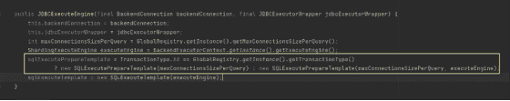

# Apache ShardingSphere 企业用户案例——能源怪兽

> 原文：<https://blog.devgenius.io/apache-shardingsphere-enterprise-user-case-energy-monster-5f7254c6b4c5?source=collection_archive---------9----------------------->

## [能源怪兽](https://ir.enmonster.com/)对[sharing sphere 的应用——JDBC](https://shardingsphere.apache.org/document/current/en/overview/#shardingsphere-jdbc)

能源怪兽是一家消费科技公司，其使命是为日常生活提供能源。该公司是亚洲最大的移动设备充电服务提供商。

随着公司业务并发量越来越大，产生的数据量(用户、订单、活动等。)与日俱增。传统的关系数据库已被证明不足以在单个数据库或表中支持数百万或数千万的数据量。

业绩已经无法满足业务发展的基准要求。在这种情况下，数据分片是解决问题的有效方法。

## 技术选择

在[数据库加](https://shardingsphere.apache.org/)概念下，ShardingSphere 旨在异构数据库之上构建一个生态系统。目标是在最大化原始数据库计算能力的同时，提供全局可扩展和增强的计算能力。

应用程序和数据库之间的交互变得面向 Database Plus 标准，因此最小化了数据库碎片对上层服务的影响。

在 ShardingSphere 生态系统中， [ShardingSphere-JDBC](https://shardingsphere.apache.org/document/current/en/overview/#shardingsphere-jdbc) 被定位为一个轻量级 Java 框架，在 Java 的 JDBC 层提供额外的服务。

它使用客户端直接连接数据库，以`jar`包的形式提供服务，不需要额外的部署和依赖。可以理解为 JDBC 驱动的增强版，完全兼容 JDBC 和各种 ORM 框架。

JDBC 通过协调数据分片下的数据读写，使开发人员能够只关注数据层之外的工作，而不是使用业务代码来手动选择数据库和表。

## 商业案例

UCS 是 Energy Monster 以用户为中心的服务，为服务器端的用户提供基本功能。2018 年从 [PHP](https://www.php.net/) 服务器剥离，移至 Java 技术栈，实现微服务化。

它涉及新数据库和表格的设计以及数据清理和迁移。预计整个切换过程将确保以下功能:

*   稳定性:短时间内平稳释放，不停顿。

准确性:确保精确清理数千万个数据卷。

可扩展性:解决数据量增加带来的性能问题，保证可扩展性。

> ***数据清理和迁移解决方案***

*   初始数据同步。
*   应用程序的服务器切断入口(用户)。
*   数据同步(自上一时间点以来的更新和新用户)。
*   数据清理。
*   用户中心发布。

> ***数据分片策略***

数据库采用数据库分片设计，分为 16 个数据库。默认分片键是`user_id`，默认分片策略`user_id`是 mod 16，比如用户表的`${user_id % 16}`。对于不携带分片密钥的 SQL，使用广播路由。

`user_id`作为分片键是因为`user_id`可以覆盖大部分业务场景，其他字段可能为空。在本地测试中，shard key 策略(openId，mobile)的查询耗时 50ms 到 200ms。

> ***使用分片算法***

目前有三种可用的分片算法。

*   标准分片算法。对应`StandardShardingAlgorithm`，用于使用单键作为分片键的场景，比如=，IN，BETWEEN AND，>，<，> =，< =。
*   复杂的分片算法。对应`ComplexKeysShardingAlgorithm`，用于使用多键作为分片键的场景。多个碎片键的逻辑很复杂，需要开发人员自己处理。
*   提示分片算法。它对应于`HintShardingAlgorithm`，用于提示行用于分片的场景。

## 升级 ShardingSphere-JDBC

ShardingSphere-JDBC 用于多个业务场景，如订单、库存和财务。到 2021 年，R&D 团体或团队使用不同版本的 ShardingSphere-JDBC，从 1。x 到 4。x，后期很难做到统一维护。

此外，早期版本中还有一些潜在的错误和缺失的功能。基于统一管理和可用性的要求，我们实施了一个项目来统一公司使用的 ShardingSphere-JDBC 版本，并在 2021 年 4 月将其升级到 4.1.1 稳定版本。

**升级过程中遇到以下问题:**

**1。升级后需要很长时间才能启动服务。**

ShardingSphere-JDBC 在服务启动时检查子表的元数据一致性。配置项`max.connections.size.per.quer`(每个查询可以打开的最大连接数)默认为 1。对于大量的表，加载过程会很慢。你需要参考连接池配置来提高加载速度。

**2。子表查询中没有分片键时没有响应。**

逻辑 SQL 查询不指定分片键，它根据广播路由中路由器的整个数据库表查询所有的表。

配置项在数据库中有 108 个实际表。根据`maxConnectionsizeperquery=50`的配置，ShardingSphere-JDBC 使用连接限制模式，将查询请求分为三组，并将结果与内存合并。因此，一个查询需要 36 个数据库连接。但是[德鲁伊](https://druid.apache.org/)线程池配置的`maxActive`设置为 20，导致死锁。

**解决方案:**

*   结合`check.table.metadata.enabled=true`(启动时检查子表中元数据的一致性)并正确配置`maxConnectionSizePerQuery`(每次查询可以打开的最大连接数)。
*   `maxConnectionSizePerQuery`应该小于 druid 线程池配置的最大活动线程数。

**3。从 1 升级后。x，SQL 执行中显示错误消息“无法更新分片键”，实际的分片键值没有更新。**

为了避免因更改分片键值而导致的数据查询失败，在 4 中的`SQL update`中增加了分片键检测。x 版本。可以通过以下方式纠正错误:

*   更新时删除碎片密钥。
*   shard 键被同步添加到`where`语句中。

**4。使用** `**druid-spring-boot-starter**` **时导致启动失败，与** `**Sharding-datasource**` **不兼容。**

druid 数据连接池启动器将加载并创建一个默认数据源。这将在 ShardingSphere-JDBC 创建数据源时导致冲突。

**5。** `**inline strategy**` **报告范围查询错误。**

`inline strategy`默认不支持范围查询，建议使用`standard strategy`。如果范围查询需要`inline strategy`，添加以下配置。

`spring.shardingsphere.props.allow.range.query.with.inline.sharding: true`

**注意:**这里所有的`inline strategy`范围查询都会查询广播中的各个子表。

**6。报告了“无法从表中找到所有者”错误。**

SQL(简体):

`select id from`(从 x 中选择 id)按 a.id 分组

四号。x 版本支持有限的子查询。这个问题是由中间表的名称引起的。删除`select`或`group order`或其他字段的表别名。

> [*https://github.com/apache/shardingsphere/issues/4810*](https://github.com/apache/shardingsphere/issues/4810)

7。该表的主键与 [**雪花**](https://programming.vip/docs/overview-of-snowflake-algorithm.html) **算法生成的主键冲突。**

ShardingSphere 提供了配置分布式主键生成策略的灵活方式。在分片规则配置模块中，您可以为每个表配置主键生成策略。

默认情况下，[雪花](https://programming.vip/docs/overview-of-snowflake-algorithm.html)算法用于生成 64 位长整数数据。雪花发生器需要配置:

`spring.shardingsphere.sharding.tables.x.key-generator.props.worker.id = ${dcc.node.id}`

该公司使用 [apollo](https://www.apolloconfig.com/#/) 配置中心来交付服务实例的节点 id。该服务使用多数据源。如果使用 YAML 文件加载分片配置，则`workId`不能自动加载到分片配置项中。

**解决方案:**

使用基于内置`SnowflakeShardingKeyGenerator`的自定义发生器类型。

如果主键用作分片键，根据数据分片值配置`max.vibration.offset`以增加振动范围。

**8。三号。x 版本在执行** `**CASE WHEN**` **语句时报错。**

首先是 3。x 和 4。x 版本不支持`case when`语句。

三号。x 和 4。x 版本在解析`case when`的`update`语句的分片键时有不同的逻辑。四号。X `parserEngine.parse`方法会忽略`case when`解析参数，导致与外部参数表不一致，当 3。x 执行普通的 SQL。

三号。x 版本之所以能正确工作，是因为在编写 SQL 时，`case when`的第一个参数被有意设置为 shard 键，而`case when`语句排在最前面。

> 【https://github.com/apache/shardingsphere/issues/13233*T21*

**解决方案:**

*   建议重写 SQL，因为不支持`case when`。
*   按照 4.1.1 版本的分片键解析逻辑，`case when`放在最后，分片键仍然是`case when`的第一个参数。

9。逻辑表 `**actualDataNodes**` **已配置，主键无默认值错误报告。**

`check.table.metadata.enabled=true`没有配置服务，默认不检查子表的元数据一致性。

服务配置的`actualDataNodes`第一个表不存在，导致`GenerateKeyContenxt`为空。

**解决方案:**

*   配置`check.table.metadata.enabled=true`。启动时检测到不存在的表，并报告错误。
*   重写`actualDataNodes inline`表达式以确保第一个表存在。

**10。在 3.0 版本中，全数据库和表路由器的高并发下存在死锁。**

默认情况下，ShardingSphere-JDBC 使用本地事务。在本地事务中，异步获得数据库连接。在高并发下，可能无法获得所有数据库连接，从而导致死锁。

# 结论

作为 [ShardingSphere](https://shardingsphere.apache.org/) 的核心用户，[能源怪兽](https://ir.enmonster.com/)的升级过程也反映了社区用户在应用 ShardingSphere 时可能遇到的一些问题。

目前，Apache ShardingSphere 的稳定版本已经更新到 5.1.2，并在功能、性能、测试、文档和示例方面进行了优化。

更多信息可以参考 [Apache ShardingSphere 官网](https://shardingsphere.apache.org/)。如有任何问题或建议，也欢迎在 [Github](https://github.com/apache/shardingsphere) 上反馈。社区会积极响应和讨论。

# 项目链接:

[ShardingSphere Github](https://github.com/apache/shardingsphere/issues?page=1&q=is%3Aopen+is%3Aissue+label%3A%22project%3A+OpenForce+2022%22)

[ShardingSphere Twitter](https://twitter.com/ShardingSphere)

[切割球松弛度](https://join.slack.com/t/apacheshardingsphere/shared_invite/zt-sbdde7ie-SjDqo9~I4rYcR18bq0SYTg)

[投稿指南](https://shardingsphere.apache.org/community/cn/contribute/)

GitHub 问题

[投稿指南](https://shardingsphere.apache.org/community/en/contribute/)