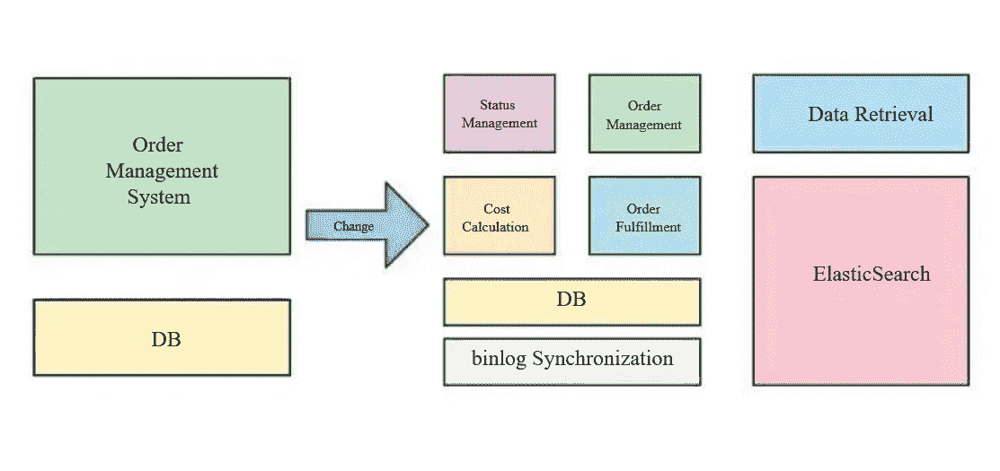
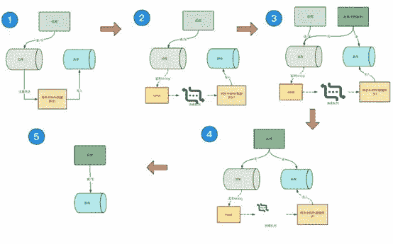

# Apache ShardingSphere 企业用户案例:上中惠民的交易中间平台架构

> 原文：<https://blog.devgenius.io/apache-shardingsphere-enterprise-user-case-zhongshang-huimins-transaction-middle-platform-4f55eaf95e61?source=collection_archive---------16----------------------->

快速消费品行业已经不能满足当前的发展需求。传统的只升级供应链末端的方式无法实现高质量的业务发展。[惠民](https://huimin.cn/)专注于超百万社区超市的订单履行和配送服务，从服务零售终端门店转型升级，推动整个快消品产业链的数字化。

致力于打造 B2B2C 数据闭环运营体系，为品牌商、经销商、社区超市提供涵盖采购、营销、运营、配送的全链条转型升级解决方案。如果没有其强大的“中间平台”系统，所有这些承诺都无法兑现。

# 介绍“中间平台”

惠民开始将 [PHP](https://www.php.net/) 技术栈转移到 Java 技术栈，2016-2017 年转向微服务，2018 年开始搭建“中间平台”。

其交易中间平台的一期工程于 2021 年初上线，二期工程于 2022 年 3 月上线。

由于业务增长和各种变化，惠民推出了强大的“中间平台”发展战略，以提高效率和降低成本。采取措施降低系统之间的耦合度，提高可伸缩性，并在提取业务共性的同时确保低延迟。2021 年初，公司完成了对原有订单管理系统(OMS)的改造，启动了以订单交易流程为中心的交易中间平台的打包业务能力项目，分为以下四个核心模块:订单状态流系统、订单管理系统、订单履行系统和订单成本计算系统。同时，基于业务分层，该项目还被拆分为订单查询系统、报表系统和订单管理后端。

为了在重建过程中协调技术和业务需求，上线过程分为两个阶段:应用系统拆分和数据拆分。

# 系统分列

R&D 团队不得不频繁调整订单管理系统并使其适应多条业务线，这可能会导致效率低下。针对这些问题，制定了以下原则来拆分和重建系统:

1.  避免不同业务线的逻辑耦合。不同业务线之间应该相互牵制，尽量减少相互影响，降低逻辑复杂度。
2.  根据订单生命周期划分职责，以确保每个系统都是独立的，并有专属的职责。
3.  读/写拆分。保证核心功能的稳定性，避免频繁迭代对核心功能的影响。
4.  [引入 ElasticSearch](https://www.elastic.co) 解决外部索引问题，减轻数据库索引压力。

# 数据分割

数据拆分的目的是减轻单个表的维护压力。当数据量达到数千万时，数据库表的索引和字段维护会对在线环境产生很大的影响。在拆分表之前，您必须考虑以下问题:

1.  拆分规则:哪些表是数据密集型的？分裂的次数呢？
2.  数据读/写:拆分表后如何解决读/写问题？
3.  上线解决方案:如何顺利上线？

**分裂规则**

在 3 年的迭代周期中，拆分次数=((每月添加的数据量* 36) +历史数据量)/单个表中的最大数据量。

当我们使用 [InnoDB](https://en.wikipedia.org/wiki/InnoDB) 引擎进行 DDL 操作来维护[阿里云](https://www.alibabacloud.com/?spm=a2796.143805.6791778070.2.b8fa46e3JLecKh) RDS MySQL 时，我们得出以下结果:

当数据量小于 500 万时，执行时间约为几十秒。500 万到 1000 万以内，执行时间 500 秒左右；1000 万到 5000 万以内，执行时间 1000 秒左右；而超过 5000 万时，执行时间超过 2000 秒。

拆分单个表的上限取决于单个表操作对业务的影响。当然，有些解决方案可以解决 DDL 操作导致的表锁问题。例如，双表同步和表名的更改可以将影响减少到几秒钟之内。

库表的拆分数最好是 2 的 N 次方，有利于后期的横向缩放。

**技术选择**

拆分数据表后，需要解决数据哈希和查询问题。作为中小企业，开发一套分片中间件的成本太高，而且前期会引发各种风险。合理的解决方案是采用一套开源的数据库分片中间件。

[**Apache sharding sphere**](https://shardingsphere.apache.org/)

Apache ShardingSphere 是一个开源生态系统，它允许您将任何数据库转换成分布式数据库系统。该项目包括一个 JDBC，一个代理和 Sidecar(规划)，可以独立部署，支持混合部署。它们都提供了数据横向扩展、分布式事务和分布式治理的功能。

Apache ShardingSphere 5.x 引入了[数据库加](https://faun.pub/whats-the-database-plus-concepand-what-challenges-can-it-solve-715920ba65aa)的概念，新版本侧重于面向插件的架构。目前功能包括数据分片、读写拆分、数据加密、影子库压力测试，以及 SQL 和协议支持如 [MySQL](https://www.mysql.com/) 、 [PostgreSQL](https://www.postgresql.org/) 、 [SQL Server](https://www.microsoft.com/en-us/sql-server/sql-server-downloads) 、 [Oracle](https://www.oracle.com/index.html) 等。通过插件嵌入到项目中，允许开发者定制他们自己独特的系统。

惠民为什么选择 Apache ShardingSphere:

1.Apache ShardingSphere 功能多样，可扩展性强，可以解决当前的挑战。

2.Apache ShardingSphere 社区非常活跃，这意味着可以快速找到支持。

3.公司采用 [SpringCloud](https://spring.io/projects/spring-cloud) 技术栈，便于集成，可以降低成本。

4.其性能完全可以支撑惠民现有业务。

ShardingSphere 支持以下 3 种模式:

目前惠民的服务器端技术栈只涉及 Java 语言，不需要考虑异构场景。综合考虑灵活性、代码入侵和部署成本，最终选择了[sharing sphere-JDBC](https://shardingsphere.apache.org/document/current/en/overview/#shardingsphere-jdbc)的实现。

**技术实现**

这个过程中最复杂的部分实际上是上线部分，而不是像某些人预期的插件集成部分。

为了实现无感知和回滚，我们将上线流程分为以下步骤，如图所示:

**第一步:**处理所有数据需要保证新旧库的数据一致性。由于目前没有支持数据分片策略的同步工具，我们开发了一个数据同步工具来支持分片策略的配置。

**第二步:**处理增量数据，以保持新旧库之间的数据一致性。我们这里的实现方案是使用开源组件，监听数据库的 binlog 并将数据库更改同步到消息队列，然后数据同步工具监听消息并将它们写入新的库中。

架构方案并不复杂，但在此过程中非常重视数据的一致性。增量数据不能丢失，单行数据要按顺序写入，防止 ABA 问题。

**第三步:**对阅读流量进行灰度释放处理。此时，我们正在数据库中编写一个旧库并读取一个新库。在这个过程中，我们应该注意业务对数据一致性的敏感性，因为从一个旧库到一个新库的延迟在几秒钟之内。当我们遇到一些需要高度一致性的敏感场景时，就需要读取旧库。

**第四步:**将应用的所有读流量切换到新库，保持写旧库和读新库的状态。

**第五步:**为了降低程序的复杂度，处理写流量没有考虑灰度释放场景。当然，灰度方案也可以达到同样的效果。我们通过将新库的数据写回旧库，然后在一个版本中将所有流量统一转移到新库，来支持回滚策略。

至此，整个发布上线的过程已经完成。由于在 ShardingSphere-JDBC 中间件的帮助下完成转换以重写 SQL 和合并结果的成本很低，所以几乎没有代码入侵，上线也很顺利。

在访问“切分球体-JDBC”方案时，您可能还需要注意一些问题:

1.  ShardingSphere-JDBC 支持数据插入逻辑的默认处理。如果 SQL 中没有 shard 列，那么每个 shard 表中都会插入相同的数据。
2.  ShardingSphere-JDBC 只解析 SQL 语义分析批处理的第一个 SQL 的 logil 表，这会导致一个错误。此问题已被报告，应该会在不久的将来得到解决。此外，还提供了一个详细的 SQL 示例，其中详细列出了支持范围。
3.  ShardingSphere 连接模式选择。为了控制资源，应该限制企业访问的数据库连接数。可以有效防止一个服务操作占用过多资源，耗尽数据库连接资源，影响其他服务的正常访问。尤其是在一个数据库实例中有很多子表的情况下，一个没有分片键的逻辑 SQL 会产生大量实际的 SQL，落在同一个库中的不同表上。如果每个实际的 SQL 占用一个单独的连接，一个查询无疑会占用太多的资源。

从执行效率的角度来看，为每个分片查询维护一个单独的数据库连接，可以更有效地利用多线程来提高执行效率。为每个数据库连接构建一个单独的线程允许并发处理 I/O 消耗，为每个碎片维护一个单独的数据库连接，并避免过早地将查询结果数据加载到内存中。单独的数据库连接可以保存对查询结果集的光标位置的引用，并在需要获取相应数据时移动光标。

将结果集光标下移的结果合并方法称为流式合并。它不必将所有的结果数据加载到内存中，可以有效地节省内存资源，减少垃圾收集的频率。如果不能保证每个分片查询都有一个单独的数据库连接，那么就需要在重用数据库连接获取下一个分片表的查询结果集之前，将当前的查询结果集加载到内存中。因此，即使可以使用流式合并，在这种情况下也会退化为内存合并。

通过采用更好的合并方式，平衡数据库连接资源的控制和保护与节省中间件内存资源之间的关系，是 ShardingSphere 执行引擎面临的问题。具体来说，如果一条 SQL 在 ShardingSphere 中分片后，需要对一个数据库实例下的 200 个表进行操作，是创建 200 个连接并发执行还是创建一个连接按顺序执行？如何在效率和资源控制之间做出选择？

针对上述场景，ShardingSphere 提供了一个解决方案。引入连接模式的概念，分为`MEMORY_STRICTLY`模式和`CONNECTION_STRICTLY`模式。

`**MEMORY_STRICTLY**`

使用这种模式的前提是，ShardingSphere 不限制操作所需的数据库连接数。如果实际执行的 SQL 需要对数据库实例中的 200 个表进行操作，则为每个表创建一个新的数据库连接，并通过多线程进行并发处理，以最大化执行效率。当 SQL 满足条件时，优先选择流合并，以防止内存溢出或频繁的垃圾收集。

`**CONNECTION_STRICTLY**`

使用这种模式的前提是，ShardingSphere 严格限制了操作所需的数据库连接数。如果实际执行的 SQL 需要操作一个数据库实例中的 200 个表，那么只创建一个数据库连接，并顺序处理它的 200 个表。如果操作中的碎片分散在不同的数据库中，多线程仍然用于处理不同库上的操作，但是每个库的每个操作只创建一个数据库连接。这种做法防止了为一个请求消耗太多数据库连接的问题。这种模式一直采用内存合并。

`MEMORY_STRICTLY`模式适用于 OLAP 操作，可以通过放宽对数据库连接的限制来提高系统吞吐量。`CONNECTION_STRICTLY`模式适用于 OLTP 操作，这些操作通常有分片键，并被路由到单个分片。因此，严格控制数据库连接以确保一个联机系统中的数据库资源能够被更多的应用程序使用是一个明智的选择。

我们发现在`MEMORY_STRICTLY`模式下，由于 MySQL InnoDB 引擎的缓存缓冲区加载策略，操作会变得 I/O 密集型，导致 SQL 超时。它的解决方案是在不改变数据库资源的情况下增加另一层处理。如果没有碎片键，请在外部索引中验证碎片键，然后使用碎片键执行数据库检索。

# ShardingSphere 优势

1.  **性能提升**

通过架构重建，可以有效控制单个表的数据量，并大大降低了缓慢的 SQL，下降了近 50%。

**2。节省研发资源，降低成本**

Apache ShardingSphere 的引入不需要重新开发分片组件，这降低了 R&D 成本并降低了风险。

**3。扩展性强**

Apache ShardingSphere 在数据加密、分布式事务、影子库等方面都有很好的扩展性。

# 结论

Sam Newman 在他的书《构建微服务》中写道:“我们的需求变化比设计和建造建筑的人更快，我们可以使用的工具和技术也是如此。我们创造的东西不是时间上的固定点。一旦投入生产，我们的软件将随着使用方式的改变而不断发展。对于我们创造的大多数东西，我们必须接受这样的事实:一旦软件到了客户手中，我们就必须做出反应并适应，而不是让它成为一个永不改变的人工制品。因此，我们的架构师需要将他们的思维从创建完美的最终产品转移开来，而是专注于帮助创建一个框架，在这个框架中，正确的系统可以出现，并随着我们了解的更多而继续增长(Sam Newman，2015: 15)。”Apache ShardingSphere 完全按照书上说的去做，并且肯定是在一条有希望的道路上。

## **作者**

**T5【阳翟】T6**

上中惠民电子商务平台团队软件架构师。

参与了中间平台建设的 0-1 过程，主要负责 R&D，建设交易和商品中间平台和搜索平台。