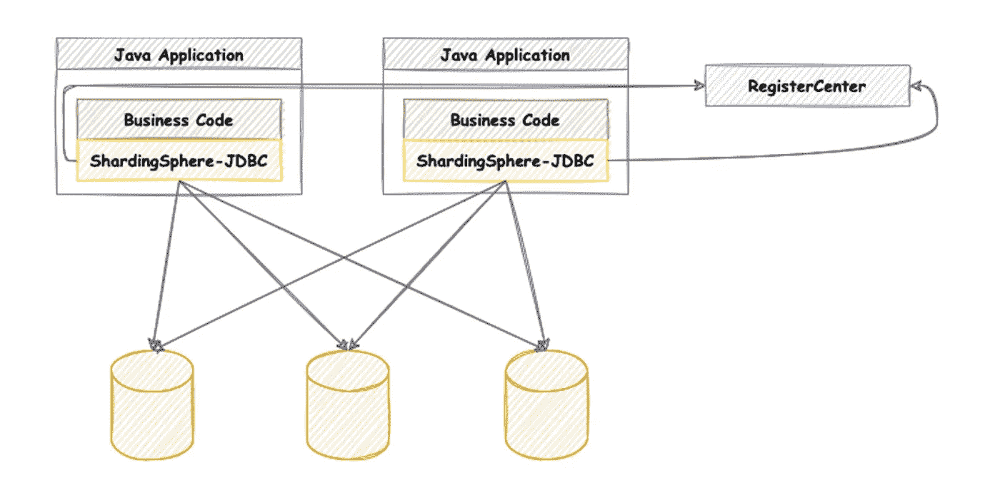
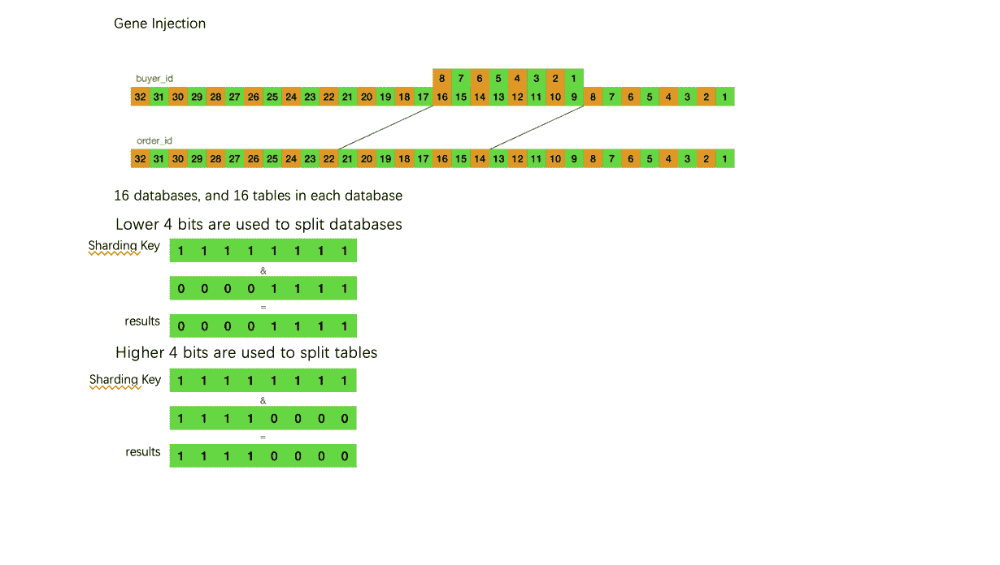
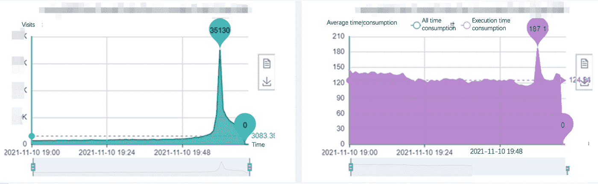

# Apache ShardingSphere 企业应用:拥有数亿条记录的转转交易系统

> 原文：<https://blog.devgenius.io/apache-shardingsphereenterprise-applications-zhuanzhuans-transaction-system-with-100s-of-6ade71faa9e6?source=collection_archive---------8----------------------->

# 背景和挑战

[转转](https://www.zhuanzhuan.com/index.html)是一个允许 it 用户出售二手物品的互联网平台——有点像东方的易贝。它的业务一直在蓬勃发展，随之而来的是订购系统开始面临越来越多的性能挑战。订单数据库是系统的基石，其性能不容小觑。

***挑战:***

*   在促销和特殊折扣期间，数据库的负担非常沉重，每秒数万个单数据库查询(qps)占用了大量数据库资源，并导致写入性能显著下降。
*   数据压力增大，单个数据库包含几个大表，数据上亿，挑战服务器的容量极限。
*   数据量巨大，数据备份和恢复需要很长时间，在极端情况下会带来数据丢失的高风险。

# 为什么是 ShardingSphere？

一开始，转转的团队采取了调整措施来缓解数据库压力。示例包括:

*   ***优化重大交易，减少交易，甚至消除交易***

我们调整了原始的事务顺序，将核心步骤表生成放在最后，并将事务只保存在 order 主数据库中。当主表的操作异常时，允许对其他与订单相关的表进行脏读。

*   ***订单数据缓存***

数据一致性是缓存中最棘手的部分。由于订单数据涉及结算和佣金，非实时和不一致的数据会导致严重的事故。

严格保持缓存数据的一致性会使编码变得复杂，降低系统的并发性。因此，我们在缓存计划上做了一些妥协:

1.  缓存失败时允许直接查询。
2.  添加版本序列号，查询最新版本的数据，保证数据的实时性。
3.  通过 [Elasticsearch (ES)](https://www.elastic.co) 和主次分离进行复杂查询，对于一些大表，我们采用了冷热数据分离。

通过这些优化，减轻了数据库压力。然而，在高并发场景下，比如打折季，这看起来仍然势不可挡。

为了从根本上解决订单数据库的性能问题，转转决定在`order`数据库上采用数据分片(数据库和表拆分)，这样我们就不用担心未来 3-5 年的订单容量了。

壮壮在比较了效率、稳定性、学习成本等因素后，选择了[分片球](https://shardingsphere.apache.org)。不同的数据分片组件。

ShardingSphere 的优势:

*   它提供了标准化的数据分片、分布式事务和数据库治理，适用于多种情况，如 Java 同构、异构语言和云原生。
*   它具有灵活的分片策略，支持多种分片方法。
*   它很容易与其他组件集成，并且事务入侵程度较低。
*   它有大量的文档和活跃的社区。

ShardingSphere 开创了 Database Plus 的概念，并采用了面向插件的架构，其中所有模块都是相互独立的，允许每个模块单独使用或灵活组合使用。

由 [JDBC](https://shardingsphere.apache.org) 、[代理](https://shardingsphere.apache.org/document/current/en/overview/#shardingsphere-proxy)和[边车(规划)](https://shardingsphere.apache.org/document/current/en/overview/#shardingsphere-sidecartodo)三款产品组成，支持独立和混合部署。

以下是三种产品的功能对比:

通过比较，并考虑到高并发性，我们选择了 sharing sphere-JDBC 作为我们的数据分片中间件。

JDBC 是一个轻量级的 Java 框架，在 JDBC 层提供额外的服务。它通过客户端直接连接数据库，通过 Jar 包提供服务，不需要额外的部署和依赖。它可以被看作是一个增强的 JDBC 驱动程序，完全兼容 JDBC 和其他对象关系映射(ORM)框架。

# 项目实施要点

*   **分片键**

当前订单 ID 由`timestamp+user identification code+machine code+incremental sequence`生成。用户识别码取自买方 ID 的第 9 至 16 位，当用户 ID 生成时，它是一个真随机数，因此适合作为分片密钥。

选择用户识别码作为分片密钥有一些优点:

*   数据可以尽可能均匀地分布到每个数据库和表中。
*   可以通过订单 ID 或用户 ID 快速找到具体的分片位置。
*   同一买家的数据可以分布到相同的数据库和表中，方便买家信息的综合查询。

分片策略:我们采用 16 个数据库和 16 个表。用户识别码用于拆分数据库，高 4 位用于拆分表。

*   **新旧数据库之间的数据迁移**

迁移必须在线，不能接受停机迁移，因为在迁移过程中会有新的数据写入。

数据应该是完整的，迁移过程应该对客户端不敏感。迁移后，新数据库中的数据应该与旧数据库中的数据一致。

迁移应该允许回滚，这样当迁移过程中出现问题时，应该能够回滚到源数据库，而不会影响系统可用性。

数据迁移步骤如下:双重写入->迁移历史数据->验证->旧数据库离线。

# 效果和益处

*   解决了单一数据库容量限制的问题。
*   分片后单个数据库和表的数据量大大减少。单个表的数据量从近亿级降低到几百万级，大大提高了整体性能。
*   降低了极端情况下因单个数据库和表过大而导致数据丢失的风险，减轻了运维压力。

下面是在两个促销和折扣期间，订单下达服务的接口调用次数和接口消耗时间的比较:

***推广前采用 ShardingSphere***

***晋级后采用 ShardingSphere***

# 摘要

ShardingSphere 以其精心设计的架构、高度灵活、可插拔和可扩展的功能简化了数据分片的开发，允许 R&D 团队只关注业务本身，从而实现数据架构的灵活扩展。

# Apache ShardingSphere 项目链接:

[ShardingSphere Github](https://github.com/apache/shardingsphere/issues?page=1&q=is%3Aopen+is%3Aissue+label%3A%22project%3A+OpenForce+2022%22)

[ShardingSphere Twitter](https://twitter.com/ShardingSphere)

[切割球松弛度](https://join.slack.com/t/apacheshardingsphere/shared_invite/zt-sbdde7ie-SjDqo9~I4rYcR18bq0SYTg)

[投稿指南](https://shardingsphere.apache.org/community/cn/contribute/)