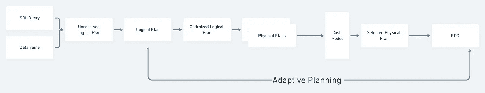
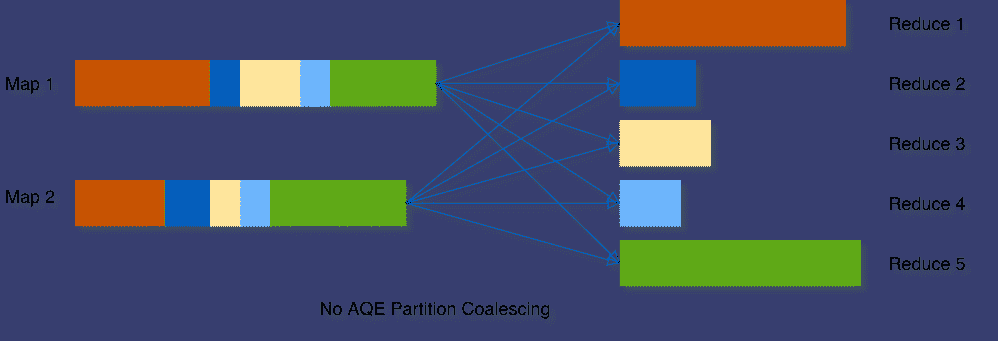
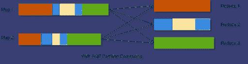
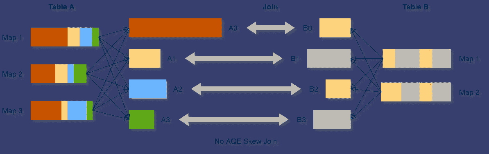
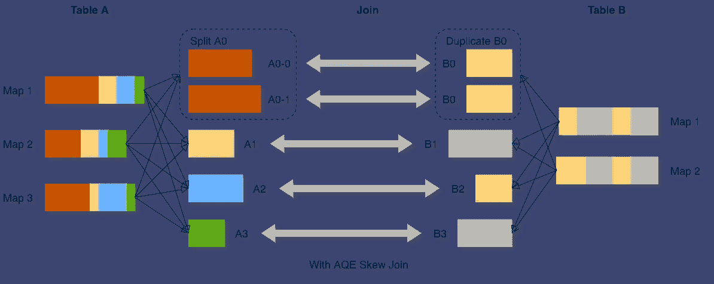

# Apache Spark : AQE(自适应查询执行)

> 原文：<https://blog.devgenius.io/apache-spark-aqe-adaptive-query-execution-d754afff96ba?source=collection_archive---------11----------------------->

# Spark 自适应查询执行

自适应查询执行(AQE)是 Spark 3.0 最重要的特性之一，它根据在查询执行期间收集的运行时统计信息来重新优化和调整查询计划。

在 spark 3.0 中，AQE 受到以下支持:

**🎯动态切换加入策略**

**🎯动态合并洗牌分区**

**🎯动态处理偏斜连接**

## **🎯动态切换加入策略:**

当任何连接端的运行时统计数据小于自适应广播散列连接阈值时，Spark 会将排序-合并连接切换到广播散列连接。通过这样做，我们可以节省两个表上的排序操作，并在本地读取 shuffle 文件以节省网络。

**重要调整变量:**

**如果洗牌必须在本地完成，traffic . spark . SQL . adaptive . localshufflereader . enabled**需要为真。

`spark.sql.adaptive.autoBroadcastJoinThreshold` **10Mb** ，如果该值设置为-1，则广播将被禁用

## **🎯动态合并混洗分区**

混洗操作在 spark 应用程序的性能中起着关键作用。Shuffle 的一个关键属性是分区的数量。如果我们设置几个分区，那么每个分区的数据大小可能会非常大，处理这些大分区的任务可能需要将数据溢出到磁盘，因此会降低查询速度。如果分区太多，那么每个分区的数据大小可能会非常小，并且会有很多小的网络数据读取来读取 shuffle 块，这也会降低查询的速度。为了解决这个问题，我们在开始时设置了一个相对较大的分区，spark 和 AQE 将这些小分区合并成一个。因此 spark 总是保持最佳分区来执行洗牌

图片来源: [Databricks 博客](https://www.databricks.com/blog/2020/05/29/adaptive-query-execution-speeding-up-spark-sql-at-runtime.html)

在上面的例子中，我们需要在所有 5 个分区上执行 Shuffle 操作。现在，如果启用了 AQE，spark 会加入较小的分区，并在较少的分区上执行 Shuffle。

图片来源: [Databricks 博客](https://www.databricks.com/blog/2020/05/29/adaptive-query-execution-speeding-up-spark-sql-at-runtime.html)

**重要调整变量:**

`spark.sql.adaptive.coalescePartitions.enabled` **真**

`spark.sql.adaptive.coalescePartitions.minPartitionSize` **1MB。**合并后混洗分区的最小大小。

## **🎯动态处理偏斜连接**

这个特性与合并分区正好相反。在我们的大多数应用中，我们需要处理数据偏斜。严重的不对称会显著降低查询性能，尤其是对于连接。因此 Spark 有能力识别这种偏斜。

在这个例子中，你可以注意到 **A0** 分区与其他分区相比相当大，因此 A0 需要被分成两个分区。

**重要的调谐变量:**

通过将**spark . SQL . adaptive . skew join . enabled**设置为 true，可以在 spark 中启用该特性，默认值为 True。

`spark.sql.adaptive.skewJoin.skewedPartitionThresholdInBytes`256 MB。如果一个分区的大小(以字节为单位)大于该阈值，则该分区被认为是倾斜的。

`spark.sql.adaptive.skewJoin.skewedPartitionFactor` **5** 。如果一个分区的大小大于该因子乘以分区大小的中值，则该分区被认为是倾斜的

## 参考:

*   [https://spark . Apache . org/docs/latest/SQL-performance-tuning . html # adaptive-query-execution](https://spark.apache.org/docs/latest/sql-performance-tuning.html#adaptive-query-execution)
*   [https://www . databricks . com/blog/2020/05/29/adaptive-query-execution-speeding-up-spark-SQL-at-runtime . html](https://www.databricks.com/blog/2020/05/29/adaptive-query-execution-speeding-up-spark-sql-at-runtime.html)