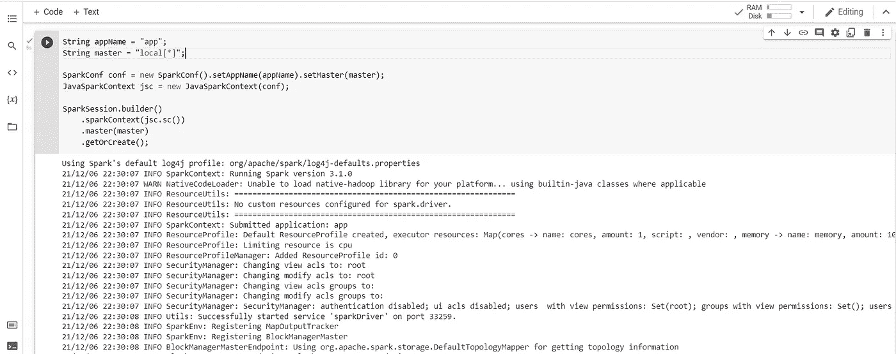
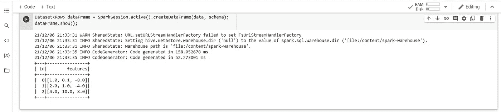
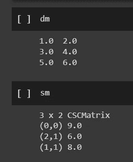

# Jupyter 上的 Apache Spark 与 Java

> 原文：<https://blog.devgenius.io/apache-spark-with-java-on-jupyter-e2a7144dbab6?source=collection_archive---------5----------------------->

使用 Java 在 Google Colab 上运行 Apache Spark 的快速入门


[图片来自 Pixabay](https://pixabay.com/photos/welding-work-metal-tools-man-3963341/)

# 介绍

在以前的文章中，我展示了我们如何在 [Google Colab](https://colab.research.google.com/) 上的 Jupyter 笔记本中用 Java 编码，并使用 [Magics](https://github.com/SpencerPark/IJava/blob/master/docs/magics.md) 通过 Maven 导入库。我们还尝试使用 [Tablesaw](https://jtablesaw.github.io/tablesaw/) 处理数据帧，并使用 [Plotly](https://github.com/plotly) 的 Java 实现创建简单的可视化。

*   [Java、Jupyter 和 Google Colab](https://medium.com/@gmsharpe/jupyter-java-and-google-colab-7a2f7fb08808)
*   [开始使用 Tablesaw 和 Google Colab](https://medium.com/@gmsharpe/getting-started-with-tablesaw-and-google-colab-65ef0cbe280c)
*   [Java、Jupyter 和 Plotly](https://medium.com/@gmsharpe/java-jupyter-plotly-e1bbaa7f2be8)

在本文中，我们将加载一个配置了必要依赖项的内核，以允许我们使用 [Java API](https://spark.apache.org/docs/latest/api/java/) 运行 [Apache Spark](https://spark.apache.org/) 。

# 入门指南

## 先决条件

在完成下一部分之前，您需要熟悉在 Google Colab 上配置和安装内核的步骤，如上面介绍中链接的几篇文章所示。

假设你现在对如何在 Colab 上安装和配置一个 Java 内核还不太熟悉，你可以在 Google Colab 中打开这个 [**Jupyter 笔记本模板**](https://github.com/gmsharpe/edumore/blob/master/blank_notebook_with_java_kernel.ipynb) ，按照下面的说明安装包含必要的 Apache Spark 依赖项的 Java 内核。


[图片来自 Pixabay](https://upload.wikimedia.org/wikipedia/commons/thumb/7/78/Sparkler.JPG/1280px-Sparkler.JPG)

***TL/DR 本节:*** *不好意思，没有捷径。您需要熟悉在 Google Colab 中配置和运行 Java 的步骤。*

*当你是，你可以从这个* [***Jupyter 笔记本模板***](https://github.com/gmsharpe/edumore/blob/master/blank_notebook_with_java_kernel.ipynb) ***开始。***

## 安装 Java 内核

最初的 IJava 笔记本只提供了入门 Java 和 Jupyter 所需的最少的库。下面的内核包括 Apache Spark，稍微简化了设置。

将以下内容粘贴到您的 [**Jupyter 笔记本模板**](https://github.com/gmsharpe/edumore/blob/master/blank_notebook_with_java_kernel.ipynb) 副本中。

这确实需要几分钟，所以要有耐心，多喝点咖啡，沉思片刻，等等。

**导入依赖关系**

完成上述工作后，我们将正式将必要的依赖项导入到我们的环境中。

```
import org.apache.spark.*;
import org.apache.spark.sql.*;
import org.apache.spark.api.java.*;
import org.apache.spark.ml.linalg.*;
import org.apache.spark.sql.types.*;
```

**初始化火花上下文**

我们不会将 Spark 与笔记本电脑“分开”运行。实际上，我们将在笔记本内部启动 Spark，将其作为嵌入式进程运行。

将此复制到笔记本的下一个代码块中并执行。



在你执行代码块之后，在你的 Google Colab 笔记本中的一张图片。

**从一个简单的数据结构中创建一个数据集(Data frame)**

Spark 现在有三个 API 用于表示我们在大多数其他流行上下文中可能认为的数据帧(例如熊猫)。这些是:

*   [弹性分布式数据集(RDD)](https://spark.apache.org/docs/latest/api/java/org/apache/spark/rdd/RDD.html)
*   [数据帧](https://spark.apache.org/docs/1.6.3/api/java/org/apache/spark/sql/DataFrame.html)
*   [数据集<T>](https://spark.apache.org/docs/latest/api/java/index.html?org/apache/spark/sql/Dataset.html)

`SparkSQL`包中的`DataFrame`不再是首选的“高级”表示。相反，我们使用继任者，严格类型化的`Dataset<T>`。

*注意:你可以在* [*三个 Apache Spark APIs 的故事:RDDs vs data frames and Datasets*](https://databricks.com/blog/2016/07/14/a-tale-of-three-apache-spark-apis-rdds-dataframes-and-datasets.html)中了解更多关于这三个在 Apache Spark 中使用的著名 API 的信息

启动 spark 后，我们在笔记本上要做的第一件事是创建一个数据集。



从这里，我们可以向任何方向探索 Apache Spark 的 Java API。

## 矩阵

如果您想在 Apache Spark 中探索矩阵，可以从以下内容开始。

```
// https://spark.apache.org/docs/latest/mllib-data-types.html#local-matrix// Create a dense matrix ((1.0, 2.0), (3.0, 4.0), (5.0, 6.0))
Matrix dm = Matrices.dense(3, 2, new double[] {1.0, 3.0, 5.0, 2.0, 4.0, 6.0});// Create a sparse matrix ((9.0, 0.0), (0.0, 8.0), (0.0, 6.0))
Matrix sm = Matrices.sparse(3, 2, new int[] {0, 1, 3}, new int[] {0, 2, 1}, new double[] {9, 6, 8});
```

在我们的笔记本中，我们可以首先粘贴上面的内容，然后渲染两个矩阵中的每一个以便快速显示，如下所示:



如果您想进一步探索“密集”和“稀疏”矩阵，您可以从 Java API 文档本身开始:

*   [DenseMatrix](https://spark.apache.org/docs/latest/api/java/org/apache/spark/mllib/linalg/DenseMatrix.html)
*   [稀疏矩阵](https://spark.apache.org/docs/latest/api/java/org/apache/spark/mllib/linalg/SparseMatrix.html)

你也可以探索其他的‘矩阵’类型、运算等。在 MLib 文档的[数据类型部分下。](https://spark.apache.org/docs/latest/mllib-data-types.html)

# 结论

这是对使用 Google Colab 的 Java 内核运行 Apache Spark 的简要介绍。Spark 的[文档中有大量简单的教程可以探索，包括 Java 中的例子。](https://spark.apache.org/docs/latest/sql-programming-guide.html)

如果您想尝试创建这篇文章的笔记本的副本，您可以在下面找到它:

*   [完成笔记本](https://gist.github.com/gmsharpe/3c49f3a79f40f90e2d6e5b5dcbda1337)

我很期待看到你们接下来的作品。

**所以，发挥创意**，别忘了[展示你的作品](https://austinkleon.com/show-your-work/)！！


[图片来自 Pixabay](https://pixabay.com/photos/light-orange-bright-art-color-579290/)

# 作者的说明

我很乐意听到任何探索如何在笔记本环境中使用 Java 的人的反馈(Jupyter， [Zeppelin](https://zeppelin.apache.org/) 等)。)和命令行( [JShell](https://docs.oracle.com/javase/9/jshell/introduction-jshell.htm) )上使用 Tablesaw 等工具进行数据处理和可视化。

给我发消息，特别是如果你已经在 Medium 上发表了任何材料，我很乐意在将来相关的时候链接到你的内容。