# Apache Tomcat 挑战:安装、配置、开始工作、SSL 和其他好东西！

> 原文：<https://blog.devgenius.io/apache-tomcat-challenges-install-configure-start-working-ssl-and-other-goodies-95f519cb4926?source=collection_archive---------6----------------------->

Apache Tomcat 是 Java 开发人员社区中最受欢迎的应用服务器。在这里，我们将看一看一个人可能面临的一些挑战，安装，配置，并开始使用它。


# 介绍

这篇文章介绍了 Apache Tomcat 服务器的安装和配置过程，以及如何部署一个应用程序(例如. war 文件)并开始使用它。此外，它在一定程度上涵盖了 Tomcat 的 HTTPS/SSL 配置，并揭示了在这个过程中可能面临的一些挑战。

一般来说，您可以很好地掌握以下主题:

*   Tomcat 和 Tomcat 安装
*   如何配置用户并允许访问管理器应用程序
*   为 HTTPS/SSL 配置 Tomcat(包括 Java keytool 和 OpenSSL)

注:本帖主要讲述如何在 Debian/Ubuntu 和 macOS 中安装并开始使用 Tomcat。然而，因为 Tomcat 是基于 Java 的，所以在其他操作系统上的安装非常相似。(在 Windows 中，它是作为服务运行的:在这里勾选)。

# 总的来说是雄猫

[**Apache Tomcat**](https://tomcat.apache.org/) 是 Java / Spring Boot 开发者社区最流行的 Java 应用服务器。

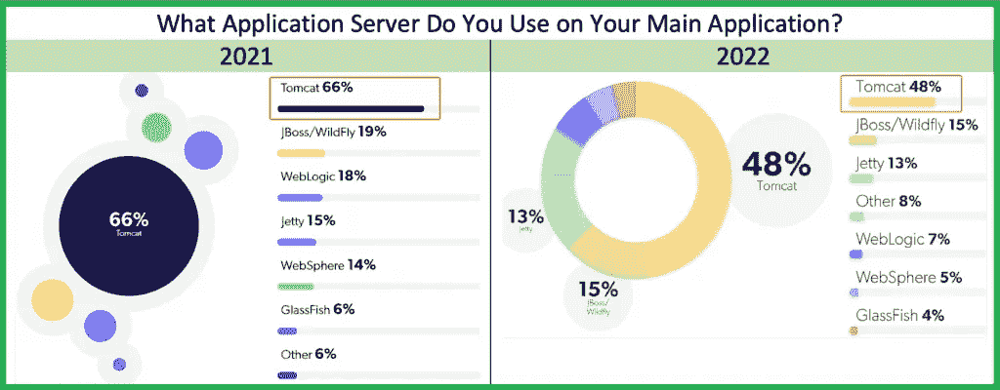

它如此受欢迎的一些原因是:

*   它是开源的
*   这是一个成熟的球员(超过 15 岁)
*   嵌入到 [Spring 工具套件(STS)](https://github.com/spring-projects/toolsuite-distribution/wiki/Spring-Tool-Suite-3) (目前为止)
*   在 [VS 代码](https://code.visualstudio.com/)中通过 [Tomcat for Java](https://marketplace.visualstudio.com/items?itemName=adashen.vscode-tomcat) 扩展进行管理。
*   任何基于 [Maven](https://maven.apache.org/) 的 web 项目的一部分，使用 [Spring Boot 启动 Web](https://mvnrepository.com/artifact/org.springframework.boot/spring-boot-starter-web) (例如通过 [Spring Initializr](https://start.spring.io/) 创建)
*   可用于基于 [Gradle](https://gradle.org/) 的项目，作为插件——扩展 [War 插件](https://docs.gradle.org/current/userguide/war_plugin.html)的 [gradle-tomcat-plugin](https://github.com/bmuschko/gradle-tomcat-plugin) 。
*   它有很好的文档和社区支持
*   它基于 Java，支持所有 3 个主要平台(Windows、Linux、macOS)
*   而且，相当重要的是:它是**免费的**！

其他著名的 Java 服务器有:

*   [突堤](https://www.eclipse.org/jetty/)遭月蚀
*   甲骨文公司的 GlassFish
*   [红帽的野花](https://www.wildfly.org/)(前 JBoss)
*   [WebLogic](https://www.oracle.com/java/weblogic/) by Oracle(见我的帖子[此处](https://medium.com/dev-genius/oracle-weblogic-java-application-server-developers-version-dde0970cef26)安装)

在这篇文章中，我们将看看如何安装并开始使用 Apache Tomcat。(这是一个 macOS 安装，但是，由于 Tomcat 是用 Java 构建的，所以在其他 OS 上的安装非常相似)。

# 为 Tomcat 安装选择合适的版本

首先，我们必须决定哪个版本更适合我们的开发/部署需求。你可以去 [Apache Tomcat 网站](https://tomcat.apache.org/)点击左边的“[哪个版本](https://tomcat.apache.org/whichversion.html)”链接，你可以看到可用版本的列表。

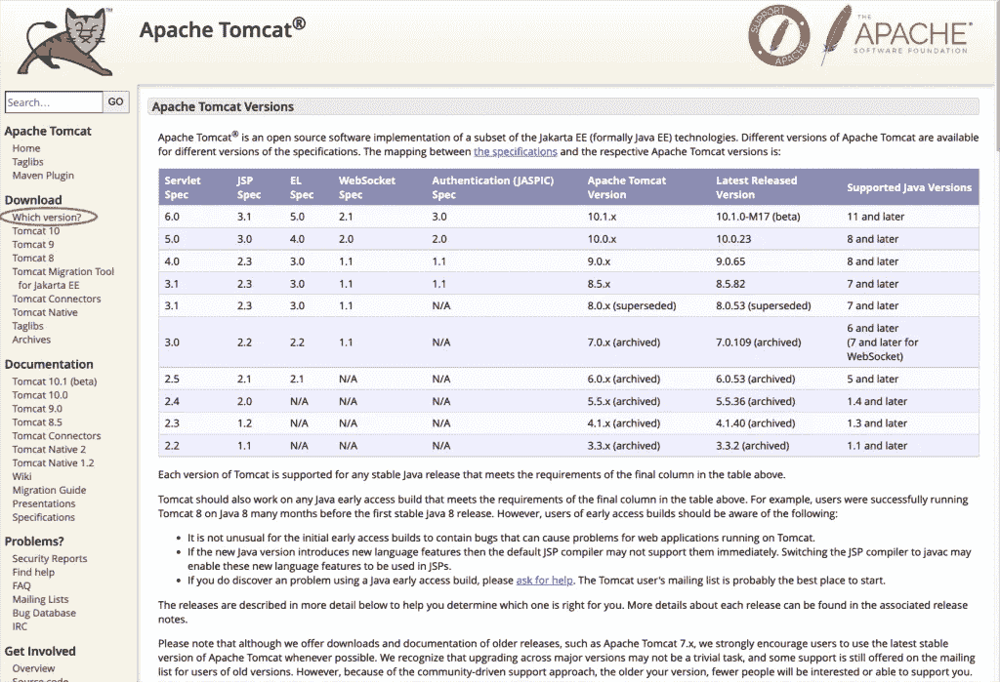

最新版本(2022 年 9 月 15 日)是 10.1.x 版，需要 Java 版或更高版本。嗯，实际上[版本](https://tomcat.apache.org/download-10.cgi) [](https://tomcat.apache.org/download-90.cgi#9.0.46)10.0.23 适用于 Java 版本 8，但是，请注意，从 Tomcat 10 和更高版本开始，(作为将 Java EE 转移到 Eclipse Foundation 的一部分，从 Java EE 转移到 Jakarta EE 的结果)，所有实现的 API 的主包已经从 javax 改变了。*去雅加达。*.10.x 版本可能具有足够的挑战性，可能需要一些我们现在不想处理的变化。因此，除非您决定放弃 Java 版本 8 或更早，否则更好的方法可能是使用 Tomcat [版本](https://tomcat.apache.org/download-90.cgi#9.0.46) 9(准确地说是 9.0.65 ),这当然也适用于 Java 版本 8。

因此，在继续之前，请确保您的 macOS 至少安装了 Java 版本 8:

# 装置

转到下载[部分](https://tomcat.apache.org/download-90.cgi#9.0.65)并选择下载包:

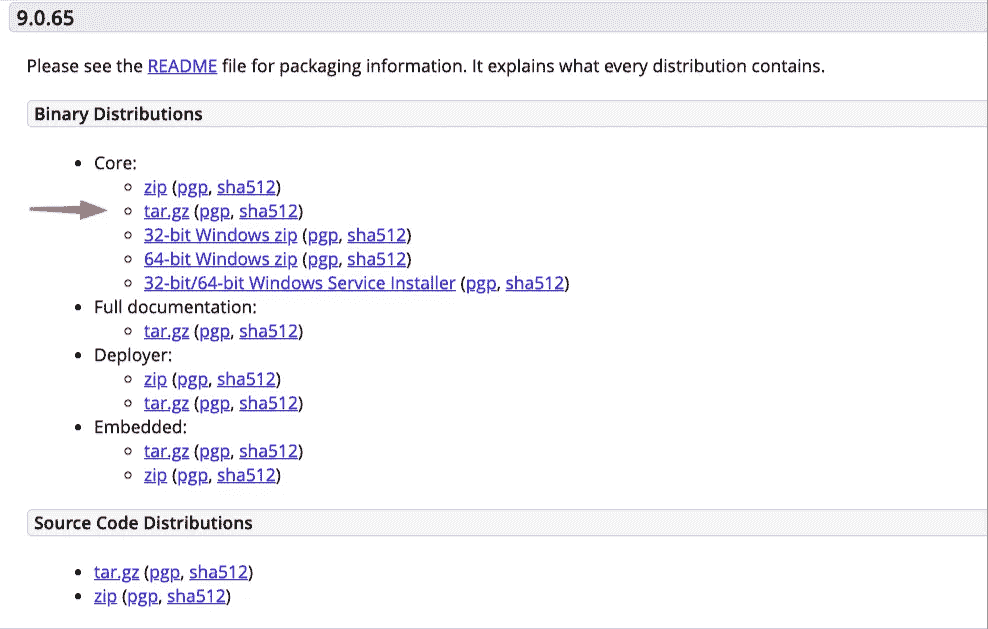

注意:您也可以下载完整的文档，如上所示。

选择系统中的一个文件夹进行下载。该文件夹也可以是 Tomcat 的安装文件夹。更改用户对该文件夹的访问权限，并解压缩下载的归档文件。

# 安装文件夹结构

为了能够管理 Tomcat 服务器(例如，部署 Java 应用程序-。war 文件，我们必须拥有对 Tomcat 服务器的**管理访问权**。默认情况下，这是禁用的，所以我们必须自己做。这意味着我们必须为此配置 Tomcat。在默认配置中，Tomcat 使用基于角色的授权，并为此预定义了一些必要的**经理/管理员**角色。因此，简单地说，我们要做的就是添加一个用户(定义他/她的凭证用户名和密码，并给他/她那些经理/管理员角色。在此之前，让我们先来看看创建的解压缩结构的一些重要文件夹:

**Tomcat 主/重要文件夹和子文件夹**

*   **bin** :包含二进制文件；以及启动脚本(Windows 的 startup.bat 和 Unix 和 Mac OS 的 **startup.sh** )、 **shutdown.sh** 脚本(Windows 的 shutdown.bat 和 Unix 和 Mac OS 的 shutdown.sh)等二进制和脚本。
*   **conf** :包含系统范围的配置文件，比如 **server.xml** 、web.xml 和 context.xml。(稍后我们将使用 **server.xml** 来配置 HTTPS/SSL 的 Tomcat 服务器)
*   **webapps** :包含需要**部署**的 webapps。您还可以将 WAR (Webapp Archive)文件放在这里进行部署。
*   lib:包含 Tomcat 的全系统 JAR 文件，所有 webapps 都可以访问。您也可以在这里放置一个外部 JAR 文件(比如 MySQL JDBC 驱动程序)。
*   **日志**:包含 Tomcat 的日志文件。您可能需要在这里检查错误消息。
*   **work**:JSP 使用的 Tomcat 的工作目录，用于 JSP 到 Servlet 的转换。

# 启动/停止 Apache Tomcat 服务器

安装程序为我们提供了一些可执行的 Bash 脚本(放在/ **bin** 子文件夹中)，其中两个可用于启动和停止 Tomcat 服务器。

在运行它们之前。确保所有批处理 shell 脚本都是可执行的，例如:

```
➜  Tomcat chmod +x ./bin/*.sh
```

要启动 Tomcat 服务器，请使用:

```
./bin/startup.sh
```

之后，您可以通过您的浏览器检查它(8080 是 Tomcat 的默认端口)

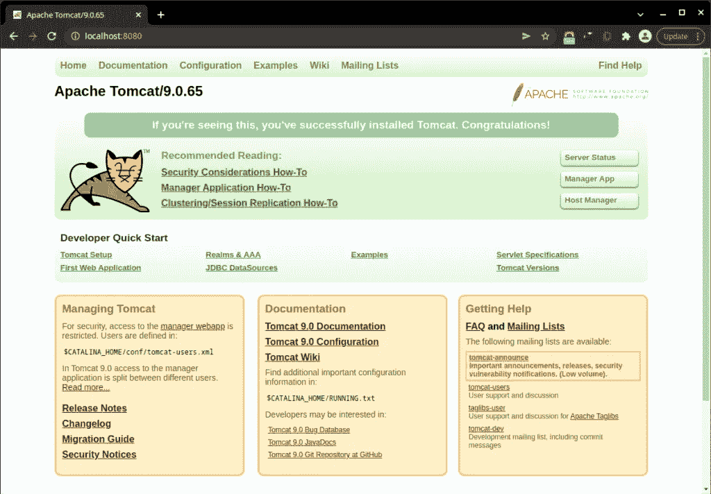

类似地，您可以通过运行以下命令来**关闭/停止**正在运行的 Tomcat:

```
./bin/shutdown.sh
```

# 允许访问经理应用程序

正如您可能注意到的，安装文件夹结构包含一个子文件夹 name / **conf。**/**conf**文件夹包含系统范围的配置文件。这个文件夹还包括 **tomcat-users.xml** 文件，我们可以在其中添加一个新用户并为他分配管理角色。所以，去吧../Tomcat/c**onf/Tomcat-users . XML**文件，打开它进行编辑，并在最后的结束标记前添加以下行(用您希望的替换用户名和密码):

然后重新启动 Tomcat 服务器(停止并再次启动)。之后，您将能够访问以下按钮/链接的**服务器状态**和**管理器应用程序**:

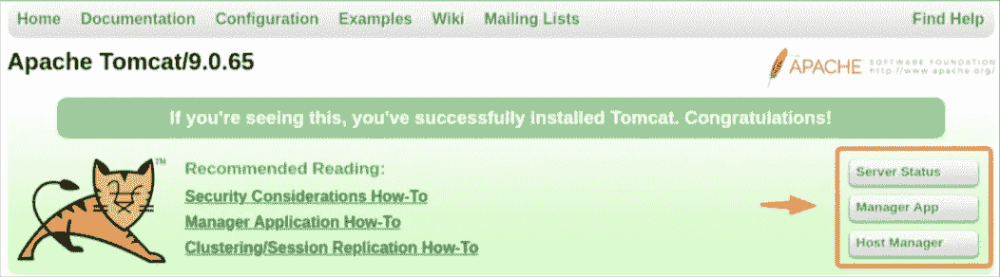

当然，在您登录之后:

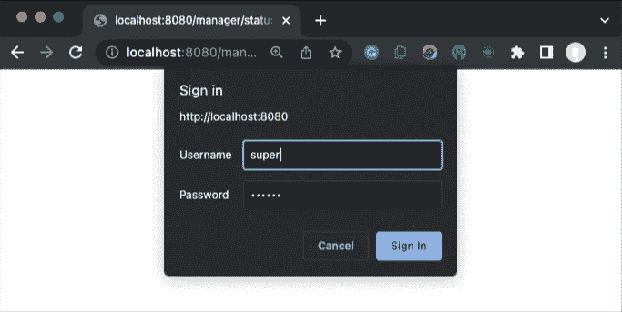

# 部署 Java 应用程序(。war 文件)

我们可以部署我们的 Java 应用程序(实际上。jar 或更常见的 web 应用程序**。war** 文件)通过**管理器应用**链接，即通过 **Tomcat Web 应用管理器**:

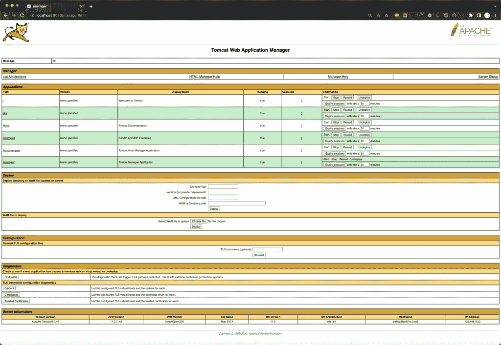

部署. war 文件可以在 **WAR 文件**部署部分完成:

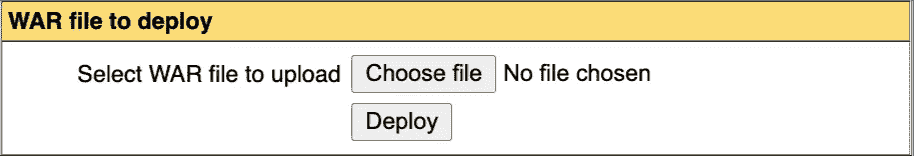

很简单，选择。war 文件，然后点击部署。之后，您可以在应用程序部分看到部署。如果您的文件名为“api ”,您将看到它的“/api”结尾[point:

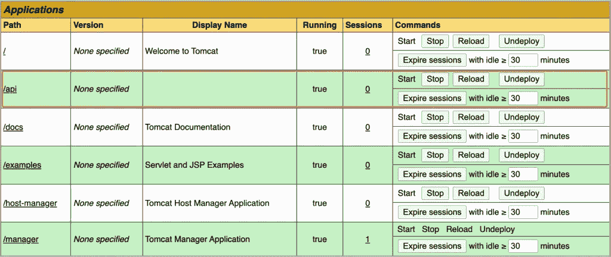

# 为 HTTPS/SSL 配置 Tomcat

## 创建自签名服务器证书

如果您想使用 [HTTPS](https://en.wikipedia.org/wiki/HTTPS) 协议来保护您的 Java web 应用程序，您还必须相应地配置 Tomcat。在我们的例子中，我们将使用自签名证书。我们可以使用众所周知的工具来创建自签名证书，比如标准的 OpenSSL 工具或 Java keytool 工具。

**使用 java keytool**

👉注意:Java 密钥库(JKS)文件是一个受保护的结构化文档，主要包含关于私有证书的密钥库部分和其他导入的可信证书条目。Tomcat 仅适用于 [JKS](https://en.wikipedia.org/wiki/Java_KeyStore) 、 [PKCS11](https://en.wikipedia.org/wiki/PKCS_11) 或 [PKCS12](https://en.wikipedia.org/wiki/PKCS_12) 格式的密钥库。在 Java 9 版本之前，JKS 商店类型是默认的。从 Java 版本 9 开始，默认的密钥库格式是行业标准的 PKCS12。但是，要足够小心，使用与 JDK 版本相同的 keytool 的正确版本，作为 Java 的运行时版本。否则，您可能会面临初始化 Tomcat SSL 连接器的问题，例如，如果您使用 JDK 版本 11 的 keytool 创建您的密钥库(默认格式为 PKCS12)，并且您的 Java 运行时环境使用 Java 1.8。(类似“无法初始化组件[连接器[HTTP/1.1–8443]]”和“密钥库格式无效”的错误)。如果使用-deststoretype 将类型设置为不推荐使用的格式 **jks** ，您可能不会遇到任何问题，但是，您会得到一个警告:“警告:jks 密钥库使用专有格式。建议迁移到 PKCS12，这是一种行业标准格式……”。Catalina 每日日志(在/logs 子文件夹中)提供了关于 Java 运行时版本的信息。

Java keytool 是一个工具，用于管理(公共/私有)安全密钥和证书，并将它们存储在 Java KeyStore 文件中(通常具有扩展名)。 **jks** )。任何标准的 JDK/JRE 发行版都提供了 keytool，通常您可以在%JAVA_HOME%\bin 文件夹下找到它。

使用 keytool 创建一个新的(默认)密钥库文件非常简单。我们只需要给它一个别名和更好的算法。例如:

```
keytool -genkey -alias tomcat1 -keyalg RSA
```

以上命令以交互方式创建一个新的。密钥库文件以及服务器证书。因为我们没有提供任何 storetype 选项，所以默认的密钥库类型主要取决于 JDK 版本。最新版本的 java 创建了一个 PKCS12 类型，而旧版本创建了一个 JKS 类型。您可以强制使用要创建的密钥库的类型，只需添加-storetype 参数和 PKCS12 值，如下所示:

```
keytool -genkey -alias tomcat1 -keyalg RSA -storetype pkcs12
```

执行该命令时，我们还必须(交互地)提供一些信息(这几乎是任何数字证书的标准)，如名称、组织、组织单位、城市和国家。下面，您可以看到我们如何创建这样一个证书的示例(在 Java 检查之后):

因为我们还没有为我们的密钥库定义任何特定的路径名(使用-keystore 参数)，所以新的。keystore”文件应该已经在您的主文件夹中生成。要检查它，使用以下命令，(提供我们之前使用的密码—默认为“changeit”):

如果您想要“静默”执行，您可以在命令行中传递需要交互提供的全部信息，并定义您自己的密钥库文件的完整路径名，您可以这样做:

```
keytool -genkey -alias tomcat1 -keyalg RSA -storepass mypassw1 -keypass mypassw1 -keystore $HOME/Tomcat/conf/tomcatkeystore.jks -storetype pkcs12 -dname "CN=Panos, OU=development, O=devxperiences.com, L=ATHENS, ST=ATTIKA, C=GR"
```

运行上面的命令会在 Tomcat 安装的/conf 子文件夹中创建一个名为“tomcatkeystore.jks”(标准 PKCS12 格式)的密钥库文件。

要获得它的信息，您可以再次使用 keytool -list 命令，这次也传递密钥库的完整路径名:

```
keytool -list -keystore $HOME/Tomcat/conf/tomcatkeystore.jks
```

## **配置 Tomcat 以使用我们的 JKS 密钥库**

正如我们已经说过的，我们必须修改/更新的文件是 Tomcat 安装的/ **conf** 子文件夹中的 **server.xml** 文件。这里可以看到 **server.xml** 文件[的默认内容。](https://gist.github.com/zzpzaf/4b13d3e6f4e92d8db2c55cb364846d18)

Tomcat 使用连接器**来配置特定的特性。一个**连接器**代表一个端点，通过它接收请求并返回响应。默认的 HTTP 连接器使用 HTTP/1.1 版并侦听 8080 端口。但是如果使用的是 HTTPS 协议，那么它会将其重定向到 8443 端口。类似地，安全 HTTPS 协议应该通过连接器进行配置。**

因此，我们现在必须改变的是，例如，修改标有红色矩形的注释块，如下所示:

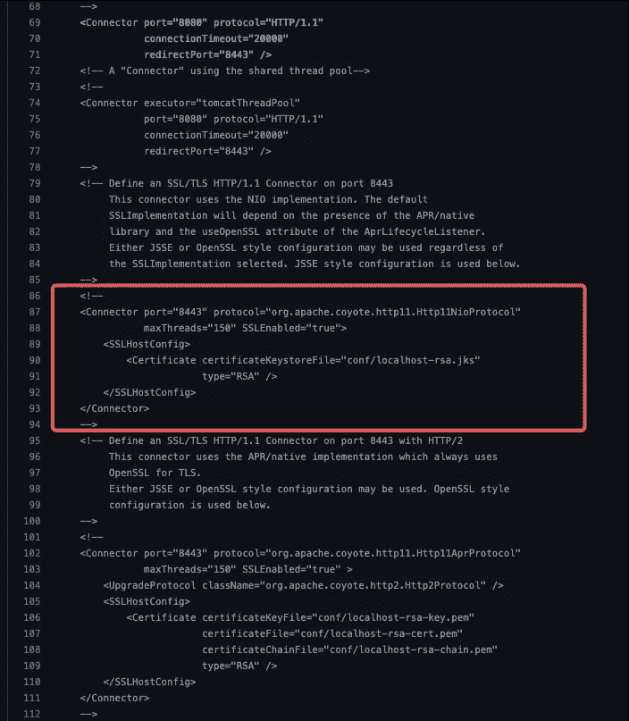

通常，我们必须:

*   将 SSLEnabled 属性设置为 true。
*   将 scheme 属性值设置为 https
*   将安全属性设置为 true 值

请注意，从 Tomcat 8.5 开始，连接器中的大多数 SSL 配置属性都被否决了，但是它们必须在 **SSLHostConfig** 元素中使用。[Tomcat 10 将不再支持连接器中的 SSL 配置属性]。因此，我们必须定义至少一个 **SSLHostConfig** 元素，其中我们还必须定义至少一个**证书**。在我们的例子中，我们要做的是定义 certificateKeystoreFile 属性，并将我们的密钥库文件的路径名和密码(以及我们用来创建服务器证书的算法)传递给它。

因此，取消推荐该块，进行以下更改并保存它:

如果一切正常，那么您可以使用 HTTPS 协议访问 8443 端口(当然，正如您在下面看到的，您的浏览器反对服务器证书是自签名证书，但是您可以忽略它):

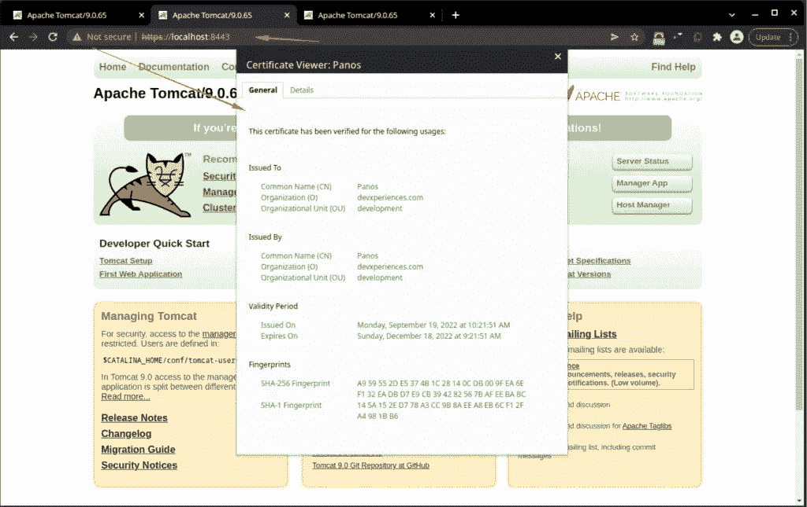

## 使用 OpenSSL 工具

注意:在继续之前，您必须知道，在 Tomcat 上使用 [OpenSSL](https://www.openssl.org/) 创建的证书和 OpenSSL 实现，要求您的系统中已经安装了基于 APR 的本地库，并且 Tomcat 可以访问它。APR 本身也需要 Apache 可移植运行时(APR)库。APR 是对 [Apache](https://en.wikipedia.org/wiki/Apache_HTTP_Server) web 服务器的支持库，也提供了一些更多的[增强和功能](https://en.wikipedia.org/wiki/Apache_Portable_Runtime)你可以在我的几篇文章中找到关于如何安装这些库的更多信息:

[](https://medium.com/@zzpzaf.se/installing-the-apache-portable-runtime-apr-libraries-a7214d9b4ba6) [## 安装 Apache 可移植运行时 APR 库

### APR 是 Apache web 服务器的支持库，也提供了更多的包装和功能。在这个…

medium.com](https://medium.com/@zzpzaf.se/installing-the-apache-portable-runtime-apr-libraries-a7214d9b4ba6) [](https://medium.com/@zzpzaf.se/installing-the-apache-portable-runtime-apr-based-native-library-for-tomcat-57fb307b27df) [## 为 Tomcat 安装基于 APR 的 Apache 可移植运行时本地库

### 安装 Tomcat APR 本地库使我们能够顺利地工作:JSSE 和 OpenSSL 实现。

medium.com](https://medium.com/@zzpzaf.se/installing-the-apache-portable-runtime-apr-based-native-library-for-tomcat-57fb307b27df) 

## 检查系统中 OpenSSL 的安装情况

在继续之前，请确保您已经在系统中安装了 OpenSSL。例如:

## 👉macOS 的注意事项

确保您将使用您希望的 OpenSSL 版本。在某些 macOS 中，通过[自制软件](https://brew.sh/)安装的 openssl 可能不同于通过“**哪个 openssl** 命令显示的默认 OpenSSL。例如，你可以在你的 MAC 上找到默认安装的[LibreSSL](https://www.libressl.org/) 版本，这可能不是你的选择，也许你更喜欢使用家酿正在使用的“官方” [OpenSSL](https://www.openssl.org/) 版本。

下面，你可以看到 MAC 上的“默认”OpenSSL 是 LibreSSL:

了解 OpenSSL 是否安装在您的 MAC 上以及安装在哪里，以及其他相关信息(如版本等。)使用下面的命令:

正如你在上面看到的，brew 提供了足够的信息来了解二进制文件安装在我们 MAC 的什么位置(一般自制程序会将符号链接放入目录: **/usr/local/opt/** )。因此，如果您愿意，您可以直接从那里获得包，例如:
使用 ls 命令:ls -l /usr/local/opt/openssl@3*

```
lrwxr-xr-x 1 zp admin 25 Sep 16 17:47 /usr/local/opt/openssl@3 -> ../Cellar/openssl@3/3.0.5
```

因此，您可以通过将 openssl@3 放在路径的第一位来将其作为默认的 openssl 版本，或者使用它的完整路径名直接使用它:**/usr/local/opt/OpenSSL @ 3/bin/OpenSSL**。

OpenSSL 有一组丰富的命令和参数可供您使用。以下是其中一些常用的列表:

*   openssl :这是创建和管理 openssl 证书、密钥和其他文件的基本命令行工具。
*   **版本**或**版本-a** :向我们提供关于系统中安装的 OpenSSL 的简短和详细信息。
*   req :这个子命令指定我们想要使用 X.509 证书签名请求(CSR)管理。“X.509”是一种公钥基础设施标准，SSL 和 TLS 遵循这一标准进行密钥和证书管理。我们想要创建一个新的 X.509 证书，所以我们使用这个子命令。
*   **-x509** :这进一步修改了前面的子命令，告诉实用程序我们想要生成一个自签名证书，而不是像通常情况下那样生成一个证书签名请求。
*   **-节点**:这告诉 OpenSSL 跳过用密码短语保护我们的证书的选项。我们需要 Apache 能够在服务器启动时读取文件，而无需用户干预。密码可以防止这种情况发生，因为我们必须在每次重启后输入密码。
*   **-天数**:该选项设置证书被认为有效的时间长度。我们在这里设定了 8 年。(365×8=2920)
*   **-keyout** :这一行告诉 OpenSSL 将我们正在创建的生成的私钥文件放在哪里。
*   **-out** :这告诉 OpenSSL 在哪里放置我们正在创建的证书。
*   **-newkey rsa:2048** :指定我们要同时生成新的证书和新的密钥。在前面的步骤中，我们没有创建签名证书所需的密钥，所以我们需要在创建证书的同时创建密钥。rsa:2048 部分告诉它生成一个 2048 位长的 rsa 密钥。

👉在官方手册页找到完整的列表，这里是。

在我们获得了 OpenSSL 安装变体的更清晰的视图之后，我们可以继续使用它来创建一个独立的自签名私钥证书。注意:这里的术语“独立”用于说明私钥和证书都是在单独的文件中创建的，它们不驻留在任何密钥库文件中。

## 使用私钥创建新的独立 SSL 证书

假设您已经将 openssl 放在您的路径的第一位，并且您在您的主目录中(并且您已经在名为/Tomcat 的文件夹中部署了 Apache Tomcat)，您可以使用 openssl 工具在 he /conf 子文件夹中创建私钥和证书文件，如下所示:

```
openssl req -x509 -nodes -days 730 -newkey rsa:2048 -keyout Tomcat/conf/tomcat_devx_01.key -out Tomcat/conf/tomcat_devx_01.pem
```

上述命令以交互方式工作，即它要求输入一些关于您要创建的证书的标准信息，如下所示:

然后，它使用私钥(通过私钥的文件: **"tomcat_devx_01.key"** )创建一个生命周期为 2 年(730 天)的自签名证书。OpenSSL 会将该证书存储在一个名为“ **tomcat_devx_01.pem** ”的 [X509](https://en.wikipedia.org/wiki/X.509) 格式的文件中。分别用于私钥和证书的两个文件“tomcat_devx_01.key”和“tomcat_devx_01.pem”放在/conf 子文件夹中:

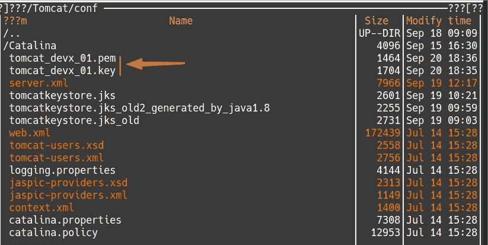

注意，我们使用了 **-nodes** 参数，因此，我们没有创建受密码保护的密钥文件。这不是最好的，但是对于你自己控制的服务器的证书来说，这是一种常见的做法，但是，你必须始终保持密钥文件的安全。您可以使用以下命令查看私钥:

```
~$ openssl rsa -**in** Tomcat/conf/tomcat_devx_01.key -check
```

完成后，使用–**x509**命令验证自签名证书。此处给出了该命令的完整描述[。](https://www.openssl.org/docs/man3.0/man1/x509.html)

对于完整/扩展信息:

```
~$ openssl x509 -noout -subject -issuer -enddate -in Tomcat/conf/tomcat_devx_01.pem
```

或者，简称为:

```
~$ openssl x509 -in Tomcat/conf/tomcat_devx_01.pem -text
```

## 更新 Tomcat 配置

在您已经很好地掌握了 OpenSSL 工具之后，是时候更新 Apache Tomcat server.xml 文件以使用我们创建的私钥和证书了。请参见下面的如何更新块(以前与密钥库一起使用):

同样，在重新启动 Apache Tomcat 之后，如果一切正常，您可以使用 HTTPS 协议访问 8443 端口:

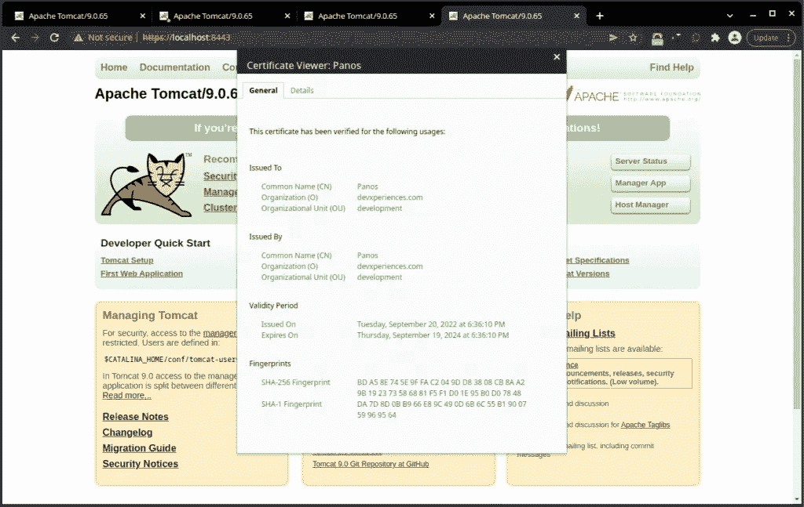

请注意，可以导入 X509。pem 证书转换成 Java keystore，将其转换成常用的 Java keystore，DER 格式。(DER 代表“**区分编码规则**”，通常是 X509 的二进制格式。证书。您可以通过使用以下两个命令来实现这一点:

然后，您可以列出默认密钥库中的证书。查看下面的完整输出:

# HTTPS 的改进

在 Tomcat 官方文档中可以看到( [SSLHostConfig](https://tomcat.apache.org/tomcat-9.0-doc/config/http.html#SSL_Support_-_SSLHostConfig) —协议属性)，Tomcat 支持许多 [HTTPS 传输协议](https://en.wikipedia.org/wiki/Transport_Layer_Security#TLS_1.3)。其中一些要么已经过时，要么不安全。最近支持的协议是提供扩展安全性的 [TLSv1.3](https://en.wikipedia.org/wiki/Transport_Layer_Security#TLS_1.3) 。而且，把我们的设置从 [HTTP1.1](https://httpwg.org/specs/rfc9112.html) 升级到 [HTTP1.2-HTTP/2](https://httpwg.org/specs/rfc7540.html) 也是个不错的主意。

所以，如果你没有其他考虑(浏览器支持，哈希函数支持等。)，我们可以为 HTTP/2 升级 Tomcat 设置，并且只允许 TLSv1.3 协议。同样，转到您的 Tomcat server.xml 文件，只更新我们到目前为止一直在处理的 HTTPS 代码块，如下面的代码块:

# Tomcat 托管服务平台

[更新于@[Yannis pana GIS](https://medium.com/@yannis.panagis)2022 . 9 . 27 评论]

通常，我使用自己的私有 Linux 服务器来托管我的 Tomcat 安装和应用程序。然而，任何人都不是这样。因此，为了方便起见，下面列出了一些知名的托管平台，可以用于您的 Tomcat。

因为 Tomcat 是一个 Java 应用服务器，所以它通常需要一些基础，也就是一个环境(OS、JRE 等)。)进行安装、运行和维护。这意味着，在大多数情况下，它需要一个容器(或虚拟机)及其托管平台。

下面的大多数平台除了提供 Tomcat 托管服务之外，还提供更多的托管服务，它们使用各种基于容器化和/或虚拟机的解决方案。其中一些更专注于 Tomcat，其他的提供更多的功能和服务。

Tomcat 托管服务平台:

[A2 托管](https://www.a2hosting.com/tomcat-hosting?aid=4a3e2f6e)

[JavaPipe](https://javapipe.com/)

JVMHost

[摩卡霍斯特](https://alterwebhost.com/tomcat-hosting/)

[玫瑰托管](https://www.rosehosting.com/tomcat-hosting/)

[DailyRazor](https://www.dailyrazor.com/tomcat-hosting/)

[蔚蓝色](https://azuremarketplace.microsoft.com/en-us/marketplace/apps/cloud-infrastructure-services.tomcat-centos?tab=Overview)

[卡马拉](https://www.kamatera.com/express/compute/apps.php?tcampaign=35166_408154&bta=35166&nci=5451#app=Tomcat)

[Virtuozzo](https://www.virtuozzo.com/application-platform-docs/tomcat/)

[液体网](https://www.liquidweb.com/products/dedicated/)

[利诺德](https://www.linode.com/)

我们做到了！—就是这样！

我希望你喜欢这篇文章，谢谢你👏为了阅读它！