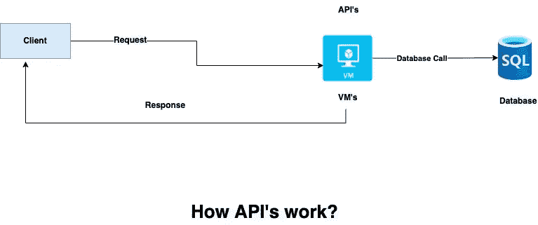
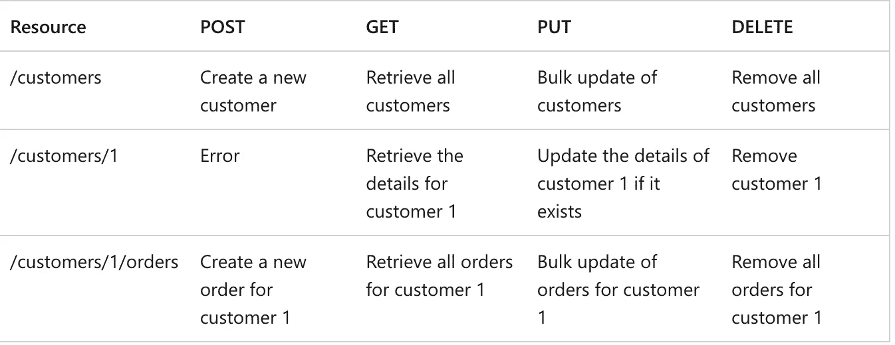
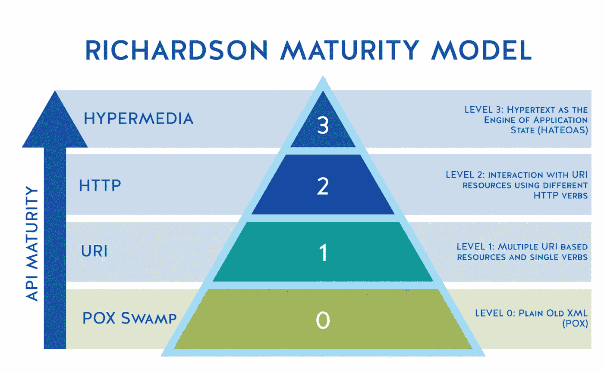

# API : 101

> 原文：<https://blog.devgenius.io/api-101-773ec501b485?source=collection_archive---------4----------------------->

这篇博客是我们从零开始讨论 101 个概念的系列文章的一部分，读者的入门知识有限。这篇文章属于*初级*系列，因为它涉及创建 API 时的一些基本设计模式。

云系列中的一些早期博客如下:

[**异步通信 101**](/async-communication-101-b04d5c95333a) [**负载均衡 101**](/load-balancing-101-8251350c033f)[**缓存 101**](/caching-101-634ef4f8ed1b)[**数据库 101**](/database-101-13d593ec4078)

# 什么是 API？

API 代表**应用编程接口，**云上托管的两个物理硬件或虚拟机之间的连接。与实际的用户界面不同，API 在后台异步或同步地公开一组功能，这取决于所支持的业务领域。

根据所公开的实际操作，API 可以是各种类型的- **GET、POST、PUT、PATCH、DELETE 等。**涵盖作为*请求主体/标题、*响应主体/标题的一部分发送的规范的文件称为 **API 规范。**

作为 API 开发的一部分，应该添加两个突出的特性— **平台独立性**，即任何客户端都能够调用 API，以及**服务演进**，即能够向这些 API 添加新功能，而无需对客户端进行任何更改。

# REST API 的类型

Web API 可以理想地公开为 [**REST**](https://en.wikipedia.org/wiki/Representational_state_transfer) 或 [**SOAP**](https://en.wikipedia.org/wiki/SOAP) ，REST 由于其互操作性是现代架构中更常用的模式。本节将介绍 REST 学校中公开的流行 API 方法。

*   **GET** —在指定的 URI 位置检索资源。通常的响应代码是 **200 (** 内容存在)、 **204** (无内容)或 **404** (未找到)。
*   **POST**–在指定的 URI 位置创建资源。通常的响应代码是 **201** (内容已创建)或 **400 (** 错误请求)。
*   **PUT**–在指定的 URI 位置创建或替换资源。通常的响应代码是 **201** (内容已创建)、 **204** (无内容)或 **409** (冲突)
*   **补丁**–部分更新指定 URL 上的资源。通常的响应代码是 **201** (内容已创建)或 **400** (错误请求)。
*   **删除** —删除指定 URL 上的资源。通常的响应代码是 **204** (无内容)或 **404** (未找到)

**REST API 的示例**

# REST API 的成熟度模型

*   **级别 1.0** —最不符合 **REST** 应用程序架构，该级别只为整个应用程序公开一个 **HTTP POST** 方法
*   **级别 2.0 —** 与级别 1.0 不同，该级别为不同的资源公开了多个 **HTTP POST** URI。
*   **3.0 级—** 比 2.0 级更成熟，这个级别公开了不同的方法类型，如 **GET、POST、PUT、PATCH 等。**
*   **Level 4.0 —** 最成熟和最稀有的层次，这个层次通过超文本暴露应用的不同状态，也称为 [**HATEOAS**](https://en.wikipedia.org/wiki/HATEOAS) **。**

# API 建议

*   API 端点应该基于名词而不是实际的动词。**举例**-***domain.com/orders/***比***domain.com/create-orders/.***
*   应该避免简单反映内部数据库结构的 API。如果数据库引擎的底层模式发生变化，API 应该独立于它。
*   避免使用 URI 层级超过三层的 API。ex—***domain.com/x1/x2/x3***应该回避。
*   应该避免喋喋不休的应用程序，即多个 API 调用来暴露少量资源。这增加了 web 服务器的整体负载，相反，理想情况下，API 应该返回非规范化的大型资源。
*   Restful APIs 应该进行版本控制，以确保向后兼容性。例-**domain.com/v1/orders 和 domain.com/v2/orders.**
*   任何 API 响应都不应该覆盖任何应用程序状态，并且在业务流中调用 API 的相对顺序应该是独立的。

# 例子

为了使用一个支持服务和模型层的示例 java rest 应用程序，可以使用下面的 repo。

 [## azure-function-incident bot/src/main/Java/org/example/incident bot at master…

### Azure 函数上的 Java 事件机器人。通过创建一个……为 Amit 894/azure-function-incident bot 开发做出贡献

github.com](https://github.com/amit894/azure-function-incidentbot/tree/master/src/main/java/org/example/incidentbot) 

# 摘要

API 构成了大多数现代应用程序的主干。良好的设计有助于将应用程序扩展到非功能性需求，如性能、可靠性和弹性。API 设计有用的另一个领域是用于监控和调试目的的端到端请求跟踪，以支持生产系统。虽然这篇博客讨论了 API 实现的基础，但是我们将使用一个实际的例子来讨论如何将一个业务功能分解成多个 API。

*如需反馈，请留言至****Amit[dot]894【at】Gmail[dot]com****或联系*[*【https://about.me/amit_raj】*](https://about.me/amit_raj)*的任何链接。*