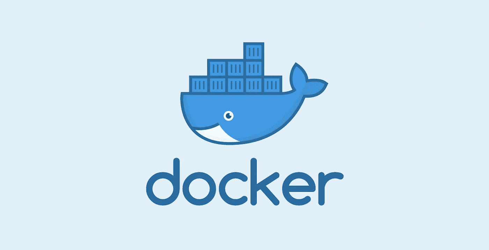

# docker 实例之间的 API 调用

> 原文：<https://blog.devgenius.io/api-calls-between-docker-instances-24124f5bf010?source=collection_archive---------2----------------------->



在 docker 中运行应用程序可能是个好主意。但是，正确配置它需要一些时间，并且您可能会遇到某些问题。当我第一次在本地使用 docker 时，我无法让多个实例相互通信。所以我决定写一篇关于它的小文章。

对于这个例子，我们将设置两个项目。一个 API 和一个对 API 进行 curl 调用的客户端。

## 先决条件

*   安装 docker
*   安装 docker-compose—[https://docs.docker.com/compose/install/#install-compose](https://docs.docker.com/compose/install/#install-compose)

## 创建 API

*   在项目的根目录下创建一个`Dockerfile`，对于这个例子，我们将使用 Node，但是当然，你可以使用你喜欢的任何东西。
*   打开文件并添加以下内容:

```
FROM node:12-alpineWORKDIR /var/wwwCMD node src/index.js
```

这将从 docker hub 下载`node:12-alpine`映像，将当前文件夹设置为`/var/www`，并运行 Node。

*   现在在项目的根中创建一个`docker-compose.yml`

```
version: '3'services:
    api:
        build:
            context: .
        ports:
            - 3000:3000
        volumes:
            - .:/var/www
        networks:
            default:
                aliases:
                    - my-api.dev
```

在`docker-compose.yml`文件中，我们配置了 API 服务。

重要的部分是`networks.default.aliases`。这个属性将确保我们的 API 在 docker 网络中被称为`my-api.dev`。我们将两个服务都连接到这个网络，并使用别名进行通信。

您可以在文档中找到所有属性的信息:[https://docs.docker.com/compose/compose-file/](https://docs.docker.com/compose/compose-file/)

*   现在，在您的终端中运行以下命令来设置一个项目

```
docker-compose run --rm api npm init
```

*   你会得到一些关于项目名称，版本等的问题。回答完所有问题后，您应该会在项目文件夹中看到 package.json。
*   现在安装 express

```
docker-compose run --rm api npm i express
```

*   创建一个`src`文件夹，并将以下内容添加到`index.js`
*   开始 API 吧！

```
docker-compose -p my-project up api
```

p(项目名称)标志将确保这个项目使用`my-project_default`网络。我们将用这个标志启动这两个服务，以确保它们在同一个 docker 网络上。如果我们不传递这个标志，docker-compose 将使用默认的文件夹名。

*   当你去`[http://127.0.0.1:3000/hello-docker](http://127.0.0.1:3000/hello-docker)`你应该看到`你好码头工人！`

## 创建第二个项目

*   打开一个新的终端窗口，因为我们希望我们的 API 继续运行。
*   为第二个项目创建一个新文件夹，并创建一个`Dockerfile`

```
# We don't actually need the node image for this, it’s just for this example.
FROM node:12-alpineRUN apk add curlCMD curl -s my-api.dev:3000/hello-docker
```

我们将安装 curl 并调用我们在 API 项目中定义的别名。

*   在根文件夹中创建一个`docker-compose.yml`文件

```
version: '3'services:
    client: # It’s important that the name is different than the one we used in the API project
        build:
            context: .
```

*   让我们运行它！

```
docker-compose -p my-project up client
```

我们在这里也使用-p 标志来确保这个项目与我们的 API 连接到同一个 docker 网络。

就这样，如果一切按预期运行，您现在应该会在终端中看到`{“message”:”Hello Docker!”}`。

## 摘要

*   `networks.default.aliases`属性可以用来给容器一个别名
*   启动容器时使用同名的`-p`标志，以确保容器使用相同的 docker 网络。
*   使用另一个服务的别名和端口调用 API(`my-api.dev:3000`)

请注意，这是一个非常基本的设置，我创建它只是为了展示如何使用`networks.default.aliases`。您可以将这种设置用于本地开发，但绝对不能用于生产。