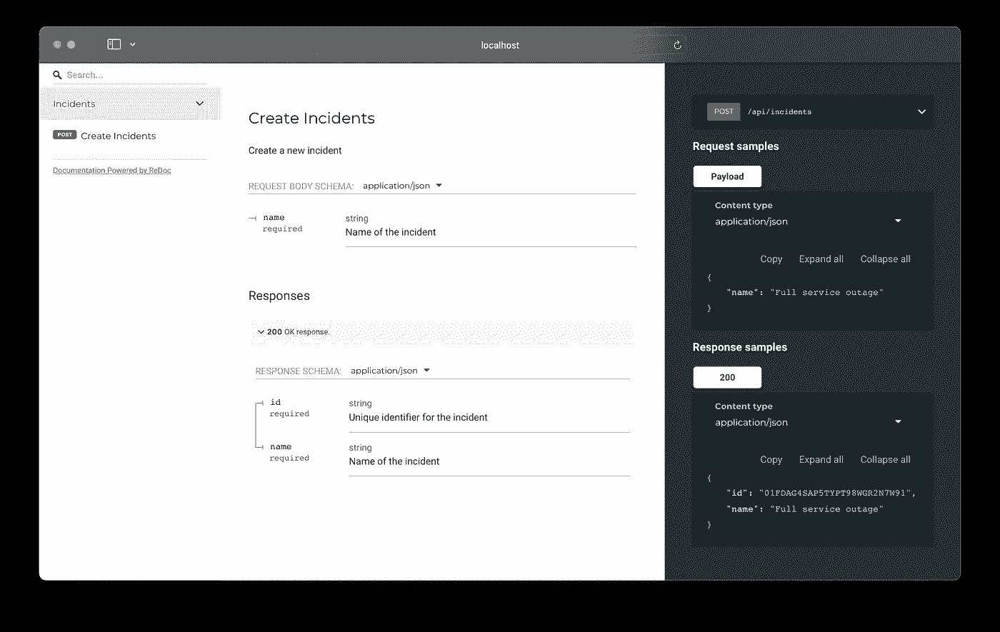

# 跨整个堆栈的类型安全 API 开发

> 原文：<https://blog.devgenius.io/api-development-with-type-safety-across-the-entire-stack-1589f182d0d6?source=collection_archive---------7----------------------->

一年前，我在 GoCardless 工作，制作一个[开放式银行产品](https://gocardless.com/solutions/instant-bank-pay/)的原型。

由于这是我在一段时间内完成的第一个产品工作(这不是 Kubernetes 操作符或数据库工具),所以重温 API 开发场景是明智的，如果有更好的选择，我不想像以前那样做事情。

我的预感是对的 API 场景*已经*向前移动了。在查看了各种工具之后，我们采用了一个名为 [Goa](https://goa.design/) 的工具，它帮助我们构建了一个令我震惊的 API。

几乎不费吹灰之力，果阿就帮助了:

*   快速迭代 API 设计
*   生成类型安全的服务器实现，保证与 API 规范一致
*   产生传输规范，如 OpenAPI 规范
*   …从中我们可以生成类型化的 API 客户端和文档

一年后，我现在在 [incident.io](https://incident.io/) 工作，在那里我的第一个贡献就是使用 Goa 来增强我们的 API。事实证明这是非常有价值的，尤其是对于一个想要快速行动而不是打破常规的初创企业。

这篇文章解释了工具链是如何工作的，以及当你采用它时你可以免费得到的一切。

# API 设计

所以你有一个产品想法，它需要一个 API。

Goa 的一切都是从“设计”开始的，在这里您使用 Goa DSL 来指定服务和方法，以及它们所使用的类型。

借用我在 incident.io 的工作，假设我们想要一个 API 来创建一个事件。这可能是这样的:

```
**package** design

**import** (
  **.** "goa.design/goa/v3/dsl"
)

**var** Incident **=** Type("Incident", **func**() {
  Attribute("id", String, "Unique identifier for the incident", **func**() {
    Example("01FDAG4SAP5TYPT98WGR2N7W91")
  })
  Attribute("name", String, "Name of the incident", **func**() {
    Example("Full service outage")
  })
  Required(
    "id",
    "name",
  )
})

**var** _ **=** Service("Incidents", **func**() {
  Description("Manage incidents")

  HTTP(**func**() {
    Path("/api/incidents")
  })

  Method("Create", **func**() {
    Description("Create a new incident")

    Payload(**func**() {
      Reference(Incident)
      Attribute("name")
    })

    Result(Incident)

    HTTP(**func**() {
      POST("/")
    })
  })
})
```

在这个例子中，我们定义了一个`Incident`类型和一个`Incidents`服务，以及一个接受事件名称并返回一个`Incident`的`Create`方法。所有这些定义都是从传输中抽象出来的，用`HTTP`块将应用程序概念绑定到 HTTP 调用。

虽然这个例子包含了 HTTP 绑定，但是如果您更喜欢用 gRPC 绑定来服务您的 API，那么您也可以轻松地包含 gRPC 绑定。这是 Goa 的优势之一，作者真正理解 API，并为每一个支持的传输创建了可靠的抽象，很少泄漏。

回到我们的例子:现在我们有一个设计，但是没有实现。我们将使用 Goa 对其余部分进行编码:

```
$ goa gen github.com/lawrencejones/goa-example/api/design -o api
api/gen/http/incidents/server/encode_decode.go
api/gen/http/incidents/server/paths.go
api/gen/http/incidents/server/server.go
api/gen/http/incidents/server/types.go
api/gen/http/openapi.json
api/gen/incidents/client.go
api/gen/incidents/endpoints.go
api/gen/incidents/service.go
```

让我们来分解一下:

*   `api/gen/incidents`包含事件服务的应用程序级接口，独立于传输的一切。我们将在构建服务时实现这些接口。
*   `api/gen/http/incidents`将 HTTP 级别的概念(HTTP 请求、HTTP 响应类型)绑定到与传输无关的服务接口。`encode_decode.go`是关于从 XML/JSON/etc 到 Go-native 类型，所以开发者可以避免传输问题。
*   `api/gen/http/openapi.json`是 API 的 OpenAPI 规范。

Goa 生成的应用程序界面应该不足为奇:

```
**package** incidents

**type** Service **interface** {
  *// Create a new incident*
  Create(context**.**Context, *****CreatePayload) (res *****Incident, err **error**)
}

*// Incident is the result type of the Incidents service Create method.*
**type** Incident **struct** {
  *// Unique identifier for the incident*
  ID **string**
  *// Name of the incident*
  Name **string**
}
```

作为实现这个 API 设计的开发人员，剩下要做的就是编写一个满足这个接口的实现。

看起来像这样:

```
**package** api

**import** (
  "context"
  "github.com/lawrencejones/goa-example/api/gen/incidents"
  "github.com/google/uuid"
)

**func** NewIncidents() incidents**.**Service {
  **return** **&**incidentsService{}
}

**type** incidentsService **struct** {
}

**func** (svc *****incidentsService) Create(ctx context**.**Context, payload *****incidents**.**CreatePayload) (*****incidents**.**Incident, **error**) {
  inc **:=** incidents**.**Incident{
    ID**:**   uuid**.**NewString(),
    Name**:** payload**.**Name,
  }

  **return** **&**inc, nil
}
```

一旦你习惯了这种模式——设计、生成、实现——逐步构建你的 API 就变得非常容易了。该流程强调构建任何 API 的最重要部分，即设计，实现被简化为修复编译器错误(`*incidentsService does not implement incidents.Service (missing Create method)`)。

这是最难的部分——从这里开始，一切都很容易。

# 生成客户端

使用 API 设计来生成后端类型，编译器将保证我们的实现是一致的，您可以完全相信生成的 API 规范是正确的和最新的。

现在我们有了忠实的规范，比如 OpenAPI 规范，我们可以用它们来生成 API 客户端。我工作过的大多数项目在 TypeScript 中都有一个前端组件，它可以从保证与服务器实现一致的强类型客户端中受益。

[OpenAPI 生成器](https://github.com/OpenAPITools/openapi-generator)可以在这里帮到你。它附带了许多生成器，这些生成器使用 OpenAPI 规范来构建各种风格(语言、框架等)的客户端。

选择正确的发电机是关键，因为质量可能不一致。我们在 [typescript-fetch](https://github.com/OpenAPITools/openapi-generator/blob/master/docs/generators/typescript-fetch.md) 上取得了成功，这是一个普通的 typescript 客户端，与 Goa 生产的传统`openapi.yml`配合得最好:

```
$ make clients/typescript
java -jar openapi-generator-cli.jar \
    generate \
        --generator-name typescript-fetch \
        --input-spec api/gen/http/openapi.json \
        --skip-validate-spec \
        --additional-properties npmName=goa-example,typescriptThreePlus=true,modelPropertyNaming=original \
        --output clients/typescript

[main] INFO  o.o.codegen.DefaultGenerator - Generating with dryRun=false
[main] INFO  o.o.codegen.DefaultGenerator - OpenAPI Generator: typescript-fetch (client)
[main] INFO  o.o.codegen.DefaultGenerator - Generator 'typescript-fetch' is considered stable.
[main] INFO  o.o.codegen.TemplateManager - writing file /Users/lawrence/Projects/goa-example/clients/typescript/src/models/IncidentsCreateRequestBody.ts
...
```

现在您有了一个 API 客户端，为集成商提供了使用他们选择的语言的理想体验:

```
**import** { IncidentsApi, Configuration } **from** "clients/typescript";

**const** client **=** IncidentsApi(**new** Configuration());
**const** incident **=** **await** client
  .incidentsCreate({
    createRequestBody: {
      name: "Full service outage",
    },
  });

alert(`Created incident with ID=${incident.id}`);
```

TypeScript 只是数百个生成器中的一个——完整列表见这里的[。](https://openapi-generator.tech/docs/generators/)

# 前端优势

在 incident.io，我们有一个 monorepo，同时包含前端 web 应用程序(`client`)和后端实现(`server`)，后端使用 Goa 公开一个 API 供前端使用。

引入 Goa 的好处有很多，但是在构建前端表单时，Goa + TypeScript 客户端确实大放异彩。我们使用 [react-hook-form](https://react-hook-form.com/) 作为前端表单组件，它有 TypeScript 绑定，所以你可以强类型化你的表单域。

现在我们有了一个 TypeScript 客户端，我们可以用客户端类型参数化 react-hook-forms，允许 TypeScript 编译器告诉我们何时我们的表单定义与我们的 API 定义不匹配:

```
**import** { useClient } **from** "contexts/ClientContext";
**import** { IncidentsCreateRequestBody } **from** "clients/typescript";

**const** IncidentCreateForm **=** ({
  closeCallback,
}: {
  **closeCallback**: () **=>** **void**;
}): React.ReactElement **|** **null** **=>** {
  **const** client **=** useClient();

  **const** { register, handleSubmit } **=** useForm**<**IncidentsCreateRequestBody**>**();

  **const** onSubmit **=** (body: IncidentsCreateRequestBody) **=>** {
    client
      .incidentsCreate({createRequestBody: body})
      .then(() **=>** {
        closeCallback();
      });
  };

  **return** (
    <form onSubmit={handleSubmit(onSubmit)}>
      <input {...register("name")} />
      <input type="submit" />
    </form>
  );
}
```

在此之前，构建使用 API 的表单需要注意产生与后端一致的请求。对该 API 进行修改将需要手动审查前端代码，以找到 API 的所有使用，希望您在部署之前发现它们。

在一个有 Goa 和生成客户端的世界中，您可以:

1.  调整 Goa 设计
2.  生成后端类型和前端客户端(`make api/gen clients/typescript`)
3.  修复后端编译器错误
4.  修复前端编译器错误

如果我们将事件字段`name`改为`description`，我们将立即得到一个关于表单的编译器错误:

```
IncidentCreateForm.tsx:21:20 - error TS2322:
        Type '"name"' is not assignable to type '"description" | "severity_id"'.

21      register("name")
         ~~
```

我不能夸大这是多么有用，特别是对于最大化开发人员的生产力和对变化的信心。

在更新规范(OpenAPI 等)在任何意义上都是可选的项目中，它将不可避免地与现实脱节。

本质上，这个工具链非常有价值，因为您可以相信 API 规范是准确的。这一保证意味着围绕 OpenAPI 的整个工具生态系统变得更加引人注目。

仅举一个例子， [go-swagger](https://github.com/go-swagger/go-swagger) 可以为 OpenAPI 规范生成真正高质量的文档。

我的大多数果阿项目都有一个`make docs`目标:

```
$ make docs
docker run --platform=linux/amd64 -p 4000:4000 --rm -v "$**(**pwd**)**/api:/api" -it quay.io/goswagger/swagger:v0.28.0 \
                serve --no-open --port=4000 --host=0.0.0.0 /api/gen/http/openapi.json
2022/01/22 17:57:24 serving docs at http://localhost:4000/docs
```

这是您获得付费产品所需的所有文档:



# 这一切感觉太简单了

当我在 2015 年第一次加入 GoCardless 时，我们刚刚构建了 crank，这是一个从 [JSON hyperschema](https://json-schema.org/draft/2019-09/json-schema-hypermedia.html) 生成 API 客户端库的内部工具。

作为一家(当时)认为他们的产品是 API 的公司，这是显而易见的。Crank 帮助我们维护了一套跨多种语言的客户端库，并自动生成我们的文档，这些文档通常是称赞和产品推荐的来源。

不过，维护 crank 并不有趣。到 2021 年我离开的时候，crank 仍然在构建我们的客户端库和文档，尽管它是每个人都喜欢讨厌的工具。

考虑到这一点，找到一个需要几天时间来设置并提供惊人的开发体验的工具链就像是一种欺骗。我们的内部 API 拥有可以与 API 产品相媲美的文档，这是我永远不会不惊叹的。

在 incident.io 中采用这些工具是我们能够如此快速地行动，并如此自信地进行产品变更的主要原因之一。无论您使用什么语言，找到一个类似的工具链并尝试一下——我可以毫无保留地推荐它！

*在*[*hacker news*](https://news.ycombinator.com/item?id=30039988)*上讨论这个帖子。如果你喜欢这个帖子并想看更多，请关注我*[*@ lawrjones*](https://twitter.com/lawrjones)*。*

*原载于 2022 年 1 月 22 日*[*https://blog . Lawrence Jones . dev*](https://blog.lawrencejones.dev/goa)*。*