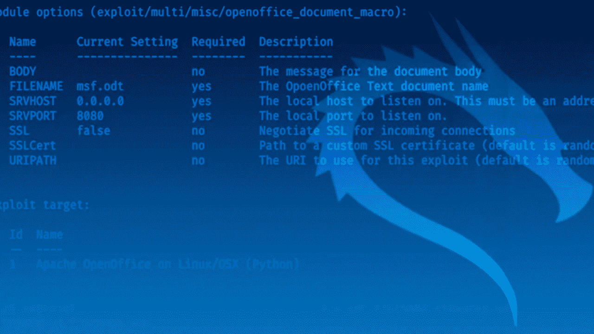
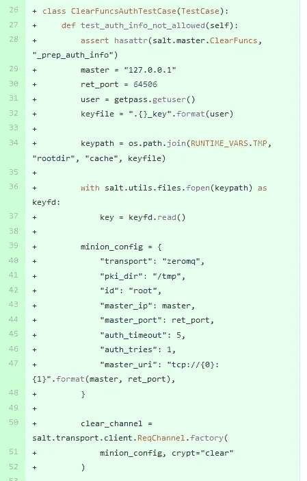

# API 暴露漏洞 SaltStack 案例研究

> 原文：<https://blog.devgenius.io/api-exposure-vulnerabilities-a-saltstack-case-study-22121b961fda?source=collection_archive---------13----------------------->

最近，SaltStack 发布了在其产品中发现的两个漏洞，CVE-2020–11651 和 CVE-2020–1162。攻击者能够利用这两个 CVE 远程执行代码，或者从服务器泄露敏感数据。许多组织使用 SaltStack 进行服务器编排，因此，许多组织受到这些漏洞的危害(最明显的是 Cisco[https://threat post . com/hackers-compromise-Cisco-servers-salt stack/156091/)。](https://threatpost.com/hackers-compromise-cisco-servers-saltstack/156091/).)

作为安全研究人员，我们经常希望发现为什么会出现这些漏洞，以及是什么导致它们如此容易被利用。在本文中，我将探索 SaltStack CVEs，并解释这些漏洞是如何产生的，为什么 POC 很容易开发，以及如何避免这种情况

**第一部分——漏洞**

这两个 CVE 都有一个共同的根本原因，那就是开发人员如何实现处理 API 调用的对象。在 Salt 中，master.py 代码负责处理用户发送的 API 调用。这个文件中有很多类，我们感兴趣的一个叫做 ClearFuncs。ClearFuncs 的目的是处理以明文形式发送的 API 调用。

如果我们在应用补丁之前查看 ClearFuncs 类，我们将会看到有许多可用的方法，任何希望通过端口 4506 向 API 发送请求的用户都可以访问所有这些方法。问题是开发人员从来没有打算让所有这些方法都是可访问的。

为了理解这一点，我们需要讨论一下对象方法范围。在 Java 和类似的语言中，我们可以根据访问的方式将方法或属性声明为私有或公共。因此，我们可以创建私有的辅助函数，这样就不能在对象外部访问它们。在 Python 中，不存在这样的概念，这意味着所有方法都被认为是公共的，除非使用某种保护来防止对它们的访问。在 ClearFuncs 对象中，编写了旨在内部使用的方法，但是它们通过 API 公开，从而允许攻击者访问它们。

这一简单疏忽的结果是 CVE-2020–11651，其中攻击者可以访问 _prep_auth_info 或 _send_pub 方法来创建远程代码执行条件。除此之外，攻击者还可以利用未排序的目录路径，通过 get_token()获得 CVE-2020–11652 的目录遍历。2019.2.4 和 3000.2 版通过限制对方法的访问以及限制目录路径参数修复了这两个问题。

从本节中学到的经验是，需要小心地管理 API，以确保不公开助手方法。如果公开了一个方法或属性，就有可能以意想不到的方式使用它，从而潜在地造成危险的情况。

**第二部分——为什么剥削容易实现**

由于可以完全访问源代码，开放源代码软件通常是一个容易被利用的目标。在许多情况下，我们可以对补丁进行逆向工程，以确定如何利用漏洞。在 SaltStack 的例子中，开发者实际上向每个人提供了本质上完全有效的利用。如果我们看看 CVE-2020–11651 的补丁，我们可以看到他们为漏洞增加了测试案例:

CVE 的测试案例-2020–11651

使用这些测试案例，我们基本上可以复制和粘贴，替换 IP，并得到一个完全工作的利用。经过大约几分钟的反复试验，一个有能力的程序员可以准备好攻击任何易受攻击的服务器。这显然是一个巨大的问题，因为我们不仅揭示了两个主要的漏洞，而且还为每个人提供了一个有效的漏洞。

这种类型的问题不是 SaltStack 独有的，实际上每个开源库都会遇到这种问题。我想强调的主要一点是监控和获取您可能使用的任何开源软件的更新的重要性。许多开源软件的漏洞利用门槛非常低，所以如果出现这样的漏洞，利用起来几乎是微不足道的。

**第三部分——吸取的教训**

从这篇文章中，我希望每个人都有两个关键的收获。首先，当您使用 API 时，理解向用户公开了什么是至关重要的。像 Python 这样的语言很容易使用，但是如果不小心使用，简单的语法可能会导致重大漏洞。如果您编写一个向用户公开的方法，您需要确保用户用它做的任何事情都不会导致被利用。类似地，如果您认为某个方法没有向用户公开，您应该编写测试用例来证明这一点，否则一个简单的编程错误就可能导致重大漏洞。

第二个要点是关于开源软件在生产环境中的使用。开源软件是一种奇妙的资源，但它也伴随着监控安全更新的重大责任。当一个软件是开源的，你应该假设任何漏洞都很容易被利用，因此，你应该尽可能地更新。攻击者仅用了一个月的时间来自动化和利用 SaltStack 问题，因此修复和利用之间的时间非常短，但却至关重要。拥有适当的更新监控和应用程序是安全系统最重要的部分之一。随着开放源码使用的增加，我们需要越来越警惕出现的漏洞。