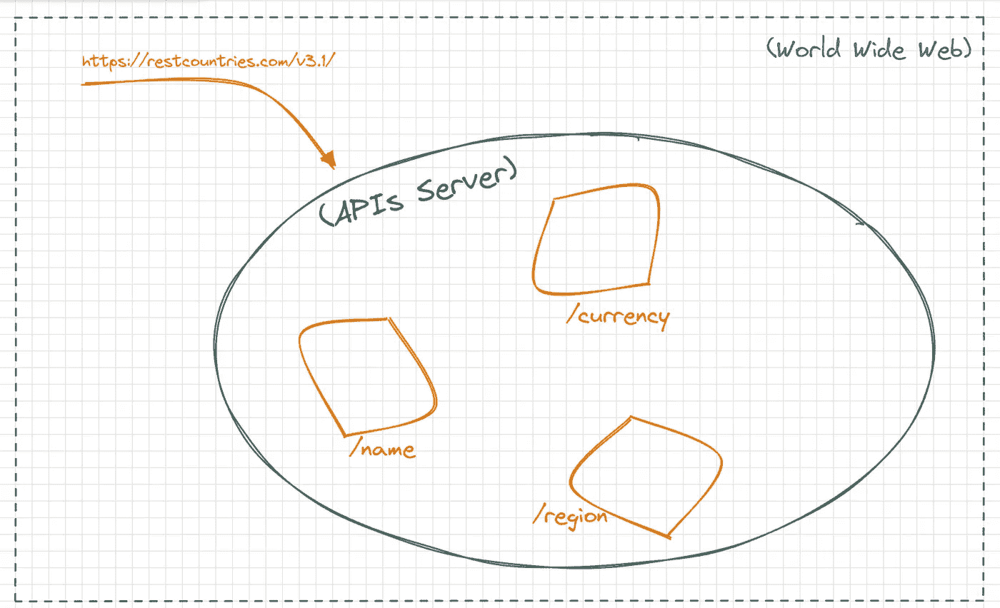

# 面向初学者的 API

> 原文：<https://blog.devgenius.io/api-for-beginners-6a87107860d3?source=collection_archive---------5----------------------->

A PI 或者**应用编程接口**，我相信你之前一定听说过这个名词，不管你是不是技术出身。理解什么是 API 是非常重要的，特别是对于开发人员来说，它在我们的日常生活中使用，简化了我们的生活，帮助我们更好更快地生活和工作。

在本文中，我们将从总体上讨论接口，具体讨论与 API 相关的术语，等等。

# 连接

让我们谈谈接口，让机器工作是相当困难的，有巨大的可怕的实现逻辑来完成一项任务。但是作为一个用户，你并不总是需要知道事情是如何在后台完成的，接口就是为完成这项工作服务的。**接口抽象掉实现**。以电视为例，你只需要按下电源按钮来打开它，我们不知道所有的混乱在后台发生什么来打开它，这里按钮是抽象出打开电视的逻辑的实现，所以按钮是这里的界面，或者更准确地说是用户界面。

该界面允许我们使用事物的工作方式，通过**暴露**选项让我们根据自己的需要工作，比如以不同的速度、质量等观看 youtube 视频。我们上面讨论的所有场景都是用户界面，现在让我们回到应用程序编程界面。

> [**应用编程接口** ( **API** )是两个或多个计算机程序相互通信的一种方式。](https://en.wikipedia.org/wiki/API)

当用户和机器之间进行交互时，使用用户界面，但是对于机器对机器(软件程序)的通信，则使用 API。让我们再举一个例子，假设您要在 windows player 上观看您最喜欢的电影，您必须单击播放按钮，这是您的用户界面，但操作系统可能会调用媒体播放器 API 来播放视频，或者调用用于复制和粘贴的 API，以便开发人员可以将文件从一个位置复制到另一个位置，而无需了解整个文件系统架构是如何工作的。使用 API 的另一种方式是当你编码时，假设你想大写一个字符串，虽然你可以通过做一些低级的二进制计算来实现，但是我们使用 javascript 中的内置函数，比如 toUpperCase。

# 本地与远程 API

我们上面讨论的所有例子都是本地 API。远程 API 旨在通过通信网络进行交互。所谓远程，我们是指由 API 操纵的资源在发出请求的计算机之外的某个地方。因为 internet 是使用最广泛的通信网络，所以大多数 API 都是基于 web 标准设计的。并不是所有的远程 API 都是 web API，但是大多数时候我们说的 API 指的是 web API。

# Web APIs

Web APIs 通常对请求消息使用 HTTP，并定义响应消息的结构，但是首先，让我们浏览一下基础知识，了解什么是 API URL。

## - API URL

API URL 路径是一个允许您访问 API 及其各种特性的地址。它与 web 浏览器中的任何其他 URL 相同。例如 youtube 趋势页面的 URL。

```
https://www.youtube.com/feed/trending
```

这个 URL 将指向 yt 的趋势页面，同样，在这里您请求浏览器获取这个页面的内容，URL 就像一个地址，帮助浏览器找到满足您的请求所需的资源。类似地，API URL 动作，它把浏览器带到你请求去的因特网上的那个资源。API URL 具有两个部分:

*   基本 URL
*   端点

考虑 [REST Countries](https://restcountries.com/) API 来正确理解。REST Countries 是一个公共 API，它向用户提供与国家相关的数据，你可以在这里阅读它的文档(*，我建议你应该这样做，因为阅读 API 文档是你应该具备的一项重要技能*)，阅读后，你会注意到一件事，所有提供的 URL，都包括这个公共部分

```
https://restcountries.com/v3.1/
```

这是 API 的**基本 URL** ，而诸如

```
name/india or currency/dollar or region/europe
```

是用来进一步指定浏览器的**端点**，以及你想要什么。这是我们正在尝试做的事情的一个可视化说明



正如您在图中看到的，假设它是互联网，您的 API 的基本 URL 将引导浏览器到这个“包”，将这个“包”视为 API 服务器，在这个“包”中，我们有其他小的“包”，对应于 API 公开的每个端点，您可以访问任何“包”，只需将它的名称附加到基本 URL，此后根据您的要求构建 URL。

## - API 参数

API 参数是可以与端点一起传递以影响响应的选项。在 REST 国家/地区 API 文档中，我们得到了一个关于如何使用全名查找国家/地区数据的示例链接

```
https://restcountries.com/v3.1/name/{name}?fullText=true
```

在这个 URL 中，我们有两种类型的参数:

*   路径参数
*   查询字符串

**问号后的那部分网址(？)**被称为查询字符串。

```
?fullText=true
```

查询字符串可以被认为是购物应用程序中的过滤器选项，它根据您的过滤器偏好从搜索结果中筛选出最相关的产品。在查询字符串(？).在上面的示例中，路径参数用花括号隔开。

```
{name}
```

## - API 头

API 头就像是您进行的每个 API 调用的额外信息源。他们的工作是表示与 API 请求和响应相关的元数据。例如，有些 API 只有在经过身份验证后才能访问，因此在请求 API 调用时，您需要传递身份验证密钥，该密钥存储为一个**请求头。**报头可分为请求报头和响应报头，响应报头由各种元数据组成，如内容类型，即响应数据以何种格式传送。以下是一些常见标题的列表:

*   Authorization:包含 HTTP 身份验证的身份验证凭据。
*   WWW-Authenticate:如果服务器在用实际请求的资源进行响应之前需要某种形式的身份验证，它可以将此作为初始响应发送。这个报头后面通常是响应代码 401，表示“未经授权”。
*   Accept-Charset:这个头随请求一起设置，并告诉服务器哪些字符集(例如，UTF-8、ISO-8859–1、Windows-1251 等。)是客户可以接受的。
*   内容类型:告诉客户端媒体类型(例如，应用程序/json、应用程序/javascript 等。)发送一个响应。这是一个重要的头字段，有助于客户端了解如何正确处理响应正文。
*   Cache-Control:服务器为该响应定义的缓存策略，缓存的响应可以由客户端存储，并在 Cache-Control 头定义的时间之前重用。

这就结束了我们关于 API 的讨论。

我希望你喜欢它。任何反馈都是最受欢迎的😊。