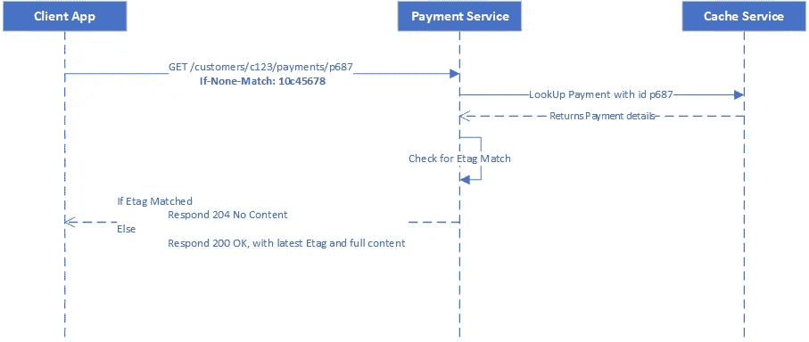
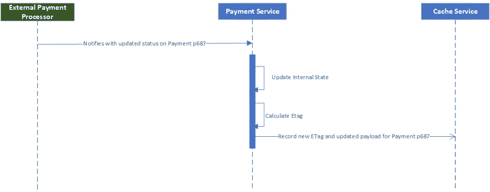
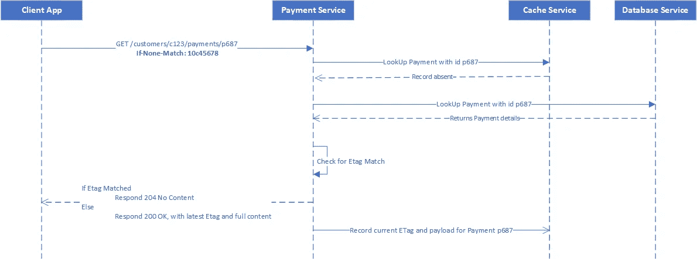

# API 反应式缓存模式

> 原文：<https://blog.devgenius.io/api-reactive-caching-pattern-cf9756b5590?source=collection_archive---------8----------------------->

# 问题定义

越来越多的 API 被引入，以方便向远程客户端发布信息，即桌面浏览器、移动浏览器、移动应用、胖客户端等。在客户端，网络的可靠性总是面临挑战。客户端环境通常不受远程服务的控制。没有一个服务用户愿意等待对请求的响应超过几秒钟。

几乎没有什么事情可以帮助克服这一挑战，或将其影响降至最低:

*   减少网络上的数据流量
*   允许客户端使用本地缓存数据

# 基本原理

这种模式提供了以下好处:

*   减少网络流量
*   缓存的反应式构建
*   流量感知缓存构建，用于托管在边缘位置的服务
*   减少数据库层的计算量，尤其是在数据库层使用 RDBMS 产品并且域数据被规范化的情况下。

# 假设

这种模式依赖于两种能力

*   ETag 管理
*   缓存管理

ETag 是一个不透明的标识符，由服务分配给它发布的资源。它标识资源在给定时间点的状态。如果状态改变，则生成新的 ETag。根据服务内部架构的性质，如果实现了简单的 CRUD 架构，它可能是资源的散列，或者当实现了事件源时，它可能只是最新事件的 id。

> 服务如何管理缓存超出了此模式的范围。服务的技术栈将对缓存系统有很大的影响。如果服务是使用 Actors(例如 [Akka 库](https://akka.io/))构建的，那么 Actors 本身也是缓存层。然而，像 [Redis](https://redis.io/) 这样的外部系统是缓存管理的良好候选。

# 结构

为了解释这种模式，我们将使用一个简化的付款示例。

创建付款

客户端在端点 */customers/c123/payments* 上发出 *POST* 调用。服务器创建支付资源并用 *201 创建的*响应来响应。付款本身可能需要几秒钟、几分钟或几天的时间来处理。这完全取决于支付方式的性质。因此，客户需要定期检查支付状态。如果在每个状态检查请求中，都在响应客户端中包括完整的支付细节，即使支付细节没有变化，这将浪费网络带宽和服务器计算资源。

注意 HTTP 头中包含的“ *ETag* ”在前面的图中？创建资源时，付款服务已经为付款分配了一个 ETag。

获取付款详细信息

每当客户端对支付服务进行"*GET/customers/c123/payments/p687 "*调用时，它都会在请求头中包含一个特殊的头" *If-None-Match"* 。这必须包含在 ETag 下提供的值，作为 POST 响应头的一部分。

如果提供的 ETag 与支付服务端的 ETag 匹配，则服务返回“ *304 未修改”*响应。然后，客户端可以继续引用付款 p687 的本地缓存副本，并继续下一步操作。

在内部，支付服务可以使用任何技术来管理缓存。然而，为了表达这种模式，我们假设有一个用于管理缓存的缓存服务。

缓存付款状态

在付款创建期间，付款服务将向缓存服务注册付款。这里的想法是将 ETag 和实体状态或视图存储在缓存服务中。根据服务的性质和发布的端点，缓存服务可用于存储 ETag、实体 Id 和实体视图组合的多个条目。

在某些情况下，客户端可能会使缓存失效，或者可能会启动新的会话。

获取付款详情

客户端将不能传递 *If-None-Match* 头，因为它不包含任何 ETag。在这种情况下，支付服务将使用“*200 Ok”*响应进行响应，并将在响应有效载荷中包括实体的完整状态或视图。

在 GET 请求期间，支付服务的内部行为如下所示:

获取请求序列

您可以看到支付服务在缓存服务上进行查找，并将当前的 ETag 与提供的 ETag 进行比较。如果所提供的 ETag 与当前的 ETag 不匹配，服务将仅响应完整的状态/视图。

> 来自缓存的响应必须是可靠的，因此它必须是实体的状态和视图。

在任何支付更新期间，支付服务的内部行为如下所示:

缓存更新

保持缓存服务中的信息准确并与实体的状态同步是很重要的，否则客户端将不会知道支付数据的任何变化。作为该模式的一部分，缓存被更新，作为对来自外部支付处理器的任何更新事件的到达的*反应*。

这种方法还有助于从零开始被动地构建缓存服务。下图显示了 GET 调用期间缓存服务的被动填充。

反应式缓存构建

当收到 GET 请求时，支付服务总是进行查找，以查看缓存服务中是否存在支付细节。如果条目不存在，那么它将与数据库服务(数据层)交互，并执行提取实体状态/视图的高成本操作。根据 ETag 的值，它会用 204 或 200 来响应客户端。但最重要的是，它将与缓存服务异步记录这一点。

> 在这个模式中，缓存服务是支付服务的延伸，而不是孤立存在的服务。从概念上讲，它存在于应用层，而不是数据层。

这成为一种强大的模式，其中支付服务的多个实例，即实体服务，正在运行以支持边缘的查询。可以创建新的实例，其中服务内的缓存基于传入的流量建立。

# 结果

这种模式虽然强大，但也有一些后果。

*   它为应用程序的架构引入了额外的缓存服务。根据应用程序的技术堆栈，这可能会增加应用程序内部架构的复杂性。
*   如果缓存服务是外部的，则会引入额外的故障点。然而，该模式是有弹性的，因为缺少缓存服务意味着服务应该继续在模式前的状态下运行。
*   通过支付服务管理 ETag。这可能会带来基于应用程序内部模式的计算开销。在事件源的情况下，没有开销，因为最新事件的 id 可以充当 ETag。但是，在基于 CRUD 的应用程序中，需要一些哈希算法来正确计算 ETag。这肯定会在变更事务处理过程中增加额外的计算时间。
*   客户对 ETag 的管理。大多数现代客户端框架都支持开箱即用的 ETag。然而，缺乏客户的 ETag 管理意味着客户的体验将处于前模式状态。
*   对于分布式和水平扩展的应用程序，更新期间缓存的刷新可能会延迟。然而，最终所有缓存都将与底层状态同步。延迟将由用于实现该模式的技术栈驱动。