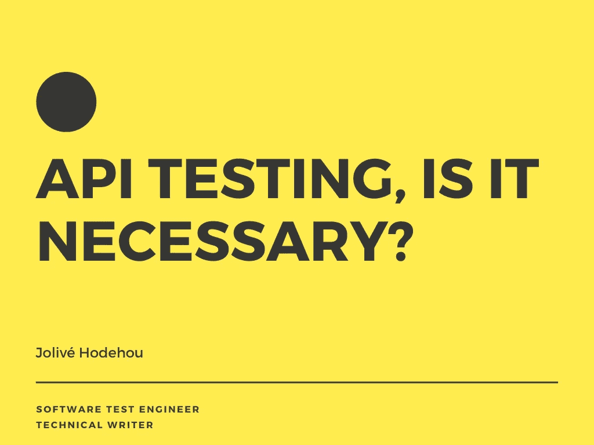

# API 测试，有必要吗？

> 原文：<https://blog.devgenius.io/api-testing-is-it-necessary-e1777cf4572?source=collection_archive---------3----------------------->

## 作为软件测试专家，掌握 API 测试是可以完全改变你生活的技能之一。

我想谈谈一种已经成为我的主要测试。这叫做 API 测试。

# 什么是 API

> API 是一组函数和过程，允许创建访问操作系统、应用程序或其他服务(Google)的功能或数据的应用程序
> 
> 应用程序编程接口(API)是一组子程序定义、协议和工具，用于构建应用软件……—维基百科

# 什么是 API 测试？

API 测试是对一组应用程序编程接口(API)的直接测试，也是集成测试的一部分，以确定它们是否满足功能、可靠性、性能和安全性要求。因为没有图形界面，API 测试在消息层执行，可以非常快速有效地验证应用程序逻辑。

*   **Functional** :这是您根据提供的输入寻找 API 响应的地方。检查实际响应是否与预期响应匹配。
*   **性能**:这里，您需要注意 API 的响应时间。有时，从 API 获得响应需要很长时间。这可能是由于与 API 设计相关的性能问题。
*   **安全性**:检查传递给 API 的敏感数据是否被加密，这是测试的一部分。例如，您可能想要检查负责在主页上生成仪表板报告的 API。为了访问 dashboard API，您可能需要一个令牌，该令牌是作为之前运行的登录 API 的响应而生成的。该令牌应该采用加密格式。您还可以检查是否有任何 HTTPS 加密。
*   **可靠性**:每次测试不同的配置(例如，不同的环境，不同的用户登录等)时，你可以检查 API 是否给你及时的响应。)您可以检查输出是否返回任何异常处理错误、超时错误等。这将表明 API 的可靠性。作为可靠性测试的一部分，您还可以检查响应数据的结构是否正确。通常，API 响应将采用 JSON 或 XML 格式。
*   **否定测试**:这里的目的是向 API 提供无效的输入数据，并检查输出数据的行为。API 应该正确处理这些错误。它应该为每个负输入条件提供有效的、有意义的错误消息。如果一些参数使用了空的输入数据，您也可以测试 API 的行为。您还可以查找不同输入数据的任何未使用的标志、缺失/重复的输出值。

# API 测试操作

每个测试都由测试动作组成。这些是每个 API 测试流程中测试需要采取的单独行动。对于每个 API 请求，测试需要采取以下行动:

**1。验证正确的 HTTP 状态代码。**例如，创建一个资源应该返回 201 CREATED，未授权的请求应该返回 403 FORBIDDEN，等等。

**2。验证响应有效负载。**检查有效的 JSON 主体并纠正字段名、类型和值——包括错误响应。

**3。验证响应标头。** HTTP 服务器头对安全性和性能都有影响。

**4。验证正确的应用程序状态。**这是可选的，主要应用于手动测试，或者当一个 UI 或另一个界面很容易被检查的时候。

**5。验证基本性能是否正常。**如果操作成功完成，但花费了不合理的时间，则测试失败。

**有用工具列表**

下面是用来测试 API 的工具列表

*   [操作系统终端](https://www.codepedia.org/ama/how-to-test-a-rest-api-from-command-line-with-curl/)
*   [邮递员](https://www.postman.com/)
*   [肥皂泡](https://www.soapui.org/)
*   阿帕奇 Jmete

我个人最喜欢的测试 API 的工具是 postman，因为它非常直观和易于使用。

# 关于我

我的名字是乔丽薇。我是一名软件测试工程师/技术作家。

我的使命是始终思考并为优化软件的实现做出贡献。

**推特【https://twitter.com/joveHod】:[推特](https://twitter.com/joveHod)**

**领英**:[https://www.linkedin.com/in/hodehoujolive/](https://www.linkedin.com/in/hodehoujolive/)

*更多内容尽在*[*blog . dev genius . io*](http://blog.devgenius.io)*。*